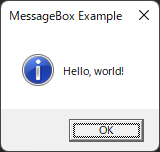

下記の手順でRustでMessageBoxを表示することができます。

1. Rustをインストールする。 [Rustのはじめかた](https://kenji.blog/posts/rust%E3%81%AE%E3%81%AF%E3%81%98%E3%82%81%E3%81%8B%E3%81%9F/) 参照
2. コマンドプロンプトで`cargo new --bin MessageBox`を実行する。
3. `MessageBox`ディレクトリに移動する。
4. `Cargo.toml`を開き、下記のように修正する。

```toml
[package]
name = "hello_world"
version = "0.1.0"
edition = "2021"

# See more keys and their definitions at https://doc.rust-lang.org/cargo/reference/manifest.html

[dependencies]
winapi = "0.2.7"
user32-sys = "0.2.0"
```

5. `src\main.rs`を開き、下記のように修正する。
```main.rs
extern crate user32;
extern crate winapi;

use std::ffi::CString;
use user32::MessageBoxA;
use winapi::winuser::{MB_OK, MB_ICONINFORMATION};

fn main() {
    let lp_text = CString::new("Hello, world!").unwrap();
    let lp_caption = CString::new("MessageBox Example").unwrap();

    unsafe {
        MessageBoxA(
            std::ptr::null_mut(),
            lp_text.as_ptr(),
            lp_caption.as_ptr(),
            MB_OK | MB_ICONINFORMATION
        );
    }
}
```

6. コマンドプロンプトで`cargo run`を実行する。
   

7. リリースのビルドをする場合は`cargo build --release`を実行する。


# 参考
[Hello World MesssageBox example in Rust](https://wesleywiser.github.io/post/rust-windows-messagebox-hello-world/)