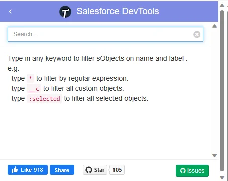

### Salesforce DevTools

You can search for custom fields and export the fields of custom objects in bulk.

It's also convenient to be able to build SOQL on the spot.

[Salesforce DevTools](https://chrome.google.com/webstore/detail/salesforce-devtools/ehgmhinnhggigkogkbhnbodhbfjgncjf)

### Salesforce advanced Code searcher

This is useful when searching for Salesforce code.

[Salesforce advanced Code searcher](https://chrome.google.com/webstore/detail/salesforce-advanced-code/lnkgcmpjkkkeffambkllliefdpjdklmi)
