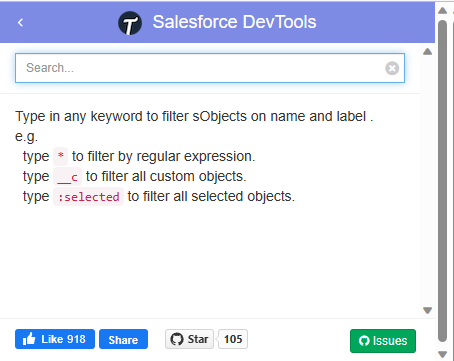
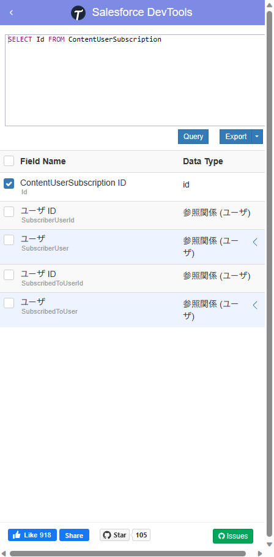
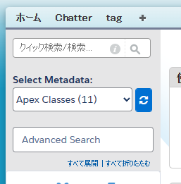

---

title: "Salesforce 추천 Chrome 확장 프로그램"
date: 2022-05-02T10:39:36+09:00
tags: ["Salesforce", "Chrome 확장 프로그램"]
draft: false
image: "img.png"
categories: ["IT・테크놀로지"]
---

### Salesforce DevTools

사용자 정의 필드를 검색하거나, 사용자 정의 객체의 필드를 일괄적으로 출력할 수 있습니다.

그 자리에서 SOQL을 작성할 수 있는 것도 편리합니다.

[Salesforce DevTools](https://chrome.google.com/webstore/detail/salesforce-devtools/ehgmhinnhggigkogkbhnbodhbfjgncjf)

### Salesforce advanced Code searcher

Salesforce 코드를 검색할 때 편리합니다.

[Salesforce advanced Code searcher](https://chrome.google.com/webstore/detail/salesforce-advanced-code/lnkgcmpjkkkeffambkllliefdpjdklmi)
