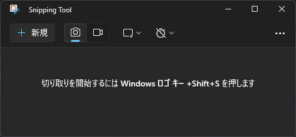

## ما هي أداة القطع Snipping Tool
أداة القطع (Snipping Tool) هي أداة لالتقاط الشاشة مدمجة في نظام ويندوز. يمكنك من خلالها قص وحفظ جزء من الشاشة، أو التقاط الشاشة بأكملها، أو تسجيلها.

## كيفية تشغيل أداة القطع

يمكنك تشغيلها بشكل رئيسي باستخدام الطرق الثلاث التالية:

- اضغط على مفتاح `Win`، واكتب `Snipping Tool`، ثم اضغط على مفتاح `Enter`.
- اضغط على مفتاح `Win` + `Shift` + `S`.
- اضغط على مفتاح `Win` + `R`، واكتب `snippingtool`، ثم اضغط على مفتاح `Enter`.

## كيفية استخدام أداة القطع

### كيفية حفظ صورة الملتقطة كالتالي:

1. حدد علامة `الكاميرا`.
2. انقر فوق زر `جديد`.
3. حدد المنطقة التي تريد التقاطها.
4. انقر فوق زر `حفظ باسم`.
5. أدخل وجهة الحفظ واسم الملف، ثم احفظ.

### كيفية تسجيل فيديو كالتالي:

1. حدد علامة `الفيديو`.
2. انقر فوق زر `جديد`.
3. حدد المنطقة التي تريد التقاطها.
4. انقر فوق زر `ابدأ`.
5. قم بتسجيل الشاشة.
6. انقر فوق زر `إيقاف`.
7. انقر فوق زر `حفظ باسم`.
8. أدخل وجهة الحفظ واسم الملف، ثم احفظ.

## مراجع

- [استخدام أداة القطع لالتقاط لقطات الشاشة](https://support.microsoft.com/ar-sa/windows/use-snipping-tool-to-capture-screenshots-00246869-1843-655f-f220-97299b865f6b)
