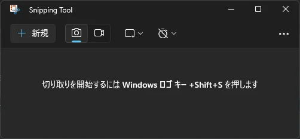

---
title: 'Как использовать стандартный «Snipping Tool» Windows для записи экрана и захвата'
slug: "Snipping Toolの使い方"
date: 2024-04-01T23:19:45+09:00
tags: ["Snipping Tool", "Изображение", "Видео", "Скриншот", "Запись", "Захват"]
draft: false
image: "img.webp"
categories: ["ИТ и технологии"]
description: 'Объясняется базовое использование «Snipping Tool», стандартного инструмента захвата экрана в Windows. Понятно представлены методы от быстрого запуска с помощью сочетаний клавиш до вырезания и сохранения частей изображений, а также инструкции по записи видео с экрана.'
---

## Что такое Snipping Tool
Snipping Tool — это стандартный инструмент для создания скриншотов в Windows. С его помощью можно вырезать и сохранить часть экрана, сделать снимок всего экрана или записать его.

## Как запустить Snipping Tool

В основном можно запустить тремя следующими способами:

- Нажмите клавишу `Win`, введите `Snipping Tool` и нажмите клавишу `Enter`.
- Нажмите клавишу `Win` + `Shift` + `S`.
- Нажмите клавишу `Win` + `R`, введите `snippingtool` и нажмите клавишу `Enter`.

## Как использовать Snipping Tool

### Способ сохранения захваченного изображения следующий:

1. Выберите значок `Камера`.
2. Нажмите кнопку `Создать`.
3. Выберите область для захвата.
4. Нажмите кнопку `Сохранить как`.
5. Укажите место сохранения и имя файла, затем сохраните.

### Способ записи видео следующий:

1. Выберите значок `Видео`.
2. Нажмите кнопку `Создать`.
3. Выберите область для захвата.
4. Нажмите кнопку `Старт`.
5. Запишите экран.
6. Нажмите кнопку `Остановить`.
7. Нажмите кнопку `Сохранить как`.
8. Укажите место сохранения и имя файла, затем сохраните.

## Ссылки

- [Использование Snipping Tool для создания скриншотов](https://support.microsoft.com/ru-ru/windows/use-snipping-tool-to-capture-screenshots-00246869-1843-655f-f220-97299b865f6b)
