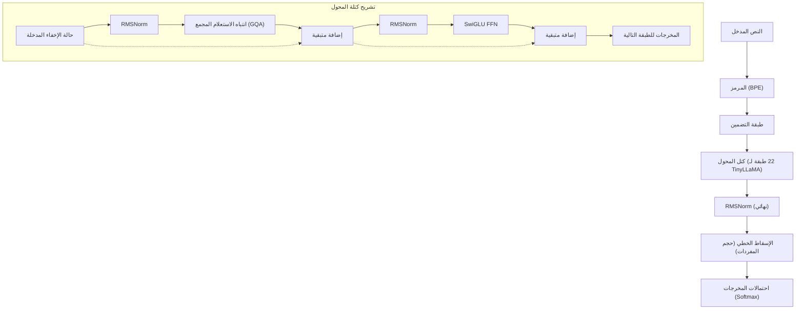
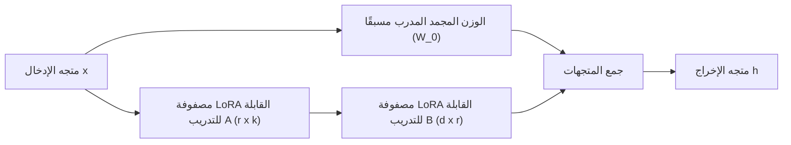
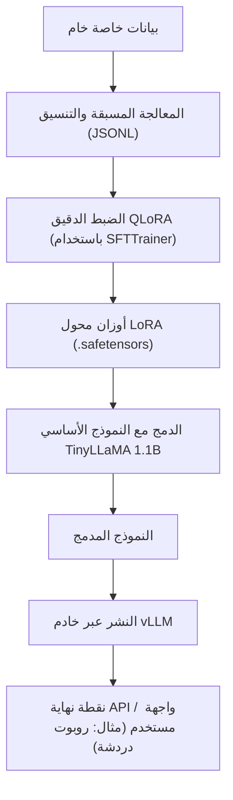

## 1. مقدمة: لماذا TinyLLaMA والبيئة المحلية الآن؟

يتقدم تطور النماذج اللغوية الكبيرة (LLMs) بسرعة هائلة، ومع ذلك يستمر عدد معلمات النماذج (Parameters) في التضخم ليصل إلى مئات المليارات. في حين أن النماذج الضخمة مثل GPT-4 و Claude 3 تتمتع بأداء لا مثيل له، إلا أن التكلفة الحسابية اللازمة للاستنتاج (Inference) والتدريب، بالإضافة إلى المخاوف المتعلقة بالأمان وخصوصية البيانات عند استخدام واجهات برمجة التطبيقات (APIs) الخارجية، تشكل عقبات كبيرة للشركات. خاصة في الأعمال التي تتعامل مع بيانات داخلية سرية للغاية أو معلومات شخصية، فإن إرسال البيانات إلى واجهات برمجة تطبيقات LLM عامة على السحابة (Cloud) غالباً ما يكون غير مقبول من منظور الامتثال (مثل GDPR و APPI).

لذلك، تتجه الأنظار نحو **النماذج اللغوية الصغيرة (SLM: Small Language Models)** و **التشغيل المحلي في بيئات محلية (On-premises)**. من بينها، يتميز "**TinyLLaMA**" بحجمه المدمج الذي يبلغ 1.1 مليار معلمة فقط (1.1B)، إلا أنه تم تدريبه مسبقًا على مجموعة بيانات ضخمة تبلغ حوالي 3 تريليون رمز (Tokens)، مما يجعله يظهر أداءً مذهلاً مقارنة بالنماذج من نفس الفئة.

في هذا المقال، سنقدم دليلاً كاملاً للضبط الدقيق (Fine-tuning) لـ TinyLLaMA في بيئة محلية (خادم محلي أو محطة عمل) للمهام الخاصة بشركتك، بـ "أسرع وأعلى كفاءة". سنشرح كل شيء بشمولية، بدءًا من الخلفية الرياضية وتقنيات التحسين الحديثة، وصولاً إلى أكواد التنفيذ الفعلية باستخدام PyTorch.

---

## 2. بنية TinyLLaMA وخصائصه

يعتمد TinyLLaMA على بنية LLaMA (Large Language Model Meta AI) التي طورتها شركة Meta. على الرغم من إبقاء عدد المعلمات عند 1.1B، إلا أنه يستخدم نفس حزمة التقنيات المستخدمة في LLaMA 2، مما يتميز بتوافق عالٍ جداً مع النظام البيئي.

### مكونات البنية الأساسية

1. **RMSNorm (Root Mean Square Normalization):**
   تقنية تطبيع (Normalization) تعمل على تحسين الكفاءة الحسابية عن طريق حذف طرح المتوسط من حسابات LayerNorm التقليدية. إنها تزيد من الإنتاجية مع الحفاظ على استقرار التدريب.
2. **دالة التنشيط SwiGLU:**
   في شبكة التغذية الأمامية (Feed Forward Network - FFN)، يتم استخدام SwiGLU بدلاً من ReLU أو GELU التقليدية. يتم التعبير عن هذا رياضياً على النحو التالي:
   $$ \text{SwiGLU}(x, W, V) = \text{Swish}(xW) \otimes (xV) $$
   هنا، يمثل $\otimes$ الضرب على مستوى العناصر (Hadamard product)، ودالة Swish هي $\text{Swish}(z) = z \cdot \sigma(\beta z)$. هذا يحسن من القدرة التعبيرية بشكل كبير.
3. **RoPE (Rotary Position Embedding):**
   طريقة تجمع بين مزايا التضمين الموضعي المطلق (Absolute position encoding) والنسبي (Relative position encoding). تتمتع بأداء تعميمي عالٍ حتى عند تمديد طول التسلسل.
4. **Grouped Query Attention (GQA):**
   نهج وسط بين Multi-Head Attention (MHA) و Multi-Query Attention (MQA)، ومن خلال تجميع رؤوس المفاتيح (Keys) والقيم (Values)، فإنه يوفر عرض النطاق الترددي للذاكرة ويزيد من سرعة الاستنتاج بشكل كبير.

يوضح مخطط Mermaid أدناه تدفق البيانات العام لـ TinyLLaMA وبنية كتلة المحول (Transformer block).



---

## 3. اختراق في الضبط الدقيق: LoRA و QLoRA

لإجراء ضبط دقيق كامل المعلمات (Full parameter fine-tuning) في بيئة محلية، حتى بالنسبة لنموذج 1.1B، فإنه يستهلك عشرات الجيجابايت من ذاكرة VRAM (ذاكرة الفيديو) للاحتفاظ بحالة المحسن (Optimizer) والتدرجات (Gradients). لتحقيق تدريب فعال بموارد محدودة، من الضروري استخدام طريقة **PEFT (Parameter-Efficient Fine-Tuning)** وهي "**LoRA**" وامتداد التكميم (Quantization) الخاص بها "**QLoRA**".

### 3.1 الخلفية الرياضية لـ LoRA (Low-Rank Adaptation)

LoRA هي طريقة تقوم بتجميد (Freeze) مصفوفات الأوزان المدربة مسبقًا، وتقريب مقدار تحديث الوزن ($\Delta W$) كحاصل ضرب مصفوفتين صغيرتين منخفضتي الرتبة (Low-rank).

لنفترض أن الأوزان المدربة مسبقًا هي $W_0 \in \mathbb{R}^{d \times k}$. في الضبط الدقيق الكامل، يتم تحديث $W_0$ نفسها لتصبح $W_0 + \Delta W$، ولكن في LoRA يتم تحليل مصفوفة التحديث $\Delta W$ على النحو التالي:

$$ \Delta W = B \times A $$

هنا، $B \in \mathbb{R}^{d \times r}$، و $A \in \mathbb{R}^{r \times k}$، و $r$ هي معلمة فائقة (Hyperparameter) تسمى الرتبة (Rank)، وهي قيمة صغيرة جداً (عادة 8، 16، 32، وما إلى ذلك) تلبي $r \ll \min(d, k)$.

يكون حساب التمرير الأمامي (Forward pass) على النحو التالي:

$$ h = W_0 x + \Delta W x = W_0 x + B A x $$

في الحالة الأولية، تتم تهيئة المصفوفة $A$ بشكل عشوائي بتوزيع طبيعي (Gaussian distribution)، وتتم تهيئة المصفوفة $B$ كمصفوفة صفرية. وبسبب هذا، تكون $\Delta W$ في بداية التدريب صفراً، مما يسمح ببدء التدريب مع الاحتفاظ بمخرجات النموذج الأساسي (Base model) بالكامل.



### 3.2 ابتكار QLoRA (Quantized LoRA)

تدفع QLoRA بنهج LoRA خطوة أبعد، وهي طريقة تقوم بتكميم (Quantize) النموذج الأساسي $W_0$ إلى دقة 4-bit (NormalFloat 4, NF4) وتحميله في الذاكرة. هذا يقلل بشكل كبير من استهلاك VRAM.

تتضمن QLoRA ثلاث تقنيات مهمة:
1. **تكميم 4-bit NormalFloat (NF4):** نوع بيانات مثالي نظرياً ومحسن للأوزان التي تتبع توزيعاً طبيعياً.
2. **التكميم المزدوج (Double Quantization):** يوفر المزيد من الذاكرة عن طريق تكميم ثوابت التكميم (معاملات المقياس - Scale factors) نفسها.
3. **Paged Optimizers:** آلية تستخدم ميزة الذاكرة الموحدة من NVIDIA لتفريغ (Evict) حالة المحسن مؤقتاً إلى ذاكرة الوصول العشوائي (RAM) الخاصة بوحدة المعالجة المركزية (CPU) عند نفاد VRAM.

نتيجة لذلك، فإن الضبط الذي يتطلب عادةً من 16 جيجابايت إلى 24 جيجابايت من VRAM يمكن إجراؤه بسهولة على وحدات معالجة رسومات استهلاكية (مثل RTX 3060 12GB أو RTX 4070).

---

## 4. متطلبات الأجهزة والإعداد في البيئة المحلية

تعتبر متطلبات الأجهزة لضبط TinyLLaMA (1.1B) باستخدام QLoRA منخفضة جداً.

### مواصفات الأجهزة الموصى بها
- **وحدة معالجة الرسومات (GPU):** NVIDIA RTX 3060 (12GB) أو RTX 3090/4090 (24GB) أو NVIDIA A10G/A100 وغيرها. تعمل إذا كان هناك 8 جيجابايت من VRAM على الأقل، ولكن يوصى بـ 12 جيجابايت أو أكثر لزيادة حجم الدفعة (Batch size).
- **وحدة المعالجة المركزية (CPU):** وحدة معالجة مركزية حديثة بـ 8 نوى أو أكثر (Intel Core i7/i9، AMD Ryzen 7/9)
- **ذاكرة الوصول العشوائي (RAM):** 32 جيجابايت أو أكثر (مهمة كوجهة إخلاء من VRAM عند استخدام Paged Optimizers)
- **مساحة التخزين:** NVMe SSD (لتسريع قراءة مجموعة البيانات وحفظ النموذج)

### إعداد بيئة البرامج

هذه إرشادات الإعداد بفرض استخدام بيئة Ubuntu 22.04 LTS. سنستخدم Python 3.10 أو أحدث.

```bash
# إنشاء بيئة افتراضية وتفعيلها
python3 -m venv tinyllama_env
source tinyllama_env/bin/activate

# تثبيت PyTorch (لـ CUDA 12.1)
pip install torch torchvision torchaudio --index-url https://download.pytorch.org/whl/cu121

# تثبيت المكتبات المتعلقة بالمحولات (Transformers)
pip install transformers datasets peft trl accelerate bitsandbytes
```

---

## 5. تقنيات التحسين للحصول على أسرع ضبط

لإكمال الضبط بـ "أسرع" طريقة، لا يكفي مجرد تشغيل النص البرمجي، بل يجب الجمع بين تقنيات التحسين التالية.

### 5.1 Flash Attention 2
في آلية الانتباه (Attention) القياسية، يكون التعقيد الزمني والمكاني $O(N^2)$ بالنسبة لطول التسلسل $N$. تعمل تقنية Flash Attention 2 على تحسين الوصول إلى الذاكرة بين SRAM و HBM (الذاكرة ذات النطاق الترددي العالي) في GPU، مما يزيل اختناقات الإدخال/الإخراج (IO bottlenecks) دون تقليل كمية الحسابات، ويرفع سرعة التدريب عدة مرات، ويقلل استهلاك الذاكرة بشكل كبير.

### 5.2 Gradient Checkpointing (نقاط فحص التدرج)
بدلاً من حفظ جميع التنشيطات الوسيطة (Intermediate activations) المحسوبة في التمرير الأمامي في VRAM، تقوم هذه الطريقة بحفظ جزء منها فقط، وإعادة حسابها عند الحاجة في التمرير الخلفي (Backward pass). يزداد وقت الحساب بنسبة 20٪ تقريبًا، ولكن يمكن تقليل استهلاك الذاكرة بشكل كبير، مما يسمح بتعيين حجم دفعة (Batch size) أكبر، وبالتالي تحسين الإنتاجية الإجمالية.

### 5.3 Mixed Precision Training (التدريب بالدقة المختلطة) و Bfloat16
لتحقيق أقصى استفادة من Tensor Cores في GPU، نستخدم `bfloat16` (Brain Floating Point) للحسابات أثناء التدريب. بالمقارنة مع `float16`، فإن طول البت للأس هو نفسه في `float32`، لذلك يكون خطر تجاوز السعة (Overflow) وانخفاض السعة (Underflow) منخفضًا جدًا، مما يجعل التدريب مستقرًا.

---

## 6. عملي: كود الضبط الدقيق QLoRA لـ TinyLLaMA

الآن، سنشرح نص PyTorch المخصص لأسرع ضبط، والذي يتضمن جميع التحسينات المذكورة أعلاه. هنا نستخدم `SFTTrainer` من مكتبة `trl` (Transformer Reinforcement Learning) الخاصة بـ Hugging Face.

### 6.1 تجهيز مجموعة البيانات وتحميل النموذج

```python
import torch
from datasets import load_dataset
from transformers import (
    AutoModelForCausalLM,
    AutoTokenizer,
    BitsAndBytesConfig,
    TrainingArguments
)
from peft import LoraConfig, get_peft_model, prepare_model_for_kbit_training
from trl import SFTTrainer

# 1. تحديد النموذج والمرمز (Tokenizer)
model_id = "TinyLlama/TinyLlama-1.1B-Chat-v1.0"

# 2. إعدادات تكميم 4-bit لـ QLoRA
bnb_config = BitsAndBytesConfig(
    load_in_4bit=True,
    bnb_4bit_use_double_quant=True,
    bnb_4bit_quant_type="nf4",
    bnb_4bit_compute_dtype=torch.bfloat16 # إجراء الحسابات باستخدام bfloat16
)

# 3. تحميل النموذج (تفعيل Flash Attention 2)
print("Loading model...")
model = AutoModelForCausalLM.from_pretrained(
    model_id,
    quantization_config=bnb_config,
    device_map="auto",
    use_flash_attention_2=True # مفتاح التسريع
)

# 4. تحميل المرمز (Tokenizer)
tokenizer = AutoTokenizer.from_pretrained(model_id, trust_remote_code=True)
tokenizer.pad_token = tokenizer.eos_token
tokenizer.padding_side = "right" # التعيين إلى right لتجنب الأخطاء أثناء التدريب باستخدام fp16/bf16
```

### 6.2 تطبيق محول LoRA وتنسيق مجموعة البيانات

```python
# 5. التحضير لتدريب k-bit وتفعيل نقاط فحص التدرج
model.gradient_checkpointing_enable()
model = prepare_model_for_kbit_training(model)

# 6. إعدادات LoRA
peft_config = LoraConfig(
    r=16, # الرتبة
    lora_alpha=32, # معامل التحجيم
    lora_dropout=0.05,
    bias="none",
    task_type="CAUSAL_LM",
    target_modules=["q_proj", "k_proj", "v_proj", "o_proj", "gate_proj", "up_proj", "down_proj"] # استهداف جميع الطبقات الخطية يحسن الأداء
)

model = get_peft_model(model, peft_config)
model.print_trainable_parameters() 
# مثال للمخرجات: trainable params: 14,286,848 || all params: 1,114,335,232 || trainable%: 1.282%

# 7. تحميل مجموعة البيانات (نستخدم هنا مجموعة بيانات Instruction باللغة اليابانية كمثال)
# في الواقع، ستقوم بتحميل ملف JSONL خاص بك من البيئة المحلية
dataset = load_dataset("kunishou/databricks-dolly-15k-ja", split="train")

def format_instruction(sample):
    """
    تنسيق السلسلة لتتناسب مع تنسيق ChatML أو قالب الموجه (Prompt template)
    """
    prompt = f"<|im_start|>user\n{sample['instruction']}"
    if sample.get("input", "") != "":
         prompt += f"\n{sample['input']}"
    prompt += f"<|im_end|>\n<|im_start|>assistant\n{sample['output']}<|im_end|>"
    return {"text": prompt}

dataset = dataset.map(format_instruction)
```

### 6.3 تنفيذ التدريب

```python
# 8. إعداد وسائط التدريب
training_args = TrainingArguments(
    output_dir="./tinyllama-lora-output",
    per_device_train_batch_size=8, # يمكن زيادته إذا كانت هناك مساحة في VRAM
    gradient_accumulation_steps=2, # حجم الدفعة الفعلي = 8 * 2 = 16
    optim="paged_adamw_32bit",     # توفير VRAM باستخدام Paged Optimizer
    save_steps=100,
    logging_steps=10,
    learning_rate=2e-4,
    fp16=False,
    bf16=True,                     # التدريب بالدقة المختلطة (bfloat16)
    max_grad_norm=0.3,
    max_steps=500,                 # 500 خطوة للاختبار. في الإنتاج، حدد عدد الحقبات (Epochs)
    warmup_ratio=0.03,
    group_by_length=True,
    lr_scheduler_type="cosine",
)

# 9. بدء التدريب باستخدام SFTTrainer
trainer = SFTTrainer(
    model=model,
    train_dataset=dataset,
    peft_config=peft_config,
    dataset_text_field="text",
    max_seq_length=1024, # تعديل ليناسب طول الإدخال المتوقع
    tokenizer=tokenizer,
    args=training_args,
)

print("Starting training...")
trainer.train()

# 10. حفظ محول LoRA
trainer.model.save_pretrained("./tinyllama-lora-final")
tokenizer.save_pretrained("./tinyllama-lora-final")
print("Training complete and model saved.")
```

---

## 7. تقييم الأداء واستكشاف الأخطاء وإصلاحها

إليك المشكلات الشائعة والحلول الخاصة بها عند تشغيل التدريب في بيئة محلية.

1. **حدوث OOM (Out Of Memory):**
   - قلل `per_device_train_batch_size` إلى `1`.
   - قم بزيادة `gradient_accumulation_steps` للحفاظ على حجم الدفعة الفعلي.
   - قم بتقصير `max_seq_length` من `2048` إلى `1024` أو `512`.
2. **الخسارة (Loss) لا تنخفض أو تتباعد:**
   - قد يكون معدل التعلم (`learning_rate`) مرتفعًا جدًا. حاول تقليله من `2e-4` إلى حوالي `5e-5`.
   - إذا كنت تستخدم Float16 بدلاً من Bfloat16، فقد يحدث انخفاض في سعة التدرجات (Underflow). تحقق من `bf16=True`.
3. **توليد سلاسل نصية غامضة أثناء الاستنتاج:**
   - تأكد من تعيين `padding_side="right"` بشكل صحيح. بالإضافة إلى ذلك، تحقق مما إذا كان تنسيق مجموعة البيانات (مثل الرموز المميزة الخاصة `<|im_start|>`) متوافقًا مع التنسيق المستخدم أثناء التدريب المسبق للنموذج الأساسي.

---

## 8. نشر النموذج بعد الضبط (Deployment)

عند اكتمال الضبط، ما يتم حفظه ليس "النموذج الأساسي بأكمله"، بل فقط "**محول LoRA (أوزان الفروق)**" الذي يبلغ حجمه بضعة ميغابايت إلى عشرات الميغابايت. لإجراء الاستنتاج بسرعة، يجب دمج (Merge) أوزان LoRA هذه في النموذج الأساسي الأصلي وتصديرها كنموذج واحد.

### نص دمج النموذج (Merge script)

```python
import torch
from peft import AutoPeftModelForCausalLM
from transformers import AutoTokenizer

output_dir = "./tinyllama-lora-final"

# تحميل النموذج والمحول باستخدام FP16/BF16
model = AutoPeftModelForCausalLM.from_pretrained(
    output_dir,
    device_map="auto",
    torch_dtype=torch.bfloat16
)
tokenizer = AutoTokenizer.from_pretrained(output_dir)

# دمج الأوزان وحفظها
merged_model = model.merge_and_unload()
merged_model.save_pretrained("./tinyllama-merged", safe_serialization=True)
tokenizer.save_pretrained("./tinyllama-merged")
print("Model merged and saved successfully!")
```

### تشغيل خادم استنتاج فائق السرعة باستخدام vLLM

عند النشر في بيئة محلية، ولتحقيق أقصى قدر من سرعة الاستنتاج (الرموز في الثانية - Tokens per second)، يوصى بشدة باستخدام **vLLM** أو **TGI (Text Generation Inference)** بدلاً من خط الأنابيب القياسي (`pipeline`) الخاص بـ Hugging Face. يستخدم vLLM تقنية PagedAttention لمنع تجزئة ذاكرة GPU، مما يحسن من قدرة معالجة الطلبات المتزامنة بشكل كبير.

يوضح مخطط Mermaid أدناه مسار العمل (Pipeline) من التدريب إلى نشر خادم الاستنتاج.



يمكن إكمال بدء تشغيل خادم API باستخدام vLLM بأمر واحد فقط:

```bash
python -m vllm.entrypoints.openai.api_server \
    --model ./tinyllama-merged \
    --host 0.0.0.0 \
    --port 8000 \
    --max-model-len 2048 \
    --dtype bfloat16
```
بهذا، يتم بناء نقطة نهاية متوافقة مع OpenAI API في البيئة المحلية، مما يسمح باستخدام الذكاء الاصطناعي المحلي بشكل آمن وسريع.

---

## 9. الخلاصة

في هذا المقال، شرحنا كيفية إجراء ضبط دقيق (Fine-tuning) لنموذج "TinyLLaMA"، الذي يتميز بأداء عالٍ على الرغم من خفة وزنه (1.1 مليار معلمة)، بأسرع طريقة وأكثرها كفاءة في استخدام الذاكرة في بيئة محلية (On-premises).

- من خلال **LoRA / QLoRA**، أصبح من الممكن إجراء ضبط لـ LLM بشكل احترافي حتى على وحدات معالجة الرسومات المخصصة للمستهلكين.
- من خلال الاستفادة من **Flash Attention 2** و **Gradient Checkpointing**، قمنا بتحسين وقت التدريب واستهلاك VRAM إلى أقصى حد.
- من خلال النشر باستخدام **vLLM**، حققنا إنتاجية عالية حتى في بيئة الإنتاج.

لا يحافظ تشغيل LLM المحلي في بيئة محلية على سرية البيانات فحسب، بل يعمل أيضاً كأقوى سلاح لبناء ذكاء اصطناعي متخصص في مجالات معينة (مثل الشؤون القانونية والطبية واللوائح الداخلية) بتكلفة منخفضة. نأمل أن تستخدم هذا الدليل كمرجع لتدريب نموذج TinyLLaMA الخاص بشركتك.
