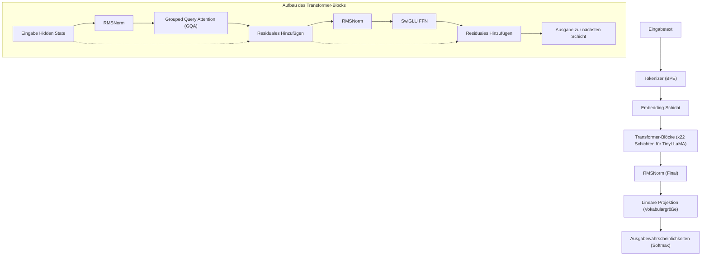
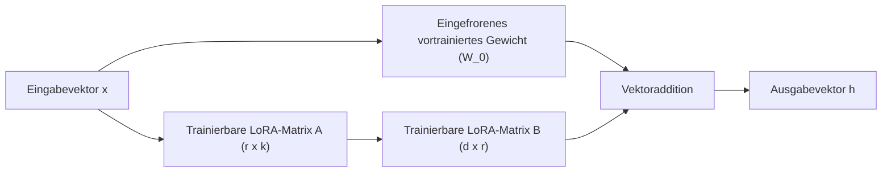
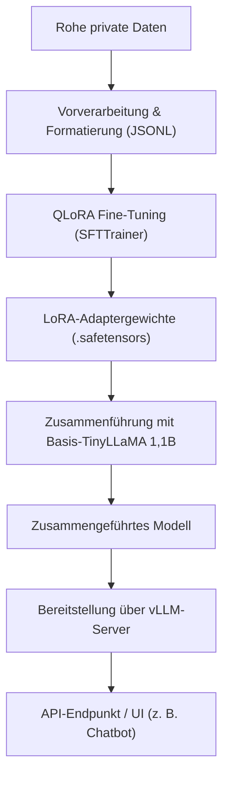

## 1. Einführung: Warum gerade jetzt TinyLLaMA und On-Premises?

Die Entwicklung von Large Language Models (LLM) schreitet mit enormer Geschwindigkeit voran, und dementsprechend wächst auch die Anzahl der Modellparameter stetig in die Hunderte von Milliarden. Während gigantische Modelle wie GPT-4 und Claude 3 eine beispiellose Leistung aufweisen, stellen die Rechenkosten für Inferenz und Training sowie Sicherheits- und Datenschutzbedenken bei der Nutzung externer APIs große Hürden für Unternehmen dar. Insbesondere in Geschäftsbereichen, die mit hochsensiblen internen Daten oder persönlichen Informationen umgehen, ist das Senden von Daten an öffentliche LLM-APIs in der Cloud aus Compliance-Gründen (wie DSGVO oder APPI) oft nicht zulässig.

Daher rücken **Small Language Models (SLM)** und der **lokale Betrieb in On-Premises-Umgebungen** ins Rampenlicht. Unter diesen zeichnet sich "**TinyLLaMA**" durch seine kompakte Größe von nur 1,1B (1,1 Milliarden) Parametern aus, während es mit einem riesigen Datensatz von etwa 3 Billionen Token vortrainiert wurde. Es zeigt im Vergleich zu Modellen derselben Klasse eine erstaunliche Leistung.

Dieser Artikel bietet einen vollständigen Leitfaden, wie Sie TinyLLaMA in einer On-Premises-Umgebung (lokaler Server oder Workstation) "am schnellsten und effizientesten" für Ihre eigenen spezifischen Aufgaben feinabstimmen (Fine-Tuning) können. Wir werden alles umfassend abdecken, von den mathematischen Grundlagen über die neuesten Optimierungstechnologien bis hin zum konkreten PyTorch-Implementierungscode.

---

## 2. Architektur und Eigenschaften von TinyLLaMA

TinyLLaMA folgt der von Meta entwickelten LLaMA (Large Language Model Meta AI)-Architektur. Obwohl die Anzahl der Parameter auf 1,1B begrenzt ist, verwendet es denselben Technologie-Stack wie LLaMA 2, was zu einer extrem hohen Ökosystem-Kompatibilität führt.

### Hauptkomponenten der Architektur

1. **RMSNorm (Root Mean Square Normalization):**
   Eine Normalisierungsmethode, die die Subtraktion des Mittelwerts aus der herkömmlichen LayerNorm-Berechnung weglässt und so die Recheneffizienz verbessert. Sie erhöht den Durchsatz, während die Stabilität des Trainings erhalten bleibt.
2. **SwiGLU-Aktivierungsfunktion:**
   Im Feed Forward Network (FFN) wird SwiGLU anstelle von herkömmlichem ReLU oder GELU verwendet. Dies wird mathematisch wie folgt ausgedrückt:
   $$ \text{SwiGLU}(x, W, V) = \text{Swish}(xW) \otimes (xV) $$
   Hierbei steht $\otimes$ für das elementweise Produkt (Hadamard-Produkt) und die Swish-Funktion ist $\text{Swish}(z) = z \cdot \sigma(\beta z)$. Dadurch wird die Ausdruckskraft deutlich erhöht.
3. **RoPE (Rotary Position Embedding):**
   Eine Methode, die die Vorteile von absoluter und relativer Positionskodierung kombiniert. Sie bietet eine hohe Generalisierungsleistung, auch wenn die Sequenzlänge erweitert wird.
4. **Grouped Query Attention (GQA):**
   Ein Ansatz, der zwischen Multi-Head Attention (MHA) und Multi-Query Attention (MQA) liegt. Durch die Gruppierung von Key- und Value-Heads wird Speicherbandbreite gespart und die Inferenzgeschwindigkeit drastisch verbessert.

Das folgende Mermaid-Diagramm zeigt den allgemeinen Datenfluss und die Struktur der Transformer-Blöcke von TinyLLaMA.



---

## 3. Durchbruch beim Fine-Tuning: LoRA und QLoRA

Die Feinabstimmung aller Parameter in einer On-Premises-Umgebung würde selbst für ein 1,1B-Modell Dutzende Gigabyte an VRAM (Videospeicher) verbrauchen, um die Optimizer-Zustände und Gradienten zu speichern. Um mit begrenzten Ressourcen effizient trainieren zu können, ist der Einsatz von **PEFT (Parameter-Efficient Fine-Tuning)**-Methoden wie "**LoRA**" und dessen quantisierter Erweiterung "**QLoRA**" unerlässlich.

### 3.1 Mathematischer Hintergrund von LoRA (Low-Rank Adaptation)

LoRA ist eine Methode, bei der die vortrainierte Gewichtsmatrix fixiert (eingefroren) wird und der Aktualisierungsbetrag dieser Gewichte ($\Delta W$) durch das Produkt von zwei kleinen Matrizen mit niedrigem Rang (Low-Rank) angenähert wird.

Sei das vortrainierte Gewicht $W_0 \in \mathbb{R}^{d \times k}$. Beim vollständigen Fine-Tuning wird $W_0$ selbst aktualisiert zu $W_0 + \Delta W$, aber bei LoRA wird die Aktualisierungsmatrix $\Delta W$ wie folgt zerlegt:

$$ \Delta W = B \times A $$

Hierbei sind $B \in \mathbb{R}^{d \times r}$ und $A \in \mathbb{R}^{r \times k}$, und $r$ ist ein Hyperparameter namens Rang (Rank), der ein sehr kleiner Wert ist (typischerweise 8, 16, 32 usw.), der $r \ll \min(d, k)$ erfüllt.

Die Berechnung des Vorwärtsdurchlaufs (Forward Pass) sieht wie folgt aus:

$$ h = W_0 x + \Delta W x = W_0 x + B A x $$

Im Initialzustand wird die Matrix $A$ zufällig mit einer Normalverteilung (Gauß-Verteilung) initialisiert, und die Matrix $B$ wird als Nullmatrix initialisiert. Dadurch ist $\Delta W$ zu Beginn des Trainings null, sodass das Training in einem Zustand gestartet werden kann, in dem die Ausgabe des Basismodells vollständig erhalten bleibt.



### 3.2 Die Innovation von QLoRA (Quantized LoRA)

QLoRA treibt den Ansatz von LoRA weiter voran, indem das Basismodell $W_0$ in 4-Bit-Präzision (NormalFloat 4, NF4) quantisiert und in den Speicher geladen wird. Dies reduziert den VRAM-Verbrauch drastisch.

In QLoRA sind drei wichtige Technologien integriert:
1. **4-bit NormalFloat (NF4) Quantisierung:** Ein theoretisch optimaler Datentyp, der für normalverteilte Gewichte optimiert ist.
2. **Double Quantization (Doppelte Quantisierung):** Spart noch mehr Speicherplatz, indem die Quantisierungskonstante (Skalierungsfaktor) selbst quantisiert wird.
3. **Paged Optimizers:** Ein Mechanismus, der die Unified-Memory-Funktion von NVIDIA nutzt, um Optimizer-Statusse bei VRAM-Mangel vorübergehend in den RAM der CPU auszulagern.

Dadurch kann ein Tuning, das normalerweise 16 GB bis 24 GB VRAM benötigt, selbst auf Consumer-GPUs (wie RTX 3060 12 GB oder RTX 4070) mühelos durchgeführt werden.

---

## 4. Hardwareanforderungen und Einrichtung in der On-Premises-Umgebung

Die Hardwareanforderungen für die Feinabstimmung von TinyLLaMA (1,1B) mit QLoRA können sehr niedrig gehalten werden.

### Empfohlene Hardwarespezifikationen
- **GPU:** NVIDIA RTX 3060 (12GB), RTX 3090/4090 (24GB) oder NVIDIA A10G/A100 usw. Ein Minimum von 8 GB VRAM ist für den Betrieb ausreichend, aber 12 GB oder mehr werden empfohlen, um größere Batch-Größen zu ermöglichen.
- **CPU:** Moderne CPU mit 8 oder mehr Kernen (Intel Core i7/i9, AMD Ryzen 7/9)
- **RAM:** 32 GB oder mehr (Wichtig als Auslagerungsziel für den VRAM bei Verwendung von Paged Optimizers)
- **Speicher:** NVMe SSD (Zur Beschleunigung des Ladens von Datensätzen und des Speicherns von Modellen)

### Einrichtung der Softwareumgebung

Dies ist ein Einrichtungsprozess, der für eine Ubuntu 22.04 LTS-Umgebung vorgesehen ist. Python 3.10 oder höher wird verwendet.

```bash
# Virtuelle Umgebung erstellen und aktivieren
python3 -m venv tinyllama_env
source tinyllama_env/bin/activate

# PyTorch installieren (für CUDA 12.1)
pip install torch torchvision torchaudio --index-url https://download.pytorch.org/whl/cu121

# Transformer-bezogene Bibliotheken installieren
pip install transformers datasets peft trl accelerate bitsandbytes
```

---

## 5. Optimierungstechnologien für schnellstes Tuning

Um das Tuning nicht nur einfach durchzuführen, sondern "am schnellsten" abzuschließen, müssen die folgenden Optimierungsmethoden kombiniert werden.

### 5.1 Flash Attention 2
Der Standard-Attention-Mechanismus hat eine Zeit- und Raumkomplexität von $O(N^2)$ für die Sequenzlänge $N$. Flash Attention 2 optimiert die Speicherzugriffe zwischen dem SRAM der GPU und dem HBM (High Bandwidth Memory), wodurch E/A-Engpässe ohne Reduzierung der Berechnungskomplexität beseitigt werden. Dies beschleunigt das Training um ein Vielfaches und reduziert den Speicherverbrauch drastisch.

### 5.2 Gradient Checkpointing (Gradienten-Checkpointing)
Hierbei werden nicht alle im Vorwärtsdurchlauf (Forward Pass) berechneten Zwischenaktivierungen im VRAM gespeichert, sondern nur ein Teil davon. Diese werden dann bei Bedarf im Rückwärtsdurchlauf (Backward Pass) neu berechnet. Die Berechnungszeit erhöht sich zwar um etwa 20 %, aber der Speicherverbrauch kann drastisch gesenkt werden, was letztendlich die Einstellung größerer Batch-Größen und eine Erhöhung des Gesamtdurchsatzes ermöglicht.

### 5.3 Mixed Precision Training (Gemischte Genauigkeit) und Bfloat16
Um die Tensor Cores der GPU optimal zu nutzen, werden die Trainingsberechnungen in `bfloat16` (Brain Floating Point) durchgeführt. Im Vergleich zu `float16` ist die Bitlänge des Exponenten dieselbe wie bei `float32`, sodass das Risiko von Overflows und Underflows extrem gering ist, was zu einem stabileren Training führt.

---

## 6. Praxis: QLoRA Fine-Tuning Code für TinyLLaMA

Lassen Sie uns nun das PyTorch-Skript für das schnellste Tuning erläutern, das alle oben genannten Optimierungen enthält. Hier verwenden wir den `SFTTrainer` aus der Bibliothek `trl` (Transformer Reinforcement Learning) von Hugging Face.

### 6.1 Vorbereiten des Datensatzes und Laden des Modells

```python
import torch
from datasets import load_dataset
from transformers import (
    AutoModelForCausalLM,
    AutoTokenizer,
    BitsAndBytesConfig,
    TrainingArguments
)
from peft import LoraConfig, get_peft_model, prepare_model_for_kbit_training
from trl import SFTTrainer

# 1. Spezifikation von Modell und Tokenizer
model_id = "TinyLlama/TinyLlama-1.1B-Chat-v1.0"

# 2. 4-Bit-Quantisierungseinstellungen für QLoRA
bnb_config = BitsAndBytesConfig(
    load_in_4bit=True,
    bnb_4bit_use_double_quant=True,
    bnb_4bit_quant_type="nf4",
    bnb_4bit_compute_dtype=torch.bfloat16 # Berechnungen in bfloat16 durchführen
)

# 3. Laden des Modells (Flash Attention 2 aktivieren)
print("Loading model...")
model = AutoModelForCausalLM.from_pretrained(
    model_id,
    quantization_config=bnb_config,
    device_map="auto",
    use_flash_attention_2=True # Schlüssel zur maximalen Geschwindigkeit
)

# 4. Laden des Tokenizers
tokenizer = AutoTokenizer.from_pretrained(model_id, trust_remote_code=True)
tokenizer.pad_token = tokenizer.eos_token
tokenizer.padding_side = "right" # Auf right setzen, um Bugs während fp16/bf16-Trainings zu vermeiden
```

### 6.2 Anwendung des LoRA-Adapters und Formatierung des Datensatzes

```python
# 5. Vorbereitung auf k-Bit-Training und Aktivierung des Gradient Checkpointings
model.gradient_checkpointing_enable()
model = prepare_model_for_kbit_training(model)

# 6. LoRA-Konfiguration
peft_config = LoraConfig(
    r=16, # Rang
    lora_alpha=32, # Skalierungsfaktor
    lora_dropout=0.05,
    bias="none",
    task_type="CAUSAL_LM",
    target_modules=["q_proj", "k_proj", "v_proj", "o_proj", "gate_proj", "up_proj", "down_proj"] # Die Einbeziehung aller linearen Schichten verbessert die Leistung
)

model = get_peft_model(model, peft_config)
model.print_trainable_parameters() 
# Ausgabebeispiel: trainable params: 14,286,848 || all params: 1,114,335,232 || trainable%: 1.282%

# 7. Laden des Datensatzes (Hier verwenden wir als Beispiel einen japanischen Instruction-Datensatz)
# In der Praxis laden Sie z.B. private JSONL-Dateien aus der On-Premises-Umgebung
dataset = load_dataset("kunishou/databricks-dolly-15k-ja", split="train")

def format_instruction(sample):
    """
    Formatiert den String so, dass er zum ChatML-Format oder Prompt-Template passt
    """
    prompt = f"<|im_start|>user\n{sample['instruction']}"
    if sample.get("input", "") != "":
         prompt += f"\n{sample['input']}"
    prompt += f"<|im_end|>\n<|im_start|>assistant\n{sample['output']}<|im_end|>"
    return {"text": prompt}

dataset = dataset.map(format_instruction)
```

### 6.3 Ausführung des Trainings

```python
# 8. Einstellen der Trainingsargumente
training_args = TrainingArguments(
    output_dir="./tinyllama-lora-output",
    per_device_train_batch_size=8, # Erhöhen, falls noch VRAM verfügbar ist
    gradient_accumulation_steps=2, # Effektive Batch-Größe = 8 * 2 = 16
    optim="paged_adamw_32bit",     # VRAM-Einsparung durch Paged Optimizer
    save_steps=100,
    logging_steps=10,
    learning_rate=2e-4,
    fp16=False,
    bf16=True,                     # Gemischte Genauigkeit (bfloat16)
    max_grad_norm=0.3,
    max_steps=500,                 # 500 Schritte zu Testzwecken. In der Produktion durch Epochenanzahl angeben
    warmup_ratio=0.03,
    group_by_length=True,
    lr_scheduler_type="cosine",
)

# 9. Starten des Trainings mit SFTTrainer
trainer = SFTTrainer(
    model=model,
    train_dataset=dataset,
    peft_config=peft_config,
    dataset_text_field="text",
    max_seq_length=1024, # Anpassen an die erwartete Eingabelänge
    tokenizer=tokenizer,
    args=training_args,
)

print("Starting training...")
trainer.train()

# 10. Speichern des LoRA-Adapters
trainer.model.save_pretrained("./tinyllama-lora-final")
tokenizer.save_pretrained("./tinyllama-lora-final")
print("Training complete and model saved.")
```

---

## 7. Leistungsbewertung und Fehlerbehebung

Dies sind häufig auftretende Probleme und deren Lösungen beim Training in On-Premises-Umgebungen.

1. **OOM (Out Of Memory) tritt auf:**
   - Senken Sie `per_device_train_batch_size` auf `1`.
   - Erhöhen Sie `gradient_accumulation_steps`, um die effektive Batch-Größe beizubehalten.
   - Verkürzen Sie `max_seq_length` von `2048` auf `1024` oder `512`.
2. **Loss sinkt nicht oder divergiert:**
   - Möglicherweise ist die Lernrate (`learning_rate`) zu hoch. Versuchen Sie, sie von `2e-4` auf etwa `5e-5` zu senken.
   - Wenn Float16 anstelle von Bfloat16 verwendet wird, könnte ein Gradienten-Underflow auftreten. Stellen Sie sicher, dass `bf16=True` gesetzt ist.
3. **Bei der Inferenz werden mysteriöse Zeichenketten generiert:**
   - Stellen Sie sicher, dass `padding_side="right"` korrekt eingestellt ist. Darüber hinaus muss überprüft werden, ob das Datensatzformat (Spezial-Token wie `<|im_start|>`) mit dem des Basismodells beim Vortraining übereinstimmt.

---

## 8. Modellbereitstellung (Deployment) nach dem Tuning

Wenn das Tuning abgeschlossen ist, wird nicht das "gesamte Basismodell" gespeichert, sondern nur der wenige MB bis Dutzende MB große "**LoRA-Adapter (Differenzgewichte)**". Um eine schnelle Inferenz durchzuführen, müssen diese LoRA-Gewichte mit dem ursprünglichen Basismodell zusammengeführt (gemergt) und als einzelnes Modell exportiert werden.

### Skript zum Mergen des Modells

```python
import torch
from peft import AutoPeftModelForCausalLM
from transformers import AutoTokenizer

output_dir = "./tinyllama-lora-final"

# Laden von Modell und Adapter in FP16/BF16
model = AutoPeftModelForCausalLM.from_pretrained(
    output_dir,
    device_map="auto",
    torch_dtype=torch.bfloat16
)
tokenizer = AutoTokenizer.from_pretrained(output_dir)

# Gewichte zusammenführen und speichern
merged_model = model.merge_and_unload()
merged_model.save_pretrained("./tinyllama-merged", safe_serialization=True)
tokenizer.save_pretrained("./tinyllama-merged")
print("Model merged and saved successfully!")
```

### Aufbau eines extrem schnellen Inferenzservers mit vLLM

Um den Inferenzdurchsatz (Tokens per second) in On-Premises-Umgebungen zu maximieren, wird dringend empfohlen, **vLLM** oder **TGI (Text Generation Inference)** anstelle der Standard-`pipeline` von Hugging Face zu verwenden. vLLM verwendet die PagedAttention-Technologie, um Speicherfragmentierung der GPU zu verhindern und die Verarbeitungskapazität für gleichzeitige Anfragen drastisch zu verbessern.

Das folgende Mermaid-Diagramm zeigt die Pipeline vom Training bis zur Bereitstellung auf dem Inferenzserver.



Das Starten des API-Servers mit vLLM ist mit folgendem Einzelbefehl erledigt:

```bash
python -m vllm.entrypoints.openai.api_server \
    --model ./tinyllama-merged \
    --host 0.0.0.0 \
    --port 8000 \
    --max-model-len 2048 \
    --dtype bfloat16
```
Damit ist ein mit der OpenAI-API kompatibler Endpunkt in der On-Premises-Umgebung eingerichtet, wodurch die lokale KI sicher und mit hoher Geschwindigkeit genutzt werden kann.

---

## 9. Fazit

Dieser Artikel erläuterte Methoden zur schnellsten und speichereffizientesten Feinabstimmung von "TinyLLaMA", einem Modell, das trotz seiner kompakten Größe von 1,1B Parametern eine hohe Leistung bietet, in einer On-Premises-Umgebung.

- Durch **LoRA / QLoRA** ist ein vollwertiges LLM-Tuning auch auf Consumer-GPUs möglich.
- Die Nutzung von **Flash Attention 2** und **Gradient Checkpointing** optimiert die Trainingszeit und den VRAM-Verbrauch auf das Äußerste.
- Durch die Bereitstellung mit **vLLM** wird auch in Produktionsumgebungen ein hoher Durchsatz erzielt.

Der lokale Betrieb von LLMs vor Ort schützt nicht nur die Datenvertraulichkeit, sondern ist auch die stärkste Waffe zum Aufbau spezialisierter KI für bestimmte Domänen (wie Recht, Medizin, interne Vorschriften usw.) zu geringen Kosten. Nutzen Sie diesen Leitfaden gerne als Referenz, um Ihr eigenes unternehmensspezifisches TinyLLaMA zu entwickeln.
