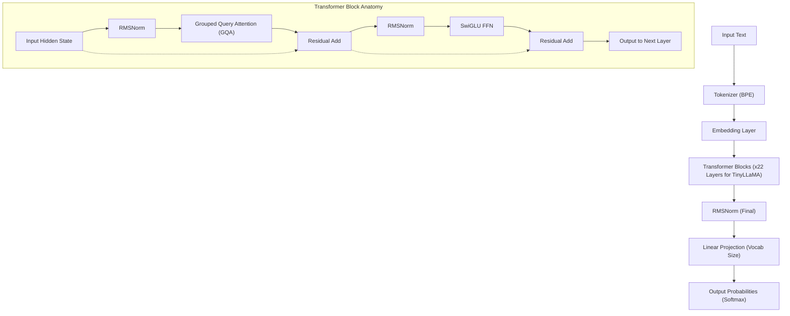
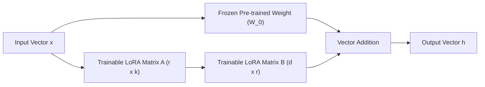
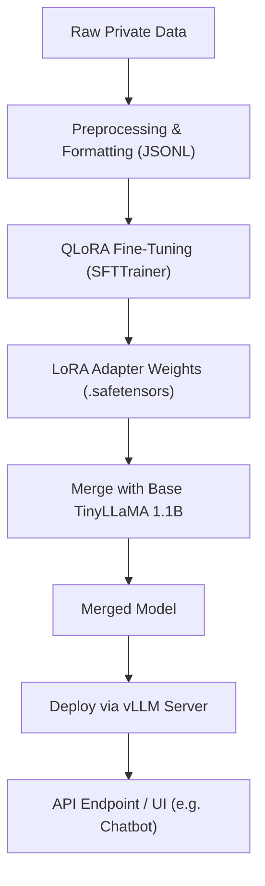

## 1. Introduction: Why TinyLLaMA and On-Premises Now?

The evolution of Large Language Models (LLMs) is proceeding at an incredible speed, but along with it, the number of model parameters continues to inflate to the scale of hundreds of billions. While ultra-giant models like GPT-4 and Claude 3 boast unparalleled performance, the computational costs required for inference and training, as well as security and data privacy concerns when using external APIs, present significant hurdles for companies. In business operations that handle highly sensitive internal data or personal information in particular, sending data to public LLM APIs on the cloud is often unacceptable from a compliance perspective (such as GDPR or APPI).

This is where **Small Language Models (SLMs)** and **local operation in an on-premises environment** are stepping into the spotlight. Among them, "**TinyLLaMA**" is a compact model with only 1.1B (1.1 billion) parameters, yet it has been pre-trained on a massive dataset of approximately 3 trillion tokens, demonstrating astonishing performance compared to models in the same class.

In this article, we provide a complete guide to fine-tuning TinyLLaMA "fastest and highly efficiently" for your company's specific tasks in an on-premises environment (local servers or workstations). We will comprehensively explain everything from the mathematical background to the latest optimization technologies and specific PyTorch implementation code.

---

## 2. TinyLLaMA Architecture and Features

TinyLLaMA follows the LLaMA (Large Language Model Meta AI) architecture developed by Meta. While keeping the number of parameters down to 1.1B, it uses the same technology stack as LLaMA 2, which features highly compatible ecosystem integration.

### Major Architectural Components

1. **RMSNorm (Root Mean Square Normalization):**
   A normalization technique that improves computational efficiency by omitting mean subtraction from conventional LayerNorm calculations. It improves throughput while maintaining training stability.
2. **SwiGLU Activation Function:**
   In the Feed Forward Network (FFN), SwiGLU is adopted instead of the conventional ReLU or GELU. Mathematically, it is expressed as follows:
   $$ \text{SwiGLU}(x, W, V) = \text{Swish}(xW) \otimes (xV) $$
   Here, $\otimes$ represents the element-wise product (Hadamard product), and the Swish function is $\text{Swish}(z) = z \cdot \sigma(\beta z)$. This significantly improves expressive power.
3. **RoPE (Rotary Position Embedding):**
   A method that combines the advantages of absolute position encoding and relative position encoding. It has high generalization performance even when the sequence length is extended.
4. **Grouped Query Attention (GQA):**
   An intermediate approach between Multi-Head Attention (MHA) and Multi-Query Attention (MQA), grouping key and value heads to save memory bandwidth and dramatically improve inference speed.

The following Mermaid diagram illustrates the overall data flow and Transformer block structure of TinyLLaMA.



---

## 3. Breakthrough in Fine-Tuning: LoRA and QLoRA

To perform full-parameter fine-tuning in an on-premises environment, even a 1.1B model consumes tens of GB of VRAM (Video RAM) to maintain optimizer states and gradients. To learn efficiently with limited resources, **PEFT (Parameter-Efficient Fine-Tuning)** techniques such as "**LoRA**" and its quantized extension "**QLoRA**" are essential.

### 3.1 Mathematical Background of LoRA (Low-Rank Adaptation)

LoRA is a method that fixes (freezes) pre-trained weight matrices and approximates the weight updates ($\Delta W$) as the product of two small, low-rank matrices.

Let the pre-trained weights be $W_0 \in \mathbb{R}^{d \times k}$. In full fine-tuning, $W_0$ itself is updated to $W_0 + \Delta W$, but in LoRA, the update matrix $\Delta W$ is decomposed as follows:

$$ \Delta W = B \times A $$

Here, $B \in \mathbb{R}^{d \times r}$ and $A \in \mathbb{R}^{r \times k}$, where $r$ is a hyperparameter called Rank, and it is a very small value (usually 8, 16, 32, etc.) that satisfies $r \ll \min(d, k)$.

The forward pass calculation is as follows:

$$ h = W_0 x + \Delta W x = W_0 x + B A x $$

In the initial state, matrix $A$ is randomly initialized with a normal distribution (Gaussian distribution), and matrix $B$ is initialized as a zero matrix. As a result, $\Delta W$ at the start of training is zero, allowing training to start with the base model's output perfectly preserved.



### 3.2 The Innovativeness of QLoRA (Quantized LoRA)

QLoRA pushes the LoRA approach further by quantizing the base model $W_0$ into 4-bit precision (NormalFloat 4, NF4) before loading it into memory. This drastically reduces VRAM consumption.

QLoRA incorporates three important technologies:
1. **4-bit NormalFloat (NF4) Quantization:** A theoretically optimal data type optimized for normally distributed weights.
2. **Double Quantization:** By quantizing the quantization constants (scale factors) themselves, it saves even more memory.
3. **Paged Optimizers:** Uses NVIDIA's unified memory feature to temporarily evict optimizer states to CPU RAM when VRAM is insufficient.

With this, fine-tuning that typically requires 16GB to 24GB of VRAM can comfortably run even on consumer-grade GPUs (like RTX 3060 12GB or RTX 4070).

---

## 4. Hardware Requirements and Setup in an On-Premises Environment

When tuning TinyLLaMA (1.1B) with QLoRA, hardware requirements are kept extremely low.

### Recommended Hardware Specifications
- **GPU:** NVIDIA RTX 3060 (12GB), RTX 3090/4090 (24GB), or NVIDIA A10G/A100, etc. It can run with a minimum of 8GB of VRAM, but 12GB or more is recommended to increase the batch size.
- **CPU:** A modern CPU with 8 or more cores (Intel Core i7/i9, AMD Ryzen 7/9)
- **RAM:** 32GB or more (crucial as a swap destination from VRAM when using Paged Optimizers)
- **Storage:** NVMe SSD (to speed up dataset loading and model saving)

### Software Environment Setup

Here is the setup procedure assuming an Ubuntu 22.04 LTS environment. We will use Python 3.10 or later.

```bash
# Create and activate a virtual environment
python3 -m venv tinyllama_env
source tinyllama_env/bin/activate

# Install PyTorch (for CUDA 12.1)
pip install torch torchvision torchaudio --index-url https://download.pytorch.org/whl/cu121

# Install transformer-related libraries
pip install transformers datasets peft trl accelerate bitsandbytes
```

---

## 5. Optimization Techniques for the Fastest Tuning

To complete tuning not just by running scripts but doing so at the "fastest" speed, you need to combine the following optimization techniques.

### 5.1 Flash Attention 2
The standard Attention mechanism has time and space complexity of $O(N^2)$ for sequence length $N$. Flash Attention 2 optimizes memory access between the GPU's SRAM and HBM (High Bandwidth Memory), eliminating the IO bottleneck without reducing the computational complexity. This boosts the training speed by several times and drastically reduces memory consumption.

### 5.2 Gradient Checkpointing
Instead of storing all intermediate activations computed during the forward pass in VRAM, this technique saves only a portion of them and recomputes them when needed during the backward pass. The computation time increases by about 20%, but memory consumption is drastically reduced, allowing for a larger batch size and resulting in improved overall throughput.

### 5.3 Mixed Precision Training and Bfloat16
To maximize the use of GPU Tensor Cores, calculations during training are performed in `bfloat16` (Brain Floating Point). Since the bit length of the exponent is the same as `float32` compared to `float16`, the risk of overflow and underflow is extremely low, stabilizing the training process.

---

## 6. Practice: QLoRA Fine-Tuning Code for TinyLLaMA

Let's break down the PyTorch script for the fastest tuning incorporating all the optimizations mentioned above. Here, we will use the `SFTTrainer` from Hugging Face's `trl` (Transformer Reinforcement Learning) library.

### 6.1 Dataset Preparation and Model Loading

```python
import torch
from datasets import load_dataset
from transformers import (
    AutoModelForCausalLM,
    AutoTokenizer,
    BitsAndBytesConfig,
    TrainingArguments
)
from peft import LoraConfig, get_peft_model, prepare_model_for_kbit_training
from trl import SFTTrainer

# 1. Specify model and tokenizer
model_id = "TinyLlama/TinyLlama-1.1B-Chat-v1.0"

# 2. 4-bit quantization settings for QLoRA
bnb_config = BitsAndBytesConfig(
    load_in_4bit=True,
    bnb_4bit_use_double_quant=True,
    bnb_4bit_quant_type="nf4",
    bnb_4bit_compute_dtype=torch.bfloat16 # Perform calculations in bfloat16
)

# 3. Load model (Enable Flash Attention 2)
print("Loading model...")
model = AutoModelForCausalLM.from_pretrained(
    model_id,
    quantization_config=bnb_config,
    device_map="auto",
    use_flash_attention_2=True # Key to maximum speed
)

# 4. Load tokenizer
tokenizer = AutoTokenizer.from_pretrained(model_id, trust_remote_code=True)
tokenizer.pad_token = tokenizer.eos_token
tokenizer.padding_side = "right" # Set to right to avoid bugs during fp16/bf16 training
```

### 6.2 Applying the LoRA Adapter and Formatting the Dataset

```python
# 5. Prepare for k-bit training and enable gradient checkpointing
model.gradient_checkpointing_enable()
model = prepare_model_for_kbit_training(model)

# 6. LoRA configuration
peft_config = LoraConfig(
    r=16, # Rank
    lora_alpha=32, # Scaling factor
    lora_dropout=0.05,
    bias="none",
    task_type="CAUSAL_LM",
    target_modules=["q_proj", "k_proj", "v_proj", "o_proj", "gate_proj", "up_proj", "down_proj"] # Targeting all Linear layers improves performance
)

model = get_peft_model(model, peft_config)
model.print_trainable_parameters() 
# Example output: trainable params: 14,286,848 || all params: 1,114,335,232 || trainable%: 1.282%

# 7. Load dataset (Using Japanese Instruction dataset as an example here)
# In practice, you would load an on-premises private JSONL file, etc.
dataset = load_dataset("kunishou/databricks-dolly-15k-ja", split="train")

def format_instruction(sample):
    """
    Formats the string according to ChatML format or prompt template
    """
    prompt = f"<|im_start|>user\n{sample['instruction']}"
    if sample.get("input", "") != "":
         prompt += f"\n{sample['input']}"
    prompt += f"<|im_end|>\n<|im_start|>assistant\n{sample['output']}<|im_end|>"
    return {"text": prompt}

dataset = dataset.map(format_instruction)
```

### 6.3 Executing the Training

```python
# 8. Set training arguments
training_args = TrainingArguments(
    output_dir="./tinyllama-lora-output",
    per_device_train_batch_size=8, # Increase if you have spare VRAM
    gradient_accumulation_steps=2, # Effective batch size = 8 * 2 = 16
    optim="paged_adamw_32bit",     # VRAM savings with Paged Optimizer
    save_steps=100,
    logging_steps=10,
    learning_rate=2e-4,
    fp16=False,
    bf16=True,                     # Mixed precision training (bfloat16)
    max_grad_norm=0.3,
    max_steps=500,                 # 500 steps for testing. Specify by epochs in production
    warmup_ratio=0.03,
    group_by_length=True,
    lr_scheduler_type="cosine",
)

# 9. Start training with SFTTrainer
trainer = SFTTrainer(
    model=model,
    train_dataset=dataset,
    peft_config=peft_config,
    dataset_text_field="text",
    max_seq_length=1024, # Adjust according to the expected input length
    tokenizer=tokenizer,
    args=training_args,
)

print("Starting training...")
trainer.train()

# 10. Save the LoRA adapter
trainer.model.save_pretrained("./tinyllama-lora-final")
tokenizer.save_pretrained("./tinyllama-lora-final")
print("Training complete and model saved.")
```

---

## 7. Performance Evaluation and Troubleshooting

Here are common issues encountered when running training in an on-premises environment and their solutions.

1. **OOM (Out Of Memory) occurs:**
   - Lower `per_device_train_batch_size` to `1`.
   - Maintain the effective batch size by increasing `gradient_accumulation_steps`.
   - Shorten `max_seq_length` from `2048` to `1024` or `512`.
2. **Loss doesn't drop or diverges:**
   - The learning rate (`learning_rate`) might be too high. Try lowering it from `2e-4` to around `5e-5`.
   - If using Float16 instead of Bfloat16, gradient underflow might be occurring. Ensure `bf16=True` is set.
3. **Mysterious strings are generated during inference:**
   - Ensure `padding_side="right"` is correctly set. Also, verify that the dataset format (`<|im_start|>` and other special tokens) is consistent with the base model's pre-training.

---

## 8. Model Deployment After Tuning

Once tuning is complete, what gets saved is not the "entire base model," but only the "**LoRA adapter (delta weights)**," which is a few MB to tens of MB in size. To perform fast inference, you need to merge (integrate) these LoRA weights back into the original base model and export it as a single model.

### Model Merging Script

```python
import torch
from peft import AutoPeftModelForCausalLM
from transformers import AutoTokenizer

output_dir = "./tinyllama-lora-final"

# Load model and adapter in FP16/BF16
model = AutoPeftModelForCausalLM.from_pretrained(
    output_dir,
    device_map="auto",
    torch_dtype=torch.bfloat16
)
tokenizer = AutoTokenizer.from_pretrained(output_dir)

# Merge weights and save
merged_model = model.merge_and_unload()
merged_model.save_pretrained("./tinyllama-merged", safe_serialization=True)
tokenizer.save_pretrained("./tinyllama-merged")
print("Model merged and saved successfully!")
```

### Launching an Ultra-Fast Inference Server with vLLM

For deployment in an on-premises environment, we strongly recommend using **vLLM** or **TGI (Text Generation Inference)** instead of Hugging Face's standard `pipeline` to maximize inference speed (Tokens per second). vLLM uses PagedAttention technology to prevent GPU memory fragmentation and dramatically improves the processing capability for concurrent requests.

The following Mermaid diagram shows the pipeline from training to deploying an inference server.



Starting an API server using vLLM can be completed with the following single command:

```bash
python -m vllm.entrypoints.openai.api_server \
    --model ./tinyllama-merged \
    --host 0.0.0.0 \
    --port 8000 \
    --max-model-len 2048 \
    --dtype bfloat16
```
Now, an OpenAI API-compatible endpoint is built in your on-premises environment, allowing you to utilize local AI securely and quickly.

---

## 9. Conclusion

In this article, we explained the methods for performing the fastest and most memory-efficient fine-tuning in an on-premises environment for "TinyLLaMA", a model that is highly performant despite being lightweight with 1.1B parameters.

- **LoRA / QLoRA** enables full-fledged LLM tuning even on consumer GPUs.
- Leveraging **Flash Attention 2** and **Gradient Checkpointing** optimizes training time and VRAM consumption to the limit.
- Deployment using **vLLM** achieves high throughput even in production environments.

Operating a local LLM on-premises is not only for protecting data confidentiality but also serves as the ultimate weapon for building specialized AI at low cost for specific domains (legal, medical, internal regulations, etc.). We encourage you to refer to this guide and nurture your own TinyLLaMA.
