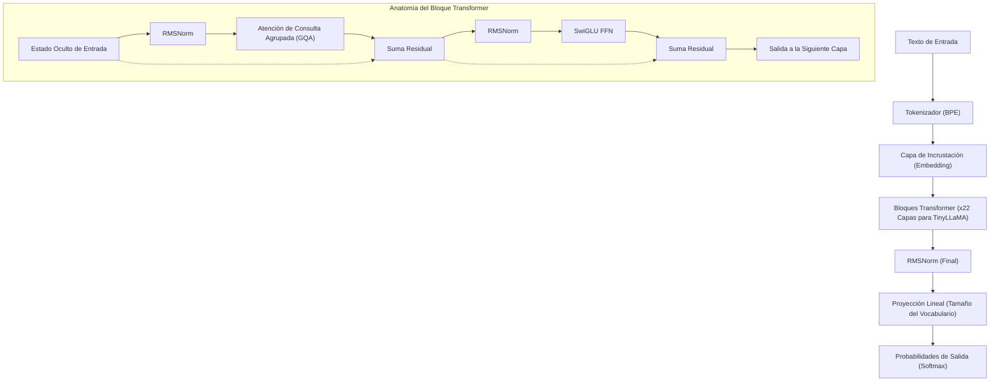
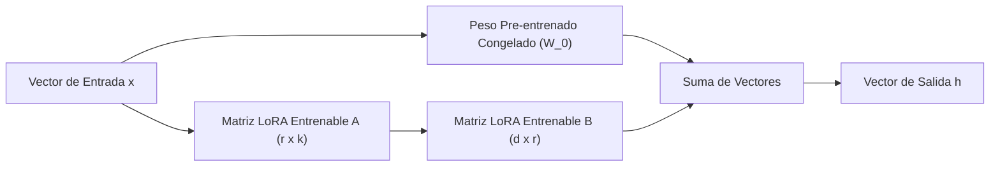
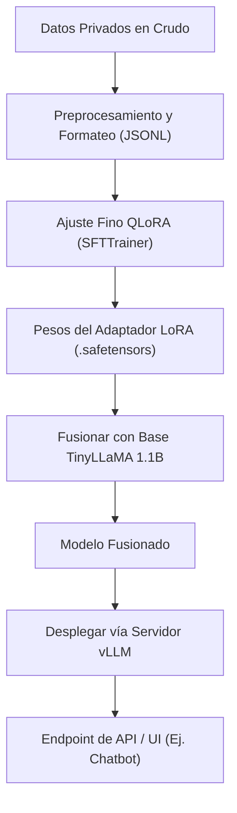

## 1. Introducción: ¿Por qué TinyLLaMA y entornos locales ahora?

La evolución de los modelos de lenguaje grande (LLM) avanza a un ritmo vertiginoso, y en consecuencia, el número de parámetros de los modelos sigue expandiéndose a escalas de cientos de miles de millones. Si bien los modelos gigantes como GPT-4 o Claude 3 ostentan un rendimiento inigualable, los costos computacionales de inferencia y entrenamiento, así como las preocupaciones sobre seguridad y privacidad de datos al usar APIs externas, se han convertido en grandes obstáculos para las empresas. Especialmente en tareas que manejan datos internos confidenciales o información personal, enviar datos a APIs de LLM públicas en la nube a menudo es inaceptable desde el punto de vista del cumplimiento normativo (como GDPR o APPI).

Aquí es donde los **modelos de lenguaje pequeños (SLM: Small Language Models)** y el **funcionamiento local en entornos On-Premises** están ganando protagonismo. Entre ellos, "**TinyLLaMA**" destaca por su tamaño compacto de tan solo 1.1B (1.100 millones) de parámetros, pero habiendo sido pre-entrenado con un inmenso conjunto de datos de aproximadamente 3 billones de tokens, ofreciendo un rendimiento asombroso en comparación con modelos de su misma clase.

En este artículo, proporcionaremos una guía completa para ajustar (fine-tune) TinyLLaMA en un entorno local (servidores locales o estaciones de trabajo) para tareas específicas de su empresa de la manera "más rápida y eficiente". Cubriremos exhaustivamente desde los fundamentos matemáticos hasta las últimas tecnologías de optimización, incluyendo código de implementación específico en PyTorch.

---

## 2. Arquitectura y características de TinyLLaMA

TinyLLaMA sigue la arquitectura LLaMA (Large Language Model Meta AI) desarrollada por Meta. Aunque mantiene el número de parámetros en 1.1B, utiliza la misma pila tecnológica que LLaMA 2, lo que le otorga una compatibilidad de ecosistema extremadamente alta.

### Componentes arquitectónicos principales

1. **RMSNorm (Root Mean Square Normalization):**
   Un método de normalización que omite la resta de la media del cálculo tradicional de LayerNorm, mejorando la eficiencia computacional. Mejora el rendimiento (throughput) manteniendo la estabilidad del entrenamiento.
2. **Función de activación SwiGLU:**
   En la red neuronal prealimentada (Feed Forward Network - FFN), adopta SwiGLU en lugar de las tradicionales ReLU o GELU. Matemáticamente, esto se expresa como:
   $$ \text{SwiGLU}(x, W, V) = \text{Swish}(xW) \otimes (xV) $$
   Aquí, $\otimes$ representa el producto elemento a elemento (producto de Hadamard), y la función Swish es $\text{Swish}(z) = z \cdot \sigma(\beta z)$. Esto mejora significativamente la capacidad de representación.
3. **RoPE (Rotary Position Embedding):**
   Un método que combina las ventajas de la codificación de posición absoluta y la codificación de posición relativa. Posee un alto rendimiento de generalización incluso cuando se expande la longitud de la secuencia.
4. **Grouped Query Attention (GQA):**
   Un enfoque intermedio entre Multi-Head Attention (MHA) y Multi-Query Attention (MQA) que, al agrupar los cabezales (heads) de las claves (keys) y valores (values), ahorra ancho de banda de memoria y mejora drásticamente la velocidad de inferencia.

El siguiente diagrama Mermaid muestra el flujo de datos general de TinyLLaMA y la estructura del bloque Transformer.



---

## 3. El avance del ajuste fino: LoRA y QLoRA

Realizar un ajuste fino (fine-tuning) con todos los parámetros en un entorno local consume decenas de GB de VRAM (memoria de video) para mantener el estado del optimizador y los gradientes, incluso con un modelo de 1.1B. Para entrenar eficientemente con recursos limitados, es imprescindible usar "**LoRA**", una técnica de **PEFT (Parameter-Efficient Fine-Tuning)**, y su extensión cuantizada, "**QLoRA**".

### 3.1 Fundamentos matemáticos de LoRA (Low-Rank Adaptation)

LoRA es una técnica que fija (congela) las matrices de peso pre-entrenadas y aproxima la cantidad de actualización de esos pesos ($\Delta W$) como el producto de dos matrices pequeñas de bajo rango.

Supongamos que los pesos pre-entrenados son $W_0 \in \mathbb{R}^{d \times k}$. En un fine-tuning completo, actualizaríamos el propio $W_0$ a $W_0 + \Delta W$, pero en LoRA descomponemos la matriz de actualización $\Delta W$ de la siguiente manera:

$$ \Delta W = B \times A $$

Aquí, $B \in \mathbb{R}^{d \times r}$ y $A \in \mathbb{R}^{r \times k}$, donde $r$ es un hiperparámetro llamado Rango (Rank) y es un valor muy pequeño (usualmente 8, 16, 32, etc.) que satisface $r \ll \min(d, k)$.

El cálculo del paso hacia adelante (forward pass) es el siguiente:

$$ h = W_0 x + \Delta W x = W_0 x + B A x $$

En el estado inicial, la matriz $A$ se inicializa aleatoriamente con una distribución normal (distribución gaussiana), y la matriz $B$ se inicializa como una matriz cero. Por lo tanto, $\Delta W$ es cero al inicio del entrenamiento, lo que permite comenzar a entrenar manteniendo completamente la salida del modelo base.



### 3.2 La innovación de QLoRA (Quantized LoRA)

QLoRA lleva el enfoque de LoRA un paso más allá cuantizando el modelo base $W_0$ a precisión de 4 bits (NormalFloat 4, NF4) antes de cargarlo en la memoria. Esto reduce drásticamente el consumo de VRAM.

QLoRA incorpora tres tecnologías importantes:
1. **Cuantización NormalFloat de 4 bits (NF4):** Un tipo de datos teóricamente óptimo para pesos que siguen una distribución normal.
2. **Doble Cuantización (Double Quantization):** Cuantiza las constantes de cuantización (factores de escala) mismas, ahorrando aún más memoria.
3. **Paged Optimizers:** Utiliza la función de memoria unificada de NVIDIA para trasladar temporalmente el estado del optimizador a la RAM de la CPU cuando la VRAM escasea.

Como resultado, el ajuste que normalmente requiere 16GB a 24GB de VRAM se puede ejecutar con holgura incluso en GPUs de nivel de consumidor (como RTX 3060 de 12GB o RTX 4070).

---

## 4. Requisitos de hardware y configuración en entornos locales

Los requisitos de hardware al ajustar TinyLLaMA (1.1B) con QLoRA se mantienen muy bajos.

### Especificaciones de hardware recomendadas
- **GPU:** NVIDIA RTX 3060 (12GB), RTX 3090/4090 (24GB), o NVIDIA A10G/A100, etc. Funcionará con al menos 8GB de VRAM, pero se recomiendan 12GB o más para aumentar el tamaño del lote (batch size).
- **CPU:** Una CPU moderna de 8 núcleos o más (Intel Core i7/i9, AMD Ryzen 7/9).
- **RAM:** 32GB o más (importante como destino de paginación desde la VRAM cuando se usan Paged Optimizers).
- **Almacenamiento:** SSD NVMe (para acelerar la carga de conjuntos de datos y guardar el modelo).

### Configuración del entorno de software

Este es un procedimiento de configuración asumiendo un entorno Ubuntu 22.04 LTS. Utilizaremos Python 3.10 o superior.

```bash
# Creación y activación de un entorno virtual
python3 -m venv tinyllama_env
source tinyllama_env/bin/activate

# Instalación de PyTorch (para CUDA 12.1)
pip install torch torchvision torchaudio --index-url https://download.pytorch.org/whl/cu121

# Instalación de bibliotecas relacionadas con Transformers
pip install transformers datasets peft trl accelerate bitsandbytes
```

---

## 5. Técnicas de optimización para el ajuste más rápido

Para completar el ajuste de la manera "más rápida" posible, no basta con ejecutar un script; es necesario combinar las siguientes técnicas de optimización.

### 5.1 Flash Attention 2
El mecanismo de Atención estándar tiene una complejidad computacional temporal y espacial de $O(N^2)$ con respecto a la longitud de la secuencia $N$. Flash Attention 2 optimiza el acceso a la memoria entre la SRAM de la GPU y la HBM (High Bandwidth Memory), resolviendo los cuellos de botella de entrada/salida (IO) sin reducir la cantidad de cálculos, lo que multiplica la velocidad de entrenamiento por varias veces y reduce drásticamente el consumo de memoria.

### 5.2 Gradient Checkpointing (Puntos de control de gradientes)
En lugar de guardar en la VRAM todas las activaciones intermedias calculadas en el paso hacia adelante, este método guarda solo algunas y recalcula las necesarias durante el paso hacia atrás (backward pass). Aunque el tiempo de cálculo aumenta aproximadamente un 20%, el consumo de memoria se reduce drásticamente. Esto permite establecer un tamaño de lote mayor, mejorando el rendimiento (throughput) general en consecuencia.

### 5.3 Entrenamiento de Precisión Mixta (Mixed Precision Training) y Bfloat16
Para maximizar el uso de los Tensor Cores de la GPU, los cálculos durante el entrenamiento se realizan en `bfloat16` (Brain Floating Point). A diferencia de `float16`, su longitud de bits para el exponente es la misma que en `float32`, por lo que el riesgo de desbordamiento (overflow o underflow) es extremadamente bajo y el entrenamiento es estable.

---

## 6. Práctica: Código de ajuste fino QLoRA para TinyLLaMA

Ahora explicaremos un script de PyTorch para el ajuste más rápido que incorpora todas las optimizaciones anteriores. Aquí utilizaremos el `SFTTrainer` de la biblioteca `trl` (Transformer Reinforcement Learning) de Hugging Face.

### 6.1 Preparación del conjunto de datos y carga del modelo

```python
import torch
from datasets import load_dataset
from transformers import (
    AutoModelForCausalLM,
    AutoTokenizer,
    BitsAndBytesConfig,
    TrainingArguments
)
from peft import LoraConfig, get_peft_model, prepare_model_for_kbit_training
from trl import SFTTrainer

# 1. Especificar el modelo y el tokenizador
model_id = "TinyLlama/TinyLlama-1.1B-Chat-v1.0"

# 2. Configuración de cuantización a 4 bits para QLoRA
bnb_config = BitsAndBytesConfig(
    load_in_4bit=True,
    bnb_4bit_use_double_quant=True,
    bnb_4bit_quant_type="nf4",
    bnb_4bit_compute_dtype=torch.bfloat16 # Realizar cálculos en bfloat16
)

# 3. Cargar el modelo (Habilitar Flash Attention 2)
print("Loading model...")
model = AutoModelForCausalLM.from_pretrained(
    model_id,
    quantization_config=bnb_config,
    device_map="auto",
    use_flash_attention_2=True # La clave para la máxima velocidad
)

# 4. Cargar el tokenizador
tokenizer = AutoTokenizer.from_pretrained(model_id, trust_remote_code=True)
tokenizer.pad_token = tokenizer.eos_token
tokenizer.padding_side = "right" # Configurar en 'right' para evitar bugs durante el entrenamiento fp16/bf16
```

### 6.2 Aplicación del adaptador LoRA y formato del conjunto de datos

```python
# 5. Preparación para entrenamiento en k bits y habilitación del Gradient Checkpointing
model.gradient_checkpointing_enable()
model = prepare_model_for_kbit_training(model)

# 6. Configuración de LoRA
peft_config = LoraConfig(
    r=16, # Rango
    lora_alpha=32, # Factor de escala
    lora_dropout=0.05,
    bias="none",
    task_type="CAUSAL_LM",
    target_modules=["q_proj", "k_proj", "v_proj", "o_proj", "gate_proj", "up_proj", "down_proj"] # El rendimiento mejora al apuntar a todas las capas Lineales
)

model = get_peft_model(model, peft_config)
model.print_trainable_parameters() 
# Ejemplo de salida: trainable params: 14,286,848 || all params: 1,114,335,232 || trainable%: 1.282%

# 7. Cargar el conjunto de datos (Aquí usamos un conjunto de datos de instrucciones en japonés como ejemplo)
# En la práctica, cargarías archivos JSONL privados locales, etc.
dataset = load_dataset("kunishou/databricks-dolly-15k-ja", split="train")

def format_instruction(sample):
    """
    Formatea las cadenas de texto para que coincidan con el formato ChatML o plantillas de prompts
    """
    prompt = f"<|im_start|>user\n{sample['instruction']}"
    if sample.get("input", "") != "":
         prompt += f"\n{sample['input']}"
    prompt += f"<|im_end|>\n<|im_start|>assistant\n{sample['output']}<|im_end|>"
    return {"text": prompt}

dataset = dataset.map(format_instruction)
```

### 6.3 Ejecución del entrenamiento

```python
# 8. Configuración de los argumentos de entrenamiento
training_args = TrainingArguments(
    output_dir="./tinyllama-lora-output",
    per_device_train_batch_size=8, # Aumentar si hay VRAM disponible
    gradient_accumulation_steps=2, # Tamaño de lote efectivo = 8 * 2 = 16
    optim="paged_adamw_32bit",     # Ahorro de VRAM gracias a Paged Optimizer
    save_steps=100,
    logging_steps=10,
    learning_rate=2e-4,
    fp16=False,
    bf16=True,                     # Entrenamiento de precisión mixta (bfloat16)
    max_grad_norm=0.3,
    max_steps=500,                 # 500 pasos para pruebas. En producción, especificar el número de épocas
    warmup_ratio=0.03,
    group_by_length=True,
    lr_scheduler_type="cosine",
)

# 9. Iniciar el entrenamiento con SFTTrainer
trainer = SFTTrainer(
    model=model,
    train_dataset=dataset,
    peft_config=peft_config,
    dataset_text_field="text",
    max_seq_length=1024, # Ajustar según la longitud de entrada esperada
    tokenizer=tokenizer,
    args=training_args,
)

print("Starting training...")
trainer.train()

# 10. Guardar el adaptador LoRA
trainer.model.save_pretrained("./tinyllama-lora-final")
tokenizer.save_pretrained("./tinyllama-lora-final")
print("Training complete and model saved.")
```

---

## 7. Evaluación de rendimiento y solución de problemas

Estos son los problemas más comunes que se enfrentan al entrenar en un entorno local y sus soluciones.

1. **Ocurre un OOM (Out Of Memory):**
   - Reducir `per_device_train_batch_size` a `1`.
   - Aumentar `gradient_accumulation_steps` para mantener el tamaño del lote efectivo.
   - Reducir `max_seq_length` de `2048` a `1024` o `512`.
2. **La pérdida (Loss) no disminuye o diverge:**
   - La tasa de aprendizaje (`learning_rate`) podría ser demasiado alta. Intente reducirla de `2e-4` a algo como `5e-5`.
   - Si está usando Float16 en lugar de Bfloat16, es posible que esté ocurriendo un underflow en los gradientes. Asegúrese de que `bf16=True` esté configurado.
3. **Se generan cadenas de texto extrañas durante la inferencia:**
   - Verifique que `padding_side="right"` esté configurado correctamente. Además, es necesario asegurarse de que el formato del conjunto de datos (tokens especiales como `<|im_start|>`) coincida con el utilizado durante el pre-entrenamiento del modelo base.

---

## 8. Despliegue del modelo después del ajuste (Deployment)

Una vez completado el ajuste, lo que se guarda no es "todo el modelo base", sino solo el "**Adaptador LoRA (pesos diferenciales)**" de unos pocos MB a decenas de MB. Para realizar inferencias a alta velocidad, es necesario fusionar (merge) estos pesos LoRA en el modelo base original y exportarlo como un modelo único.

### Script de fusión de modelos

```python
import torch
from peft import AutoPeftModelForCausalLM
from transformers import AutoTokenizer

output_dir = "./tinyllama-lora-final"

# Cargar el modelo y el adaptador en FP16/BF16
model = AutoPeftModelForCausalLM.from_pretrained(
    output_dir,
    device_map="auto",
    torch_dtype=torch.bfloat16
)
tokenizer = AutoTokenizer.from_pretrained(output_dir)

# Fusionar los pesos y guardar
merged_model = model.merge_and_unload()
merged_model.save_pretrained("./tinyllama-merged", safe_serialization=True)
tokenizer.save_pretrained("./tinyllama-merged")
print("Model merged and saved successfully!")
```

### Inicio de un servidor de inferencia ultrarrápido con vLLM

Al desplegar en un entorno local, para maximizar la velocidad de inferencia (Tokens por segundo), recomendamos encarecidamente usar **vLLM** o **TGI (Text Generation Inference)** en lugar del `pipeline` estándar de Hugging Face. vLLM utiliza la tecnología PagedAttention para evitar la fragmentación de la memoria de la GPU, mejorando drásticamente la capacidad de procesar solicitudes concurrentes.

El siguiente diagrama Mermaid muestra el pipeline desde el entrenamiento hasta el despliegue del servidor de inferencia.



Iniciar un servidor API con vLLM se completa con el siguiente comando:

```bash
python -m vllm.entrypoints.openai.api_server \
    --model ./tinyllama-merged \
    --host 0.0.0.0 \
    --port 8000 \
    --max-model-len 2048 \
    --dtype bfloat16
```
Con esto, se establecerá un endpoint compatible con la API de OpenAI en su entorno local, permitiéndole aprovechar la IA local de manera segura y rápida.

---

## 9. Conclusión

En este artículo, explicamos el método para realizar un ajuste fino de la manera más rápida y eficiente en memoria en un entorno local, centrándonos en "TinyLLaMA", que es liviano con 1.1B de parámetros pero de alto rendimiento.

- Gracias a **LoRA / QLoRA**, es posible realizar un ajuste fino auténtico de LLM incluso en GPUs de consumidor.
- Al aprovechar **Flash Attention 2** y **Gradient Checkpointing**, el tiempo de entrenamiento y el consumo de VRAM se optimizan al límite.
- El despliegue utilizando **vLLM** logra un alto rendimiento (throughput) incluso en entornos de producción.

Operar un LLM localmente en entornos On-Premises no solo protege la confidencialidad de los datos, sino que también se convierte en su arma más poderosa para construir IA especializada para dominios específicos (legal, médico, regulaciones internas de la empresa, etc.) a bajo costo. Por favor, utilice esta guía como referencia para entrenar su propio TinyLLaMA personalizado.
