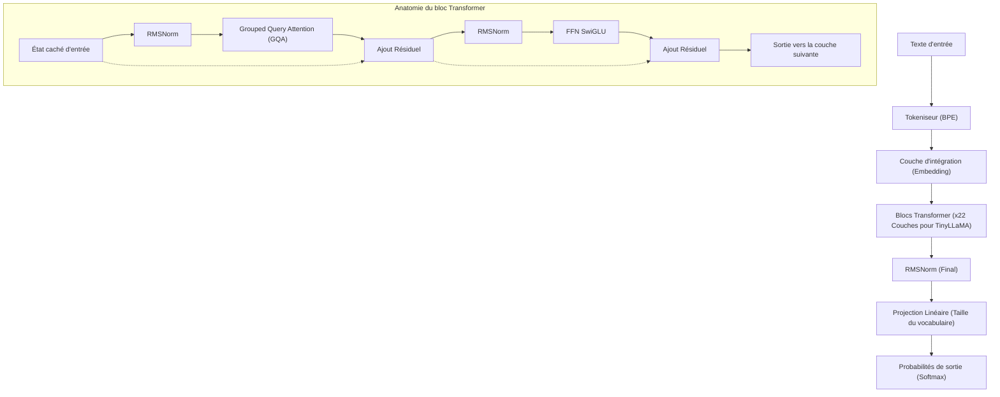
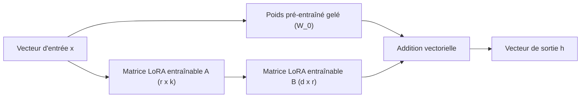
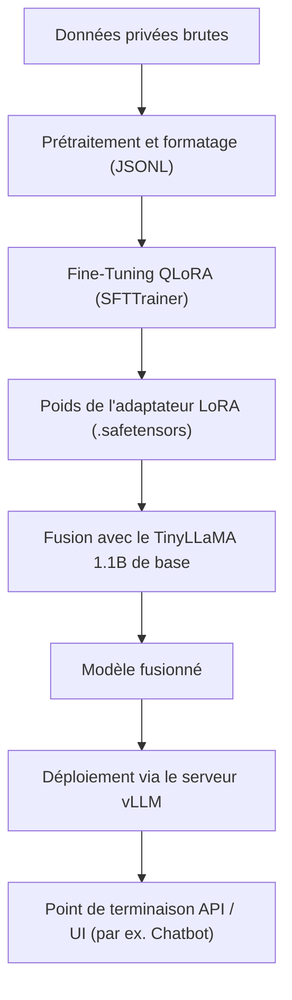

## 1. Introduction : Pourquoi TinyLLaMA et le sur site aujourd'hui ?

L'évolution des grands modèles de langage (LLM) progresse à une vitesse fulgurante, et avec elle, le nombre de paramètres des modèles continue de s'étendre pour atteindre des centaines de milliards. Si des modèles gigantesques comme GPT-4 et Claude 3 offrent des performances inégalées, les coûts de calcul pour l'inférence et l'apprentissage, ainsi que les problèmes de sécurité et de confidentialité des données lors de l'utilisation d'API externes, constituent des obstacles majeurs pour les entreprises. En particulier pour les tâches impliquant des données internes hautement confidentielles ou des informations personnelles, l'envoi de données à des API LLM publiques dans le cloud est souvent inacceptable du point de vue de la conformité (RGPD, APPI, etc.).

C'est là que les **petits modèles de langage (SLM : Small Language Models)** et le **déploiement local dans des environnements sur site** (on-premises) entrent en jeu. Parmi eux, "**TinyLLaMA**" se distingue. Avec une taille compacte de seulement 1,1B (1,1 milliard) de paramètres, il a été pré-entraîné sur un ensemble de données massif d'environ 3 billions de jetons (tokens), offrant des performances exceptionnelles par rapport aux modèles de la même catégorie.

Cet article fournit un guide complet pour affiner (fine-tuning) TinyLLaMA de manière "ultra-rapide et très efficace" pour vos tâches spécifiques dans un environnement sur site (serveur local ou station de travail). Nous couvrirons tout de manière exhaustive, des fondements mathématiques aux dernières techniques d'optimisation, en passant par le code d'implémentation concret en PyTorch.

---

## 2. Architecture et caractéristiques de TinyLLaMA

TinyLLaMA suit l'architecture LLaMA (Large Language Model Meta AI) développée par Meta. Tout en maintenant le nombre de paramètres à 1,1B, il utilise la même pile technologique que LLaMA 2, ce qui rend son écosystème hautement compatible.

### Principaux composants de l'architecture

1. **RMSNorm (Root Mean Square Normalization) :**
   Une méthode de normalisation qui améliore l'efficacité des calculs en omettant la soustraction de la moyenne des calculs LayerNorm traditionnels. Elle augmente le débit tout en maintenant la stabilité de l'apprentissage.
2. **Fonction d'activation SwiGLU :**
   Dans le Feed Forward Network (FFN), SwiGLU est utilisé à la place des classiques ReLU ou GELU. Mathématiquement, cela s'exprime comme suit :
   $$ \text{SwiGLU}(x, W, V) = \text{Swish}(xW) \otimes (xV) $$
   Ici, $\otimes$ représente le produit élément par élément (produit de Hadamard), et la fonction Swish est $\text{Swish}(z) = z \cdot \sigma(\beta z)$. Cela améliore considérablement la puissance de représentation.
3. **RoPE (Rotary Position Embedding) :**
   Une méthode qui combine les avantages de l'encodage de position absolu et relatif. Elle présente de fortes performances de généralisation même lorsque la longueur de la séquence est étendue.
4. **Grouped Query Attention (GQA) :**
   Une approche intermédiaire entre la Multi-Head Attention (MHA) et la Multi-Query Attention (MQA), qui permet d'économiser la bande passante mémoire et d'améliorer considérablement la vitesse d'inférence en regroupant les têtes de clé (key) et de valeur (value).

Le diagramme Mermaid ci-dessous illustre le flux de données global de TinyLLaMA et la structure du bloc Transformer.



---

## 3. La révolution du Fine-Tuning : LoRA et QLoRA

Pour effectuer un fine-tuning avec tous les paramètres dans un environnement sur site, même avec un modèle de 1,1B, il faut consommer des dizaines de gigaoctets de VRAM (mémoire vidéo) pour stocker les états de l'optimiseur et les gradients. Les méthodes **PEFT (Parameter-Efficient Fine-Tuning)** telles que "**LoRA**" et son extension quantifiée "**QLoRA**" sont essentielles pour un apprentissage efficace avec des ressources limitées.

### 3.1 Contexte mathématique de LoRA (Low-Rank Adaptation)

LoRA est une méthode qui fixe (gèle) la matrice de poids pré-entraînée et approxime la quantité de mise à jour de ce poids ($\Delta W$) par le produit de deux petites matrices de rang inférieur.

Soit $W_0 \in \mathbb{R}^{d \times k}$ le poids pré-entraîné. Dans un fine-tuning complet, $W_0$ lui-même est mis à jour en $W_0 + \Delta W$. Cependant, avec LoRA, la matrice de mise à jour $\Delta W$ est décomposée comme suit :

$$ \Delta W = B \times A $$

Ici, $B \in \mathbb{R}^{d \times r}$ et $A \in \mathbb{R}^{r \times k}$, et $r$ est un hyperparamètre appelé rang (Rank), qui est une très petite valeur (généralement 8, 16, 32, etc.) satisfaisant $r \ll \min(d, k)$.

Le calcul de la passe avant (forward pass) est le suivant :

$$ h = W_0 x + \Delta W x = W_0 x + B A x $$

À l'état initial, la matrice $A$ est initialisée de manière aléatoire avec une distribution normale (distribution gaussienne), et la matrice $B$ est initialisée avec une matrice nulle. Ainsi, $\Delta W$ au début de l'apprentissage est zéro, ce qui permet de commencer l'apprentissage tout en conservant parfaitement la sortie du modèle de base.



### 3.2 L'innovation de QLoRA (Quantized LoRA)

QLoRA pousse l'approche LoRA encore plus loin en quantifiant le modèle de base $W_0$ avec une précision de 4 bits (NormalFloat 4, NF4) et en le chargeant en mémoire. Cela réduit considérablement la consommation de VRAM.

QLoRA intègre trois technologies importantes :
1. **Quantification 4-bit NormalFloat (NF4) :** Un type de données théoriquement optimal pour les poids suivant une distribution normale.
2. **Double Quantification (Double Quantization) :** Économise encore plus de mémoire en quantifiant également la constante de quantification (facteur d'échelle) elle-même.
3. **Paged Optimizers :** Utilise la fonction de mémoire unifiée de NVIDIA pour évacuer temporairement le statut de l'optimiseur vers la RAM du processeur lorsque la VRAM est insuffisante.

Grâce à cela, un fine-tuning qui nécessite normalement 16 à 24 Go de VRAM peut être exécuté confortablement même sur des GPU grand public (comme la RTX 3060 12 Go ou la RTX 4070).

---

## 4. Exigences matérielles et configuration dans un environnement sur site

Les exigences matérielles pour affiner TinyLLaMA (1,1B) avec QLoRA sont extrêmement faibles.

### Spécifications matérielles recommandées
- **GPU :** NVIDIA RTX 3060 (12 Go), RTX 3090/4090 (24 Go), ou NVIDIA A10G/A100, etc. Un minimum de 8 Go de VRAM est nécessaire pour fonctionner, mais 12 Go ou plus sont recommandés pour augmenter la taille du lot (batch size).
- **CPU :** Processeur moderne à 8 cœurs ou plus (Intel Core i7/i9, AMD Ryzen 7/9)
- **RAM :** 32 Go ou plus (Important comme destination d'évacuation depuis la VRAM lors de l'utilisation de Paged Optimizers)
- **Stockage :** SSD NVMe (Pour accélérer le chargement des ensembles de données et la sauvegarde du modèle)

### Configuration de l'environnement logiciel

Voici les étapes d'installation prévues pour un environnement Ubuntu 22.04 LTS. Nous utiliserons Python 3.10 ou une version ultérieure.

```bash
# Création et activation de l'environnement virtuel
python3 -m venv tinyllama_env
source tinyllama_env/bin/activate

# Installation de PyTorch (pour CUDA 12.1)
pip install torch torchvision torchaudio --index-url https://download.pytorch.org/whl/cu121

# Installation des bibliothèques liées aux Transformers
pip install transformers datasets peft trl accelerate bitsandbytes
```

---

## 5. Techniques d'optimisation pour le fine-tuning le plus rapide

Pour terminer le fine-tuning "le plus rapidement possible" plutôt que de simplement exécuter un script, il est nécessaire de combiner les techniques d'optimisation suivantes.

### 5.1 Flash Attention 2
Le mécanisme d'Attention standard a une complexité temporelle et spatiale de $O(N^2)$ pour une longueur de séquence $N$. Flash Attention 2 optimise l'accès mémoire entre la SRAM du GPU et la HBM (High Bandwidth Memory), éliminant ainsi les goulots d'étranglement d'E/S sans réduire la quantité de calcul, augmentant la vitesse d'apprentissage de plusieurs fois et réduisant considérablement la consommation de mémoire.

### 5.2 Gradient Checkpointing (Point de contrôle du gradient)
Une technique dans laquelle, au lieu de sauvegarder toutes les activations intermédiaires calculées lors de la passe avant dans la VRAM, seule une partie est sauvegardée, et elles sont recalculées lorsqu'elles sont nécessaires lors de la passe arrière. Le temps de calcul augmente d'environ 20 %, mais la consommation de mémoire peut être considérablement réduite, ce qui permet de définir une taille de lot plus importante et d'améliorer le débit global.

### 5.3 Mixed Precision Training (Apprentissage en précision mixte) et Bfloat16
Pour maximiser l'utilisation des Tensor Cores du GPU, les calculs pendant l'apprentissage sont effectués en `bfloat16` (Brain Floating Point). Par rapport à `float16`, la longueur en bits de l'exposant est la même que celle de `float32`, de sorte que le risque de dépassement de capacité (overflow) ou de sous-dépassement (underflow) est extrêmement faible, ce qui stabilise l'apprentissage.

---

## 6. Pratique : Code de fine-tuning QLoRA pour TinyLLaMA

Nous allons maintenant expliquer le script PyTorch pour le fine-tuning le plus rapide intégrant toutes les optimisations ci-dessus. Nous utiliserons ici `SFTTrainer` de la bibliothèque `trl` (Transformer Reinforcement Learning) de Hugging Face.

### 6.1 Préparation de l'ensemble de données et chargement du modèle

```python
import torch
from datasets import load_dataset
from transformers import (
    AutoModelForCausalLM,
    AutoTokenizer,
    BitsAndBytesConfig,
    TrainingArguments
)
from peft import LoraConfig, get_peft_model, prepare_model_for_kbit_training
from trl import SFTTrainer

# 1. Spécification du modèle et du tokeniseur
model_id = "TinyLlama/TinyLlama-1.1B-Chat-v1.0"

# 2. Paramètres de quantification 4-bit pour QLoRA
bnb_config = BitsAndBytesConfig(
    load_in_4bit=True,
    bnb_4bit_use_double_quant=True,
    bnb_4bit_quant_type="nf4",
    bnb_4bit_compute_dtype=torch.bfloat16 # Les calculs sont effectués en bfloat16
)

# 3. Chargement du modèle (Activation de Flash Attention 2)
print("Chargement du modèle...")
model = AutoModelForCausalLM.from_pretrained(
    model_id,
    quantization_config=bnb_config,
    device_map="auto",
    use_flash_attention_2=True # La clé de l'accélération
)

# 4. Chargement du tokeniseur
tokenizer = AutoTokenizer.from_pretrained(model_id, trust_remote_code=True)
tokenizer.pad_token = tokenizer.eos_token
tokenizer.padding_side = "right" # Défini sur right pour éviter un bug lors de l'entraînement fp16/bf16
```

### 6.2 Application de l'adaptateur LoRA et formatage des données

```python
# 5. Préparation de l'apprentissage k-bit et activation du gradient checkpointing
model.gradient_checkpointing_enable()
model = prepare_model_for_kbit_training(model)

# 6. Configuration de LoRA
peft_config = LoraConfig(
    r=16, # Rang
    lora_alpha=32, # Facteur d'échelle
    lora_dropout=0.05,
    bias="none",
    task_type="CAUSAL_LM",
    target_modules=["q_proj", "k_proj", "v_proj", "o_proj", "gate_proj", "up_proj", "down_proj"] # Cibler toutes les couches Linear améliore les performances
)

model = get_peft_model(model, peft_config)
model.print_trainable_parameters() 
# Exemple de sortie : trainable params: 14,286,848 || all params: 1,114,335,232 || trainable%: 1.282%

# 7. Chargement de l'ensemble de données (ici, un ensemble de données d'instructions en japonais est utilisé comme exemple)
# En réalité, vous chargerez un fichier JSONL privé sur site, etc.
dataset = load_dataset("kunishou/databricks-dolly-15k-ja", split="train")

def format_instruction(sample):
    """
    Formate la chaîne pour correspondre au format ChatML ou au modèle de prompt
    """
    prompt = f"<|im_start|>user\n{sample['instruction']}"
    if sample.get("input", "") != "":
         prompt += f"\n{sample['input']}"
    prompt += f"<|im_end|>\n<|im_start|>assistant\n{sample['output']}<|im_end|>"
    return {"text": prompt}

dataset = dataset.map(format_instruction)
```

### 6.3 Exécution de l'entraînement

```python
# 8. Configuration des arguments d'entraînement
training_args = TrainingArguments(
    output_dir="./tinyllama-lora-output",
    per_device_train_batch_size=8, # Augmenter s'il y a assez de VRAM
    gradient_accumulation_steps=2, # Taille de lot effective = 8 * 2 = 16
    optim="paged_adamw_32bit",     # Économie de VRAM avec Paged Optimizer
    save_steps=100,
    logging_steps=10,
    learning_rate=2e-4,
    fp16=False,
    bf16=True,                     # Apprentissage en précision mixte (bfloat16)
    max_grad_norm=0.3,
    max_steps=500,                 # 500 étapes pour les tests. En production, spécifier par nombre d'époques
    warmup_ratio=0.03,
    group_by_length=True,
    lr_scheduler_type="cosine",
)

# 9. Démarrage de l'apprentissage avec SFTTrainer
trainer = SFTTrainer(
    model=model,
    train_dataset=dataset,
    peft_config=peft_config,
    dataset_text_field="text",
    max_seq_length=1024, # Ajuster selon la longueur d'entrée prévue
    tokenizer=tokenizer,
    args=training_args,
)

print("Démarrage de l'entraînement...")
trainer.train()

# 10. Sauvegarde de l'adaptateur LoRA
trainer.model.save_pretrained("./tinyllama-lora-final")
tokenizer.save_pretrained("./tinyllama-lora-final")
print("Entraînement terminé et modèle sauvegardé.")
```

---

## 7. Évaluation des performances et dépannage

Voici les problèmes courants rencontrés lors de l'exécution de l'apprentissage dans un environnement sur site et leurs solutions.

1. **OOM (Out Of Memory) se produit :**
   - Réduisez `per_device_train_batch_size` à `1`.
   - Augmentez `gradient_accumulation_steps` pour maintenir la taille de lot effective.
   - Raccourcissez `max_seq_length` de `2048` à `1024` ou `512`.
2. **La perte (Loss) ne diminue pas / diverge :**
   - Le taux d'apprentissage (`learning_rate`) peut être trop élevé. Essayez de le réduire de `2e-4` à environ `5e-5`.
   - Si vous utilisez Float16 au lieu de Bfloat16, un sous-dépassement de gradient peut se produire. Vérifiez `bf16=True`.
3. **Des chaînes de caractères mystérieuses sont générées lors de l'inférence :**
   - Assurez-vous que `padding_side="right"` est correctement défini. Il est également nécessaire de vérifier si le format du jeu de données (les tokens spéciaux comme `<|im_start|>`) est cohérent avec celui de la phase de pré-entraînement du modèle de base.

---

## 8. Déploiement du modèle après le fine-tuning

Une fois le fine-tuning terminé, ce qui est sauvegardé n'est pas "l'ensemble du modèle de base", mais seulement "l'**adaptateur LoRA (poids différentiels)**" de quelques mégaoctets à quelques dizaines de mégaoctets. Pour effectuer une inférence à grande vitesse, ce poids LoRA doit être fusionné (intégré) dans le modèle de base d'origine et exporté en tant que modèle unique.

### Script de fusion de modèle

```python
import torch
from peft import AutoPeftModelForCausalLM
from transformers import AutoTokenizer

output_dir = "./tinyllama-lora-final"

# Charger le modèle et l'adaptateur en FP16/BF16
model = AutoPeftModelForCausalLM.from_pretrained(
    output_dir,
    device_map="auto",
    torch_dtype=torch.bfloat16
)
tokenizer = AutoTokenizer.from_pretrained(output_dir)

# Fusionner les poids et sauvegarder
merged_model = model.merge_and_unload()
merged_model.save_pretrained("./tinyllama-merged", safe_serialization=True)
tokenizer.save_pretrained("./tinyllama-merged")
print("Modèle fusionné et sauvegardé avec succès !")
```

### Lancement d'un serveur d'inférence ultra-rapide avec vLLM

Pour un déploiement dans un environnement sur site, afin de maximiser la vitesse d'inférence (Jetons par seconde), il est fortement recommandé d'utiliser **vLLM** ou **TGI (Text Generation Inference)** au lieu du `pipeline` standard de Hugging Face. vLLM utilise la technologie PagedAttention pour éviter la fragmentation de la mémoire GPU, améliorant considérablement la capacité de traitement des requêtes simultanées.

Le diagramme Mermaid ci-dessous montre le pipeline allant de l'apprentissage au déploiement du serveur d'inférence.



Le démarrage du serveur d'API avec vLLM s'effectue avec la commande suivante.

```bash
python -m vllm.entrypoints.openai.api_server \
    --model ./tinyllama-merged \
    --host 0.0.0.0 \
    --port 8000 \
    --max-model-len 2048 \
    --dtype bfloat16
```
Avec cela, un point de terminaison compatible avec l'API OpenAI est construit dans l'environnement sur site, vous permettant d'utiliser l'IA locale de manière sécurisée et à haute vitesse.

---

## 9. Conclusion

Dans cet article, nous avons expliqué la méthode de fine-tuning de "TinyLLaMA", qui offre des performances élevées malgré son poids léger de 1,1B de paramètres, de manière très rapide et économe en mémoire dans un environnement sur site.

- **LoRA / QLoRA** permet un véritable fine-tuning de LLM même sur des GPU grand public.
- En exploitant **Flash Attention 2** et **Gradient Checkpointing**, le temps d'apprentissage et la consommation de VRAM sont optimisés à l'extrême.
- Le déploiement utilisant **vLLM** permet d'atteindre un débit élevé même dans des environnements de production.

L'exploitation locale de LLM sur site protège non seulement la confidentialité des données, mais constitue également l'arme ultime pour construire à faible coût une IA spécialisée pour un domaine spécifique (juridique, médical, réglementations internes, etc.). N'hésitez pas à utiliser ce guide comme référence pour développer votre propre TinyLLaMA.
