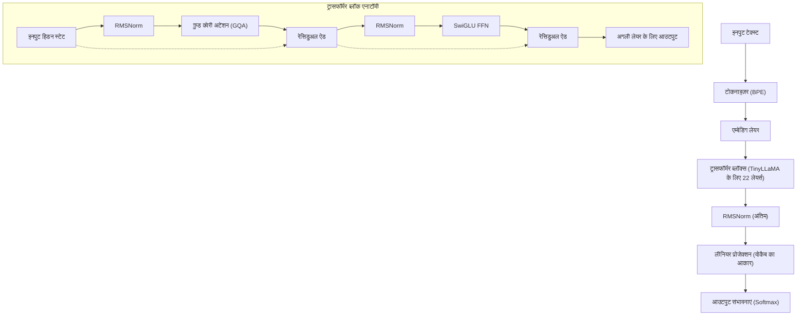
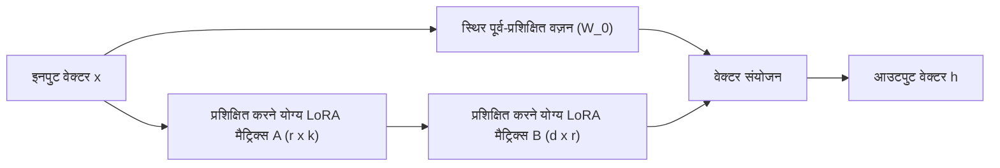
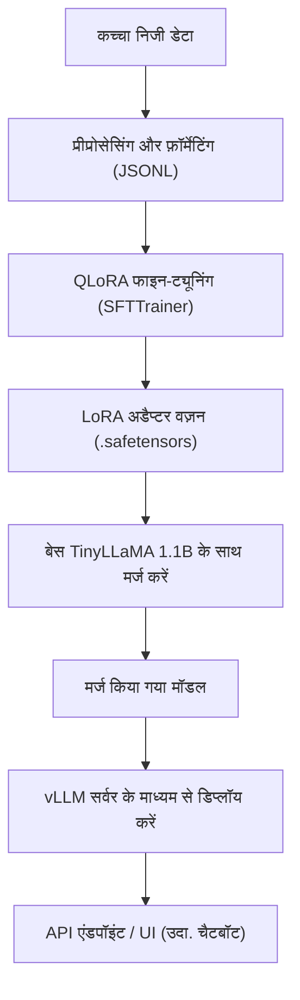

## 1. परिचय: अभी TinyLLaMA और ऑन-प्रिमाइसेस क्यों?

लार्ज लैंग्वेज मॉडल (LLM) का विकास अविश्वसनीय गति से आगे बढ़ रहा है, और इसके साथ, मॉडल के मापदंडों की संख्या सैकड़ों अरबों तक फैल रही है। GPT-4 और Claude 3 जैसे विशाल मॉडल बेजोड़ प्रदर्शन का दावा करते हैं, लेकिन अनुमान और प्रशिक्षण से जुड़ी गणना लागत, साथ ही बाहरी API का उपयोग करते समय सुरक्षा और डेटा गोपनीयता की चिंताएँ कंपनियों के लिए बड़ी बाधाएँ बन गई हैं। विशेष रूप से, अत्यधिक गोपनीय आंतरिक डेटा या व्यक्तिगत जानकारी से जुड़े कार्यों में, अनुपालन (जैसे GDPR और APPI) के दृष्टिकोण से सार्वजनिक क्लाउड LLM API में डेटा भेजना अक्सर अस्वीकार्य होता है।

यहीं पर **स्मॉल लैंग्वेज मॉडल (SLM)** और **ऑन-प्रिमाइसेस वातावरण में स्थानीय संचालन** सुर्खियों में आ रहे हैं। इनमें से "**TinyLLaMA**", केवल 1.1B (1.1 बिलियन) मापदंडों के अपने कॉम्पैक्ट आकार के बावजूद, लगभग 3 ट्रिलियन टोकन के विशाल डेटासेट पर पूर्व-प्रशिक्षित किया गया है, और अपने वर्ग के अन्य मॉडलों की तुलना में आश्चर्यजनक प्रदर्शन प्रदान करता है।

इस लेख में, हम आपकी कंपनी के विशिष्ट कार्यों के लिए ऑन-प्रिमाइसेस वातावरण (स्थानीय सर्वर या वर्कस्टेशन) में इस TinyLLaMA को "सबसे तेज़ और अत्यधिक कुशल" तरीके से फाइन-ट्यून करने के लिए एक संपूर्ण मार्गदर्शिका प्रदान करते हैं। हम गणितीय पृष्ठभूमि, नवीनतम अनुकूलन तकनीकों और विशिष्ट PyTorch कार्यान्वयन कोड को व्यापक रूप से कवर करेंगे।

---

## 2. TinyLLaMA का आर्किटेक्चर और विशेषताएं

TinyLLaMA, Meta द्वारा विकसित LLaMA (Large Language Model Meta AI) आर्किटेक्चर का अनुसरण करता है। मापदंडों की संख्या को 1.1B तक कम करते हुए, यह LLaMA 2 के समान प्रौद्योगिकी स्टैक का उपयोग करता है, जिससे इसका इकोसिस्टम अत्यधिक संगत हो जाता है।

### प्रमुख आर्किटेक्चर घटक

1. **RMSNorm (Root Mean Square Normalization):**
   यह एक सामान्यीकरण विधि है जो पारंपरिक LayerNorm गणनाओं से माध्य घटाव को हटा देती है, जिससे कम्प्यूटेशनल दक्षता में सुधार होता है। यह प्रशिक्षण स्थिरता बनाए रखते हुए थ्रूपुट को बढ़ाता है।
2. **SwiGLU एक्टिवेशन फंक्शन:**
   Feed Forward Network (FFN) में, पारंपरिक ReLU या GELU के बजाय SwiGLU को अपनाया गया है। इसे गणितीय रूप से इस प्रकार दर्शाया गया है:
   $$ \text{SwiGLU}(x, W, V) = \text{Swish}(xW) \otimes (xV) $$
   यहां, $\otimes$ तत्व-वार गुणन (Hadamard उत्पाद) को दर्शाता है, और Swish फ़ंक्शन $\text{Swish}(z) = z \cdot \sigma(\beta z)$ है। इससे अभिव्यक्ति की क्षमता में काफी सुधार होता है।
3. **RoPE (Rotary Position Embedding):**
   यह एक ऐसी तकनीक है जो पूर्ण (absolute) और सापेक्ष (relative) पोजीशन एन्कोडिंग के लाभों को जोड़ती है। अनुक्रम (sequence) की लंबाई बढ़ने पर भी यह उच्च सामान्यीकरण (generalization) प्रदर्शन बनाए रखती है।
4. **Grouped Query Attention (GQA):**
   यह Multi-Head Attention (MHA) और Multi-Query Attention (MQA) के बीच का एक मध्यवर्ती दृष्टिकोण है, जो कुंजियों (keys) और मूल्यों (values) के हेड्स को समूहित करके मेमोरी बैंडविड्थ को बचाता है और अनुमान की गति में नाटकीय रूप से सुधार करता है।

नीचे दिया गया Mermaid आरेख TinyLLaMA के समग्र डेटा प्रवाह और Transformer ब्लॉक की संरचना को दर्शाता है।



---

## 3. फाइन-ट्यूनिंग में सफलता: LoRA और QLoRA

ऑन-प्रिमाइसेस वातावरण में पूर्ण-पैरामीटर फाइन-ट्यूनिंग करने के लिए, यहां तक कि 1.1B मॉडल के साथ भी, ऑप्टिमाइज़र की स्थिति और ग्रेडिएंट को बनाए रखने के लिए दसियों गीगाबाइट VRAM (वीडियो मेमोरी) की खपत होती है। सीमित संसाधनों के साथ कुशलतापूर्वक प्रशिक्षण के लिए आवश्यक **PEFT (Parameter-Efficient Fine-Tuning)** तकनीक "**LoRA**" और इसका क्वांटाइज़ेशन एक्सटेंशन "**QLoRA**" है।

### 3.1 LoRA (Low-Rank Adaptation) की गणितीय पृष्ठभूमि

LoRA एक ऐसी तकनीक है जो पूर्व-प्रशिक्षित वज़न मैट्रिक्स को स्थिर (फ़्रीज़) कर देती है और उसके वज़न अपडेट ($\Delta W$) का अनुमान दो छोटे लो-रैंक मैट्रिक्स के गुणनफल के रूप में लगाती है।

मान लें कि पूर्व-प्रशिक्षित वज़न $W_0 \in \mathbb{R}^{d \times k}$ है। पूर्ण फाइन-ट्यूनिंग में, $W_0$ को स्वयं अपडेट करके $W_0 + \Delta W$ किया जाता है, लेकिन LoRA में, अपडेट मैट्रिक्स $\Delta W$ को इस प्रकार विघटित किया जाता है:

$$ \Delta W = B \times A $$

यहां, $B \in \mathbb{R}^{d \times r}$ और $A \in \mathbb{R}^{r \times k}$, जहां $r$ एक हाइपरपैरामीटर है जिसे रैंक कहा जाता है, जो एक बहुत छोटा मान है (आमतौर पर 8, 16, 32, आदि) और $r \ll \min(d, k)$ को संतुष्ट करता है।

फॉरवर्ड पास की गणना इस प्रकार है:

$$ h = W_0 x + \Delta W x = W_0 x + B A x $$

प्रारंभिक अवस्था में, मैट्रिक्स $A$ को सामान्य वितरण (गॉसियन वितरण) का उपयोग करके यादृच्छिक रूप से प्रारंभ (initialize) किया जाता है, और मैट्रिक्स $B$ को शून्य मैट्रिक्स के साथ प्रारंभ किया जाता है। इससे यह सुनिश्चित होता है कि प्रशिक्षण की शुरुआत में $\Delta W$ शून्य है, जिससे बेस मॉडल के आउटपुट को पूरी तरह से सुरक्षित रखते हुए प्रशिक्षण शुरू किया जा सकता है।



### 3.2 QLoRA (Quantized LoRA) का नवाचार

QLoRA LoRA के दृष्टिकोण को और आगे ले जाता है, जिसमें बेस मॉडल $W_0$ को मेमोरी में लोड करने से पहले 4-बिट परिशुद्धता (NormalFloat 4, NF4) में क्वांटाइज़ किया जाता है। इससे VRAM की खपत में काफी कमी आती है।

QLoRA में तीन महत्वपूर्ण तकनीकें शामिल हैं:
1. **4-बिट NormalFloat (NF4) क्वांटाइज़ेशन:** सामान्य वितरण का पालन करने वाले वज़न के लिए अनुकूलित एक सैद्धांतिक रूप से इष्टतम डेटा प्रकार।
2. **डबल क्वांटाइज़ेशन:** क्वांटाइज़ेशन स्थिरांक (स्केलिंग फैक्टर) को स्वयं क्वांटाइज़ करके मेमोरी की और अधिक बचत।
3. **पेज्ड ऑप्टिमाइज़र:** NVIDIA के यूनिफाइड मेमोरी फ़ीचर का उपयोग करके, VRAM कम होने पर ऑप्टिमाइज़र की स्थिति को अस्थायी रूप से CPU RAM में ले जाने का एक तंत्र।

इसके परिणामस्वरूप, फाइन-ट्यूनिंग जिसके लिए आम तौर पर 16GB से 24GB VRAM की आवश्यकता होती है, आसानी से उपभोक्ता श्रेणी के GPU (जैसे RTX 3060 12GB या RTX 4070) पर निष्पादित की जा सकती है।

---

## 4. ऑन-प्रिमाइसेस वातावरण के लिए हार्डवेयर आवश्यकताएं और सेटअप

जब QLoRA के साथ TinyLLaMA (1.1B) को ट्यून किया जाता है, तो हार्डवेयर आवश्यकताएं बहुत कम रखी जा सकती हैं।

### अनुशंसित हार्डवेयर विनिर्देश
- **GPU:** NVIDIA RTX 3060 (12GB), RTX 3090/4090 (24GB), या NVIDIA A10G/A100 आदि। यह कम से कम 8GB VRAM के साथ चलेगा, लेकिन बड़े बैच आकार को संभालने के लिए 12GB या अधिक की अनुशंसा की जाती है।
- **CPU:** 8 या अधिक कोर वाला आधुनिक CPU (Intel Core i7/i9, AMD Ryzen 7/9)।
- **RAM:** 32GB या अधिक (पेज्ड ऑप्टिमाइज़र का उपयोग करते समय VRAM से डेटा निकालने के लिए महत्वपूर्ण)।
- **स्टोरेज:** NVMe SSD (डेटासेट लोड करने और मॉडल को तेज़ी से सहेजने के लिए)।

### सॉफ्टवेयर वातावरण सेटअप

यहां Ubuntu 22.04 LTS वातावरण के लिए सेटअप प्रक्रिया दी गई है। यह Python 3.10 या बाद के संस्करण का उपयोग करता है।

```bash
# वर्चुअल एनवायरनमेंट बनाना और सक्रिय करना
python3 -m venv tinyllama_env
source tinyllama_env/bin/activate

# PyTorch इंस्टॉल करना (CUDA 12.1 के लिए)
pip install torch torchvision torchaudio --index-url https://download.pytorch.org/whl/cu121

# ट्रांसफार्मर से संबंधित लाइब्रेरी इंस्टॉल करना
pip install transformers datasets peft trl accelerate bitsandbytes
```

---

## 5. सबसे तेज़ ट्यूनिंग के लिए अनुकूलन तकनीकें

सिर्फ स्क्रिप्ट चलाने के अलावा, "सबसे तेज़" ट्यूनिंग पूरी करने के लिए निम्नलिखित अनुकूलन विधियों को संयोजित करना आवश्यक है।

### 5.1 Flash Attention 2
मानक अटेंशन तंत्र की समय और स्थान जटिलता अनुक्रम (sequence) लंबाई $N$ के लिए $O(N^2)$ होती है। Flash Attention 2 GPU के SRAM और HBM (High Bandwidth Memory) के बीच मेमोरी एक्सेस को अनुकूलित करता है, गणना की मात्रा को कम किए बिना IO अड़चनों को दूर करता है, प्रशिक्षण गति को कई गुना बढ़ाता है, और मेमोरी खपत को काफी कम करता है।

### 5.2 Gradient Checkpointing (ग्रेडिएंट चेकपॉइंटिंग)
यह एक ऐसी तकनीक है जहां फॉरवर्ड पास के दौरान गणना किए गए सभी मध्यवर्ती एक्टिवेशन को VRAM में सहेजने के बजाय, केवल कुछ को ही सहेजा जाता है और जब बैकवर्ड पास के दौरान आवश्यकता होती है तो उनकी पुनर्गणना की जाती है। गणना समय लगभग 20% बढ़ जाता है, लेकिन मेमोरी खपत नाटकीय रूप से कम हो जाती है, जिससे बड़े बैच आकार सेट किए जा सकते हैं और समग्र थ्रूपुट में सुधार होता है।

### 5.3 Mixed Precision Training (मिश्रित सटीक प्रशिक्षण) और Bfloat16
GPU के Tensor Cores का पूरा लाभ उठाने के लिए, प्रशिक्षण के दौरान गणना `bfloat16` (Brain Floating Point) में की जाती है। `float16` की तुलना में, घातांक (exponent) की बिट लंबाई `float32` के समान है, इसलिए ओवरफ्लो और अंडरफ्लो का जोखिम बेहद कम है, जिससे स्थिर प्रशिक्षण सुनिश्चित होता है।

---

## 6. अभ्यास: TinyLLaMA के लिए QLoRA फाइन-ट्यूनिंग कोड

अब, आइए सबसे तेज़ ट्यूनिंग के लिए एक PyTorch स्क्रिप्ट देखें जिसमें उपरोक्त सभी अनुकूलन शामिल हैं। यहाँ, हम Hugging Face की `trl` (Transformer Reinforcement Learning) लाइब्रेरी से `SFTTrainer` का उपयोग करेंगे।

### 6.1 डेटासेट तैयार करना और मॉडल लोड करना

```python
import torch
from datasets import load_dataset
from transformers import (
    AutoModelForCausalLM,
    AutoTokenizer,
    BitsAndBytesConfig,
    TrainingArguments
)
from peft import LoraConfig, get_peft_model, prepare_model_for_kbit_training
from trl import SFTTrainer

# 1. मॉडल और टोकनाइज़र निर्दिष्ट करना
model_id = "TinyLlama/TinyLlama-1.1B-Chat-v1.0"

# 2. QLoRA के लिए 4-बिट क्वांटाइज़ेशन कॉन्फ़िगरेशन
bnb_config = BitsAndBytesConfig(
    load_in_4bit=True,
    bnb_4bit_use_double_quant=True,
    bnb_4bit_quant_type="nf4",
    bnb_4bit_compute_dtype=torch.bfloat16 # गणना bfloat16 में की जाती है
)

# 3. मॉडल लोड करना (Flash Attention 2 सक्षम करना)
print("मॉडल लोड हो रहा है...")
model = AutoModelForCausalLM.from_pretrained(
    model_id,
    quantization_config=bnb_config,
    device_map="auto",
    use_flash_attention_2=True # सबसे तेज़ गति की कुंजी
)

# 4. टोकनाइज़र लोड करना
tokenizer = AutoTokenizer.from_pretrained(model_id, trust_remote_code=True)
tokenizer.pad_token = tokenizer.eos_token
tokenizer.padding_side = "right" # fp16/bf16 प्रशिक्षण के दौरान बग से बचने के लिए "right" पर सेट करें
```

### 6.2 LoRA अडैप्टर लागू करना और डेटासेट को फ़ॉर्मेट करना

```python
# 5. k-बिट प्रशिक्षण की तैयारी करना और ग्रेडिएंट चेकपॉइंटिंग सक्षम करना
model.gradient_checkpointing_enable()
model = prepare_model_for_kbit_training(model)

# 6. LoRA सेटिंग्स
peft_config = LoraConfig(
    r=16, # रैंक
    lora_alpha=32, # स्केलिंग फैक्टर
    lora_dropout=0.05,
    bias="none",
    task_type="CAUSAL_LM",
    target_modules=["q_proj", "k_proj", "v_proj", "o_proj", "gate_proj", "up_proj", "down_proj"] # सभी लीनियर लेयर्स को लक्षित करने से प्रदर्शन में सुधार होता है
)

model = get_peft_model(model, peft_config)
model.print_trainable_parameters() 
# आउटपुट उदाहरण: trainable params: 14,286,848 || all params: 1,114,335,232 || trainable%: 1.282%

# 7. डेटासेट लोड करना (यहां हम उदाहरण के रूप में जापानी निर्देश डेटासेट का उपयोग कर रहे हैं)
# वास्तव में, आप ऑन-प्रिमाइसेस निजी JSONL फ़ाइलें आदि लोड करेंगे
dataset = load_dataset("kunishou/databricks-dolly-15k-ja", split="train")

def format_instruction(sample):
    """
    स्ट्रिंग को ChatML फॉर्मेट या प्रॉम्ट टेम्प्लेट में फ़ॉर्मेट करें
    """
    prompt = f"<|im_start|>user\n{sample['instruction']}"
    if sample.get("input", "") != "":
         prompt += f"\n{sample['input']}"
    prompt += f"<|im_end|>\n<|im_start|>assistant\n{sample['output']}<|im_end|>"
    return {"text": prompt}

dataset = dataset.map(format_instruction)
```

### 6.3 प्रशिक्षण निष्पादित करना

```python
# 8. प्रशिक्षण तर्क (arguments) सेट करना
training_args = TrainingArguments(
    output_dir="./tinyllama-lora-output",
    per_device_train_batch_size=8, # यदि VRAM की अनुमति हो तो बढ़ाएं
    gradient_accumulation_steps=2, # प्रभावी बैच आकार = 8 * 2 = 16
    optim="paged_adamw_32bit",     # पेज्ड ऑप्टिमाइज़र के साथ VRAM की बचत
    save_steps=100,
    logging_steps=10,
    learning_rate=2e-4,
    fp16=False,
    bf16=True,                     # मिश्रित सटीक प्रशिक्षण (bfloat16)
    max_grad_norm=0.3,
    max_steps=500,                 # परीक्षण के लिए 500 कदम। उत्पादन में इपोक (epochs) की संख्या निर्दिष्ट करें
    warmup_ratio=0.03,
    group_by_length=True,
    lr_scheduler_type="cosine",
)

# 9. SFTTrainer का उपयोग करके प्रशिक्षण शुरू करना
trainer = SFTTrainer(
    model=model,
    train_dataset=dataset,
    peft_config=peft_config,
    dataset_text_field="text",
    max_seq_length=1024, # अपेक्षित इनपुट लंबाई के अनुसार समायोजित करें
    tokenizer=tokenizer,
    args=training_args,
)

print("प्रशिक्षण शुरू हो रहा है...")
trainer.train()

# 10. LoRA अडैप्टर को सहेजना
trainer.model.save_pretrained("./tinyllama-lora-final")
tokenizer.save_pretrained("./tinyllama-lora-final")
print("प्रशिक्षण पूरा हुआ और मॉडल सहेज लिया गया।")
```

---

## 7. प्रदर्शन मूल्यांकन और समस्या निवारण

ऑन-प्रिमाइसेस वातावरण में प्रशिक्षण चलाते समय आने वाली सामान्य समस्याएं और उनके समाधान।

1. **OOM (Out Of Memory) होता है:**
   - `per_device_train_batch_size` को `1` पर कम करें।
   - प्रभावी बैच आकार को बनाए रखने के लिए `gradient_accumulation_steps` बढ़ाएं।
   - `max_seq_length` को `2048` से `1024` या `512` तक कम करें।
2. **Loss कम नहीं हो रहा है या डाइवर्ज हो रहा है:**
   - लर्निंग रेट (`learning_rate`) बहुत अधिक हो सकता है। इसे `2e-4` से घटाकर लगभग `5e-5` करने का प्रयास करें।
   - यदि Bfloat16 के बजाय Float16 का उपयोग किया जा रहा है, तो ग्रेडिएंट अंडरफ्लो हो सकता है। सुनिश्चित करें कि `bf16=True` सेट है।
3. **अनुमान के दौरान रहस्यमय स्ट्रिंग्स उत्पन्न होती हैं:**
   - सुनिश्चित करें कि `padding_side="right"` सही ढंग से सेट है। साथ ही, जांचें कि डेटासेट फ़ॉर्मेट (जैसे `<|im_start|>` विशेष टोकन) बेस मॉडल के पूर्व-प्रशिक्षण के साथ संगत है या नहीं।

---

## 8. ट्यूनिंग के बाद मॉडल की तैनाती (Deployment)

ट्यूनिंग पूरी होने के बाद, जो सहेजा जाता है वह "संपूर्ण बेस मॉडल" नहीं है, बल्कि केवल कुछ MB से दसियों MB का "**LoRA अडैप्टर (अंतर वज़न)**" है। अनुमान को तेज़ी से निष्पादित करने के लिए, आपको इस LoRA वज़न को मूल बेस मॉडल के साथ मर्ज (एकीकृत) करना होगा और इसे एकल मॉडल के रूप में निर्यात करना होगा।

### मॉडल मर्जिंग स्क्रिप्ट

```python
import torch
from peft import AutoPeftModelForCausalLM
from transformers import AutoTokenizer

output_dir = "./tinyllama-lora-final"

# FP16/BF16 में मॉडल और अडैप्टर लोड करें
model = AutoPeftModelForCausalLM.from_pretrained(
    output_dir,
    device_map="auto",
    torch_dtype=torch.bfloat16
)
tokenizer = AutoTokenizer.from_pretrained(output_dir)

# वज़न मर्ज करें और सहेजें
merged_model = model.merge_and_unload()
merged_model.save_pretrained("./tinyllama-merged", safe_serialization=True)
tokenizer.save_pretrained("./tinyllama-merged")
print("मॉडल को सफलतापूर्वक मर्ज और सहेजा गया!")
```

### vLLM के साथ अति-तीव्र अनुमान सर्वर शुरू करना

ऑन-प्रिमाइसेस डिप्लॉयमेंट में अनुमान गति (टोकन प्रति सेकंड) को अधिकतम करने के लिए, हम Hugging Face की मानक `pipeline` के बजाय **vLLM** या **TGI (Text Generation Inference)** का उपयोग करने की दृढ़ता से अनुशंसा करते हैं। vLLM GPU मेमोरी विखंडन को रोकने के लिए PagedAttention तकनीक का उपयोग करता है और समवर्ती अनुरोध प्रसंस्करण क्षमता में नाटकीय रूप से सुधार करता है।

नीचे दिया गया Mermaid आरेख प्रशिक्षण से लेकर अनुमान सर्वर परिनियोजन तक की पाइपलाइन को दर्शाता है।



vLLM का उपयोग करके API सर्वर शुरू करना निम्नलिखित एकल कमांड के साथ पूरा किया जा सकता है:

```bash
python -m vllm.entrypoints.openai.api_server \
    --model ./tinyllama-merged \
    --host 0.0.0.0 \
    --port 8000 \
    --max-model-len 2048 \
    --dtype bfloat16
```
इसके साथ, आपके ऑन-प्रिमाइसेस वातावरण में एक OpenAI API-संगत एंडपॉइंट बनाया जाता है, जिससे आप सुरक्षित और तेज़ी से स्थानीय AI का उपयोग कर सकते हैं।

---

## 9. निष्कर्ष

इस लेख में, हमने बताया है कि ऑन-प्रिमाइसेस वातावरण में सबसे तेज़ और मेमोरी-कुशल तरीके से "TinyLLaMA" को कैसे फाइन-ट्यून किया जाए, जो कि 1.1B मापदंडों के साथ एक हल्का लेकिन उच्च प्रदर्शन करने वाला मॉडल है।

- **LoRA / QLoRA** उपभोक्ता-ग्रेड GPU पर भी पूर्ण विकसित LLM ट्यूनिंग को सक्षम बनाता है।
- **Flash Attention 2** और **Gradient Checkpointing** का पूरा उपयोग करके, प्रशिक्षण समय और VRAM खपत को सीमा तक अनुकूलित किया जाता है।
- **vLLM** का उपयोग करके डिप्लॉयमेंट उत्पादन वातावरण में भी उच्च थ्रूपुट प्राप्त करता है।

ऑन-प्रिमाइसेस स्थानीय LLM का संचालन न केवल डेटा गोपनीयता की रक्षा करता है, बल्कि कम लागत पर विशिष्ट डोमेन (कानूनी, चिकित्सा, आंतरिक कंपनी नियम, आदि) के अनुरूप विशेष AI बनाने के लिए सबसे मजबूत हथियार बन जाता है। कृपया इस मार्गदर्शिका को संदर्भ के रूप में उपयोग करें और अपना स्वयं का समर्पित TinyLLaMA विकसित करने का प्रयास करें।
