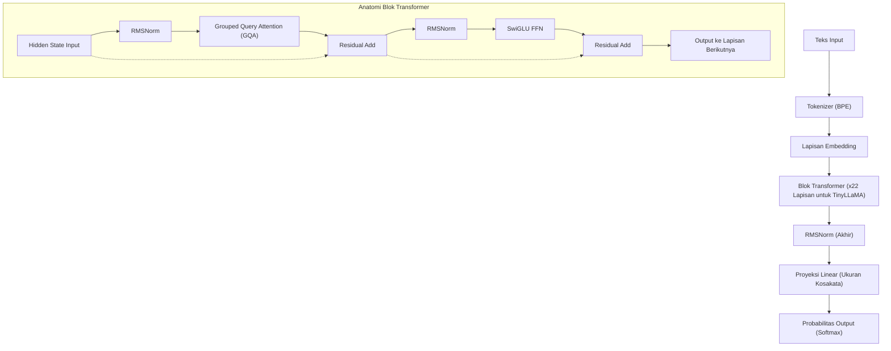
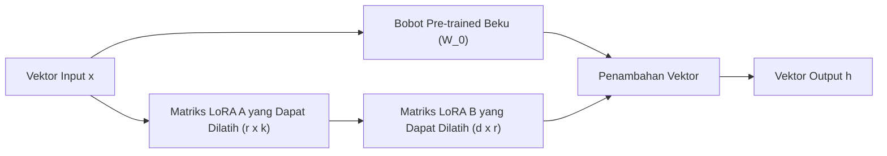
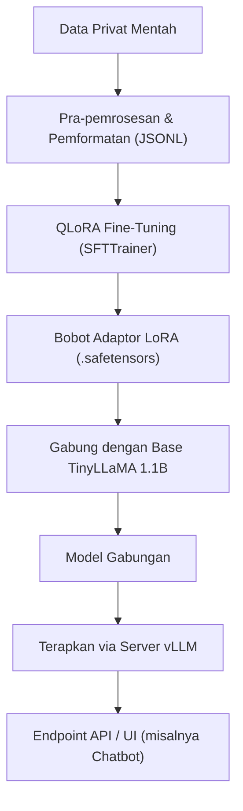

## 1. Pendahuluan: Mengapa Harus TinyLLaMA dan On-Premises Saat Ini?

Evolusi Large Language Models (LLM) berlangsung dengan kecepatan yang luar biasa, dan seiring dengan itu, jumlah parameter model terus membengkak hingga skala ratusan miliar. Di satu sisi, model super raksasa seperti GPT-4 dan Claude 3 membanggakan kinerja yang tak tertandingi, namun biaya komputasi yang dibutuhkan untuk inferensi dan pelatihan, serta kekhawatiran tentang keamanan dan privasi data saat menggunakan API eksternal menjadi hambatan besar bagi perusahaan. Terutama dalam tugas-tugas yang menangani data internal yang sangat rahasia dan informasi pribadi, mengirimkan data ke API LLM publik di cloud sering kali tidak dapat diterima dari sudut pandang kepatuhan (seperti GDPR dan APPI).

Oleh karena itu, yang kini menjadi sorotan adalah **Small Language Models (SLM)** dan **pengoperasian lokal di lingkungan on-premises**. Di antaranya, "**TinyLLaMA**" hadir dengan ukuran yang ringkas yaitu hanya 1.1B (1,1 miliar) parameter, namun telah melalui pre-training dengan dataset yang sangat besar yaitu sekitar 3 triliun token, sehingga menunjukkan kinerja yang luar biasa dibandingkan dengan model di kelasnya.

Artikel ini menyediakan panduan lengkap untuk melakukan fine-tuning (penyesuaian) TinyLLaMA agar menjadi "tercepat dan berefisiensi tinggi" untuk tugas-tugas khusus perusahaan Anda di lingkungan on-premises (server lokal atau workstation). Kami akan menjelaskan secara komprehensif mulai dari latar belakang matematis, teknologi optimasi terbaru, hingga kode implementasi PyTorch secara spesifik.

---

## 2. Arsitektur dan Karakteristik TinyLLaMA

TinyLLaMA mengikuti arsitektur LLaMA (Large Language Model Meta AI) yang dikembangkan oleh Meta. Meskipun jumlah parameternya ditekan menjadi 1.1B, ia menggunakan tumpukan teknologi yang sama dengan LLaMA 2, sehingga memiliki kompatibilitas ekosistem yang sangat tinggi.

### Komponen Arsitektur Utama

1. **RMSNorm (Root Mean Square Normalization):**
   Ini adalah metode normalisasi yang menghilangkan pengurangan rata-rata dari perhitungan LayerNorm konvensional, sehingga meningkatkan efisiensi komputasi. Metode ini menjaga stabilitas pelatihan sekaligus meningkatkan throughput.
2. **Fungsi Aktivasi SwiGLU:**
   Dalam Feed Forward Network (FFN), SwiGLU diadopsi menggantikan ReLU dan GELU konvensional. Secara matematis dapat dinyatakan sebagai berikut:
   $$ \text{SwiGLU}(x, W, V) = \text{Swish}(xW) \otimes (xV) $$
   Di sini, $\otimes$ melambangkan perkalian elemen-demi-elemen (Hadamard product), dan fungsi Swish adalah $\text{Swish}(z) = z \cdot \sigma(\beta z)$. Hal ini secara signifikan meningkatkan daya ekspresi model.
3. **RoPE (Rotary Position Embedding):**
   Ini adalah metode yang menggabungkan keuntungan dari positional encoding absolut dan relatif. Metode ini memiliki kemampuan generalisasi yang tinggi bahkan ketika panjang urutan diperluas.
4. **Grouped Query Attention (GQA):**
   Ini adalah pendekatan perantara antara Multi-Head Attention (MHA) dan Multi-Query Attention (MQA). Dengan mengelompokkan head key dan value, metode ini menghemat bandwidth memori dan secara dramatis meningkatkan kecepatan inferensi.

Diagram Mermaid berikut menunjukkan aliran data keseluruhan dan struktur blok Transformer dari TinyLLaMA.



---

## 3. Terobosan Fine-Tuning: LoRA dan QLoRA

Untuk melakukan fine-tuning pada seluruh parameter di lingkungan on-premises, bahkan untuk model 1.1B, model tersebut akan mengonsumsi puluhan GB VRAM (memori video) untuk menyimpan status optimizer dan gradien. Agar dapat melakukan pelatihan secara efisien dengan sumber daya yang terbatas, teknik **PEFT (Parameter-Efficient Fine-Tuning)**, yaitu "**LoRA**" dan ekstensi kuantisasinya "**QLoRA**", menjadi sangat penting.

### 3.1 Latar Belakang Matematis LoRA (Low-Rank Adaptation)

LoRA adalah metode yang mengunci (freeze) matriks bobot yang telah dilatih sebelumnya (pre-trained), dan memperkirakan jumlah pembaruan bobot tersebut ($\Delta W$) sebagai hasil perkalian dari dua matriks kecil berpangkat rendah (low-rank).

Misalkan bobot pre-trained adalah $W_0 \in \mathbb{R}^{d \times k}$. Pada full fine-tuning, $W_0$ itu sendiri diperbarui menjadi $W_0 + \Delta W$, namun pada LoRA, matriks pembaruan $\Delta W$ didekomposisi sebagai berikut:

$$ \Delta W = B \times A $$

Di sini, $B \in \mathbb{R}^{d \times r}$ dan $A \in \mathbb{R}^{r \times k}$, di mana $r$ adalah hyperparameter yang disebut rank, dengan nilai yang sangat kecil (biasanya 8, 16, 32, dll.) yang memenuhi $r \ll \min(d, k)$.

Perhitungan forward pass adalah sebagai berikut:

$$ h = W_0 x + \Delta W x = W_0 x + B A x $$

Pada keadaan awal, matriks $A$ diinisialisasi secara acak menggunakan distribusi normal (distribusi Gaussian), dan matriks $B$ diinisialisasi sebagai matriks nol. Akibatnya, nilai $\Delta W$ pada awal pelatihan adalah nol, memungkinkan dimulainya pelatihan dengan output dari model dasar yang dipertahankan sepenuhnya.



### 3.2 Inovasi QLoRA (Quantized LoRA)

QLoRA mendorong pendekatan LoRA lebih jauh, dengan melakukan kuantisasi pada model dasar $W_0$ ke dalam presisi 4-bit (NormalFloat 4, NF4) sebelum dimuat ke dalam memori. Hal ini secara dramatis mengurangi konsumsi VRAM.

Ada tiga teknologi penting yang terintegrasi di dalam QLoRA:
1. **Kuantisasi 4-bit NormalFloat (NF4):** Tipe data yang secara teoritis optimal untuk bobot yang mengikuti distribusi normal.
2. **Double Quantization (Kuantisasi Ganda):** Mengkuantisasi konstanta kuantisasi itu sendiri (scale factor) untuk menghemat memori lebih lanjut.
3. **Paged Optimizers:** Menggunakan fitur memori terpadu NVIDIA untuk sementara waktu memindahkan status optimizer ke RAM CPU saat VRAM hampir habis.

Dengan ini, tuning yang biasanya membutuhkan 16GB hingga 24GB VRAM dapat dijalankan dengan nyaman bahkan pada GPU kelas konsumen (seperti RTX 3060 12GB atau RTX 4070).

---

## 4. Persyaratan Perangkat Keras dan Pengaturan di Lingkungan On-Premises

Persyaratan perangkat keras untuk melakukan tuning TinyLLaMA (1.1B) dengan QLoRA dapat ditekan sangat rendah.

### Spesifikasi Perangkat Keras yang Disarankan
- **GPU:** NVIDIA RTX 3060 (12GB), RTX 3090/4090 (24GB), atau NVIDIA A10G/A100, dll. Meskipun VRAM 8GB adalah batas minimal untuk berjalan, disarankan memiliki 12GB atau lebih untuk mengakomodasi ukuran batch (batch size) yang memadai.
- **CPU:** CPU modern 8 core atau lebih (Intel Core i7/i9, AMD Ryzen 7/9)
- **RAM:** 32GB atau lebih (penting sebagai tujuan pemindahan data dari VRAM saat menggunakan Paged Optimizers)
- **Penyimpanan:** NVMe SSD (untuk mempercepat pemuatan dataset dan penyimpanan model)

### Membangun Lingkungan Perangkat Lunak

Langkah-langkah berikut mengasumsikan lingkungan Ubuntu 22.04 LTS. Python 3.10 atau versi yang lebih baru akan digunakan.

```bash
# Membuat dan mengaktifkan lingkungan virtual (virtual environment)
python3 -m venv tinyllama_env
source tinyllama_env/bin/activate

# Menginstal PyTorch (untuk CUDA 12.1)
pip install torch torchvision torchaudio --index-url https://download.pytorch.org/whl/cu121

# Menginstal pustaka terkait Transformer
pip install transformers datasets peft trl accelerate bitsandbytes
```

---

## 5. Teknik Optimasi untuk Tuning Tercepat

Untuk menyelesaikan tuning dengan "kecepatan maksimum", tidak cukup hanya dengan menjalankan skrip; teknik optimasi berikut harus dikombinasikan.

### 5.1 Flash Attention 2
Mekanisme Attention standar memiliki kompleksitas waktu dan ruang $O(N^2)$ terhadap panjang urutan $N$. Flash Attention 2 mengoptimalkan akses memori antara SRAM dan HBM (High Bandwidth Memory) pada GPU, mengurangi hambatan I/O tanpa mengurangi jumlah komputasi. Ini meningkatkan kecepatan pelatihan beberapa kali lipat dan secara drastis mengurangi konsumsi memori.

### 5.2 Gradient Checkpointing
Alih-alih menyimpan semua aktivasi perantara yang dihitung selama forward pass ke dalam VRAM, metode ini hanya menyimpan sebagian dan menghitung ulang sisanya jika diperlukan saat backward pass. Meskipun waktu komputasi meningkat sekitar 20%, konsumsi memori berkurang secara drastis. Hasilnya, Anda dapat mengatur ukuran batch yang lebih besar, dan meningkatkan throughput secara keseluruhan.

### 5.3 Pelatihan Presisi Campuran (Mixed Precision Training) dan Bfloat16
Untuk memaksimalkan penggunaan Tensor Core pada GPU, komputasi selama pelatihan dilakukan dengan tipe data `bfloat16` (Brain Floating Point). Dibandingkan dengan `float16`, `bfloat16` memiliki panjang bit eksponen yang sama dengan `float32`, sehingga risiko overflow dan underflow sangat rendah, menjadikan pelatihan lebih stabil.

---

## 6. Praktik: Kode Fine-Tuning QLoRA untuk TinyLLaMA

Selanjutnya, kami akan menjelaskan skrip PyTorch untuk tuning tercepat yang mencakup semua optimasi di atas. Di sini, kami menggunakan `SFTTrainer` dari pustaka `trl` (Transformer Reinforcement Learning) oleh Hugging Face.

### 6.1 Persiapan Dataset dan Pemuatan Model

```python
import torch
from datasets import load_dataset
from transformers import (
    AutoModelForCausalLM,
    AutoTokenizer,
    BitsAndBytesConfig,
    TrainingArguments
)
from peft import LoraConfig, get_peft_model, prepare_model_for_kbit_training
from trl import SFTTrainer

# 1. Menentukan model dan tokenizer
model_id = "TinyLlama/TinyLlama-1.1B-Chat-v1.0"

# 2. Pengaturan kuantisasi 4-bit untuk QLoRA
bnb_config = BitsAndBytesConfig(
    load_in_4bit=True,
    bnb_4bit_use_double_quant=True,
    bnb_4bit_quant_type="nf4",
    bnb_4bit_compute_dtype=torch.bfloat16 # Komputasi dilakukan dalam bfloat16
)

# 3. Memuat model (Mengaktifkan Flash Attention 2)
print("Loading model...")
model = AutoModelForCausalLM.from_pretrained(
    model_id,
    quantization_config=bnb_config,
    device_map="auto",
    use_flash_attention_2=True # Kunci percepatan maksimal
)

# 4. Memuat tokenizer
tokenizer = AutoTokenizer.from_pretrained(model_id, trust_remote_code=True)
tokenizer.pad_token = tokenizer.eos_token
tokenizer.padding_side = "right" # Diatur ke right untuk menghindari bug selama pelatihan fp16/bf16
```

### 6.2 Penerapan Adaptor LoRA dan Pemformatan Dataset

```python
# 5. Persiapan untuk pelatihan k-bit dan aktivasi gradient checkpointing
model.gradient_checkpointing_enable()
model = prepare_model_for_kbit_training(model)

# 6. Pengaturan LoRA
peft_config = LoraConfig(
    r=16, # Rank
    lora_alpha=32, # Scaling factor
    lora_dropout=0.05,
    bias="none",
    task_type="CAUSAL_LM",
    target_modules=["q_proj", "k_proj", "v_proj", "o_proj", "gate_proj", "up_proj", "down_proj"] # Menerapkannya ke semua layer Linear meningkatkan kinerja
)

model = get_peft_model(model, peft_config)
model.print_trainable_parameters() 
# Contoh output: trainable params: 14,286,848 || all params: 1,114,335,232 || trainable%: 1.282%

# 7. Memuat dataset (Di sini menggunakan dataset instruksi bahasa Jepang sebagai contoh)
# Dalam praktiknya, Anda memuat file JSONL privat dari on-premises, dll.
dataset = load_dataset("kunishou/databricks-dolly-15k-ja", split="train")

def format_instruction(sample):
    """
    Memformat string agar sesuai dengan format ChatML atau template prompt
    """
    prompt = f"<|im_start|>user\n{sample['instruction']}"
    if sample.get("input", "") != "":
         prompt += f"\n{sample['input']}"
    prompt += f"<|im_end|>\n<|im_start|>assistant\n{sample['output']}<|im_end|>"
    return {"text": prompt}

dataset = dataset.map(format_instruction)
```

### 6.3 Pelaksanaan Pelatihan

```python
# 8. Pengaturan parameter pelatihan
training_args = TrainingArguments(
    output_dir="./tinyllama-lora-output",
    per_device_train_batch_size=8, # Naikkan jika VRAM Anda memungkinkan
    gradient_accumulation_steps=2, # Ukuran batch efektif = 8 * 2 = 16
    optim="paged_adamw_32bit",     # Menghemat VRAM dengan Paged Optimizer
    save_steps=100,
    logging_steps=10,
    learning_rate=2e-4,
    fp16=False,
    bf16=True,                     # Pelatihan presisi campuran (bfloat16)
    max_grad_norm=0.3,
    max_steps=500,                 # 500 langkah untuk tujuan pengujian. Pada produksi, tentukan dengan epoch
    warmup_ratio=0.03,
    group_by_length=True,
    lr_scheduler_type="cosine",
)

# 9. Memulai pelatihan menggunakan SFTTrainer
trainer = SFTTrainer(
    model=model,
    train_dataset=dataset,
    peft_config=peft_config,
    dataset_text_field="text",
    max_seq_length=1024, # Sesuaikan dengan panjang input yang diharapkan
    tokenizer=tokenizer,
    args=training_args,
)

print("Starting training...")
trainer.train()

# 10. Menyimpan adaptor LoRA
trainer.model.save_pretrained("./tinyllama-lora-final")
tokenizer.save_pretrained("./tinyllama-lora-final")
print("Training complete and model saved.")
```

---

## 7. Evaluasi Kinerja dan Pemecahan Masalah (Troubleshooting)

Berikut adalah masalah umum yang sering dihadapi saat menjalankan pelatihan di lingkungan on-premises beserta solusinya.

1. **Terjadinya OOM (Out Of Memory):**
   - Turunkan nilai `per_device_train_batch_size` menjadi `1`.
   - Tingkatkan `gradient_accumulation_steps` untuk mempertahankan ukuran batch efektif.
   - Persingkat `max_seq_length` dari `2048` menjadi `1024` atau `512`.
2. **Loss Tidak Menurun atau Mengalami Divergensi:**
   - Kecepatan pembelajaran (`learning_rate`) mungkin terlalu besar. Coba turunkan dari `2e-4` menjadi sekitar `5e-5`.
   - Jika Anda menggunakan Float16 dan bukan Bfloat16, gradien underflow mungkin sedang terjadi. Pastikan nilai `bf16=True`.
3. **String Aneh Muncul Saat Inferensi:**
   - Pastikan bahwa `padding_side="right"` telah diatur dengan benar. Selain itu, Anda perlu memverifikasi apakah format dataset (seperti token khusus `<|im_start|>`) sejalan dengan yang digunakan selama pre-training model dasar.

---

## 8. Penerapan (Deployment) Model Setelah Tuning

Setelah tuning selesai, yang disimpan bukanlah "keseluruhan model dasar", melainkan hanya "**Adaptor LoRA (bobot diferensial)**" yang berukuran beberapa MB hingga puluhan MB. Untuk melakukan inferensi berkecepatan tinggi, bobot LoRA ini perlu digabungkan (di-merge) ke dalam model dasar asli dan diekspor sebagai model tunggal.

### Skrip Penggabungan Model

```python
import torch
from peft import AutoPeftModelForCausalLM
from transformers import AutoTokenizer

output_dir = "./tinyllama-lora-final"

# Memuat model dan adaptor dalam FP16/BF16
model = AutoPeftModelForCausalLM.from_pretrained(
    output_dir,
    device_map="auto",
    torch_dtype=torch.bfloat16
)
tokenizer = AutoTokenizer.from_pretrained(output_dir)

# Menggabungkan bobot dan menyimpannya
merged_model = model.merge_and_unload()
merged_model.save_pretrained("./tinyllama-merged", safe_serialization=True)
tokenizer.save_pretrained("./tinyllama-merged")
print("Model merged and saved successfully!")
```

### Meluncurkan Server Inferensi Kecepatan Tinggi Menggunakan vLLM

Untuk penerapan di lingkungan on-premises, guna memaksimalkan kecepatan inferensi (Tokens per second), kami sangat menyarankan untuk tidak menggunakan `pipeline` bawaan Hugging Face, melainkan menggunakan **vLLM** atau **TGI (Text Generation Inference)**. vLLM memanfaatkan teknologi PagedAttention untuk mencegah fragmentasi memori GPU, secara drastis meningkatkan kapasitas pemrosesan permintaan bersamaan (concurrent requests).

Diagram Mermaid berikut mengilustrasikan pipeline dari pelatihan hingga penerapan server inferensi.



Menjalankan server API menggunakan vLLM dapat diselesaikan hanya dengan satu perintah berikut.

```bash
python -m vllm.entrypoints.openai.api_server \
    --model ./tinyllama-merged \
    --host 0.0.0.0 \
    --port 8000 \
    --max-model-len 2048 \
    --dtype bfloat16
```
Dengan ini, sebuah endpoint yang kompatibel dengan API OpenAI dibangun di lingkungan on-premises, memungkinkan pemanfaatan AI lokal secara aman dan berkecepatan tinggi.

---

## 9. Kesimpulan

Artikel ini menjelaskan metode fine-tuning tercepat dan paling hemat memori di lingkungan on-premises untuk "TinyLLaMA", sebuah model yang ringan dengan 1.1B parameter namun berkinerja tinggi.

- Dengan **LoRA / QLoRA**, tuning LLM berskala penuh dapat dilakukan bahkan dengan GPU kelas konsumen.
- Dengan memanfaatkan **Flash Attention 2** dan **Gradient Checkpointing** secara optimal, waktu pelatihan dan konsumsi VRAM diminimalkan secara ekstrem.
- Penerapan yang memanfaatkan **vLLM** memungkinkan tercapainya throughput yang tinggi bahkan di lingkungan produksi.

Pengoperasian LLM lokal secara on-premises tidak hanya melindungi kerahasiaan data, tetapi juga menjadi senjata terkuat untuk membangun AI khusus pada domain tertentu (hukum, medis, peraturan internal, dll.) dengan biaya rendah. Kami berharap Anda dapat menggunakan panduan ini untuk melatih TinyLLaMA khusus perusahaan Anda.
