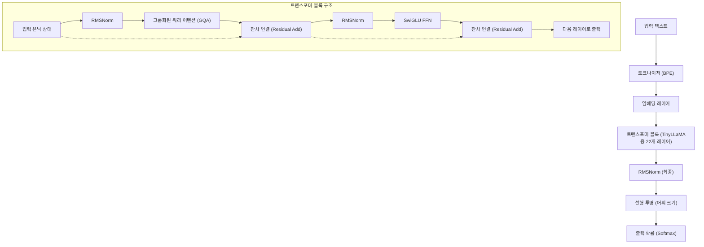
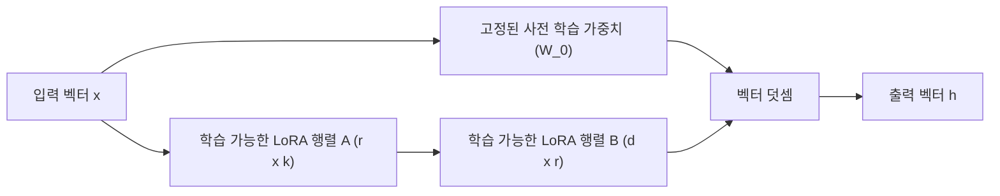
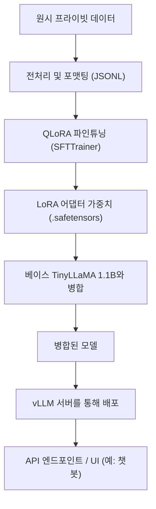

## 1. 시작하며: 왜 지금, TinyLLaMA와 온프레미스인가?

대규모 언어 모델(LLM)의 진화는 무서운 속도로 진행되고 있지만, 그에 따라 모델의 파라미터 수도 수천억 규모로 계속 팽창하고 있습니다. GPT-4나 Claude 3와 같은 초거대 모델은 비할 데 없는 성능을 자랑하는 반면, 추론이나 학습에 드는 계산 비용, 그리고 외부 API를 이용할 때의 보안 및 데이터 프라이버시 우려가 기업에게 큰 장애물이 되고 있습니다. 특히 기밀성이 높은 사내 데이터나 개인정보를 다루는 업무에서는 클라우드상의 퍼블릭 LLM API로 데이터를 전송하는 것이 컴플라이언스(GDPR이나 APPI 등) 관점에서 허용되지 않는 경우가 많습니다.

그래서 각광받고 있는 것이 **소규모 언어 모델(SLM: Small Language Models)**과 **온프레미스 환경에서의 로컬 운영**입니다. 그중에서도 '**TinyLLaMA**'는 불과 1.1B(11억) 파라미터라는 콤팩트한 크기이면서도 약 3조 토큰이라는 방대한 데이터 세트로 사전 학습되어, 동급 모델과 비교해 경이로운 성능을 발휘합니다.

본 기사에서는 이 TinyLLaMA를 온프레미스 환경(로컬 서버나 워크스테이션)에서 자사 전용 태스크를 위해 '가장 빠르고 고효율'로 파인튜닝(미세 조정)하기 위한 완전한 가이드를 제공합니다. 수학적 배경부터 최신 최적화 기술, 그리고 구체적인 PyTorch 구현 코드까지 망라하여 해설해 나갈 것입니다.

---

## 2. TinyLLaMA의 아키텍처와 특징

TinyLLaMA는 Meta사가 개발한 LLaMA(Large Language Model Meta AI) 아키텍처를 따르고 있습니다. 파라미터 수를 1.1B로 억제하면서도 LLaMA 2와 같은 기술 스택을 이용하고 있어 생태계 호환성이 매우 높은 것이 특징입니다.

### 주요 아키텍처 컴포넌트

1. **RMSNorm (Root Mean Square Normalization):**
   기존의 LayerNorm 계산에서 평균 뺄셈을 생략하여 계산 효율을 향상시킨 정규화 기법입니다. 학습의 안정성을 유지하면서 처리량(throughput)을 향상시킵니다.
2. **SwiGLU 활성화 함수:**
   피드 포워드 네트워크(FFN)에서 기존의 ReLU나 GELU 대신 SwiGLU를 채택했습니다. 이는 수학적으로 다음과 같이 표현됩니다.
   $$ \text{SwiGLU}(x, W, V) = \text{Swish}(xW) \otimes (xV) $$
   여기서 $\otimes$는 요소별 곱(아다마르 곱)을 나타내며, Swish 함수는 $\text{Swish}(z) = z \cdot \sigma(\beta z)$ 입니다. 이로 인해 표현력이 크게 향상됩니다.
3. **RoPE (Rotary Position Embedding):**
   절대적 위치 인코딩과 상대적 위치 인코딩의 장점을 결합한 기법입니다. 시퀀스 길이가 확장되었을 때도 높은 일반화 성능을 가집니다.
4. **Grouped Query Attention (GQA):**
   Multi-Head Attention (MHA)와 Multi-Query Attention (MQA)의 중간적인 접근 방식으로, 키와 밸류의 헤드를 그룹화함으로써 메모리 대역폭을 절약하고 추론 속도를 획기적으로 향상시킵니다.

다음 Mermaid 다이어그램은 TinyLLaMA의 전반적인 데이터 흐름과 Transformer 블록 구조를 보여줍니다.



---

## 3. 파인튜닝의 돌파구: LoRA와 QLoRA

온프레미스 환경에서 전체 파라미터의 파인튜닝을 수행하려면 1.1B 모델이라 하더라도 옵티마이저의 상태나 그래디언트를 유지하기 위해 수십 GB의 VRAM(비디오 메모리)을 소비합니다. 제한된 리소스로 효율적인 학습을 수행하기 위해 필수적인 것이 **PEFT (Parameter-Efficient Fine-Tuning)** 기법인 '**LoRA**'와 그 양자화 확장인 '**QLoRA**'입니다.

### 3.1 LoRA (Low-Rank Adaptation)의 수학적 배경

LoRA는 사전 학습된 가중치 행렬을 고정(프리즈)하고, 그 가중치의 업데이트 양($\Delta W$)을 낮은 랭크를 가진 두 개의 작은 행렬의 곱으로 근사하는 기법입니다.

사전 학습된 가중치를 $W_0 \in \mathbb{R}^{d \times k}$ 라고 합시다. 풀 파인튜닝에서는 $W_0$ 자체를 업데이트하여 $W_0 + \Delta W$ 로 만들지만, LoRA에서는 업데이트 행렬 $\Delta W$ 를 다음과 같이 분해합니다.

$$ \Delta W = B \times A $$

여기서 $B \in \mathbb{R}^{d \times r}$, $A \in \mathbb{R}^{r \times k}$ 이며, $r$은 랭크(Rank)라고 불리는 하이퍼파라미터로, $r \ll \min(d, k)$ 를 만족하는 매우 작은 값(보통 8, 16, 32 등)입니다.

포워드 패스의 계산은 다음과 같습니다.

$$ h = W_0 x + \Delta W x = W_0 x + B A x $$

초기 상태에서 행렬 $A$는 정규 분포(가우스 분포)로 무작위 초기화되고, 행렬 $B$는 영행렬로 초기화됩니다. 이에 따라 학습 시작 시의 $\Delta W$는 0이 되어, 베이스 모델의 출력을 완전히 유지한 상태에서 학습을 시작할 수 있습니다.



### 3.2 QLoRA (Quantized LoRA)의 혁신성

QLoRA는 LoRA의 접근 방식을 더욱 발전시켜 베이스 모델 $W_0$ 를 4-bit 정밀도(NormalFloat 4, NF4)로 양자화하여 메모리에 로드하는 기법입니다. 이를 통해 VRAM 소비량을 획기적으로 줄입니다.

QLoRA에는 3가지 중요한 기술이 포함되어 있습니다.
1. **4-bit NormalFloat (NF4) 양자화:** 정규 분포를 따르는 가중치에 최적화된 이론적으로 가장 이상적인 데이터 타입.
2. **Double Quantization (이중 양자화):** 양자화 상수(스케일 팩터) 자체도 양자화하여 메모리를 추가로 절약.
3. **Paged Optimizers:** NVIDIA의 통합 메모리 기능을 활용하여 VRAM이 부족할 때 옵티마이저의 상태를 CPU의 RAM으로 일시적으로 대피시키는 메커니즘.

이에 따라 보통 16GB~24GB의 VRAM이 필요한 튜닝이 소비자용 GPU(RTX 3060 12GB나 RTX 4070 등)에서도 여유롭게 실행 가능해집니다.

---

## 4. 온프레미스 환경에서의 하드웨어 요구사항과 셋업

TinyLLaMA (1.1B)를 QLoRA로 튜닝할 경우 하드웨어 요구사항을 매우 낮출 수 있습니다.

### 권장 하드웨어 사양
- **GPU:** NVIDIA RTX 3060 (12GB), RTX 3090/4090 (24GB), 또는 NVIDIA A10G/A100 등. VRAM은 최소 8GB만 있어도 동작하지만, 배치 크기를 확보하기 위해서는 12GB 이상을 권장합니다.
- **CPU:** 8코어 이상의 모던 CPU (Intel Core i7/i9, AMD Ryzen 7/9)
- **RAM:** 32GB 이상 (Paged Optimizers를 이용할 경우 VRAM에서의 대피소로서 중요)
- **스토리지:** NVMe SSD (데이터 세트 로딩이나 모델 저장을 가속하기 위함)

### 소프트웨어 환경 구축

Ubuntu 22.04 LTS 환경을 가정한 셋업 절차입니다. Python 3.10 이상을 사용합니다.

```bash
# 가상 환경 생성 및 활성화
python3 -m venv tinyllama_env
source tinyllama_env/bin/activate

# PyTorch 설치 (CUDA 12.1용)
pip install torch torchvision torchaudio --index-url https://download.pytorch.org/whl/cu121

# 트랜스포머 관련 라이브러리 설치
pip install transformers datasets peft trl accelerate bitsandbytes
```

---

## 5. 가장 빠른 튜닝을 위한 최적화 기술

단순히 스크립트를 돌리는 것뿐만 아니라, '가장 빠르게' 튜닝을 완료하기 위해서는 다음과 같은 최적화 기법을 조합해야 합니다.

### 5.1 Flash Attention 2
표준적인 어텐션(Attention) 메커니즘은 시퀀스 길이 $N$ 에 대해 시간·공간 계산량이 $O(N^2)$ 가 됩니다. Flash Attention 2는 GPU의 SRAM과 HBM(High Bandwidth Memory) 사이의 메모리 접근을 최적화함으로써 계산량을 줄이지 않고도 I/O 병목을 해소하여 학습 속도를 수 배 끌어올리고 메모리 소비를 급감시킵니다.

### 5.2 Gradient Checkpointing (그래디언트 체크포인트)
포워드 패스에서 계산된 중간 활성화를 모두 VRAM에 저장하는 것이 아니라 일부만 저장하고, 백워드 패스에서 필요해졌을 때 다시 계산하는 기법입니다. 계산 시간은 약 20% 증가하지만 메모리 소비량을 획기적으로 줄일 수 있기 때문에, 결과적으로 더 큰 배치 크기를 설정할 수 있어 전체적인 처리량이 향상됩니다.

### 5.3 Mixed Precision Training (혼합 정밀도 학습)과 Bfloat16
GPU의 텐서 코어(Tensor Core)를 최대한 활용하기 위해 학습 시의 계산을 `bfloat16` (Brain Floating Point)으로 수행합니다. `float16` 과 비교하여 지수부의 비트 길이가 `float32` 와 동일하기 때문에 오버플로·언더플로의 위험이 극히 낮아 학습이 안정됩니다.

---

## 6. 실전: TinyLLaMA의 QLoRA 파인튜닝 코드

그러면 위에서 언급한 모든 최적화를 포함한 가장 빠른 튜닝용 PyTorch 스크립트를 해설하겠습니다. 여기서는 Hugging Face의 `trl` (Transformer Reinforcement Learning) 라이브러리의 `SFTTrainer` 를 이용합니다.

### 6.1 데이터 세트 준비 및 모델 로드

```python
import torch
from datasets import load_dataset
from transformers import (
    AutoModelForCausalLM,
    AutoTokenizer,
    BitsAndBytesConfig,
    TrainingArguments
)
from peft import LoraConfig, get_peft_model, prepare_model_for_kbit_training
from trl import SFTTrainer

# 1. 모델과 토크나이저 지정
model_id = "TinyLlama/TinyLlama-1.1B-Chat-v1.0"

# 2. QLoRA용 4-bit 양자화 설정
bnb_config = BitsAndBytesConfig(
    load_in_4bit=True,
    bnb_4bit_use_double_quant=True,
    bnb_4bit_quant_type="nf4",
    bnb_4bit_compute_dtype=torch.bfloat16 # 계산은 bfloat16으로 수행
)

# 3. 모델 로드 (Flash Attention 2 활성화)
print("Loading model...")
model = AutoModelForCausalLM.from_pretrained(
    model_id,
    quantization_config=bnb_config,
    device_map="auto",
    use_flash_attention_2=True # 속도 극대화의 핵심
)

# 4. 토크나이저 로드
tokenizer = AutoTokenizer.from_pretrained(model_id, trust_remote_code=True)
tokenizer.pad_token = tokenizer.eos_token
tokenizer.padding_side = "right" # fp16/bf16 트레이닝 시의 버그 회피를 위해 right로 설정
```

### 6.2 LoRA 어댑터 적용 및 데이터 세트 성형

```python
# 5. k-bit 학습 준비 및 그래디언트 체크포인트 활성화
model.gradient_checkpointing_enable()
model = prepare_model_for_kbit_training(model)

# 6. LoRA 설정
peft_config = LoraConfig(
    r=16, # 랭크
    lora_alpha=32, # 스케일링 팩터
    lora_dropout=0.05,
    bias="none",
    task_type="CAUSAL_LM",
    target_modules=["q_proj", "k_proj", "v_proj", "o_proj", "gate_proj", "up_proj", "down_proj"] # 모든 Linear 레이어를 타겟으로 하면 성능이 향상됨
)

model = get_peft_model(model, peft_config)
model.print_trainable_parameters() 
# 출력 예시: trainable params: 14,286,848 || all params: 1,114,335,232 || trainable%: 1.282%

# 7. 데이터 세트 로드 (여기서는 예시로 일본어 Instruction 데이터 세트를 사용)
# 실제로는 온프레미스의 프라이빗 JSONL 파일 등을 로드합니다.
dataset = load_dataset("kunishou/databricks-dolly-15k-ja", split="train")

def format_instruction(sample):
    """
    ChatML 포맷이나 프롬프트 템플릿에 맞추어 문자열을 성형합니다.
    """
    prompt = f"<|im_start|>user\n{sample['instruction']}"
    if sample.get("input", "") != "":
         prompt += f"\n{sample['input']}"
    prompt += f"<|im_end|>\n<|im_start|>assistant\n{sample['output']}<|im_end|>"
    return {"text": prompt}

dataset = dataset.map(format_instruction)
```

### 6.3 트레이닝 실행

```python
# 8. 트레이닝 인자 설정
training_args = TrainingArguments(
    output_dir="./tinyllama-lora-output",
    per_device_train_batch_size=8, # VRAM에 여유가 있다면 올림
    gradient_accumulation_steps=2, # 실질적인 배치 크기 = 8 * 2 = 16
    optim="paged_adamw_32bit",     # Paged Optimizer에 의한 VRAM 절약
    save_steps=100,
    logging_steps=10,
    learning_rate=2e-4,
    fp16=False,
    bf16=True,                     # 혼합 정밀도 학습 (bfloat16)
    max_grad_norm=0.3,
    max_steps=500,                 # 테스트용으로 500 스텝. 실전에서는 에포크 수로 지정
    warmup_ratio=0.03,
    group_by_length=True,
    lr_scheduler_type="cosine",
)

# 9. SFTTrainer를 이용한 학습 시작
trainer = SFTTrainer(
    model=model,
    train_dataset=dataset,
    peft_config=peft_config,
    dataset_text_field="text",
    max_seq_length=1024, # 예상되는 입력 길이에 맞춰 조정
    tokenizer=tokenizer,
    args=training_args,
)

print("Starting training...")
trainer.train()

# 10. LoRA 어댑터 저장
trainer.model.save_pretrained("./tinyllama-lora-final")
tokenizer.save_pretrained("./tinyllama-lora-final")
print("Training complete and model saved.")
```

---

## 7. 성능 평가 및 트러블슈팅

온프레미스 환경에서 학습을 돌릴 때 자주 직면하는 문제와 그 해결책입니다.

1. **OOM(Out Of Memory)이 발생한다:**
   - `per_device_train_batch_size` 를 `1` 로 낮춥니다.
   - `gradient_accumulation_steps` 를 늘려 실질적인 배치 크기를 유지합니다.
   - `max_seq_length` 를 `2048` 에서 `1024` 나 `512` 로 줄입니다.
2. **Loss가 떨어지지 않는다·발산한다:**
   - 학습률 (`learning_rate`)이 너무 클 가능성이 있습니다. `2e-4` 에서 `5e-5` 정도로 낮춰보세요.
   - Bfloat16이 아닌 Float16을 사용하고 있을 경우 그래디언트의 언더플로가 일어나고 있을 가능성이 있습니다. `bf16=True` 를 확인하세요.
3. **추론 시 알 수 없는 문자열이 생성된다:**
   - `padding_side="right"` 가 올바르게 설정되어 있는지 확인하세요. 또한 데이터 세트의 포맷(`<|im_start|>` 등의 특수 토큰)이 베이스 모델의 사전 학습 때와 일치하는지 확인이 필요합니다.

---

## 8. 튜닝 후 모델 배포 (Deployment)

튜닝이 완료되면 저장되는 것은 '베이스 모델 전체'가 아니라 수 MB~수십 MB의 '**LoRA 어댑터 (차이점 가중치)**'뿐입니다. 추론을 고속으로 수행하기 위해서는 이 LoRA 가중치를 원래 베이스 모델에 병합(통합)하여 단일 모델로 저장해야 합니다.

### 모델 병합 스크립트

```python
import torch
from peft import AutoPeftModelForCausalLM
from transformers import AutoTokenizer

output_dir = "./tinyllama-lora-final"

# FP16/BF16으로 모델과 어댑터 로드
model = AutoPeftModelForCausalLM.from_pretrained(
    output_dir,
    device_map="auto",
    torch_dtype=torch.bfloat16
)
tokenizer = AutoTokenizer.from_pretrained(output_dir)

# 가중치를 병합하여 저장
merged_model = model.merge_and_unload()
merged_model.save_pretrained("./tinyllama-merged", safe_serialization=True)
tokenizer.save_pretrained("./tinyllama-merged")
print("Model merged and saved successfully!")
```

### vLLM을 활용한 초고속 추론 서버 구축

온프레미스 환경에서의 배포에 있어 추론 속도(Tokens per second)를 극대화하기 위해서는 Hugging Face의 표준 `pipeline` 이 아니라 **vLLM**이나 **TGI (Text Generation Inference)** 의 사용을 강력히 권장합니다. vLLM은 PagedAttention 기술을 사용하여 GPU 메모리의 단편화를 방지하고 병렬 요청 처리 능력을 극적으로 향상시킵니다.

다음 Mermaid 다이어그램은 학습부터 추론 서버 배포까지의 파이프라인을 보여줍니다.



vLLM을 사용한 API 서버 실행은 다음 명령어 하나로 완료됩니다.

```bash
python -m vllm.entrypoints.openai.api_server \
    --model ./tinyllama-merged \
    --host 0.0.0.0 \
    --port 8000 \
    --max-model-len 2048 \
    --dtype bfloat16
```
이것으로 OpenAI API 호환 엔드포인트가 온프레미스 환경에 구축되어, 안전하고 빠르게 로컬 AI를 활용할 수 있게 됩니다.

---

## 9. 마무리

본 기사에서는 1.1B라는 가벼운 파라미터 수임에도 불구하고 고성능인 'TinyLLaMA'를 대상으로 온프레미스 환경에서 가장 빠르고 메모리 효율적으로 파인튜닝을 수행하는 기법을 해설했습니다.

- **LoRA / QLoRA** 를 통해 소비자용 GPU에서도 본격적인 LLM 튜닝이 가능해졌습니다.
- **Flash Attention 2** 와 **Gradient Checkpointing** 을 구사하여 학습 시간과 VRAM 소비를 극한까지 최적화했습니다.
- **vLLM** 을 활용한 배포로 프로덕션 환경에서도 높은 처리량을 실현했습니다.

온프레미스에서의 로컬 LLM 운영은 데이터의 기밀성을 보호할 뿐만 아니라, 특정 도메인(법무, 의료, 사내 규정 등)에 특화된 전문 AI를 저비용으로 구축하기 위한 최강의 무기가 됩니다. 꼭 본 가이드를 참고하여 자사 전용의 TinyLLaMA를 육성해 보시기 바랍니다.
