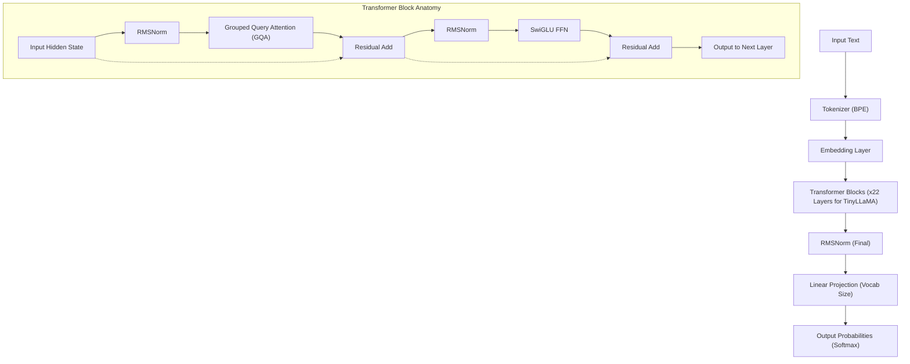
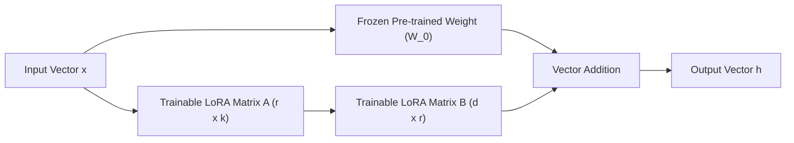
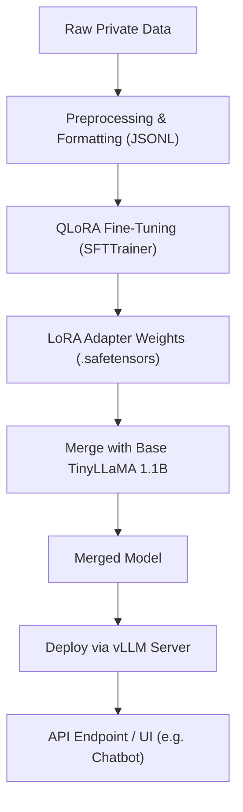

## 1. はじめに：なぜ今、TinyLLaMAとオンプレミスなのか？

大規模言語モデル（LLM）の進化は凄まじいスピードで進んでいますが、それに伴いモデルのパラメータ数も数千億規模へと膨張し続けています。GPT-4やClaude 3のような超巨大モデルは比類なき性能を誇る一方で、推論や学習にかかる計算コスト、そして外部APIを利用する際のセキュリティやデータプライバシーの懸念が企業にとって大きなハードルとなっています。特に機密性の高い社内データや個人情報を扱う業務においては、クラウド上のパブリックなLLM APIへデータを送信することは、コンプライアンス（GDPRやAPPIなど）の観点から許容されないケースが多々あります。

そこで脚光を浴びているのが、**小規模言語モデル（SLM: Small Language Models）** と **オンプレミス環境でのローカル運用** です。その中でも「**TinyLLaMA**」は、わずか1.1B（11億）パラメータというコンパクトなサイズでありながら、約3兆トークンという膨大なデータセットで事前学習されており、同クラスのモデルと比較して驚異的な性能を発揮します。

本記事では、このTinyLLaMAをオンプレミス環境（ローカルサーバーやワークステーション）で、自社専用のタスクに向けて「最速かつ高効率」にファインチューニング（微調整）するための完全ガイドを提供します。数学的な背景から、最新の最適化技術、そして具体的なPyTorchの実装コードまで、網羅的に解説していきます。

---

## 2. TinyLLaMAのアーキテクチャと特徴

TinyLLaMAは、Meta社が開発したLLaMA（Large Language Model Meta AI）アーキテクチャを踏襲しています。パラメータ数を1.1Bに抑えつつも、LLaMA 2と同じ技術スタックを利用しているため、エコシステムの互換性が非常に高いのが特徴です。

### 主要なアーキテクチャコンポーネント

1. **RMSNorm (Root Mean Square Normalization):**
   従来のLayerNormの計算から平均の減算を省略し、計算効率を向上させた正規化手法です。学習の安定性を保ちながらスループットを向上させます。
2. **SwiGLU活性化関数:**
   Feed Forward Network (FFN) において、従来のReLUやGELUの代わりにSwiGLUを採用しています。これは数学的には以下のように表されます。
   $$ \text{SwiGLU}(x, W, V) = \text{Swish}(xW) \otimes (xV) $$
   ここで、$\otimes$ は要素ごとの積（Hadamard積）を表し、Swish関数は $\text{Swish}(z) = z \cdot \sigma(\beta z)$ です。これにより表現力が大幅に向上します。
3. **RoPE (Rotary Position Embedding):**
   絶対的な位置エンコーディングと相対的な位置エンコーディングの利点を組み合わせた手法です。シーケンス長が拡張された際にも高い汎化性能を持ちます。
4. **Grouped Query Attention (GQA):**
   Multi-Head Attention (MHA) と Multi-Query Attention (MQA) の中間的なアプローチであり、キーとバリューのヘッドをグループ化することで、メモリ帯域幅を節約し推論速度を劇的に向上させます。

以下のMermaid図は、TinyLLaMAの全体的なデータフローとTransformerブロックの構造を示しています。



---

## 3. ファインチューニングのブレイクスルー：LoRAとQLoRA

オンプレミス環境でフルパラメータのファインチューニングを行うには、1.1Bモデルであってもオプティマイザのステートや勾配を保持するために数十GBのVRAM（ビデオメモリ）を消費します。限られたリソースで効率的に学習を行うために必須となるのが、**PEFT (Parameter-Efficient Fine-Tuning)** 手法である「**LoRA**」とその量子化拡張である「**QLoRA**」です。

### 3.1 LoRA (Low-Rank Adaptation) の数学的背景

LoRAは、事前学習済みの重み行列を固定（フリーズ）し、その重みの更新量（$\Delta W$）を低ランクの2つの小さな行列の積として近似する手法です。

事前学習済みの重みを $W_0 \in \mathbb{R}^{d \times k}$ とします。フルファインチューニングでは、$W_0$ 自体を更新して $W_0 + \Delta W$ としますが、LoRAでは更新行列 $\Delta W$ を以下のように分解します。

$$ \Delta W = B \times A $$

ここで、$B \in \mathbb{R}^{d \times r}$、$A \in \mathbb{R}^{r \times k}$ であり、$r$ はランク（Rank）と呼ばれるハイパーパラメータで、$r \ll \min(d, k)$ を満たす非常に小さな値（通常は8, 16, 32など）です。

フォワードパスの計算は以下のようになります。

$$ h = W_0 x + \Delta W x = W_0 x + B A x $$

初期状態において、行列 $A$ は正規分布（ガウス分布）でランダムに初期化され、行列 $B$ はゼロ行列で初期化されます。これにより、学習開始時の $\Delta W$ はゼロとなり、ベースモデルの出力を完全に保持した状態から学習をスタートできます。



### 3.2 QLoRA (Quantized LoRA) の革新性

QLoRAは、LoRAのアプローチをさらに推し進め、ベースモデル $W_0$ を4-bit精度（NormalFloat 4, NF4）で量子化してメモリにロードする手法です。これにより、VRAM消費量を劇的に削減します。

QLoRAには3つの重要な技術が組み込まれています。
1. **4-bit NormalFloat (NF4) 量子化:** 正規分布に従う重みに最適化された理論的に最適なデータ型。
2. **Double Quantization (二重量子化):** 量子化定数（スケールファクタ）自体も量子化することで、さらにメモリを節約。
3. **Paged Optimizers:** NVIDIAの統合メモリ機能を利用し、VRAMが不足した際にオプティマイザのステータスをCPUのRAMへ一時的に退避させる仕組み。

これにより、通常はVRAMが16GB〜24GB必要なチューニングが、コンシューマー向けのGPU（RTX 3060 12GBやRTX 4070など）でも余裕を持って実行可能になります。

---

## 4. オンプレミス環境におけるハードウェア要件とセットアップ

TinyLLaMA (1.1B) をQLoRAでチューニングする場合のハードウェア要件は非常に低く抑えられます。

### 推奨ハードウェアスペック
- **GPU:** NVIDIA RTX 3060 (12GB), RTX 3090/4090 (24GB), または NVIDIA A10G/A100 など。VRAMは最低8GBあれば動作しますが、バッチサイズを稼ぐためには12GB以上を推奨します。
- **CPU:** 8コア以上のモダンなCPU（Intel Core i7/i9, AMD Ryzen 7/9）
- **RAM:** 32GB以上（Paged Optimizersを利用する場合、VRAMからの退避先として重要）
- **ストレージ:** NVMe SSD（データセットの読み込みやモデルの保存を高速化するため）

### ソフトウェア環境の構築

Ubuntu 22.04 LTS環境を想定したセットアップ手順です。Python 3.10以降を使用します。

```bash
# 仮想環境の作成とアクティベート
python3 -m venv tinyllama_env
source tinyllama_env/bin/activate

# PyTorchのインストール (CUDA 12.1用)
pip install torch torchvision torchaudio --index-url https://download.pytorch.org/whl/cu121

# トランスフォーマー関連ライブラリのインストール
pip install transformers datasets peft trl accelerate bitsandbytes
```

---

## 5. 最速チューニングのための最適化技術

ただスクリプトを回すだけでなく、「最速」でチューニングを完了させるためには、以下の最適化手法を組み合わせる必要があります。

### 5.1 Flash Attention 2
標準的なAttentionメカニズムは、シーケンス長 $N$ に対して時間・空間計算量が $O(N^2)$ となります。Flash Attention 2は、GPUのSRAMとHBM（High Bandwidth Memory）間のメモリアクセスを最適化することで、計算量を削減せずにIOネックを解消し、学習速度を数倍に引き上げ、メモリ消費を激減させます。

### 5.2 Gradient Checkpointing (勾配チェックポイント)
フォワードパスで計算された中間アクティベーションをすべてVRAMに保存するのではなく、一部のみを保存し、バックワードパスで必要になった際に再計算する手法です。計算時間は約20%増加しますが、メモリ消費量を劇的に削減できるため、結果としてより大きなバッチサイズを設定でき、スループット全体が向上します。

### 5.3 Mixed Precision Training (混合精度学習) と Bfloat16
GPUのTensor Coreを最大限に活用するため、学習時の計算を `bfloat16` (Brain Floating Point) で行います。`float16` と比較して指数部のビット長が `float32` と同じであるため、オーバーフロー・アンダーフローのリスクが極めて低く、学習が安定します。

---

## 6. 実践：TinyLLaMAのQLoRAファインチューニングコード

それでは、上記すべての最適化を盛り込んだ最速チューニング用のPyTorchスクリプトを解説します。ここではHugging Faceの `trl` (Transformer Reinforcement Learning) ライブラリの `SFTTrainer` を利用します。

### 6.1 データセットの準備とモデルのロード

```python
import torch
from datasets import load_dataset
from transformers import (
    AutoModelForCausalLM,
    AutoTokenizer,
    BitsAndBytesConfig,
    TrainingArguments
)
from peft import LoraConfig, get_peft_model, prepare_model_for_kbit_training
from trl import SFTTrainer

# 1. モデルとトークナイザーの指定
model_id = "TinyLlama/TinyLlama-1.1B-Chat-v1.0"

# 2. QLoRA用の4-bit量子化設定
bnb_config = BitsAndBytesConfig(
    load_in_4bit=True,
    bnb_4bit_use_double_quant=True,
    bnb_4bit_quant_type="nf4",
    bnb_4bit_compute_dtype=torch.bfloat16 # 計算はbfloat16で行う
)

# 3. モデルのロード (Flash Attention 2を有効化)
print("Loading model...")
model = AutoModelForCausalLM.from_pretrained(
    model_id,
    quantization_config=bnb_config,
    device_map="auto",
    use_flash_attention_2=True # 最速化の鍵
)

# 4. トークナイザーのロード
tokenizer = AutoTokenizer.from_pretrained(model_id, trust_remote_code=True)
tokenizer.pad_token = tokenizer.eos_token
tokenizer.padding_side = "right" # fp16/bf16トレーニング時のバグ回避のためrightに設定
```

### 6.2 LoRAアダプタの適用とデータセットの整形

```python
# 5. k-bit学習の準備と勾配チェックポイントの有効化
model.gradient_checkpointing_enable()
model = prepare_model_for_kbit_training(model)

# 6. LoRAの設定
peft_config = LoraConfig(
    r=16, # ランク
    lora_alpha=32, # スケーリングファクタ
    lora_dropout=0.05,
    bias="none",
    task_type="CAUSAL_LM",
    target_modules=["q_proj", "k_proj", "v_proj", "o_proj", "gate_proj", "up_proj", "down_proj"] # 全てのLinear層をターゲットにすると性能が向上
)

model = get_peft_model(model, peft_config)
model.print_trainable_parameters() 
# 出力例: trainable params: 14,286,848 || all params: 1,114,335,232 || trainable%: 1.282%

# 7. データセットのロード (ここでは例として日本語Instructionデータセットを使用)
# 実際にはオンプレミスのプライベートJSONLファイルなどをロードします
dataset = load_dataset("kunishou/databricks-dolly-15k-ja", split="train")

def format_instruction(sample):
    """
    ChatMLフォーマットやプロンプトテンプレートに合わせて文字列を成形します
    """
    prompt = f"<|im_start|>user\n{sample['instruction']}"
    if sample.get("input", "") != "":
         prompt += f"\n{sample['input']}"
    prompt += f"<|im_end|>\n<|im_start|>assistant\n{sample['output']}<|im_end|>"
    return {"text": prompt}

dataset = dataset.map(format_instruction)
```

### 6.3 トレーニングの実行

```python
# 8. トレーニング引数の設定
training_args = TrainingArguments(
    output_dir="./tinyllama-lora-output",
    per_device_train_batch_size=8, # VRAMに余裕があれば上げる
    gradient_accumulation_steps=2, # 実質的なバッチサイズ = 8 * 2 = 16
    optim="paged_adamw_32bit",     # Paged OptimizerによるVRAM節約
    save_steps=100,
    logging_steps=10,
    learning_rate=2e-4,
    fp16=False,
    bf16=True,                     # 混合精度学習 (bfloat16)
    max_grad_norm=0.3,
    max_steps=500,                 # テスト用に500ステップ。本番はエポック数で指定
    warmup_ratio=0.03,
    group_by_length=True,
    lr_scheduler_type="cosine",
)

# 9. SFTTrainerによる学習の開始
trainer = SFTTrainer(
    model=model,
    train_dataset=dataset,
    peft_config=peft_config,
    dataset_text_field="text",
    max_seq_length=1024, # 想定する入力長に合わせて調整
    tokenizer=tokenizer,
    args=training_args,
)

print("Starting training...")
trainer.train()

# 10. LoRAアダプタの保存
trainer.model.save_pretrained("./tinyllama-lora-final")
tokenizer.save_pretrained("./tinyllama-lora-final")
print("Training complete and model saved.")
```

---

## 7. パフォーマンス評価とトラブルシューティング

オンプレミス環境で学習を回す際、よく直面する問題とその解決策です。

1. **OOM (Out Of Memory) が発生する:**
   - `per_device_train_batch_size` を `1` に下げる。
   - `gradient_accumulation_steps` を増やして実質バッチサイズを維持する。
   - `max_seq_length` を `2048` から `1024` や `512` に短縮する。
2. **Lossが下がらない・発散する:**
   - 学習率 (`learning_rate`) が大きすぎる可能性があります。`2e-4` から `5e-5` 程度まで下げてみてください。
   - Bfloat16ではなくFloat16を使用している場合、勾配のアンダーフローが起きている可能性があります。`bf16=True` を確認してください。
3. **推論時に謎の文字列が生成される:**
   - `padding_side="right"` が正しく設定されているか確認してください。また、データセットのフォーマット（`<|im_start|>` などの特殊トークン）がベースモデルの事前学習時と整合しているか確認が必要です。

---

## 8. チューニング後のモデル展開 (Deployment)

チューニングが完了すると、保存されるのは「ベースモデル全体」ではなく、数MB〜数十MBの「**LoRAアダプタ（差分ウェイト）**」のみです。推論を高速に行うためには、このLoRAウェイトを元のベースモデルにマージ（統合）し、単一のモデルとして書き出す必要があります。

### モデルのマージスクリプト

```python
import torch
from peft import AutoPeftModelForCausalLM
from transformers import AutoTokenizer

output_dir = "./tinyllama-lora-final"

# FP16/BF16でモデルとアダプタをロード
model = AutoPeftModelForCausalLM.from_pretrained(
    output_dir,
    device_map="auto",
    torch_dtype=torch.bfloat16
)
tokenizer = AutoTokenizer.from_pretrained(output_dir)

# ウェイトをマージして保存
merged_model = model.merge_and_unload()
merged_model.save_pretrained("./tinyllama-merged", safe_serialization=True)
tokenizer.save_pretrained("./tinyllama-merged")
print("Model merged and saved successfully!")
```

### vLLMによる爆速推論サーバーの立ち上げ

オンプレミス環境での展開において、推論速度（Tokens per second）を最大化するためには、Hugging Faceの標準の `pipeline` ではなく、**vLLM** や **TGI (Text Generation Inference)** の使用を強く推奨します。vLLMはPagedAttention技術を用いて、GPUメモリの断片化を防ぎ、並行リクエストの処理能力を劇的に向上させます。

以下のMermaid図は、学習から推論サーバー展開までのパイプラインを示しています。



vLLMを使ったAPIサーバーの起動は以下の1コマンドで完了します。

```bash
python -m vllm.entrypoints.openai.api_server \
    --model ./tinyllama-merged \
    --host 0.0.0.0 \
    --port 8000 \
    --max-model-len 2048 \
    --dtype bfloat16
```
これで、OpenAI API互換のエンドポイントがオンプレミス環境に構築され、セキュアかつ高速にローカルAIを活用できるようになります。

---

## 9. まとめ

本記事では、パラメータ数が1.1Bと軽量でありながら高性能な「TinyLLaMA」を対象に、オンプレミス環境において最速かつメモリ効率良くファインチューニングを行う手法を解説しました。

- **LoRA / QLoRA** により、コンシューマー向けGPUでも本格的なLLMチューニングが可能に。
- **Flash Attention 2** と **Gradient Checkpointing** を駆使することで、学習時間とVRAM消費を極限まで最適化。
- **vLLM** を活用したデプロイにより、本番環境でも高いスループットを実現。

オンプレミスでのローカルLLM運用は、データの機密性を守るだけでなく、特定のドメイン（法務、医療、社内規程など）に特化した専門AIを低コストで構築するための最強の武器となります。ぜひ本ガイドを参考に、自社専用のTinyLLaMAを育成してみてください。
