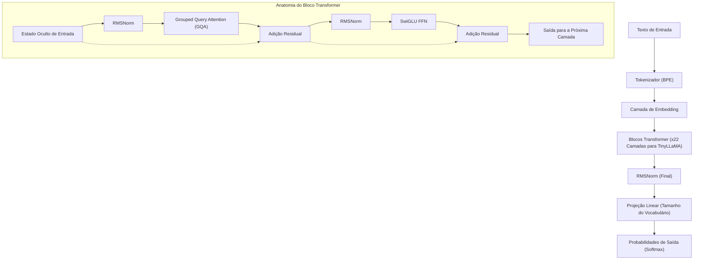
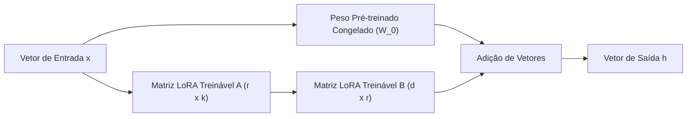
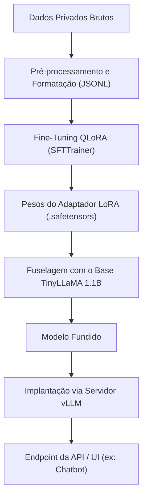

## 1. Introdução: Por que TinyLLaMA e On-Premises agora?

A evolução dos grandes modelos de linguagem (LLM) está avançando a uma velocidade incrível, mas, consequentemente, o número de parâmetros dos modelos continua a inchar para a escala de centenas de bilhões. Embora modelos supergigantes como GPT-4 e Claude 3 possuam um desempenho inigualável, o custo computacional para inferência e treinamento, bem como as preocupações de segurança e privacidade de dados ao usar APIs externas, tornaram-se grandes obstáculos para as empresas. Especialmente em operações que lidam com dados corporativos altamente confidenciais e informações pessoais, enviar dados para uma API de LLM pública na nuvem frequentemente não é permitido do ponto de vista da conformidade (como GDPR e LGPD).

É aí que os **Pequenos Modelos de Linguagem (SLM: Small Language Models)** e as **operações locais em ambientes on-premises** estão ganhando destaque. Entre eles, o "**TinyLLaMA**" tem um tamanho compacto de apenas 1.1B (1.1 bilhão) de parâmetros, mas foi pré-treinado com um enorme conjunto de dados de cerca de 3 trilhões de tokens, demonstrando um desempenho impressionante em comparação com modelos da mesma classe.

Neste artigo, forneceremos um guia completo para realizar o fine-tuning (ajuste fino) deste TinyLLaMA de forma "mais rápida e altamente eficiente" para tarefas específicas da sua empresa em um ambiente on-premises (servidores locais ou estações de trabalho). Explicaremos de forma abrangente desde os fundamentos matemáticos e as mais recentes tecnologias de otimização até códigos práticos de implementação em PyTorch.

---

## 2. Arquitetura e Características do TinyLLaMA

O TinyLLaMA segue a arquitetura LLaMA (Large Language Model Meta AI) desenvolvida pela Meta. Embora mantenha o número de parâmetros em 1.1B, ele utiliza a mesma pilha de tecnologia do LLaMA 2, o que o caracteriza por uma compatibilidade extremamente alta com o ecossistema.

### Principais Componentes da Arquitetura

1. **RMSNorm (Root Mean Square Normalization):**
   Um método de normalização que omite a subtração da média dos cálculos do LayerNorm tradicional, melhorando a eficiência computacional. Ele aumenta a taxa de transferência enquanto mantém a estabilidade do treinamento.
2. **Função de Ativação SwiGLU:**
   Na Feed Forward Network (FFN), o SwiGLU é adotado em vez do ReLU ou GELU tradicionais. Matematicamente, isso é expresso da seguinte forma:
   $$ \text{SwiGLU}(x, W, V) = \text{Swish}(xW) \otimes (xV) $$
   Aqui, $\otimes$ representa o produto elemento a elemento (Produto de Hadamard) e a função Swish é $\text{Swish}(z) = z \cdot \sigma(\beta z)$. Isso melhora significativamente a capacidade de representação.
3. **RoPE (Rotary Position Embedding):**
   Um método que combina as vantagens da codificação de posição absoluta e da codificação de posição relativa. Possui alta capacidade de generalização mesmo quando o comprimento da sequência é estendido.
4. **Grouped Query Attention (GQA):**
   Uma abordagem intermediária entre a Multi-Head Attention (MHA) e a Multi-Query Attention (MQA), que economiza largura de banda de memória e melhora drasticamente a velocidade de inferência agrupando as cabeças de chaves e valores.

O diagrama Mermaid a seguir mostra o fluxo de dados geral e a estrutura dos blocos Transformer do TinyLLaMA.



---

## 3. Um Avanço no Fine-Tuning: LoRA e QLoRA

Realizar um fine-tuning com todos os parâmetros em um ambiente on-premises, mesmo para um modelo de 1.1B, consome dezenas de GBs de VRAM (memória de vídeo) para manter os estados do otimizador e gradientes. Para treinar eficientemente com recursos limitados, o método **PEFT (Parameter-Efficient Fine-Tuning)** chamado "**LoRA**" e sua extensão quantizada "**QLoRA**" são essenciais.

### 3.1 Contexto Matemático do LoRA (Low-Rank Adaptation)

LoRA é uma técnica que fixa (congela) as matrizes de pesos pré-treinadas e aproxima a atualização desses pesos ($\Delta W$) como o produto de duas matrizes pequenas de baixo posto.

Suponha que os pesos pré-treinados sejam $W_0 \in \mathbb{R}^{d \times k}$. No fine-tuning completo, o próprio $W_0$ é atualizado para $W_0 + \Delta W$, mas no LoRA a matriz de atualização $\Delta W$ é decomposta da seguinte forma:

$$ \Delta W = B \times A $$

Aqui, $B \in \mathbb{R}^{d \times r}$, $A \in \mathbb{R}^{r \times k}$, e $r$ é um hiperparâmetro chamado posto (Rank), que é um valor muito pequeno que satisfaz $r \ll \min(d, k)$ (geralmente 8, 16, 32, etc.).

O cálculo na passagem para frente (forward pass) é o seguinte:

$$ h = W_0 x + \Delta W x = W_0 x + B A x $$

No estado inicial, a matriz $A$ é inicializada aleatoriamente com uma distribuição normal (distribuição Gaussiana), e a matriz $B$ é inicializada com uma matriz zero. Isso garante que $\Delta W$ seja zero no início do treinamento, permitindo iniciar o treinamento preservando totalmente a saída do modelo base.



### 3.2 A Inovação do QLoRA (Quantized LoRA)

QLoRA impulsiona ainda mais a abordagem do LoRA, quantizando o modelo base $W_0$ em precisão de 4 bits (NormalFloat 4, NF4) e carregando-o na memória. Isso reduz drasticamente o consumo de VRAM.

O QLoRA incorpora 3 tecnologias cruciais:
1. **Quantização de 4 bits NormalFloat (NF4):** Um tipo de dados teoricamente ideal otimizado para pesos que seguem uma distribuição normal.
2. **Double Quantization (Quantização Dupla):** Economiza ainda mais memória quantizando a própria constante de quantização (fator de escala).
3. **Paged Optimizers:** Um mecanismo que utiliza o recurso de memória unificada da NVIDIA para descarregar temporariamente o status do otimizador para a RAM da CPU quando a VRAM se esgota.

Como resultado, o fine-tuning que normalmente requeriria 16GB a 24GB de VRAM pode ser executado facilmente até mesmo em GPUs de nível consumidor (como RTX 3060 de 12GB e RTX 4070).

---

## 4. Requisitos de Hardware e Configuração em um Ambiente On-Premises

Os requisitos de hardware para o fine-tuning do TinyLLaMA (1.1B) com QLoRA podem ser mantidos muito baixos.

### Especificações de Hardware Recomendadas
- **GPU:** NVIDIA RTX 3060 (12GB), RTX 3090/4090 (24GB), ou NVIDIA A10G/A100, etc. Funcionará com pelo menos 8GB de VRAM, mas recomenda-se 12GB ou mais para aumentar o tamanho do batch.
- **CPU:** Uma CPU moderna com 8 núcleos ou mais (Intel Core i7/i9, AMD Ryzen 7/9).
- **RAM:** 32GB ou mais (importante como destino de backup da VRAM ao usar Paged Optimizers).
- **Armazenamento:** NVMe SSD (para acelerar a leitura de conjuntos de dados e o salvamento de modelos).

### Configuração do Ambiente de Software

O procedimento de configuração a seguir assume um ambiente Ubuntu 22.04 LTS. Usa-se o Python 3.10 ou superior.

```bash
# Criação e ativação do ambiente virtual
python3 -m venv tinyllama_env
source tinyllama_env/bin/activate

# Instalação do PyTorch (para CUDA 12.1)
pip install torch torchvision torchaudio --index-url https://download.pytorch.org/whl/cu121

# Instalação das bibliotecas relacionadas aos transformers
pip install transformers datasets peft trl accelerate bitsandbytes
```

---

## 5. Técnicas de Otimização para o Ajuste Fino Mais Rápido

Para concluir o fine-tuning de forma "mais rápida", além de simplesmente executar o script, é necessário combinar as seguintes técnicas de otimização.

### 5.1 Flash Attention 2
O mecanismo padrão de Attention tem uma complexidade computacional de tempo e espaço de $O(N^2)$ para um comprimento de sequência $N$. O Flash Attention 2 otimiza o acesso à memória entre a SRAM da GPU e a HBM (High Bandwidth Memory), eliminando o gargalo de IO sem reduzir a quantidade de cálculos, o que aumenta a velocidade de treinamento em várias vezes e reduz drasticamente o consumo de memória.

### 5.2 Gradient Checkpointing (Ponto de Verificação de Gradiente)
Em vez de salvar todas as ativações intermediárias calculadas na passagem para frente (forward pass) na VRAM, apenas uma parte é salva e recalculada quando necessária na passagem para trás (backward pass). Embora o tempo de computação aumente em cerca de 20%, ele reduz o consumo de memória dramaticamente, permitindo a definição de um tamanho de batch maior e melhorando a taxa de transferência geral.

### 5.3 Mixed Precision Training (Treinamento de Precisão Mista) e Bfloat16
Para maximizar a utilização dos Tensor Cores da GPU, os cálculos durante o treinamento são realizados em `bfloat16` (Brain Floating Point). Comparado ao `float16`, o comprimento de bits da parte expoente é o mesmo que no `float32`, portanto o risco de overflow e underflow é extremamente baixo, resultando em um treinamento mais estável.

---

## 6. Prática: Código de Fine-Tuning QLoRA do TinyLLaMA

Agora, explicaremos o script PyTorch para o fine-tuning mais rápido, incorporando todas as otimizações acima. Aqui, utilizaremos o `SFTTrainer` da biblioteca `trl` (Transformer Reinforcement Learning) da Hugging Face.

### 6.1 Preparação do Conjunto de Dados e Carregamento do Modelo

```python
import torch
from datasets import load_dataset
from transformers import (
    AutoModelForCausalLM,
    AutoTokenizer,
    BitsAndBytesConfig,
    TrainingArguments
)
from peft import LoraConfig, get_peft_model, prepare_model_for_kbit_training
from trl import SFTTrainer

# 1. Especificar modelo e tokenizador
model_id = "TinyLlama/TinyLlama-1.1B-Chat-v1.0"

# 2. Configuração de quantização de 4 bits para QLoRA
bnb_config = BitsAndBytesConfig(
    load_in_4bit=True,
    bnb_4bit_use_double_quant=True,
    bnb_4bit_quant_type="nf4",
    bnb_4bit_compute_dtype=torch.bfloat16 # O cálculo é feito em bfloat16
)

# 3. Carregamento do modelo (Habilitar Flash Attention 2)
print("Carregando o modelo...")
model = AutoModelForCausalLM.from_pretrained(
    model_id,
    quantization_config=bnb_config,
    device_map="auto",
    use_flash_attention_2=True # A chave para o treinamento mais rápido
)

# 4. Carregamento do tokenizador
tokenizer = AutoTokenizer.from_pretrained(model_id, trust_remote_code=True)
tokenizer.pad_token = tokenizer.eos_token
tokenizer.padding_side = "right" # Definido como right para evitar bugs durante o treinamento fp16/bf16
```

### 6.2 Aplicação do Adaptador LoRA e Formatação do Conjunto de Dados

```python
# 5. Preparação para o treinamento k-bit e ativação do gradient checkpointing
model.gradient_checkpointing_enable()
model = prepare_model_for_kbit_training(model)

# 6. Configuração do LoRA
peft_config = LoraConfig(
    r=16, # Posto
    lora_alpha=32, # Fator de escala
    lora_dropout=0.05,
    bias="none",
    task_type="CAUSAL_LM",
    target_modules=["q_proj", "k_proj", "v_proj", "o_proj", "gate_proj", "up_proj", "down_proj"] # O desempenho melhora se todas as camadas Lineares forem os alvos
)

model = get_peft_model(model, peft_config)
model.print_trainable_parameters() 
# Exemplo de saída: trainable params: 14,286,848 || all params: 1,114,335,232 || trainable%: 1.282%

# 7. Carregamento do conjunto de dados (Aqui, usamos um dataset de instruções em japonês como exemplo)
# Na prática, você carregará arquivos JSONL privados em seu ambiente on-premises
dataset = load_dataset("kunishou/databricks-dolly-15k-ja", split="train")

def format_instruction(sample):
    """
    Formata a string para corresponder ao formato ChatML ou ao template de prompt
    """
    prompt = f"<|im_start|>user\n{sample['instruction']}"
    if sample.get("input", "") != "":
         prompt += f"\n{sample['input']}"
    prompt += f"<|im_end|>\n<|im_start|>assistant\n{sample['output']}<|im_end|>"
    return {"text": prompt}

dataset = dataset.map(format_instruction)
```

### 6.3 Execução do Treinamento

```python
# 8. Definição dos argumentos de treinamento
training_args = TrainingArguments(
    output_dir="./tinyllama-lora-output",
    per_device_train_batch_size=8, # Aumente se houver VRAM suficiente
    gradient_accumulation_steps=2, # Tamanho de batch efetivo = 8 * 2 = 16
    optim="paged_adamw_32bit",     # Economia de VRAM através do Paged Optimizer
    save_steps=100,
    logging_steps=10,
    learning_rate=2e-4,
    fp16=False,
    bf16=True,                     # Mixed precision training (bfloat16)
    max_grad_norm=0.3,
    max_steps=500,                 # 500 passos para teste. Em produção, especifique pelo número de épocas
    warmup_ratio=0.03,
    group_by_length=True,
    lr_scheduler_type="cosine",
)

# 9. Iniciar o treinamento com o SFTTrainer
trainer = SFTTrainer(
    model=model,
    train_dataset=dataset,
    peft_config=peft_config,
    dataset_text_field="text",
    max_seq_length=1024, # Ajuste conforme o comprimento de entrada esperado
    tokenizer=tokenizer,
    args=training_args,
)

print("Iniciando o treinamento...")
trainer.train()

# 10. Salvar o adaptador LoRA
trainer.model.save_pretrained("./tinyllama-lora-final")
tokenizer.save_pretrained("./tinyllama-lora-final")
print("Treinamento completo e modelo salvo.")
```

---

## 7. Avaliação de Desempenho e Solução de Problemas

Ao realizar o treinamento em um ambiente on-premises, aqui estão alguns problemas frequentes e suas soluções.

1. **Ocorre OOM (Out Of Memory):**
   - Reduza `per_device_train_batch_size` para `1`.
   - Aumente `gradient_accumulation_steps` para manter o tamanho de batch efetivo.
   - Reduza `max_seq_length` de `2048` para `1024` ou `512`.
2. **A perda (Loss) não diminui ou diverge:**
   - A taxa de aprendizado (`learning_rate`) pode estar muito alta. Tente reduzi-la de `2e-4` para algo em torno de `5e-5`.
   - Se você estiver usando Float16 em vez de Bfloat16, pode estar ocorrendo underflow dos gradientes. Verifique se `bf16=True` está ativado.
3. **Strings estranhas são geradas durante a inferência:**
   - Verifique se `padding_side="right"` está configurado corretamente. Além disso, você precisa verificar se o formato do conjunto de dados (tokens especiais como `<|im_start|>`) é consistente com os usados durante o pré-treinamento do modelo base.

---

## 8. Implantação do Modelo Após o Ajuste Fino (Deployment)

Quando o fine-tuning estiver completo, o que será salvo não é o "modelo base inteiro", mas apenas um "**Adaptador LoRA (pesos de diferença)**" de alguns MB a algumas dezenas de MB. Para realizar a inferência em alta velocidade, você precisa fundir (integrar) esses pesos LoRA de volta ao modelo base original e exportá-lo como um modelo único.

### Script de Fusão do Modelo

```python
import torch
from peft import AutoPeftModelForCausalLM
from transformers import AutoTokenizer

output_dir = "./tinyllama-lora-final"

# Carrega o modelo e o adaptador em FP16/BF16
model = AutoPeftModelForCausalLM.from_pretrained(
    output_dir,
    device_map="auto",
    torch_dtype=torch.bfloat16
)
tokenizer = AutoTokenizer.from_pretrained(output_dir)

# Funde os pesos e salva
merged_model = model.merge_and_unload()
merged_model.save_pretrained("./tinyllama-merged", safe_serialization=True)
tokenizer.save_pretrained("./tinyllama-merged")
print("Model merged and saved successfully!")
```

### Configuração de um Servidor de Inferência Ultrarrápido com vLLM

Na implantação em um ambiente on-premises, para maximizar a velocidade de inferência (Tokens por segundo), é fortemente recomendado o uso do **vLLM** ou **TGI (Text Generation Inference)**, em vez do `pipeline` padrão da Hugging Face. O vLLM usa a tecnologia PagedAttention para evitar a fragmentação da memória da GPU, melhorando drasticamente a capacidade de lidar com requisições concorrentes.

O diagrama Mermaid a seguir mostra o pipeline desde o treinamento até a implantação do servidor de inferência.



Iniciar um servidor de API usando o vLLM pode ser concluído com o seguinte comando.

```bash
python -m vllm.entrypoints.openai.api_server \
    --model ./tinyllama-merged \
    --host 0.0.0.0 \
    --port 8000 \
    --max-model-len 2048 \
    --dtype bfloat16
```
Com isso, um endpoint compatível com a API da OpenAI será configurado em seu ambiente on-premises, permitindo que você utilize a IA local de forma segura e rápida.

---

## 9. Conclusão

Neste artigo, explicamos um método para realizar o fine-tuning do "TinyLLaMA" — um modelo de alto desempenho, apesar de ser leve com apenas 1.1B parâmetros — em um ambiente on-premises de maneira rápida e com baixo uso de memória.

- O **LoRA / QLoRA** possibilita o fine-tuning completo de LLMs, mesmo em GPUs de nível consumidor.
- O uso intenso de **Flash Attention 2** e **Gradient Checkpointing** otimiza o tempo de treinamento e o consumo de VRAM ao máximo.
- O deployment utilizando o **vLLM** atinge uma alta taxa de transferência, mesmo em ambientes de produção.

A operação de um LLM local on-premises não apenas protege a confidencialidade dos dados, mas também se torna uma arma poderosa para construir IAs especializadas em domínios específicos (como jurídico, médico, regulamentos internos, etc.) a um baixo custo. Utilize este guia como referência para cultivar o TinyLLaMA exclusivo da sua própria empresa.
