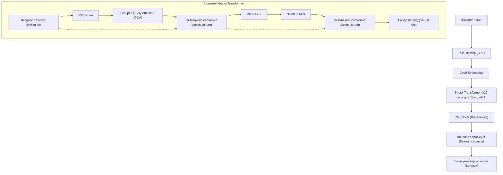
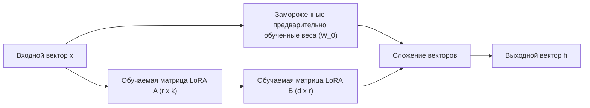
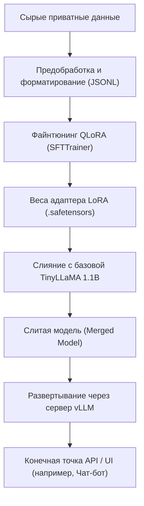

## 1. Введение: Почему именно сейчас TinyLLaMA и локальная среда?

Эволюция больших языковых моделей (LLM) идет с невероятной скоростью, и вместе с этим количество параметров моделей продолжает разрастаться до сотен миллиардов. Хотя сверхгигантские модели, такие как GPT-4 и Claude 3, обладают непревзойденной производительностью, вычислительные затраты на инференс и обучение, а также проблемы безопасности и конфиденциальности данных при использовании внешних API стали серьезным препятствием для бизнеса. В частности, при работе с высококонфиденциальными внутренними данными компании или личной информацией, отправка данных в публичные API LLM в облаке часто недопустима с точки зрения соблюдения нормативных требований (таких как GDPR, APPI и др.).

Именно поэтому в центре внимания оказались **малые языковые модели (SLM: Small Language Models)** и **локальная эксплуатация в on-premises среде**. Среди них «**TinyLLaMA**» при компактном размере всего 1.1B (1,1 миллиарда) параметров была предварительно обучена на огромном наборе данных объемом около 3 триллионов токенов, демонстрируя поразительную производительность по сравнению с моделями того же класса.

В этой статье мы представляем полное руководство по файнтюнингу (тонкой настройке) TinyLLaMA в локальной среде (на локальном сервере или рабочей станции) «максимально быстро и эффективно» для ваших собственных специализированных задач. Мы всесторонне рассмотрим всё: от математических основ до новейших технологий оптимизации и конкретного кода реализации на PyTorch.

---

## 2. Архитектура и особенности TinyLLaMA

TinyLLaMA следует архитектуре LLaMA (Large Language Model Meta AI), разработанной компанией Meta. При ограничении количества параметров до 1.1B она использует тот же технологический стек, что и LLaMA 2, что обеспечивает ей чрезвычайно высокую совместимость в экосистеме.

### Основные компоненты архитектуры

1. **RMSNorm (Root Mean Square Normalization):**
   Это метод нормализации, который опускает вычитание среднего значения из традиционного вычисления LayerNorm, тем самым повышая эффективность вычислений. Это увеличивает пропускную способность при сохранении стабильности обучения.
2. **Функция активации SwiGLU:**
   В сети прямого распространения (Feed Forward Network, FFN) вместо традиционных ReLU или GELU используется SwiGLU. Математически это выражается следующим образом:
   $$ \text{SwiGLU}(x, W, V) = \text{Swish}(xW) \otimes (xV) $$
   Здесь $\otimes$ обозначает поэлементное произведение (произведение Адамара), а функция Swish — это $\text{Swish}(z) = z \cdot \sigma(\beta z)$. Это значительно повышает выразительность.
3. **RoPE (Rotary Position Embedding):**
   Это метод, сочетающий преимущества абсолютного и относительного позиционного кодирования. Он обладает высокой обобщающей способностью даже при увеличении длины последовательности.
4. **Grouped Query Attention (GQA):**
   Это промежуточный подход между Multi-Head Attention (MHA) и Multi-Query Attention (MQA), который значительно увеличивает скорость инференса и экономит пропускную способность памяти за счет группировки голов ключей (key) и значений (value).

Следующая диаграмма Mermaid показывает общий поток данных TinyLLaMA и структуру блока Transformer.



---

## 3. Прорыв в файнтюнинге: LoRA и QLoRA

Для выполнения полного файнтюнинга параметров в локальной среде, даже для модели 1.1B, требуются десятки гигабайт видеопамяти (VRAM) для хранения состояний оптимизатора и градиентов. Для эффективного обучения с ограниченными ресурсами необходимы методы **PEFT (Parameter-Efficient Fine-Tuning)**, такие как «**LoRA**» и её квантованное расширение «**QLoRA**».

### 3.1 Математические основы LoRA (Low-Rank Adaptation)

LoRA — это метод, который фиксирует (замораживает) предварительно обученную матрицу весов и аппроксимирует обновление весов ($\Delta W$) как произведение двух небольших матриц низкого ранга.

Пусть предварительно обученные веса равны $W_0 \in \mathbb{R}^{d \times k}$. При полном файнтюнинге обновляется сама $W_0$ до $W_0 + \Delta W$, но в LoRA матрица обновлений $\Delta W$ разлагается следующим образом:

$$ \Delta W = B \times A $$

Здесь $B \in \mathbb{R}^{d \times r}$, $A \in \mathbb{R}^{r \times k}$, а $r$ — это гиперпараметр, называемый рангом (Rank), который является очень маленьким значением (обычно 8, 16, 32 и т.д.), удовлетворяющим условию $r \ll \min(d, k)$.

Вычисление прямого прохода выглядит следующим образом:

$$ h = W_0 x + \Delta W x = W_0 x + B A x $$

В начальном состоянии матрица $A$ инициализируется случайным образом с нормальным (гауссовым) распределением, а матрица $B$ инициализируется нулевой матрицей. В результате $\Delta W$ в начале обучения равна нулю, и мы можем начать обучение, полностью сохраняя выходные данные базовой модели.



### 3.2 Инновационность QLoRA (Quantized LoRA)

QLoRA развивает подход LoRA дальше, квантуя базовую модель $W_0$ с 4-битной точностью (NormalFloat 4, NF4) и загружая её в память. Это кардинально снижает потребление VRAM.

В QLoRA интегрированы три ключевые технологии:
1. **Квантование 4-bit NormalFloat (NF4):** Теоретически оптимальный тип данных, оптимизированный для весов, распределенных по нормальному закону.
2. **Двойное квантование (Double Quantization):** Квантование самих констант квантования (масштабных коэффициентов) для дополнительной экономии памяти.
3. **Paged Optimizers:** Механизм, использующий функцию объединенной памяти (unified memory) NVIDIA для временной выгрузки состояний оптимизатора в оперативную память CPU (RAM) при нехватке VRAM.

Благодаря этому тюнинг, который обычно требует от 16 до 24 ГБ VRAM, может быть легко выполнен даже на потребительских GPU (таких как RTX 3060 12GB или RTX 4070).

---

## 4. Требования к оборудованию и настройка в локальной среде

Требования к оборудованию для тюнинга TinyLLaMA (1.1B) с помощью QLoRA очень низки.

### Рекомендуемые характеристики оборудования
- **GPU:** NVIDIA RTX 3060 (12GB), RTX 3090/4090 (24GB) или NVIDIA A10G/A100 и т.д. Минимальный объем VRAM для работы — 8 ГБ, но для увеличения размера батча рекомендуется от 12 ГБ и выше.
- **CPU:** Современный процессор с 8 и более ядрами (Intel Core i7/i9, AMD Ryzen 7/9).
- **RAM:** Не менее 32 ГБ (важно при использовании Paged Optimizers как место для выгрузки из VRAM).
- **Накопитель:** NVMe SSD (для ускорения загрузки датасетов и сохранения модели).

### Настройка программной среды

Процедура настройки предполагается для среды Ubuntu 22.04 LTS. Мы будем использовать Python 3.10 или новее.

```bash
# Создание и активация виртуальной среды
python3 -m venv tinyllama_env
source tinyllama_env/bin/activate

# Установка PyTorch (для CUDA 12.1)
pip install torch torchvision torchaudio --index-url https://download.pytorch.org/whl/cu121

# Установка библиотек, связанных с трансформерами
pip install transformers datasets peft trl accelerate bitsandbytes
```

---

## 5. Методы оптимизации для самого быстрого тюнинга

Для завершения тюнинга «максимально быстро» недостаточно просто запустить скрипт, необходимо комбинировать следующие методы оптимизации.

### 5.1 Flash Attention 2
Стандартный механизм внимания (Attention) имеет временную и пространственную сложность $O(N^2)$ для длины последовательности $N$. Flash Attention 2 оптимизирует доступ к памяти между SRAM и HBM (High Bandwidth Memory) GPU, устраняя узкое место ввода-вывода (IO) без сокращения вычислений, что в разы увеличивает скорость обучения и кардинально снижает потребление памяти.

### 5.2 Gradient Checkpointing (Чекпойнтинг градиентов)
Это метод, при котором в VRAM сохраняются не все промежуточные активации, вычисленные при прямом проходе, а лишь некоторые из них; остальные пересчитываются при обратном проходе, когда это необходимо. Время вычислений увеличивается примерно на 20%, но потребление памяти значительно сокращается, что позволяет установить больший размер батча (batch size) и в итоге повысить общую пропускную способность.

### 5.3 Обучение со смешанной точностью (Mixed Precision Training) и Bfloat16
Для максимального использования тензорных ядер (Tensor Cores) GPU вычисления при обучении выполняются в `bfloat16` (Brain Floating Point). По сравнению с `float16` длина бита экспоненты у него такая же, как у `float32`, поэтому риск переполнения и потери значимости (overflow/underflow) крайне низок, что делает обучение стабильным.

---

## 6. Практика: Код файнтюнинга TinyLLaMA с помощью QLoRA

Теперь давайте разберем скрипт PyTorch для самого быстрого тюнинга, который включает в себя все вышеупомянутые оптимизации. Здесь мы будем использовать `SFTTrainer` из библиотеки Hugging Face `trl` (Transformer Reinforcement Learning).

### 6.1 Подготовка набора данных и загрузка модели

```python
import torch
from datasets import load_dataset
from transformers import (
    AutoModelForCausalLM,
    AutoTokenizer,
    BitsAndBytesConfig,
    TrainingArguments
)
from peft import LoraConfig, get_peft_model, prepare_model_for_kbit_training
from trl import SFTTrainer

# 1. Указание модели и токенизатора
model_id = "TinyLlama/TinyLlama-1.1B-Chat-v1.0"

# 2. Настройка 4-битного квантования для QLoRA
bnb_config = BitsAndBytesConfig(
    load_in_4bit=True,
    bnb_4bit_use_double_quant=True,
    bnb_4bit_quant_type="nf4",
    bnb_4bit_compute_dtype=torch.bfloat16 # Вычисления производятся в bfloat16
)

# 3. Загрузка модели (Включение Flash Attention 2)
print("Loading model...")
model = AutoModelForCausalLM.from_pretrained(
    model_id,
    quantization_config=bnb_config,
    device_map="auto",
    use_flash_attention_2=True # Ключ к максимальной скорости
)

# 4. Загрузка токенизатора
tokenizer = AutoTokenizer.from_pretrained(model_id, trust_remote_code=True)
tokenizer.pad_token = tokenizer.eos_token
tokenizer.padding_side = "right" # Устанавливаем right для предотвращения багов при обучении fp16/bf16
```

### 6.2 Применение адаптера LoRA и форматирование набора данных

```python
# 5. Подготовка к k-bit обучению и включение чекпойнтинга градиентов
model.gradient_checkpointing_enable()
model = prepare_model_for_kbit_training(model)

# 6. Настройка LoRA
peft_config = LoraConfig(
    r=16, # Ранг
    lora_alpha=32, # Масштабный коэффициент
    lora_dropout=0.05,
    bias="none",
    task_type="CAUSAL_LM",
    target_modules=["q_proj", "k_proj", "v_proj", "o_proj", "gate_proj", "up_proj", "down_proj"] # Ориентация на все линейные слои улучшает производительность
)

model = get_peft_model(model, peft_config)
model.print_trainable_parameters() 
# Пример вывода: trainable params: 14,286,848 || all params: 1,114,335,232 || trainable%: 1.282%

# 7. Загрузка набора данных (В качестве примера используется японский датасет инструкций)
# На практике здесь загружается локальный приватный JSONL файл и т.д.
dataset = load_dataset("kunishou/databricks-dolly-15k-ja", split="train")

def format_instruction(sample):
    """
    Форматирует строку в соответствии с форматом ChatML или шаблоном промпта
    """
    prompt = f"<|im_start|>user\n{sample['instruction']}"
    if sample.get("input", "") != "":
         prompt += f"\n{sample['input']}"
    prompt += f"<|im_end|>\n<|im_start|>assistant\n{sample['output']}<|im_end|>"
    return {"text": prompt}

dataset = dataset.map(format_instruction)
```

### 6.3 Выполнение обучения

```python
# 8. Настройка аргументов обучения
training_args = TrainingArguments(
    output_dir="./tinyllama-lora-output",
    per_device_train_batch_size=8, # Увеличьте, если есть свободная VRAM
    gradient_accumulation_steps=2, # Эффективный размер батча = 8 * 2 = 16
    optim="paged_adamw_32bit",     # Экономия VRAM с помощью Paged Optimizer
    save_steps=100,
    logging_steps=10,
    learning_rate=2e-4,
    fp16=False,
    bf16=True,                     # Обучение со смешанной точностью (bfloat16)
    max_grad_norm=0.3,
    max_steps=500,                 # 500 шагов для тестирования. В реальности указывайте количество эпох
    warmup_ratio=0.03,
    group_by_length=True,
    lr_scheduler_type="cosine",
)

# 9. Запуск обучения с помощью SFTTrainer
trainer = SFTTrainer(
    model=model,
    train_dataset=dataset,
    peft_config=peft_config,
    dataset_text_field="text",
    max_seq_length=1024, # Настройте в соответствии с ожидаемой длиной входа
    tokenizer=tokenizer,
    args=training_args,
)

print("Starting training...")
trainer.train()

# 10. Сохранение адаптера LoRA
trainer.model.save_pretrained("./tinyllama-lora-final")
tokenizer.save_pretrained("./tinyllama-lora-final")
print("Training complete and model saved.")
```

---

## 7. Оценка производительности и устранение неполадок

Вот частые проблемы и их решения при запуске обучения в локальной среде.

1. **Возникает ошибка OOM (Out Of Memory):**
   - Уменьшите `per_device_train_batch_size` до `1`.
   - Увеличьте `gradient_accumulation_steps`, чтобы сохранить эффективный размер батча.
   - Сократите `max_seq_length` с `2048` до `1024` или `512`.
2. **Loss (Потеря) не снижается или расходится:**
   - Возможно, скорость обучения (`learning_rate`) слишком высока. Попробуйте снизить её с `2e-4` до примерно `5e-5`.
   - Если используется Float16 вместо Bfloat16, возможно, происходит потеря значимости градиента (underflow). Проверьте наличие `bf16=True`.
3. **При инференсе генерируются непонятные символы:**
   - Убедитесь, что `padding_side="right"` настроен правильно. Также необходимо проверить, соответствует ли формат датасета (специальные токены вроде `<|im_start|>`) формату базовой модели при предварительном обучении.

---

## 8. Развертывание модели (Deployment) после тюнинга

После завершения тюнинга сохраняется не "вся базовая модель", а только "**адаптер LoRA (веса разницы)**" размером от нескольких до десятков мегабайт. Для быстрого инференса эти веса LoRA необходимо слить (merge) с исходной базовой моделью и экспортировать как единую модель.

### Скрипт слияния модели

```python
import torch
from peft import AutoPeftModelForCausalLM
from transformers import AutoTokenizer

output_dir = "./tinyllama-lora-final"

# Загрузка модели и адаптера в формате FP16/BF16
model = AutoPeftModelForCausalLM.from_pretrained(
    output_dir,
    device_map="auto",
    torch_dtype=torch.bfloat16
)
tokenizer = AutoTokenizer.from_pretrained(output_dir)

# Слияние и сохранение весов
merged_model = model.merge_and_unload()
merged_model.save_pretrained("./tinyllama-merged", safe_serialization=True)
tokenizer.save_pretrained("./tinyllama-merged")
print("Model merged and saved successfully!")
```

### Запуск сверхбыстрого сервера инференса с помощью vLLM

Для максимизации скорости инференса (токенов в секунду) при развертывании в локальной среде настоятельно рекомендуется использовать **vLLM** или **TGI (Text Generation Inference)** вместо стандартного `pipeline` от Hugging Face. vLLM использует технологию PagedAttention для предотвращения фрагментации памяти GPU и кардинально увеличивает пропускную способность при параллельных запросах.

Следующая диаграмма Mermaid показывает пайплайн от обучения до развертывания сервера инференса.



Запуск API-сервера с использованием vLLM выполняется всего одной командой:

```bash
python -m vllm.entrypoints.openai.api_server \
    --model ./tinyllama-merged \
    --host 0.0.0.0 \
    --port 8000 \
    --max-model-len 2048 \
    --dtype bfloat16
```
Теперь в вашей локальной среде развернута конечная точка, совместимая с OpenAI API, что позволяет безопасно и быстро использовать локальный ИИ.

---

## 9. Заключение

В этой статье мы рассмотрели методы максимально быстрого и экономичного с точки зрения памяти файнтюнинга в локальной среде легкой, но высокопроизводительной модели «TinyLLaMA» с 1.1B параметров.

- **LoRA / QLoRA** делают возможным полноценный тюнинг LLM даже на потребительских GPU.
- Использование **Flash Attention 2** и **Gradient Checkpointing** позволяет предельно оптимизировать время обучения и потребление VRAM.
- Развертывание с помощью **vLLM** обеспечивает высокую пропускную способность даже в рабочей (production) среде.

Эксплуатация локальной LLM в on-premises среде не только защищает конфиденциальность данных, но и становится мощнейшим инструментом для создания по низким затратам специализированного ИИ, адаптированного для конкретных областей (юриспруденция, медицина, внутренние правила компании и т.д.). Пожалуйста, используйте это руководство для создания вашей собственной специализированной версии TinyLLaMA.
