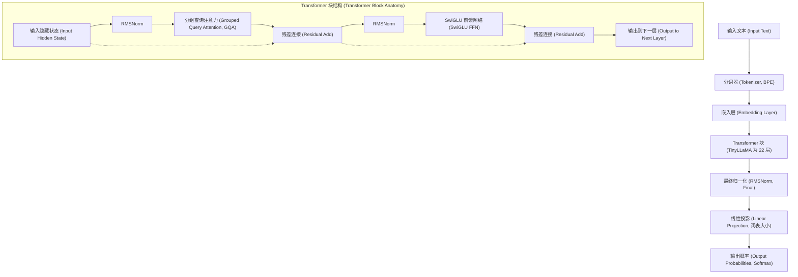
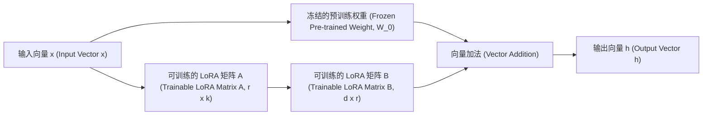
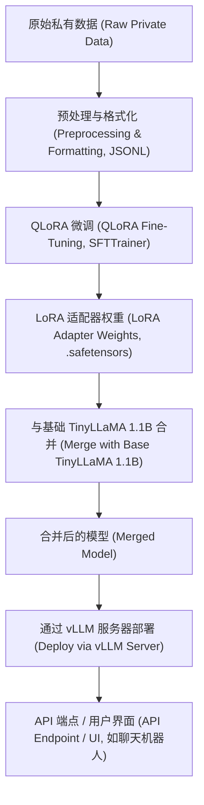

## 1. 引言：为什么现在选择 TinyLLaMA 和本地部署？

大型语言模型（LLM）的演进正以惊人的速度推进，随之而来的是模型参数量也持续膨胀至数千亿规模。虽然像 GPT-4 和 Claude 3 这样的超大型模型拥有无与伦比的性能，但推理和训练所需的计算成本，以及使用外部 API 时存在的安全和数据隐私隐患，成为了企业面临的巨大障碍。特别是在处理高机密性的内部数据或个人信息的业务中，从合规性（如 GDPR、APPI 等）的角度来看，将数据发送到云端公开的 LLM API 往往是不可接受的。

因此，备受瞩目的是**小型语言模型（SLM: Small Language Models）**以及**本地环境部署（On-Premises）**。其中，“**TinyLLaMA**”以仅 1.1B（11亿）参数的紧凑尺寸，却拥有在约 3 万亿 Token 的庞大数据集上预训练的底蕴，与同级别的模型相比，展现出惊人的性能。

本文将提供一份完整指南，教你如何在本地环境（本地服务器或工作站）中，针对公司专属任务，以“最快且最高效”的方式对 TinyLLaMA 进行微调（Fine-Tuning）。从数学背景到最新的优化技术，再到具体的 PyTorch 实现代码，我们将进行全面的讲解。

---

## 2. TinyLLaMA 的架构与特点

TinyLLaMA 沿用了 Meta 公司开发的 LLaMA（Large Language Model Meta AI）架构。在将参数量控制在 1.1B 的同时，使用了与 LLaMA 2 相同的技术栈，因此其生态系统兼容性极高。

### 主要架构组件

1. **RMSNorm (Root Mean Square Normalization):**
   省略了传统 LayerNorm 计算中减去均值的步骤，是一种提高了计算效率的归一化方法。它在保持训练稳定性的同时提升了吞吐量。
2. **SwiGLU 激活函数:**
   在前馈神经网络 (FFN) 中，采用了 SwiGLU 替代传统的 ReLU 或 GELU。其数学表达式如下：
   $$ \text{SwiGLU}(x, W, V) = \text{Swish}(xW) \otimes (xV) $$
   这里，$\otimes$ 表示逐元素乘积（Hadamard 积），Swish 函数为 $\text{Swish}(z) = z \cdot \sigma(\beta z)$。这大幅提升了模型的表达能力。
3. **RoPE (Rotary Position Embedding):**
   结合了绝对位置编码和相对位置编码优点的技术。即使在序列长度扩展时，也具有很高的泛化性能。
4. **Grouped Query Attention (GQA):**
   介于多头注意力 (MHA) 和多查询注意力 (MQA) 之间的一种方法，通过将键 (Key) 和值 (Value) 的注意力头进行分组，节省了内存带宽并显著提高了推理速度。

下面的 Mermaid 图展示了 TinyLLaMA 的整体数据流和 Transformer 块的结构。



---

## 3. 微调的突破口：LoRA 与 QLoRA

在本地环境中进行全参数微调，即使是 1.1B 的模型，为了保存优化器状态和梯度，也会消耗数十 GB 的 VRAM（显存）。为了在有限资源下高效地进行训练，必须使用 **PEFT (Parameter-Efficient Fine-Tuning, 参数高效微调)** 技术中的“**LoRA**”及其量化扩展版本“**QLoRA**”。

### 3.1 LoRA (Low-Rank Adaptation) 的数学背景

LoRA 是一种将预训练权重矩阵固定（冻结），并将其权重的更新量（$\Delta W$）近似为两个低秩小矩阵乘积的方法。

设预训练权重为 $W_0 \in \mathbb{R}^{d \times k}$。在全参数微调中，会直接更新 $W_0$ 得到 $W_0 + \Delta W$，而在 LoRA 中，更新矩阵 $\Delta W$ 被分解如下：

$$ \Delta W = B \times A $$

这里，$B \in \mathbb{R}^{d \times r}$，$A \in \mathbb{R}^{r \times k}$，而 $r$ 被称为秩 (Rank)，是一个超参数，它是一个非常小的值（通常为 8, 16, 32 等），满足 $r \ll \min(d, k)$。

前向传播的计算如下所示：

$$ h = W_0 x + \Delta W x = W_0 x + B A x $$

在初始状态下，矩阵 $A$ 会以正态分布（高斯分布）随机初始化，而矩阵 $B$ 则被初始化为零矩阵。因此，训练开始时的 $\Delta W$ 为零，这样就可以在完全保留基础模型输出的状态下开始训练。



### 3.2 QLoRA (Quantized LoRA) 的创新性

QLoRA 进一步推进了 LoRA 的方法，它将基础模型 $W_0$ 量化为 4-bit 精度（NormalFloat 4, NF4）加载到内存中。这极大地减少了 VRAM 的消耗。

QLoRA 融入了 3 项关键技术：
1. **4-bit NormalFloat (NF4) 量化:** 一种在理论上最优的数据类型，针对服从正态分布的权重进行了优化。
2. **Double Quantization (双重量化):** 对量化常数（缩放因子）本身再次进行量化，从而进一步节省内存。
3. **Paged Optimizers:** 利用 NVIDIA 的统一内存功能，在 VRAM 不足时，将优化器的状态暂时转移到 CPU 的 RAM 中。

通过这些技术，通常需要 16GB 到 24GB VRAM 的微调任务，现在即使在消费级显卡（如 RTX 3060 12GB 或 RTX 4070）上也能轻松运行。

---

## 4. 本地环境的硬件要求与环境搭建

使用 QLoRA 微调 TinyLLaMA (1.1B) 时的硬件要求可以控制得非常低。

### 推荐硬件配置
- **GPU:** NVIDIA RTX 3060 (12GB), RTX 3090/4090 (24GB), 或 NVIDIA A10G/A100 等。VRAM 最低 8GB 即可运行，但为了增大 Batch Size（批大小），推荐 12GB 以上。
- **CPU:** 8 核以上的现代 CPU（Intel Core i7/i9, AMD Ryzen 7/9）
- **RAM:** 32GB 以上（如果使用 Paged Optimizers，作为 VRAM 的退避空间非常重要）
- **存储:** NVMe SSD（为了加速数据集的读取和模型的保存）

### 软件环境搭建

以下是假设使用 Ubuntu 22.04 LTS 环境的搭建步骤。使用 Python 3.10 及以上版本。

```bash
# 创建并激活虚拟环境
python3 -m venv tinyllama_env
source tinyllama_env/bin/activate

# 安装 PyTorch (适用于 CUDA 12.1)
pip install torch torchvision torchaudio --index-url https://download.pytorch.org/whl/cu121

# 安装 Transformer 相关的库
pip install transformers datasets peft trl accelerate bitsandbytes
```

---

## 5. 实现最快微调的优化技术

仅仅运行脚本是不够的，为了“最快”地完成微调，需要结合以下优化方法。

### 5.1 Flash Attention 2
标准的注意力机制的时间和空间复杂度相对于序列长度 $N$ 呈 $O(N^2)$ 增长。Flash Attention 2 通过优化 GPU 的 SRAM 和 HBM（高带宽内存）之间的内存访问，在不减少计算量的情况下消除了 I/O 瓶颈，将训练速度提升数倍，并大幅降低了内存消耗。

### 5.2 Gradient Checkpointing (梯度检查点)
在前向传播计算出的中间激活值并不全部保存在 VRAM 中，而是仅保存一部分，在反向传播需要时再重新计算。虽然计算时间会增加约 20%，但可以大幅减少内存消耗，从而可以设置更大的 Batch Size，最终提升整体吞吐量。

### 5.3 Mixed Precision Training (混合精度训练) 与 Bfloat16
为了充分利用 GPU 的 Tensor Core，在训练时使用 `bfloat16` (Brain Floating Point) 进行计算。与 `float16` 相比，它的指数部分位数与 `float32` 相同，因此发生上溢或下溢的风险极低，训练过程更加稳定。

---

## 6. 实践：TinyLLaMA 的 QLoRA 微调代码

接下来，我们将讲解融合了上述所有优化技术的 PyTorch 脚本，以实现最快微调。这里使用 Hugging Face `trl` (Transformer Reinforcement Learning) 库中的 `SFTTrainer`。

### 6.1 准备数据集与加载模型

```python
import torch
from datasets import load_dataset
from transformers import (
    AutoModelForCausalLM,
    AutoTokenizer,
    BitsAndBytesConfig,
    TrainingArguments
)
from peft import LoraConfig, get_peft_model, prepare_model_for_kbit_training
from trl import SFTTrainer

# 1. 指定模型和分词器
model_id = "TinyLlama/TinyLlama-1.1B-Chat-v1.0"

# 2. QLoRA 的 4-bit 量化配置
bnb_config = BitsAndBytesConfig(
    load_in_4bit=True,
    bnb_4bit_use_double_quant=True,
    bnb_4bit_quant_type="nf4",
    bnb_4bit_compute_dtype=torch.bfloat16 # 使用 bfloat16 进行计算
)

# 3. 加载模型 (启用 Flash Attention 2)
print("Loading model...")
model = AutoModelForCausalLM.from_pretrained(
    model_id,
    quantization_config=bnb_config,
    device_map="auto",
    use_flash_attention_2=True # 实现最快速度的关键
)

# 4. 加载分词器
tokenizer = AutoTokenizer.from_pretrained(model_id, trust_remote_code=True)
tokenizer.pad_token = tokenizer.eos_token
tokenizer.padding_side = "right" # 设置为 right 以避免 fp16/bf16 训练时的 bug
```

### 6.2 应用 LoRA 适配器与格式化数据集

```python
# 5. 准备 k-bit 训练并启用梯度检查点
model.gradient_checkpointing_enable()
model = prepare_model_for_kbit_training(model)

# 6. LoRA 配置
peft_config = LoraConfig(
    r=16, # 秩
    lora_alpha=32, # 缩放因子
    lora_dropout=0.05,
    bias="none",
    task_type="CAUSAL_LM",
    target_modules=["q_proj", "k_proj", "v_proj", "o_proj", "gate_proj", "up_proj", "down_proj"] # 以所有 Linear 层为目标可以提升性能
)

model = get_peft_model(model, peft_config)
model.print_trainable_parameters() 
# 输出示例: trainable params: 14,286,848 || all params: 1,114,335,232 || trainable%: 1.282%

# 7. 加载数据集 (此处以日语 Instruction 数据集为例)
# 实际操作中可加载本地环境下的私有 JSONL 文件等
dataset = load_dataset("kunishou/databricks-dolly-15k-ja", split="train")

def format_instruction(sample):
    """
    根据 ChatML 格式或提示词模板对字符串进行格式化
    """
    prompt = f"<|im_start|>user\n{sample['instruction']}"
    if sample.get("input", "") != "":
         prompt += f"\n{sample['input']}"
    prompt += f"<|im_end|>\n<|im_start|>assistant\n{sample['output']}<|im_end|>"
    return {"text": prompt}

dataset = dataset.map(format_instruction)
```

### 6.3 执行训练

```python
# 8. 设置训练参数
training_args = TrainingArguments(
    output_dir="./tinyllama-lora-output",
    per_device_train_batch_size=8, # 如果 VRAM 充足可以调高
    gradient_accumulation_steps=2, # 实际 Batch Size = 8 * 2 = 16
    optim="paged_adamw_32bit",     # 使用 Paged Optimizer 节省 VRAM
    save_steps=100,
    logging_steps=10,
    learning_rate=2e-4,
    fp16=False,
    bf16=True,                     # 混合精度训练 (bfloat16)
    max_grad_norm=0.3,
    max_steps=500,                 # 用于测试的 500 步。正式训练时应指定 epoch 数
    warmup_ratio=0.03,
    group_by_length=True,
    lr_scheduler_type="cosine",
)

# 9. 使用 SFTTrainer 开始训练
trainer = SFTTrainer(
    model=model,
    train_dataset=dataset,
    peft_config=peft_config,
    dataset_text_field="text",
    max_seq_length=1024, # 根据预期的输入长度进行调整
    tokenizer=tokenizer,
    args=training_args,
)

print("Starting training...")
trainer.train()

# 10. 保存 LoRA 适配器
trainer.model.save_pretrained("./tinyllama-lora-final")
tokenizer.save_pretrained("./tinyllama-lora-final")
print("Training complete and model saved.")
```

---

## 7. 性能评估与故障排除

在本地环境中进行训练时，常遇到的问题及其解决方案如下：

1. **发生 OOM (Out Of Memory):**
   - 将 `per_device_train_batch_size` 降至 `1`。
   - 增加 `gradient_accumulation_steps` 以维持实际的 Batch Size。
   - 将 `max_seq_length` 从 `2048` 缩短至 `1024` 或 `512`。
2. **Loss 降不下来或发生发散:**
   - 学习率 (`learning_rate`) 可能设置过大。尝试将其从 `2e-4` 降低到 `5e-5` 左右。
   - 如果使用的是 Float16 而不是 Bfloat16，可能会发生梯度下溢。请确保设置了 `bf16=True`。
3. **推理时生成乱码字符:**
   - 请确认 `padding_side="right"` 是否设置正确。此外，还需检查数据集的格式（如 `<|im_start|>` 等特殊 Token）是否与基础模型预训练时保持一致。

---

## 8. 微调后的模型部署 (Deployment)

微调完成后，保存的并不是“整个基础模型”，而是仅有几 MB 到几十 MB 的“**LoRA 适配器（权重差值）**”。为了能够高速地进行推理，需要将这个 LoRA 权重与原始的基础模型合并，并导出为一个单一的模型。

### 模型合并脚本

```python
import torch
from peft import AutoPeftModelForCausalLM
from transformers import AutoTokenizer

output_dir = "./tinyllama-lora-final"

# 以 FP16/BF16 精度加载模型和适配器
model = AutoPeftModelForCausalLM.from_pretrained(
    output_dir,
    device_map="auto",
    torch_dtype=torch.bfloat16
)
tokenizer = AutoTokenizer.from_pretrained(output_dir)

# 合并权重并保存
merged_model = model.merge_and_unload()
merged_model.save_pretrained("./tinyllama-merged", safe_serialization=True)
tokenizer.save_pretrained("./tinyllama-merged")
print("Model merged and saved successfully!")
```

### 使用 vLLM 启动极速推理服务器

在本地环境中进行部署时，为了最大化推理速度（Tokens per second），强烈建议不使用 Hugging Face 标准的 `pipeline`，而是使用 **vLLM** 或 **TGI (Text Generation Inference)**。vLLM 采用了 PagedAttention 技术，可防止 GPU 内存碎片化，从而大幅提升并发请求的处理能力。

下面的 Mermaid 图展示了从训练到部署推理服务器的流程。



使用 vLLM 启动 API 服务器只需以下一条命令即可完成。

```bash
python -m vllm.entrypoints.openai.api_server \
    --model ./tinyllama-merged \
    --host 0.0.0.0 \
    --port 8000 \
    --max-model-len 2048 \
    --dtype bfloat16
```
这样一来，就能够在本地环境中构建一个兼容 OpenAI API 的端点，让你能够安全且高速地利用本地 AI。

---

## 9. 总结

本文以参数量仅 1.1B 但性能强悍的“TinyLLaMA”为对象，详细解说了在本地环境中最快且内存高效地进行微调的方法。

- 借助 **LoRA / QLoRA**，即使在消费级 GPU 上也能进行正式的 LLM 微调。
- 充分利用 **Flash Attention 2** 和 **Gradient Checkpointing**，将训练时间和 VRAM 消耗优化到极致。
- 通过使用 **vLLM** 进行部署，在生产环境中也能实现高吞吐量。

在本地运行本地 LLM，不仅能保护数据的机密性，更是低成本构建特定领域（如法务、医疗、公司章程等）专用 AI 的最强武器。希望你能以此指南为参考，培养出专属于你公司的 TinyLLaMA。
