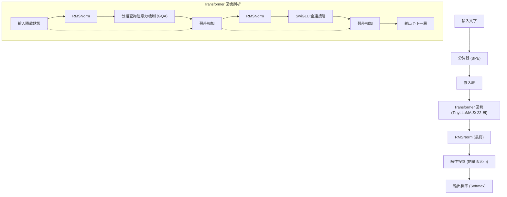
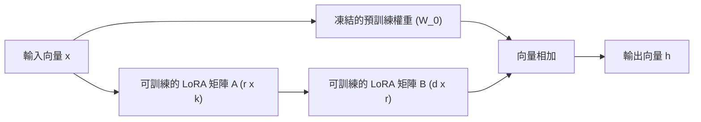
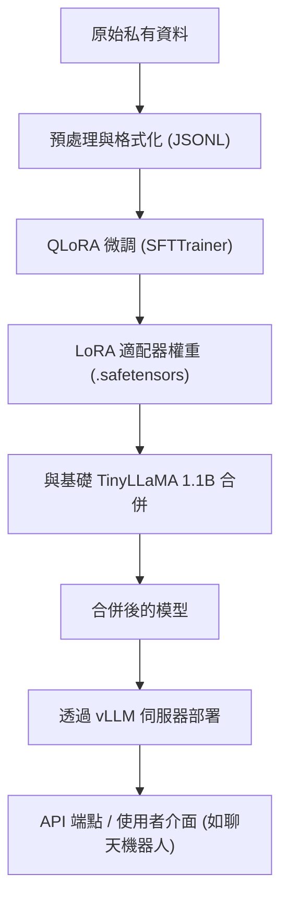

## 1. 前言：為什麼現在要選擇 TinyLLaMA 與本地部署？

大型語言模型 (LLM) 的進化正以驚人的速度發展，隨之而來的是模型參數數量也持續膨脹至數千億規模。儘管 GPT-4 或 Claude 3 這樣超巨大的模型擁有無與倫比的效能，但對於企業而言，推論和訓練所需的運算成本，以及使用外部 API 時對安全性與資料隱私的擔憂，已成為巨大的障礙。特別是在處理高度機密的內部資料或個人資訊的業務中，基於合規性（如 GDPR 或 APPI 等）的考量，將資料傳送至雲端上的公開 LLM API 往往是不被允許的。

因此，**小型語言模型 (SLM: Small Language Models)** 與**在本地環境中進行區域網路運作**正逐漸受到矚目。其中，「**TinyLLaMA**」雖然僅有 1.1B（11 億）參數的精簡大小，卻使用了約 3 兆個 Token 的龐大資料集進行預訓練，與同級別的模型相比，展現出驚人的效能。

本文將提供一份完整指南，教您如何在本地環境（本地伺服器或工作站）中，針對公司專屬任務「最快且高效」地對 TinyLLaMA 進行微調 (Fine-Tuning)。從數學背景到最新的最佳化技術，再到具體的 PyTorch 實作程式碼，我們將進行全面性的解說。

---

## 2. TinyLLaMA 的架構與特徵

TinyLLaMA 沿用了 Meta 公司開發的 LLaMA (Large Language Model Meta AI) 架構。在將參數數量控制在 1.1B 的同時，因為使用了與 LLaMA 2 相同的技術堆疊，其特徵在於生態系統的相容性非常高。

### 主要架構元件

1. **RMSNorm (Root Mean Square Normalization):**
   省略了傳統 LayerNorm 計算中減去平均值的步驟，是一種提升了計算效率的正規化方法。在保持訓練穩定性的同時提升了吞吐量。
2. **SwiGLU 激勵函數:**
   在全連接層 (Feed Forward Network, FFN) 中，採用了 SwiGLU 來取代傳統的 ReLU 或 GELU。這在數學上可表示如下：
   $$ \text{SwiGLU}(x, W, V) = \text{Swish}(xW) \otimes (xV) $$
   此處，$\otimes$ 表示逐元素乘積（Hadamard 乘積），而 Swish 函數為 $\text{Swish}(z) = z \cdot \sigma(\beta z)$。這大幅提升了模型的表達能力。
3. **RoPE (Rotary Position Embedding):**
   結合了絕對位置編碼與相對位置編碼優點的方法。在序列長度擴展時，也具備高度的泛化能力。
4. **Grouped Query Attention (GQA):**
   介於多頭注意力機制 (Multi-Head Attention, MHA) 與多查詢注意力機制 (Multi-Query Attention, MQA) 之間的方法，透過將 Key 和 Value 的注意力頭進行分組，節省了記憶體頻寬，並顯著提升了推論速度。

以下的 Mermaid 圖表展示了 TinyLLaMA 的整體資料流與 Transformer 區塊的結構。



---

## 3. 微調的突破：LoRA 與 QLoRA

在本地環境中進行全參數微調，即使是 1.1B 的模型，為了保存最佳化器的狀態與梯度，也會消耗數十 GB 的 VRAM（視訊記憶體）。為了在有限的資源下有效率地進行訓練，必須使用的是 **PEFT (Parameter-Efficient Fine-Tuning)** 方法中的「**LoRA**」以及其量化擴展「**QLoRA**」。

### 3.1 LoRA (Low-Rank Adaptation) 的數學背景

LoRA 是一種將預訓練好的權重矩陣固定（凍結），並將其權重更新量（$\Delta W$）近似為兩個低秩小矩陣相乘的方法。

假設預訓練的權重為 $W_0 \in \mathbb{R}^{d \times k}$。在全參數微調中，會直接更新 $W_0$ 使其成為 $W_0 + \Delta W$，但在 LoRA 中，會將更新矩陣 $\Delta W$ 分解如下：

$$ \Delta W = B \times A $$

在此，$B \in \mathbb{R}^{d \times r}$，$A \in \mathbb{R}^{r \times k}$，而 $r$ 是稱為秩 (Rank) 的超參數，為一個滿足 $r \ll \min(d, k)$ 的極小值（通常是 8、16、32 等）。

前向傳播的計算如下所示：

$$ h = W_0 x + \Delta W x = W_0 x + B A x $$

在初始狀態下，矩陣 $A$ 會以常態分佈（高斯分佈）進行隨機初始化，而矩陣 $B$ 則會以零矩陣初始化。這樣一來，訓練開始時的 $\Delta W$ 將為零，可以從完全保留基礎模型輸出的狀態開始訓練。



### 3.2 QLoRA (Quantized LoRA) 的創新性

QLoRA 進一步推廣了 LoRA 的方法，將基礎模型 $W_0$ 以 4-bit 精度（NormalFloat 4, NF4）進行量化後再載入記憶體。這大幅降低了 VRAM 的消耗量。

QLoRA 整合了三個關鍵技術：
1. **4-bit NormalFloat (NF4) 量化:** 針對服從常態分佈的權重所最佳化，為理論上最佳的資料型態。
2. **Double Quantization (雙重量化):** 透過將量化常數（縮放因子）本身也進行量化，進一步節省記憶體。
3. **Paged Optimizers:** 利用 NVIDIA 的統一記憶體功能，當 VRAM 不足時，將最佳化器的狀態暫時轉移至 CPU 的 RAM 上的機制。

藉此，通常需要 16GB 至 24GB VRAM 的微調，現在即使是在消費級 GPU（如 RTX 3060 12GB 或 RTX 4070 等）上也能游刃有餘地執行。

---

## 4. 本地環境的硬體需求與設定

在使用 QLoRA 對 TinyLLaMA (1.1B) 進行微調時，硬體需求可以降得非常低。

### 推薦硬體規格
- **GPU:** NVIDIA RTX 3060 (12GB), RTX 3090/4090 (24GB), 或 NVIDIA A10G/A100 等。VRAM 最低只需 8GB 即可運作，但為了增加批次大小，建議至少 12GB 以上。
- **CPU:** 8 核心以上的現代 CPU (Intel Core i7/i9, AMD Ryzen 7/9)
- **RAM:** 32GB 以上（當使用 Paged Optimizers 時，作為 VRAM 的備用儲存空間非常重要）
- **儲存空間:** NVMe SSD（為了加速資料集讀取與模型儲存）

### 軟體環境建置

以下為假設使用 Ubuntu 22.04 LTS 環境的設定步驟。請使用 Python 3.10 或更新版本。

```bash
# 建立並啟動虛擬環境
python3 -m venv tinyllama_env
source tinyllama_env/bin/activate

# 安裝 PyTorch (適用於 CUDA 12.1)
pip install torch torchvision torchaudio --index-url https://download.pytorch.org/whl/cu121

# 安裝 Transformer 相關函式庫
pip install transformers datasets peft trl accelerate bitsandbytes
```

---

## 5. 為了最快微調的最佳化技術

為了不只是執行腳本，而是「最快」完成微調，必須結合以下最佳化方法。

### 5.1 Flash Attention 2
標準的注意力機制對於序列長度 $N$ 來說，時間與空間複雜度為 $O(N^2)$。Flash Attention 2 透過最佳化 GPU 的 SRAM 與 HBM (High Bandwidth Memory) 之間的記憶體存取，在不增加計算量的情況下解決了 IO 瓶頸，將訓練速度提升了數倍，並大幅減少了記憶體消耗。

### 5.2 Gradient Checkpointing (梯度檢查點)
這是一種不將前向傳播中計算的所有中間激活值儲存在 VRAM 中，而是僅儲存一部分，並在反向傳播需要時重新計算的方法。雖然計算時間會增加約 20%，但可以大幅減少記憶體消耗量，進而可以設定更大的批次大小，最終提升整體的吞吐量。

### 5.3 Mixed Precision Training (混合精度訓練) 與 Bfloat16
為了最大化利用 GPU 的 Tensor Core，在訓練時的計算使用 `bfloat16` (Brain Floating Point)。與 `float16` 相比，由於其指數部的位元長度與 `float32` 相同，發生上溢 (Overflow) 或下溢 (Underflow) 的風險極低，訓練會更加穩定。

---

## 6. 實作：TinyLLaMA 的 QLoRA 微調程式碼

接下來，我們將解說包含了上述所有最佳化的最快微調 PyTorch 腳本。在這裡，我們將使用 Hugging Face 的 `trl` (Transformer Reinforcement Learning) 函式庫中的 `SFTTrainer`。

### 6.1 資料集準備與模型載入

```python
import torch
from datasets import load_dataset
from transformers import (
    AutoModelForCausalLM,
    AutoTokenizer,
    BitsAndBytesConfig,
    TrainingArguments
)
from peft import LoraConfig, get_peft_model, prepare_model_for_kbit_training
from trl import SFTTrainer

# 1. 指定模型與分詞器
model_id = "TinyLlama/TinyLlama-1.1B-Chat-v1.0"

# 2. QLoRA 用的 4-bit 量化設定
bnb_config = BitsAndBytesConfig(
    load_in_4bit=True,
    bnb_4bit_use_double_quant=True,
    bnb_4bit_quant_type="nf4",
    bnb_4bit_compute_dtype=torch.bfloat16 # 使用 bfloat16 進行計算
)

# 3. 載入模型 (啟用 Flash Attention 2)
print("Loading model...")
model = AutoModelForCausalLM.from_pretrained(
    model_id,
    quantization_config=bnb_config,
    device_map="auto",
    use_flash_attention_2=True # 最快化的關鍵
)

# 4. 載入分詞器
tokenizer = AutoTokenizer.from_pretrained(model_id, trust_remote_code=True)
tokenizer.pad_token = tokenizer.eos_token
tokenizer.padding_side = "right" # 為了避免 fp16/bf16 訓練時的錯誤，設定為 right
```

### 6.2 套用 LoRA 適配器與資料集格式化

```python
# 5. k-bit 訓練的準備與啟用梯度檢查點
model.gradient_checkpointing_enable()
model = prepare_model_for_kbit_training(model)

# 6. LoRA 的設定
peft_config = LoraConfig(
    r=16, # 秩
    lora_alpha=32, # 縮放因子
    lora_dropout=0.05,
    bias="none",
    task_type="CAUSAL_LM",
    target_modules=["q_proj", "k_proj", "v_proj", "o_proj", "gate_proj", "up_proj", "down_proj"] # 將所有 Linear 層設為目標可提升效能
)

model = get_peft_model(model, peft_config)
model.print_trainable_parameters() 
# 輸出範例: trainable params: 14,286,848 || all params: 1,114,335,232 || trainable%: 1.282%

# 7. 載入資料集 (此處以日文 Instruction 資料集為例)
# 實際上會載入本地環境中的私有 JSONL 檔案等
dataset = load_dataset("kunishou/databricks-dolly-15k-ja", split="train")

def format_instruction(sample):
    """
    配合 ChatML 格式或提示詞模板來格式化字串
    """
    prompt = f"<|im_start|>user\n{sample['instruction']}"
    if sample.get("input", "") != "":
         prompt += f"\n{sample['input']}"
    prompt += f"<|im_end|>\n<|im_start|>assistant\n{sample['output']}<|im_end|>"
    return {"text": prompt}

dataset = dataset.map(format_instruction)
```

### 6.3 執行訓練

```python
# 8. 設定訓練參數
training_args = TrainingArguments(
    output_dir="./tinyllama-lora-output",
    per_device_train_batch_size=8, # 若 VRAM 充裕可再調高
    gradient_accumulation_steps=2, # 實質上的批次大小 = 8 * 2 = 16
    optim="paged_adamw_32bit",     # 透過 Paged Optimizer 節省 VRAM
    save_steps=100,
    logging_steps=10,
    learning_rate=2e-4,
    fp16=False,
    bf16=True,                     # 混合精度訓練 (bfloat16)
    max_grad_norm=0.3,
    max_steps=500,                 # 測試用的 500 步。正式上線請改用 epoch 數指定
    warmup_ratio=0.03,
    group_by_length=True,
    lr_scheduler_type="cosine",
)

# 9. 透過 SFTTrainer 開始訓練
trainer = SFTTrainer(
    model=model,
    train_dataset=dataset,
    peft_config=peft_config,
    dataset_text_field="text",
    max_seq_length=1024, # 配合預期的輸入長度進行調整
    tokenizer=tokenizer,
    args=training_args,
)

print("Starting training...")
trainer.train()

# 10. 儲存 LoRA 適配器
trainer.model.save_pretrained("./tinyllama-lora-final")
tokenizer.save_pretrained("./tinyllama-lora-final")
print("Training complete and model saved.")
```

---

## 7. 效能評估與疑難排解

在本地環境執行訓練時，經常遇到的問題與解決方案。

1. **發生 OOM (Out Of Memory):**
   - 將 `per_device_train_batch_size` 降至 `1`。
   - 增加 `gradient_accumulation_steps` 以維持實質批次大小。
   - 將 `max_seq_length` 從 `2048` 縮短至 `1024` 或 `512`。
2. **Loss 無法下降或發散:**
   - 學習率 (`learning_rate`) 可能設定過高。請試著從 `2e-4` 降到 `5e-5` 左右。
   - 若使用的是 Float16 而非 Bfloat16，可能發生了梯度下溢。請確認是否設定了 `bf16=True`。
3. **推論時產生奇怪的字串:**
   - 請確認 `padding_side="right"` 是否設定正確。另外，必須確認資料集的格式（如 `<|im_start|>` 等特殊 Token）是否與基礎模型在預訓練時一致。

---

## 8. 微調後的模型部署 (Deployment)

微調完成後，儲存的並非「整個基礎模型」，而是僅有數 MB 至數十 MB 的「**LoRA 適配器（差異權重）**」。為了能高速進行推論，必須將此 LoRA 權重合併（整合）至原始的基礎模型中，並匯出為單一模型。

### 模型合併腳本

```python
import torch
from peft import AutoPeftModelForCausalLM
from transformers import AutoTokenizer

output_dir = "./tinyllama-lora-final"

# 以 FP16/BF16 載入模型與適配器
model = AutoPeftModelForCausalLM.from_pretrained(
    output_dir,
    device_map="auto",
    torch_dtype=torch.bfloat16
)
tokenizer = AutoTokenizer.from_pretrained(output_dir)

# 合併權重並儲存
merged_model = model.merge_and_unload()
merged_model.save_pretrained("./tinyllama-merged", safe_serialization=True)
tokenizer.save_pretrained("./tinyllama-merged")
print("Model merged and saved successfully!")
```

### 透過 vLLM 啟動極速推論伺服器

在本地環境部署時，為了將推論速度 (Tokens per second) 最大化，強烈建議使用 **vLLM** 或 **TGI (Text Generation Inference)**，而不是 Hugging Face 標準的 `pipeline`。vLLM 使用了 PagedAttention 技術，可防止 GPU 記憶體碎片化，並大幅提升平行請求的處理能力。

以下的 Mermaid 圖表展示了從訓練到部署推論伺服器的管線 (Pipeline)。



使用 vLLM 啟動 API 伺服器只需以下 1 行指令即可完成。

```bash
python -m vllm.entrypoints.openai.api_server \
    --model ./tinyllama-merged \
    --host 0.0.0.0 \
    --port 8000 \
    --max-model-len 2048 \
    --dtype bfloat16
```
如此一來，便能在本地環境中建構與 OpenAI API 相容的端點，讓您能安全且高速地運用本地 AI。

---

## 9. 總結

本文針對參數數量僅有 1.1B、輕量卻擁有高效能的「TinyLLaMA」，解說了如何在本地環境中最快且最高效利用記憶體來進行微調的方法。

- 透過 **LoRA / QLoRA**，即使在消費級 GPU 也能進行正式的 LLM 微調。
- 靈活運用 **Flash Attention 2** 與 **Gradient Checkpointing**，將訓練時間與 VRAM 消耗最佳化至極限。
- 透過活用 **vLLM** 進行部署，在正式環境中也能實現高吞吐量。

在本地運作的 Local LLM，不僅能保護資料的機密性，更是能以低成本建構專注於特定領域（法務、醫療、公司內部規定等）之專業 AI 的最強武器。請務必參考本指南，試著培育出專屬於貴公司的 TinyLLaMA 吧。
