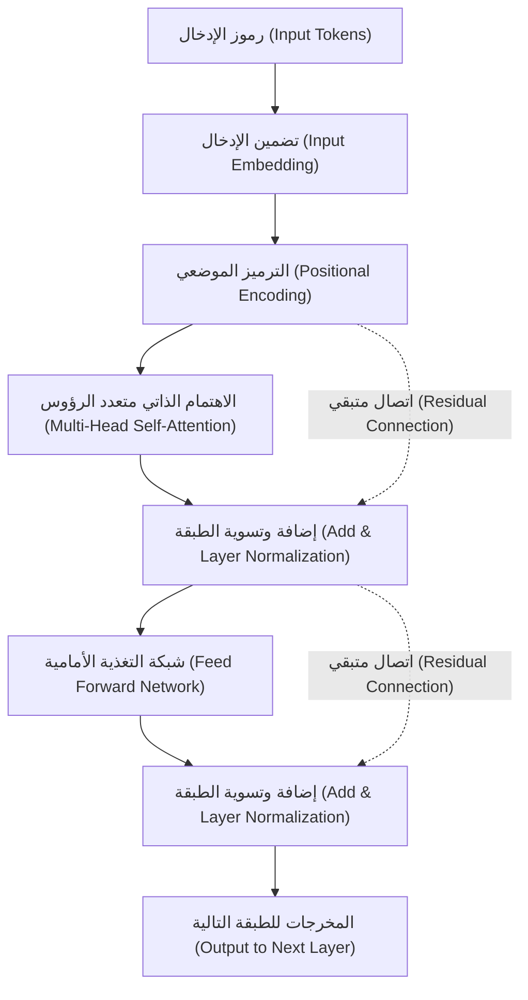
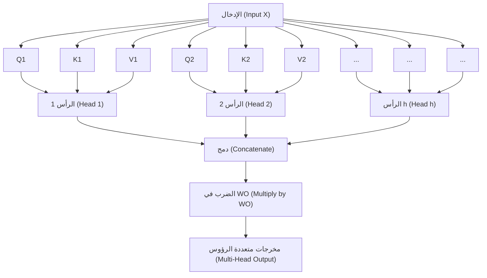

# مقدمة: لماذا نتعلم رياضيات الـ Transformer؟

يمكن القول دون مبالغة أن "Transformer" هي البنية التي أعادت كتابة تاريخ معالجة اللغات الطبيعية (NLP) والذكاء الاصطناعي بشكل عام في العصر الحديث. تم اقتراح هذا النموذج لأول مرة في ورقة بحثية بعنوان "Attention Is All You Need" نُشرت من قبل باحثين في Google عام 2017، ويعمل كقلب نابض للنماذج اللغوية الكبيرة (LLMs) التي تجتاح العالم اليوم، مثل سلسلة GPT من OpenAI (التقنية الأساسية لـ ChatGPT)، و BERT من Google، و Claude من Anthropic.

ومع ذلك، في حين نرى غالباً تفسيرات نوعية لآلية عمل Transformer مثل "فهم السياق باستخدام Attention (آلية الانتباه)"، إلا أن التفسيرات التي تتعمق في **البنية الرياضية** الكامنة وراءها للمبتدئين قليلة بشكل مفاجئ. لفهم كيف يقوم الذكاء الاصطناعي بمعالجة "الكلمات" كـ "معادلات رياضية" وتوليد نصوص طبيعية بشكل مذهل حقاً، من الضروري فك تشفير آليته الرياضية.

في هذا المقال، سنقوم بشرح البنية الرياضية لقلب الـ Transformer بشكل شامل ومبسط، مثل "آلية الاهتمام الذاتي (Self-Attention)"، ونموذج "الاستعلام والمفتاح والقيمة (Q/K/V)"، و"التسوية باستخدام دالة Softmax"، و"الترميز الموضعي (Positional Encoding)"، وذلك للأشخاص الذين لديهم معرفة أساسية بالرياضيات والبرمجة (أولئك الذين يفهمون مفاهيم المصفوفات والتفاضل على مستوى المرحلة الثانوية).

قد تشعر بالإرهاق من سرد المعادلات الرياضية، ولكن لكل عملية حسابية "معنى" واضح. بحلول الوقت الذي تنتهي فيه من قراءة هذا المقال، يجب أن تكون قادراً على فهم أن الـ Transformer ليس مجرد صندوق أسود سحري، بل هو تبلور لرياضيات وإحصاءات مصممة بدقة.

---

# 1. حدود الطرق التقليدية وابتكار الـ Transformer

قبل ظهور Transformer، كان الاتجاه السائد في معالجة اللغات الطبيعية هو الشبكات العصبية المتكررة (RNN) ومشتقاتها مثل LSTM (الذاكرة الطويلة قصيرة المدى). تم تصميم RNN لمعالجة بيانات السلاسل الزمنية، وتقوم بقراءة الجمل كلمة بكلمة بالترتيب من البداية.

ومع ذلك، كان لدى RNN نقطتي ضعف قاتلتين:
1. **صعوبة تعلم التبعيات طويلة المدى**: عندما تصبح الجملة طويلة، تتلاشى معلومات الكلمات المدخلة في البداية بحلول الوقت الذي تصل فيه إلى النهاية (مشكلة تلاشي التدرج).
2. **استحالة الحوسبة المتوازية**: نظراً لأنه يجب معالجة الكلمات بالترتيب، فإن الحوسبة المتوازية واسعة النطاق باستخدام وحدات معالجة الرسومات (GPU) تكون صعبة، ويستغرق التدريب وقتاً هائلاً.

تخلى الـ Transformer تماماً عن بنية الـ RNN وأحدث نقلة نوعية من خلال التقاط السياق باستخدام "الاهتمام (Attention)" فقط. بفضل هذا، لم يعد هناك فقدان للمعلومات بغض النظر عن طول السلسلة، وأصبح من الممكن موازنة العمليات الحسابية لتحقيق أقصى استفادة من أداء وحدات معالجة الرسومات.

---

# 2. البنية العامة لـ Transformer

أولاً، دعونا نلقي نظرة عامة على البنية الكلية لـ Transformer. يتكون Transformer بشكل أساسي من كتلتين: "المشفر (Encoder)" و"فك التشفير (Decoder)". بأخذ مهمة الترجمة كمثال، يقوم المشفر بتحويل لغة الإدخال (مثال: الإنجليزية) إلى تمثيلات متجهة رياضية، ويقوم فك التشفير بتوليد لغة الإخراج (مثال: اليابانية) بناءً على تلك التمثيلات المتجهة.

يوضح الشكل أدناه بنية مبسطة لكتلة المشفر من الداخل.



من هنا، دعونا نتبع العمليات الرياضية التي تتم في كل مكون خطوة بخطوة.

---

# 3. توجيه الكلمات والترميز الموضعي (Positional Encoding)

لا تستطيع أجهزة الكمبيوتر فهم النصوص كما هي. يتم أولاً تقسيم النص المدخل إلى وحدات تسمى "الرموز (Tokens)"، ويتم تحويل كل منها إلى متجه ذي طول ثابت. هذا هو **تضمين الإدخال (Input Embedding)**.

## 3.1 رياضيات تضمين الإدخال
بفرض أن حجم المفردات هو $V$، وعدد أبعاد متجه التضمين هو $d_{model}$ (في الورقة البحثية الأصلية $d_{model} = 512$). يتم تحويل كل كلمة $w_i$ إلى متجه $x_i \in \mathbb{R}^{d_{model}}$ باستخدام مصفوفة التضمين $W_E \in \mathbb{R}^{V \times d_{model}}$.

$$ x_i = W_E \cdot \text{one\_hot}(w_i) $$

بهذا، يتم التعبير عن الجملة بأكملها كمصفوفة $X \in \mathbb{R}^{N \times d_{model}}$ (حيث $N$ هو طول الجملة).

## 3.2 الحاجة للترميز الموضعي (Positional Encoding) ومعادلاته
لا يقوم Transformer بمعالجة الكلمات بشكل متسلسل مثل RNN، بل يقوم بمعالجة جميع الكلمات في وقت واحد بشكل متوازٍ. يُعد هذا ميزة كبيرة من حيث سرعة الحساب، ولكنه في الوقت نفسه يتسبب في مشكلة **فقدان المعلومات الهامة المتعلقة بـ "ترتيب الكلمات (سياق الكلام)"**. على سبيل المثال، "الكلب يعض الرجل" و"الرجل يعض الكلب" لهما نفس مجموعة الكلمات المدخلة ولكن معانيهما مختلفة تماماً.

لإعطاء النموذج معلومات ترتيب الكلمات، تم ابتكار **الترميز الموضعي (Positional Encoding)**.
يتم حساب الترميز الموضعي $PE$ للبعد $i$ للكلمة الموجودة في الموضع $pos$ باستخدام الدوال المثلثية التالية.

$$ PE_{(pos, 2i)} = \sin\left(\frac{pos}{10000^{2i/d_{model}}}\right) $$
$$ PE_{(pos, 2i+1)} = \cos\left(\frac{pos}{10000^{2i/d_{model}}}\right) $$

هنا، $pos$ هو موضع الكلمة ($0, 1, 2, \dots, N-1$)، و $i$ هو مؤشر أبعاد المتجه ($0, 1, \dots, d_{model}/2 - 1$).

### لماذا نستخدم الجيب (Sine) وجيب التمام (Cosine)؟
للوهلة الأولى، تبدو معادلة معقدة وغريبة جداً، ولكن هناك أسباب رياضية عميقة لذلك. باستخدام الدوال المثلثية، يصبح من السهل على النموذج تعلم الفروق في **"المواضع النسبية" وليس فقط "المواضع المطلقة"**.

تذكر نظرية الجمع للدوال المثلثية التي تُدرّس في رياضيات المرحلة الثانوية.
$$ \sin(\alpha + \beta) = \sin\alpha \cos\beta + \cos\alpha \sin\beta $$
$$ \cos(\alpha + \beta) = \cos\alpha \cos\beta - \sin\alpha \sin\beta $$

يمكن التعبير عن الترميز الموضعي للموضع $pos + k$ الذي يبعد عن موضع معين $pos$ بمقدار $k$ كتركيبة خطية للترميز الموضعي للموضع $pos$. أي باستخدام المصفوفة $M_k$، يمكن كتابته على النحو التالي.

$$ PE_{pos+k} = M_k \cdot PE_{pos} $$

بفضل هذا، يمكن لآلية الانتباه التعرف بسهولة على المسافة النسبية أو "مدى تباعد الكلمات عن بعضها" من خلال حساب الضرب النقطي. بالإضافة إلى ذلك، من خلال الجمع بين موجات جيب وجيب تمام متعددة ذات أطوال موجية مختلفة، هناك ميزة تتمثل في القدرة على توليد متجه موضع فريد بغض النظر عن طول الجملة.

مصفوفة الإدخال النهائية $X_{input}$ هي مجموع متجهات تضمين الكلمات مع الترميز الموضعي.

$$ X_{input} = X + PE $$

---

# 4. الرياضيات العميقة لآلية الاهتمام الذاتي (Self-Attention)

أخيراً، ندخل في أهم مكون لـ Transformer وهو **الاهتمام الذاتي (Self-Attention)**. الهدف من الاهتمام الذاتي هو "حساب درجة الارتباط بين جميع الكلمات في الجملة، وتحديث متجه كل كلمة إلى تمثيل أكثر ثراءً يأخذ السياق في الاعتبار".

هنا يتم استخدام تشبيه "نظام البحث".
- **الاستعلام (Query - Q)**: كلمة البحث. "ما هي المعلومات التي أبحث عنها الآن؟"
- **المفتاح (Key - K)**: العنوان. "ما هي المعلومات التي أمتلكها؟"
- **القيمة (Value - V)**: الكيان الفعلي. "ما هي المعلومات التي أقدمها بالفعل؟"

## 4.1 توليد المصفوفات $Q, K, V$
لمصفوفة الإدخال $X \in \mathbb{R}^{N \times d_{model}}$ (نتجاهل هنا حجم الدفعة لتبسيط الأمر)، نقوم بحساب الاستعلام $Q$ والمفتاح $K$ والقيمة $V$ عن طريق ضربها في مصفوفات الأوزان القابلة للتعلم $W^Q, W^K, W^V \in \mathbb{R}^{d_{model} \times d_k}$. (عادةً $d_k = d_v = d_{model} / h$)

$$ Q = X W^Q $$
$$ K = X W^K $$
$$ V = X W^V $$

هنا، تكون المصفوفات $Q, K, V$ جميعها مصفوفات بأبعاد $\mathbb{R}^{N \times d_k}$.

## 4.2 حساب درجة الانتباه (الضرب النقطي)
لقياس مدى ارتباط الاستعلام لكل كلمة بمفاتيح جميع الكلمات الأخرى، نحسب **الضرب النقطي** للمتجهات. يمكن كتابتها كعملية مصفوفة على النحو التالي.

$$ \text{Scores} = Q K^T $$

كل عنصر $s_{ij}$ في المصفوفة $\text{Scores} \in \mathbb{R}^{N \times N}$ الناتجة عن هذا الحساب يمثل الضرب النقطي لاستعلام الكلمة $i$ ومفتاح الكلمة $j$، أي أنه يعبر عن "قوة الارتباط".

## 4.3 القياس (Scaling)
هناك مشكلة واحدة في حساب الدرجة باستخدام الضرب النقطي. عندما يصبح بُعد المتجه $d_k$ كبيراً، تصبح قيمة الضرب النقطي كبيرة جداً أو صغيرة جداً.

دعونا نثبت ذلك رياضياً.
لنفترض أن كل عنصر من عناصر الاستعلام $q \sim \mathcal{N}(0, 1)$، وكل عنصر من عناصر المفتاح $k \sim \mathcal{N}(0, 1)$ تتبع توزيعاً طبيعياً معيارياً مستقلاً.
نوجد المتوسط والتباين للضرب النقطي $q \cdot k = \sum_{i=1}^{d_k} q_i k_i$.
المتوسط: بما أن $\mathbb{E}[q_i k_i] = \mathbb{E}[q_i] \mathbb{E}[k_i] = 0 \times 0 = 0$، فإن متوسط المجموع هو أيضاً $0$.
التباين: تباين $q_i k_i$ يعطى من خلال الاستقلالية على أنه $\text{Var}(q_i k_i) = \mathbb{E}[(q_i k_i)^2] - (\mathbb{E}[q_i k_i])^2 = 1 \times 1 - 0 = 1$.
لذلك، فإن التباين الكلي للضرب النقطي يساوي عدد الأبعاد $d_k$.

$$ \text{Var}(q \cdot k) = d_k $$

عندما يصبح التباين كبيراً، يحدث "تلاشي التدرج" في دالة Softmax التي سيتم تطبيقها لاحقاً، حيث تصبح التدرجات باستثناء القيمة القصوى صغيرة جداً، مما يؤدي إلى توقف التعلم.
لمنع حدوث ذلك، نقوم بقسمة (أو قياس) الدرجة على $\sqrt{d_k}$ للحفاظ على التباين دائماً عند $1$.

$$ \text{Scaled Scores} = \frac{Q K^T}{\sqrt{d_k}} $$

## 4.4 التحويل إلى احتمالات باستخدام دالة Softmax
نطبق **دالة Softmax** صفا بصف لتحويل الدرجات التي حصلنا عليها إلى توزيع احتمالي (أوزان) بحيث يكون مجموعها $1$.

$$ a_{ij} = \text{softmax}(s_i)_j = \frac{\exp(s_{ij} / \sqrt{d_k})}{\sum_{m=1}^N \exp(s_{im} / \sqrt{d_k})} $$

تُسمى المصفوفة $A \in \mathbb{R}^{N \times N}$ مصفوفة أوزان الانتباه (Attention Weight). إذا نظرنا إلى كل صف $i$ من هذه المصفوفة، فهو يعبر بقيمة من 0 إلى 1 عن "مدى الانتباه الذي يجب إعطاؤه لأي كلمة أخرى $j$ من أجل فهم الكلمة $i$".

## 4.5 المجموع الموزون للقيم (Value)
أخيراً، باستخدام مصفوفة أوزان الانتباه $A$ التي تم الحصول عليها، نحسب المجموع الموزون لمصفوفة القيم $V$.

$$ \text{Output} = A V = \text{softmax}\left(\frac{Q K^T}{\sqrt{d_k}}\right) V $$

المصفوفة $Z \in \mathbb{R}^{N \times d_v}$ الناتجة عن هذه العملية هي مجموعة من "التمثيلات المتجهة للكلمات المحدثة التي تأخذ السياق في الاعتبار".
هذه هي الصورة الكاملة لـ **الاهتمام بالضرب النقطي المقاس (Scaled Dot-Product Attention)** المعرف في الورقة البحثية.

---

# 5. الانتباه متعدد الرؤوس (Multi-Head Attention)

من خلال عملية حساب انتباه واحدة فقط (رأس واحد)، قد لا نتمكن من التقاط السياق إلا من وجهة نظر واحدة (على سبيل المثال "العلاقة النحوية"). لذلك، تم تقديم **الانتباه متعدد الرؤوس (Multi-Head Attention)** من أجل التقاط العلاقات الدلالية والنحوية المتنوعة التي تمتلكها اللغة ("الفاعل والمفعول"، "الضمير ومُشار إليه"، وما إلى ذلك) في وقت واحد.

نقوم بتوليد $Q, K, V$ وحساب الانتباه كما ذكرنا سابقاً، وذلك بشكل متوازٍ لـ $h$ من المرات (عدد الرؤوس. في الورقة الأصلية $h=8$).

$$ \text{head}_i = \text{Attention}(X W_i^Q, X W_i^K, X W_i^V) $$

هنا، $W_i^Q, W_i^K, W_i^V \in \mathbb{R}^{d_{model} \times d_k}$ هي مصفوفات أوزان قابلة للتعلم مخصصة للرأس رقم $i$.

يتم دمج (Concatenate) النتائج الناتجة $\text{head}_i \in \mathbb{R}^{N \times d_v}$ من كل رأس جنباً إلى جنب.

$$ \text{Concat}(\text{head}_1, \dots, \text{head}_h) \in \mathbb{R}^{N \times (h \cdot d_v)} $$

عادةً ما يتم ضبطها بحيث تكون $h \cdot d_v = d_{model}$، لذا فإن الأبعاد بعد الدمج تعود مرة أخرى إلى $d_{model}$ كما في الإدخال. أخيراً، نضرب هذه المصفوفة في مصفوفة الأوزان $W^O \in \mathbb{R}^{d_{model} \times d_{model}}$ للحصول على المخرجات النهائية.

$$ \text{MultiHead}(Q, K, V) = \text{Concat}(\text{head}_1, \dots, \text{head}_h) W^O $$



---

# 6. الشبكة العصبية ذات التغذية الأمامية (Feed-Forward Neural Network - FFN)

يتم بعد ذلك إدخال مخرجات الانتباه متعدد الرؤوس في **الشبكة العصبية ذات التغذية الأمامية حسب الموضع (Position-wise Feed-Forward Network - FFN)**.
وهي عبارة عن شبكة عصبية متصلة بالكامل من طبقتين يتم تطبيقها "بشكل مستقل لكل موضع (كلمة)" في السلسلة.

يمكن التعبير عنها بالمعادلة التالية.

$$ \text{FFN}(x) = \max(0, x W_1 + b_1) W_2 + b_2 $$

هنا، تشير $\max(0, z)$ إلى دالة التنشيط ReLU (وحدة خطية مقومة) (غالباً ما تُستخدم دوال مثل GELU أو SwiGLU في النماذج الحديثة).

دور هذه الشبكة مهم جداً. فبينما تتعلم آلية الانتباه "العلاقات بين الكلمات (العلاقات المكانية والمتسلسلة)"، فإن شبكة FFN مسؤولة عن "التحويل غير الخطي لخصائص كل متجه كلمة بحد ذاته".
في العادة، يتم تكبير الأبعاد مؤقتاً بشكل كبير بواسطة أوزان الطبقة الأولى $W_1$ (على سبيل المثال، تتضاعف 4 مرات من $d_{model}=512$ إلى $d_{ff}=2048$)، وبعد إجراء عمليات حسابية معقدة في فضاء الميزات، يتم إعادتها مرة أخرى إلى أبعادها الأصلية باستخدام أوزان الطبقة الثانية $W_2$. يؤدي هذا "التوسيع والتقليص للأبعاد" إلى زيادة القدرة التعبيرية للنموذج بشكل كبير.

---

# 7. الاتصال المتبقي (Residual Connection) وتسوية الطبقة (Layer Normalization)

في التعلم العميق، عندما يتم زيادة عمق طبقات الشبكة، تحدث مشكلة تلاشي أو انفجار التدرج أثناء التدريب، مما يعيق التعلم بشكل صحيح. لمنع حدوث ذلك، يتم وضع **اتصال متبقي (Residual Connection)** و **تسوية الطبقة (Layer Normalization)** حول كل طبقة فرعية (الانتباه و FFN) في الـ Transformer.

بالمعادلات، يتم معالجة مخرجات الطبقة الفرعية على النحو التالي.

$$ \text{Output} = \text{LayerNorm}(x + \text{Sublayer}(x)) $$

## 7.1 الاتصال المتبقي ($x + \text{Sublayer}(x)$)
نقوم بإضافة الإدخال $x$ مباشرة إلى مخرجات الطبقة الفرعية. بفضل هذا، ينتقل التدرج مباشرة إلى الطبقات السطحية من خلال اختصار أثناء الانتشار العكسي، مما يضمن استقرار التدريب حتى مع زيادة عمق الطبقات.

## 7.2 رياضيات تسوية الطبقة (Layer Normalization)
تسوية الطبقة (Layer Normalization) هي تقنية تقوم بحساب المتوسط والتباين عبر اتجاه أبعاد الميزات لتسوية البيانات. في إدخال ذو حجم دفعة $B$، وطول سلسلة $N$، وعدد أبعاد $d_{model}$، يتم إجراء التسوية على متجه كلمة واحد $x \in \mathbb{R}^{d_{model}}$.

نحسب المتوسط $\mu$ والتباين $\sigma^2$.
$$ \mu = \frac{1}{d_{model}} \sum_{i=1}^{d_{model}} x_i $$
$$ \sigma^2 = \frac{1}{d_{model}} \sum_{i=1}^{d_{model}} (x_i - \mu)^2 $$

ثم نحصل على المخرجات المسواة $\hat{x}$.
$$ \text{LN}(x) = \frac{x - \mu}{\sqrt{\sigma^2 + \epsilon}} \odot \gamma + \beta $$
($\epsilon$ هو ثابت متناهي الصغر لمنع القسمة على صفر. $\gamma, \beta$ هما معلماتا المقياس والإزاحة القابلتان للتعلم)

السبب في اعتماد تسوية الطبقة (Layer Normalization) بدلاً من تسوية الدفعة (Batch Normalization) هو أنه عند معالجة بيانات متسلسلة ذات أطوال غير ثابتة مثل الجمل، تميل الإحصاءات بين الدفعات إلى عدم الاستقرار. بفضل تسوية الطبقة، يصبح التدريب المستقر في Transformer ممكناً بغض النظر عن حجم الدفعة.

---

# 8. البنية الخاصة بفك التشفير (Decoder): الانتباه المقنع (Masked Attention) والانتباه المتقاطع (Cross-Attention)

البنية التي تم شرحها حتى الآن تخص المشفر. في كتلة فك التشفير المسؤولة عن توليد الجمل، تختلف البنية قليلاً.

## 8.1 الانتباه متعدد الرؤوس المقنع (Masked Multi-Head Attention)
دور فك التشفير هو "التنبؤ بالكلمة التالية من الكلمات السابقة". لذلك، إذا رأى "الكلمات المستقبلية" أثناء التدريب، فسيكون ذلك بمثابة غش. العملية الرياضية لمنع حدوث ذلك هي **القناع (Masking)**.

إلى مصفوفة الدرجات $Q K^T$، نقوم بإضافة مصفوفة قناع $M$ تعين قيماً صغيرة جداً تقترب من $-\infty$ في الجزء المثلثي العلوي (الذي يتوافق مع المعلومات المستقبلية).

$$ M_{ij} = \begin{cases} 0 & (i \le j) \\ -\infty & (i > j) \end{cases} $$

$$ \text{Masked Attention}(Q, K, V) = \text{softmax}\left(\frac{Q K^T + M}{\sqrt{d_k}}\right) V $$

عند حساب دالة Softmax، نظراً لأن $\exp(-\infty) = 0$، فإن وزن الانتباه للكلمات المستقبلية يصبح $0$ تماماً. بفضل هذا، يصبح التوليد التلقائي الانحداري مع الحفاظ على السببية (Causality) ممكناً.

## 8.2 الانتباه المتقاطع بين المشفر وفك التشفير (Encoder-Decoder Cross-Attention)
الطبقة الفرعية الثانية من فك التشفير هي **الانتباه المتقاطع (Cross-Attention)** التي تشير إلى مخرجات المشفر.
هنا، يتم توليد $Q$ من طبقة فك التشفير السابقة، بينما يتم توليد $K$ و $V$ من مخرجات الطبقة النهائية للمشفر.

$$ Q_{decoder} = X_{dec} W^Q $$
$$ K_{encoder} = X_{enc} W^K $$
$$ V_{encoder} = X_{enc} W^V $$

من خلال هذا الحساب، يمكن للنموذج أن يتعلم في مهام الترجمة مثلاً "ما هو الجزء من الجملة الأجنبية الأصلية الذي ترتبط به بقوة الكلمة التي تُترجم الآن".

---

# 9. تعقيد الحساب ورياضيات التحسين في العصر الحديث

يعد Transformer نموذجاً رائعاً، ولكنه يعاني أيضاً من "نقاط ضعف" بسبب بنيته الرياضية.
يرجى الانتباه إلى تعقيد حساب الانتباه الذاتي (Self-Attention). في حساب مصفوفة الدرجات $Q K^T$، يتم ضرب مصفوفة $(N \times d_k)$ في مصفوفة $(d_k \times N)$، وبالتالي فإن التعقيد الحسابي هو **$O(N^2 \cdot d_{model})$**.

بمعنى آخر، **يزداد التعقيد الحسابي واستهلاك الذاكرة بتربيع طول السلسلة $N$**.
لا تمثل هذه مشكلة عندما تكون الجمل قصيرة، ولكن عند محاولة إدخال سياق طويل جداً مثل كتاب كامل في نماذج LLM، يصل $N$ إلى عشرات الآلاف أو مئات الآلاف، وفي الحسابات التقليدية للانتباه، ستنفد ذاكرة وحدة معالجة الرسومات (GPU) على الفور.

لكسر هذه اللعنة المتمثلة في $O(N^2)$، تم اقتراح تحسينات مختلفة في السنوات الأخيرة من خلال المناهج الرياضية والأجهزة.
المثال الأبرز على ذلك هو **FlashAttention**. إن FlashAttention هو خوارزمية تقوم بحساب الانتباه عن طريق تقسيمه إلى أجزاء (Tiling) لتقليل نقل البيانات (الوصول إلى الذاكرة) بين مستويات الذاكرة في وحدة معالجة الرسومات (SRAM و HBM). على الرغم من أنها تُخرج نفس النتيجة تماماً رياضياً مثل الانتباه القياسي (Exact Attention)، إلا أنها تحقق تسريعاً كبيراً وتقليلاً في استخدام الذاكرة من خلال تحسينات على مستوى الأجهزة، مما جعل من الممكن تحقيق نماذج سياق طويل مثل GPT-4.

بالإضافة إلى ذلك، تُجرى أبحاث نشطة على الانتباه المتناثر (Sparse Attention) والانتباه الخطي (Linear Attention) التي تقرّب تعقيد الحساب إلى $O(N \log N)$ أو $O(N)$.

---

# 10. صورة التنفيذ (كود زائف بأسلوب PyTorch)

إذا قمنا بتحويل البنية الرياضية المذكورة حتى الآن إلى كود برمجي فعلي (Python / PyTorch)، سنلاحظ أنه يمكن كتابتها بشكل بسيط ومدهش. نعرض الكود الزائف للجزء الأساسي من الاهتمام الذاتي (Self-Attention).

```python
import torch
import torch.nn.functional as F
import math

def scaled_dot_product_attention(q, k, v, mask=None):
    # أشكال q, k, v: [batch_size, num_heads, seq_length, d_k]
    d_k = q.size(-1)
    
    # 1. حساب الدرجة بالضرب النقطي: Q * K^T
    # تبديل آخر بُعدين لحساب ضرب المصفوفات
    scores = torch.matmul(q, k.transpose(-2, -1))
    
    # 2. القياس (Scaling)
    scores = scores / math.sqrt(d_k)
    
    # 3. القناع (في حالة Masked Attention)
    if mask is not None:
        scores = scores.masked_fill(mask == 0, -1e9)
        
    # 4. تحويل إلى احتمالات باستخدام Softmax
    attention_weights = F.softmax(scores, dim=-1)
    
    # 5. الضرب في مصفوفة القيم (Value)
    output = torch.matmul(attention_weights, v)
    
    return output, attention_weights
```

يمكننا أن نرى أن المعادلة الرياضية $Q K^T / \sqrt{d_k}$ يتم تنفيذها بشكل حدسي كـ `torch.matmul(q, k.transpose(-2, -1)) / math.sqrt(d_k)`. إن الجانب الممتع للغاية في التعلم العميق هو أن النظريات الرياضية تتحقق في بضعة أسطر من الكود بمساعدة مكتبات التحسين المتقدمة.

---

# خاتمة: شكل "الذكاء" المرئي من المعادلات الرياضية

في هذا المقال، قمنا بفك تشفير البنية الرياضية العميقة لنموذج Transformer.

التضمين (Embedding) الذي يعيّن الكلمات في فضاء متجه متعدد الأبعاد، والترميز الموضعي (Positional Encoding) الذي يعبر عن معلومات الموضع بتراكب الموجات المثلثية، وآلية الاهتمام الذاتي (Self-Attention) التي هي حساب الضرب النقطي للمصفوفات المستمدة من تشبيه استرجاع المعلومات. كل واحد من هذه المكونات ما هو إلا تراكم للرياضيات الأساسية مثل الجبر الخطي، وحساب التفاضل والتكامل، والاحتمالات والإحصاء.

ولكن عندما تتداخل هذه العمليات المصفوفية البسيطة في طبقات عديدة، وتتعلم الأنماط من مجموعات البيانات الضخمة من خلال مليارات أو مئات المليارات من المعلمات، يظهر هناك ما يشبه "شكل من أشكال الذكاء" القادر على فهم "لغتنا"، وإجراء الاستنتاجات المنطقية، وأحياناً توليد أفكار إبداعية.

كما يوحي العنوان الاستفزازي "Attention Is All You Need" (الاهتمام هو كل ما تحتاجه)، يمكن القول إن جمال هذه البنية، التي تخلت عن المعالجات المتكررة والالتفافية المعقدة وتخصصت في حساب "الاهتمام (درجة الارتباط)" الخالص، يكمن بالتحديد في بساطتها الرياضية.

في المستقبل، قد تظهر بنيات جديدة تتجاوز Transformer (مثل Mamba، وهو نموذج حالة الفضاء - State Space Model)، ولكن الإطار الرياضي لـ "فهم السياق بواسطة الاهتمام" الذي بناه Transformer سيُحفر بالتأكيد إلى الأبد في تاريخ الذكاء الاصطناعي.

إذا سنحت لك الفرصة لاستخدام نماذج LLM مثل ChatGPT أو Claude في المستقبل، فحاول أن تتخيل تريليونات المرات من ضرب المصفوفات $Q K^T$ التي تُحسب كل ثانية في الخلفية، ودالة Softmax التي تستخرج الاحتمالات. سيرتفع وعيك بالتقنية، وستجد عالم الذكاء الاصطناعي أكثر إثارة للاهتمام.

### المراجع
- Vaswani, A., et al. (2017). "Attention Is All You Need." *Advances in Neural Information Processing Systems*.
- Alammar, J. (2018). "The Illustrated Transformer."

---
*كُتب هذا المقال كدليل لأولئك الذين يتعلمون الأسس الرياضية لمعالجة اللغات الطبيعية والذكاء الاصطناعي. إذا كان لديك أي أسئلة أو نقاشات، فلا تتردد في مشاركتها في قسم التعليقات!*
