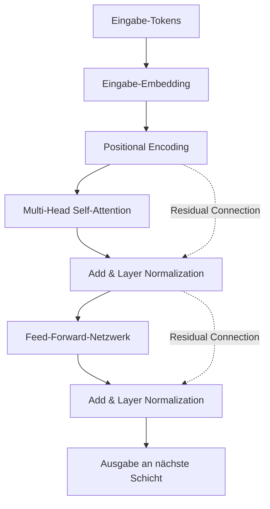
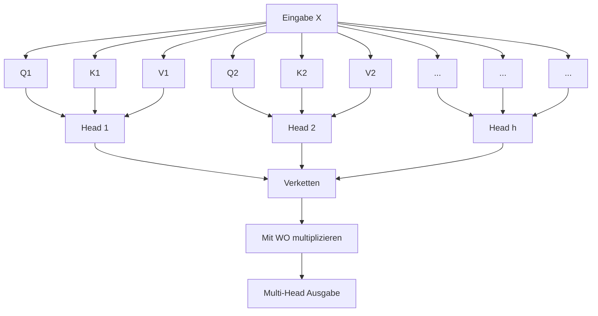

# Einführung: Warum die Mathematik des Transformers lernen?

Es ist keine Übertreibung zu sagen, dass die Architektur des „Transformers“ die Geschichte der modernen natürlichen Sprachverarbeitung (NLP) und der gesamten KI neu geschrieben hat. Dieses Modell, das erstmals 2017 in dem Paper „Attention Is All You Need“ von Google-Forschern vorgestellt wurde, fungiert als Herzstück der Large Language Models (LLM), die derzeit die Welt dominieren, wie etwa die GPT-Serie von OpenAI (die Basistechnologie von ChatGPT), BERT von Google und Claude von Anthropic.

Während man oft qualitative Erklärungen zur Funktionsweise des Transformers findet, wie etwa „den Kontext mithilfe des Attention-Mechanismus (Aufmerksamkeitsmechanismus) verstehen“, gibt es überraschenderweise nur wenige tiefgehende Erklärungen der dahinterliegenden **mathematischen Struktur** für Anfänger. Um wirklich zu verstehen, wie die KI „Wörter“ als „mathematische Formeln“ verarbeitet und erstaunlich natürliche Texte generiert, ist es unerlässlich, ihre mathematischen Mechanismen zu entschlüsseln.

In diesem Artikel werden wir die mathematischen Strukturen der Kernkomponenten des Transformers, wie den „Self-Attention-Mechanismus“, das „Query-Key-Value (Q/K/V)-Modell“, die „Normalisierung durch die Softmax-Funktion“ und das „Positional Encoding“, für Leser mit Grundkenntnissen in Mathematik und Programmierung (auf dem Niveau von Matrizen und Ableitungen aus der Oberstufe) gründlich und verständlich erläutern.

Sie könnten von der Aneinanderreihung mathematischer Formeln überwältigt sein, aber jede einzelne Berechnung hat eine klare „Bedeutung“. Wenn Sie diesen Artikel zu Ende gelesen haben, sollten Sie verstehen können, dass der Transformer nicht einfach eine magische Blackbox ist, sondern ein präzise entworfenes Kristall aus Mathematik und Statistik.

---

# 1. Die Grenzen herkömmlicher Methoden und die Innovation des Transformers

Bevor der Transformer aufkam, waren Recurrent Neural Networks (RNN) und ihre Derivate wie LSTM (Long Short-Term Memory) der Mainstream in der natürlichen Sprachverarbeitung. RNNs wurden entwickelt, um Zeitreihendaten zu verarbeiten, und lesen Texte Wort für Wort von Anfang an nacheinander ein.

RNNs hatten jedoch zwei fatale Schwachstellen:
1. **Schwierigkeiten beim Erlernen langfristiger Abhängigkeiten**: Wenn Sätze länger werden, verblasst die Information der zuerst eingegebenen Wörter, bis sie das Ende erreichen (Problem des verschwindenden Gradienten).
2. **Paralleles Rechnen ist unmöglich**: Da die Wörter nacheinander verarbeitet werden müssen, sind groß angelegte parallele Berechnungen mithilfe von GPUs schwierig, und das Training nimmt enorm viel Zeit in Anspruch.

Der Transformer löste einen Paradigmenwechsel aus, indem er die RNN-Struktur komplett verwarf und den Kontext ausschließlich mithilfe von „Attention“ erfasste. Dadurch gibt es unabhängig von der Sequenzlänge keinen Informationsverlust, und Berechnungen können parallelisiert werden, um die Leistung von GPUs maximal auszuschöpfen.

---

# 2. Die Gesamtarchitektur des Transformers

Lassen Sie uns zunächst einen Überblick über die Gesamtarchitektur des Transformers verschaffen. Der Transformer besteht grob aus zwei Blöcken: dem „Encoder“ und dem „Decoder“. Am Beispiel einer Übersetzungsaufgabe wandelt der Encoder die Eingabesprache (z.B. Englisch) in eine mathematische Vektordarstellung um, und der Decoder generiert basierend auf dieser Vektordarstellung die Ausgabesprache (z.B. Japanisch).

Das folgende Diagramm zeigt vereinfacht die interne Struktur des Encoder-Blocks.



Von hier an werden wir die mathematischen Operationen in den einzelnen Komponenten Schritt für Schritt betrachten.

---

# 3. Vektorisierung von Wörtern und Positionskodierung (Positional Encoding)

Computer können Text nicht so verstehen, wie er ist. Der eingegebene Text wird zunächst in Einheiten namens „Tokens“ unterteilt, die jeweils in einen Vektor fester Länge umgewandelt werden. Das ist das **Input Embedding**.

## 3.1 Die Mathematik des Input Embeddings
Sei $V$ die Größe des Vokabulars und $d_{model}$ die Anzahl der Dimensionen des Embedding-Vektors (im ursprünglichen Paper war $d_{model} = 512$). Jedes Wort $w_i$ wird mithilfe der Embedding-Matrix $W_E \in \mathbb{R}^{V \times d_{model}}$ in einen Vektor $x_i \in \mathbb{R}^{d_{model}}$ umgewandelt.

$$ x_i = W_E \cdot \text{one\_hot}(w_i) $$

Dadurch wird der gesamte Satz als Matrix $X \in \mathbb{R}^{N \times d_{model}}$ dargestellt (wobei $N$ die Länge des Satzes ist).

## 3.2 Die Notwendigkeit und Formel des Positional Encodings
Der Transformer verarbeitet Wörter nicht nacheinander wie ein RNN, sondern alle Wörter gleichzeitig und parallel. Dies ist hinsichtlich der Berechnungsgeschwindigkeit ein großer Vorteil, verursacht aber gleichzeitig das Problem, dass **die wichtige Information der „Reihenfolge der Wörter (Wortstellung)“ verloren geht**. Zum Beispiel sind die eingegebenen Wortmengen für „Ein Hund beißt einen Mann“ und „Ein Mann beißt einen Hund“ identisch, aber die Bedeutung ist völlig unterschiedlich.

Um dem Modell diese Information über die Wortstellung zur Verfügung zu stellen, wurde das **Positional Encoding** entwickelt.
Das Positional Encoding $PE$ für die $i$-te Dimension eines Wortes an der Position $pos$ wird mithilfe der folgenden trigonometrischen Funktionen berechnet.

$$ PE_{(pos, 2i)} = \sin\left(\frac{pos}{10000^{2i/d_{model}}}\right) $$
$$ PE_{(pos, 2i+1)} = \cos\left(\frac{pos}{10000^{2i/d_{model}}}\right) $$

Hierbei ist $pos$ die Position des Wortes ($0, 1, 2, \dots, N-1$) und $i$ der Index der Dimension des Vektors ($0, 1, \dots, d_{model}/2 - 1$).

### Warum Sinus und Kosinus verwendet werden
Auf den ersten Blick sieht es nach einer sehr komplexen und seltsamen Formel aus, aber es gibt einen tiefen mathematischen Grund dafür. Durch die Verwendung trigonometrischer Funktionen kann das Modell **nicht nur „absolute Positionen“, sondern auch die Differenz „relativer Positionen“** leicht erlernen.

Erinnern Sie sich an die Additionstheoreme für trigonometrische Funktionen aus der Schulmathematik.
$$ \sin(\alpha + \beta) = \sin\alpha \cos\beta + \cos\alpha \sin\beta $$
$$ \cos(\alpha + \beta) = \cos\alpha \cos\beta - \sin\alpha \sin\beta $$

Das Positional Encoding für eine Position $pos + k$, die um einen Offset $k$ von einer Position $pos$ entfernt ist, kann als Linearkombination des Positional Encodings der Position $pos$ dargestellt werden. Das bedeutet, es kann mithilfe einer Matrix $M_k$ wie folgt geschrieben werden:

$$ PE_{pos+k} = M_k \cdot PE_{pos} $$

Dadurch kann der Attention-Mechanismus durch die Berechnung von Skalarprodukten leicht erkennen, „wie weit“ Wörter voneinander entfernt sind (relative Distanz). Zudem hat es den Vorteil, dass durch die Kombination mehrerer Sinus- und Kosinuswellen unterschiedlicher Wellenlängen selbst für noch so lange Sätze ein eindeutiger Positionsvektor generiert werden kann.

Die endgültige Eingabematrix $X_{input}$ ergibt sich aus der Addition der Wort-Embedding-Vektoren und dieses Positional Encodings.

$$ X_{input} = X + PE $$

---

# 4. Die tiefgründige Mathematik der Self-Attention (Selbstaufmerksamkeitsmechanismus)

Nun dringen wir zur wichtigsten Komponente des Transformers vor: der **Self-Attention (Selbstaufmerksamkeitsmechanismus)**. Das Ziel der Self-Attention ist es, „die Relevanz aller Wörter in einem Satz untereinander zu berechnen und den Vektor jedes Wortes zu einer reichhaltigeren Darstellung zu aktualisieren, die den Kontext berücksichtigt“.

Hierbei wird die Analogie eines „Suchsystems“ verwendet.
- **Query (Q)**: Suchanfrage. „Nach welchen Informationen suche ich gerade?“
- **Key (K)**: Schlüssel (Schlagwort). „Welche Informationen habe ich?“
- **Value (V)**: Wert (Inhalt). „Welche Informationen biete ich tatsächlich an?“

## 4.1 Generierung der Matrizen $Q, K, V$
Wir berechnen Query $Q$, Key $K$ und Value $V$, indem wir die Eingabematrix $X \in \mathbb{R}^{N \times d_{model}}$ (zur Vereinfachung ignorieren wir hier die Batch-Größe) mit den lernbaren Gewichtsmatrizen $W^Q, W^K, W^V \in \mathbb{R}^{d_{model} \times d_k}$ multiplizieren. (Normalerweise gilt $d_k = d_v = d_{model} / h$)

$$ Q = X W^Q $$
$$ K = X W^K $$
$$ V = X W^V $$

Hier sind $Q, K, V$ alle Matrizen der Form $\mathbb{R}^{N \times d_k}$.

## 4.2 Berechnung der Attention-Scores (Skalarprodukt)
Um zu messen, wie stark das Query jedes Wortes mit den Keys aller anderen Wörter in Beziehung steht, berechnen wir das **Skalarprodukt** der Vektoren. Als Matrixoperation geschrieben, sieht das wie folgt aus:

$$ \text{Scores} = Q K^T $$

Jedes Element $s_{ij}$ der aus dieser Berechnung resultierenden Matrix $\text{Scores} \in \mathbb{R}^{N \times N}$ repräsentiert das Skalarprodukt zwischen dem Query des $i$-ten Wortes und dem Key des $j$-ten Wortes, d. h. die „Stärke der Relevanz“.

## 4.3 Skalierung (Scale)
Die Score-Berechnung durch das Skalarprodukt hat ein Problem. Wenn die Dimension der Vektoren $d_k$ groß wird, werden die Werte des Skalarprodukts extrem groß oder extrem klein.

Lassen Sie uns dies mathematisch beweisen.
Nehmen wir an, dass jedes Element des Queries $q \sim \mathcal{N}(0, 1)$ und jedes Element des Keys $k \sim \mathcal{N}(0, 1)$ einer unabhängigen Standardnormalverteilung folgt.
Wir bestimmen den Mittelwert und die Varianz des Skalarprodukts $q \cdot k = \sum_{i=1}^{d_k} q_i k_i$.
Mittelwert: Da $\mathbb{E}[q_i k_i] = \mathbb{E}[q_i] \mathbb{E}[k_i] = 0 \times 0 = 0$, ist auch der Mittelwert der Summe $0$.
Varianz: Die Varianz von $q_i k_i$ ist aufgrund der Unabhängigkeit $\text{Var}(q_i k_i) = \mathbb{E}[(q_i k_i)^2] - (\mathbb{E}[q_i k_i])^2 = 1 \times 1 - 0 = 1$.
Daher entspricht die Gesamtvarianz des Skalarprodukts der Dimensionsanzahl $d_k$.

$$ \text{Var}(q \cdot k) = d_k $$

Wenn die Varianz groß wird, tritt bei der anschließend angewendeten Softmax-Funktion das „Problem des verschwindenden Gradienten“ auf, bei dem die Gradienten für alle Werte außer dem Maximum extrem klein werden, wodurch das Training stagniert.
Um dies zu verhindern, teilen wir die Scores durch $\sqrt{d_k}$ (Skalierung), um die Varianz stets bei $1$ zu halten.

$$ \text{Scaled Scores} = \frac{Q K^T}{\sqrt{d_k}} $$

## 4.4 Umwandlung in Wahrscheinlichkeiten durch die Softmax-Funktion
Um die erhaltenen Scores in eine Wahrscheinlichkeitsverteilung (Gewichte) umzuwandeln, deren Summe $1$ ergibt, wird die **Softmax-Funktion** zeilenweise angewendet.

$$ a_{ij} = \text{softmax}(s_i)_j = \frac{\exp(s_{ij} / \sqrt{d_k})}{\sum_{m=1}^N \exp(s_{im} / \sqrt{d_k})} $$

Die Matrix $A \in \mathbb{R}^{N \times N}$ wird als Attention-Weight-Matrix (Aufmerksamkeitsgewichtsmatrix) bezeichnet. Wenn wir uns jede Zeile $i$ dieser Matrix ansehen, wird durch einen Wert zwischen 0 und 1 ausgedrückt: „Wie viel Aufmerksamkeit (Attention) sollte man anderen Wörtern $j$ schenken, um das Wort $i$ zu verstehen?“.

## 4.5 Gewichtete Summe der Values
Schließlich berechnen wir mithilfe der erhaltenen Attention-Weight-Matrix $A$ die gewichtete Summe der Value-Matrix $V$.

$$ \text{Output} = A V = \text{softmax}\left(\frac{Q K^T}{\sqrt{d_k}}\right) V $$

Die durch diese Operation ausgegebene Matrix $Z \in \mathbb{R}^{N \times d_v}$ ist eine Sammlung von „Vektordarstellungen der Wörter, die unter Berücksichtigung des Kontextes aktualisiert wurden“.
Dies ist das vollständige Bild der im Paper definierten **Scaled Dot-Product Attention**.

---

# 5. Multi-Head Attention

Mit nur einer einzigen Attention-Berechnung (Single-Head) besteht die Möglichkeit, dass der Kontext nur aus einer Perspektive (z. B. „grammatikalische Beziehungen“) erfasst wird. Um die vielfältigen semantischen und syntaktischen Beziehungen der Sprache („Subjekt und Prädikat“, „Pronomen und ihr Bezugswort“ usw.) gleichzeitig zu erfassen, wurde die **Multi-Head Attention** eingeführt.

Die Generierung von $Q, K, V$ und die Attention-Berechnung von vorhin werden $h$-mal parallel durchgeführt ($h$ ist die Anzahl der Heads; im ursprünglichen Paper war $h=8$).

$$ \text{head}_i = \text{Attention}(X W_i^Q, X W_i^K, X W_i^V) $$

Hierbei sind $W_i^Q, W_i^K, W_i^V \in \mathbb{R}^{d_{model} \times d_k}$ die lernbaren Gewichtsmatrizen speziell für den $i$-ten Head.

Die von jedem Head ausgegebenen Ergebnisse $\text{head}_i \in \mathbb{R}^{N \times d_v}$ werden horizontal verkettet (Concatenate).

$$ \text{Concat}(\text{head}_1, \dots, \text{head}_h) \in \mathbb{R}^{N \times (h \cdot d_v)} $$

Normalerweise wird $h \cdot d_v = d_{model}$ so gewählt, dass die Dimension nach der Verkettung wieder auf das Eingangsmaß $d_{model}$ zurückkehrt. Schließlich wird diese Matrix mit der Gewichtsmatrix $W^O \in \mathbb{R}^{d_{model} \times d_{model}}$ multipliziert, um die endgültige Ausgabe zu erhalten.

$$ \text{MultiHead}(Q, K, V) = \text{Concat}(\text{head}_1, \dots, \text{head}_h) W^O $$



---

# 6. Feed-Forward Neural Network (FFN)

Die Ausgabe der Multi-Head Attention wird anschließend in das **Position-wise Feed-Forward Network (FFN)** eingespeist.
Dies ist ein zweischichtiges, vollständig verbundenes neuronales Netzwerk, das „für jede Position (jedes Wort) in der Sequenz unabhängig“ angewendet wird.

Als mathematische Formel ausgedrückt, sieht das so aus:

$$ \text{FFN}(x) = \max(0, x W_1 + b_1) W_2 + b_2 $$

Hierbei repräsentiert $\max(0, z)$ die ReLU-Aktivierungsfunktion (Rectified Linear Unit) (in neueren Modellen werden oft auch GELU oder SwiGLU verwendet).

Die Rolle dieses Netzwerks ist äußerst wichtig. Während der Attention-Mechanismus „Beziehungen zwischen Wörtern (räumliche und sequentielle Beziehungen)“ erlernt, ist das FFN für die „nichtlineare Feature-Transformation jedes einzelnen Wortvektors“ verantwortlich.
Typischerweise wird die Dimension durch die Gewichte der ersten Schicht $W_1$ vorübergehend stark erweitert (z. B. vervierfacht von $d_{model}=512$ auf $d_{ff}=2048$), um komplexe Berechnungen im Merkmalsraum durchzuführen, und dann durch die Gewichte der zweiten Schicht $W_2$ wieder auf die ursprüngliche Dimension reduziert. Durch diese „Erweiterung und Reduktion der Dimensionen“ wird die Ausdruckskraft des Modells dramatisch erhöht.

---

# 7. Residual Connection und Layer Normalization

Im Deep Learning tritt bei tiefer werdenden Netzwerkschichten das Problem auf, dass Gradienten während des Trainings verschwinden oder explodieren, was ein erfolgreiches Training verhindert. Um dies zu verhindern, sind um jede Subschicht (Attention und FFN) des Transformers eine **Residual Connection (Restverbindung)** und eine **Layer Normalization (Schichtnormalisierung)** angeordnet.

Als Formel geschrieben, wird die Ausgabe der Subschicht wie folgt verarbeitet:

$$ \text{Output} = \text{LayerNorm}(x + \text{Sublayer}(x)) $$

## 7.1 Residual Connection ($x + \text{Sublayer}(x)$)
Die Eingabe $x$ wird direkt zur Ausgabe der Subschicht addiert. Dadurch wird der Gradient bei der Backpropagation direkt durch einen Shortcut in flachere Schichten weitergeleitet, wodurch das Training selbst bei tiefen Schichten stabil bleibt.

## 7.2 Die Mathematik der Layer Normalization
Layer Normalization ist eine Technik, die den Mittelwert und die Varianz entlang der Dimension der Merkmale berechnet und die Daten normalisiert. Bei einer Eingabe mit der Batch-Größe $B$, der Sequenzlänge $N$ und der Dimensionsanzahl $d_{model}$ wird die Normalisierung für einen einzelnen Wortvektor $x \in \mathbb{R}^{d_{model}}$ durchgeführt.

Wir berechnen den Mittelwert $\mu$ und die Varianz $\sigma^2$.
$$ \mu = \frac{1}{d_{model}} \sum_{i=1}^{d_{model}} x_i $$
$$ \sigma^2 = \frac{1}{d_{model}} \sum_{i=1}^{d_{model}} (x_i - \mu)^2 $$

Dann erhalten wir die normalisierte Ausgabe $\hat{x}$.
$$ \text{LN}(x) = \frac{x - \mu}{\sqrt{\sigma^2 + \epsilon}} \odot \gamma + \beta $$
($\epsilon$ ist eine winzige Konstante zur Vermeidung einer Division durch null. $\gamma, \beta$ sind lernbare Skalierungs- und Verschiebungsparameter.)

Der Grund für die Verwendung der schichtweisen Normalisierung (Layer Normalization) anstelle der Normalisierung in Batch-Richtung (Batch Normalization) liegt darin, dass bei der Verarbeitung von sequenziellen Daten mit variabler Länge, wie z.B. Sätzen, die Statistiken zwischen den Batches tendenziell instabil werden. Dank der Layer Normalization ermöglicht der Transformer ein stabiles Training unabhängig von der Batch-Größe.

---

# 8. Decoderspezifische Strukturen: Masked Attention und Cross-Attention

Die bisher erläuterten Strukturen gehören zum Encoder. Beim Decoder-Block, der Sätze generiert, weicht die Struktur leicht ab.

## 8.1 Masked Multi-Head Attention
Die Rolle des Decoders ist es, „das nächste Wort aus vergangenen Wörtern vorherzusagen“. Daher wäre es beim Training Schummeln, wenn er „zukünftige Wörter“ sehen würde. Die mathematische Operation, um dies zu verhindern, ist das **Masking (Maskierung)**.

Zur Score-Matrix $Q K^T$ wird eine Maskenmatrix $M$ addiert, die im oberen Dreiecksteil (was den zukünftigen Informationen entspricht) sehr kleine Werte nahe $-\infty$ setzt.

$$ M_{ij} = \begin{cases} 0 & (i \le j) \\ -\infty & (i > j) \end{cases} $$

$$ \text{Masked Attention}(Q, K, V) = \text{softmax}\left(\frac{Q K^T + M}{\sqrt{d_k}}\right) V $$

Bei der Berechnung der Softmax-Funktion wird $\exp(-\infty) = 0$, sodass das Attention-Weight für zukünftige Wörter komplett $0$ wird. Dadurch wird eine autoregressive Generierung unter Beibehaltung der Kausalität ermöglicht.

## 8.2 Encoder-Decoder Cross-Attention
Die zweite Subschicht des Decoders ist die **Cross-Attention**, die auf die Ausgabe des Encoders verweist.
Hierbei wird $Q$ aus der vorherigen Decoder-Schicht generiert, während $K$ und $V$ aus der Ausgabe der letzten Encoder-Schicht generiert werden.

$$ Q_{decoder} = X_{dec} W^Q $$
$$ K_{encoder} = X_{enc} W^K $$
$$ V_{encoder} = X_{enc} W^V $$

Durch diese Berechnung kann das Modell bei Übersetzungsaufgaben lernen, „mit welchem Teil des ursprünglichen fremdsprachigen Satzes das aktuell zu übersetzende Wort stark zusammenhängt“.

---

# 9. Rechenaufwand und die Mathematik der Optimierung in der Moderne

Der Transformer ist ein großartiges Modell, hat aber aufgrund seiner mathematischen Struktur auch „Schwachstellen“.
Achten Sie auf den Rechenaufwand der Self-Attention. Bei der Berechnung der Score-Matrix $Q K^T$ wird eine $(N \times d_k)$-Matrix mit einer $(d_k \times N)$-Matrix multipliziert, sodass der Rechenaufwand **$O(N^2 \cdot d_{model})$** beträgt.

Das bedeutet, dass **Rechenaufwand und Speicherverbrauch quadratisch zur Sequenzlänge $N$ ansteigen**.
Bei kurzen Texten ist das kein Problem, aber wenn man versucht, einen extrem langen Kontext wie ein ganzes Buch in ein LLM einzuspeisen, erreicht $N$ Zehn- bis Hunderttausende, und bei herkömmlichen Attention-Berechnungen wäre der GPU-Speicher sofort erschöpft.

Um diesen Fluch der $O(N^2)$-Komplexität zu brechen, wurden in den letzten Jahren verschiedene Optimierungen aus mathematischen und hardwaretechnischen Ansätzen vorgeschlagen.
Ein Paradebeispiel dafür ist **FlashAttention**. FlashAttention ist ein Algorithmus, der die Attention-Berechnung in Kacheln unterteilt (Tiling), um den Datentransfer (Speicherzugriff) zwischen den Speicherhierarchien der GPU (SRAM und HBM) zu minimieren. Obwohl es mathematisch exakt das gleiche Ergebnis wie die Standard-Attention liefert (Exact Attention), erreicht es durch Optimierung auf Hardware-Ebene eine dramatische Beschleunigung und Speicherreduzierung, was die Realisierung von Modellen mit langem Kontext wie GPT-4 ermöglicht hat.

Darüber hinaus wird intensiv an Sparse Attention, Linear Attention und Ähnlichem geforscht, die den Rechenaufwand auf $O(N \log N)$ oder $O(N)$ annähern.

---

# 10. Vorstellungen zur Implementierung (Pseudocode im PyTorch-Stil)

Wenn man die bisherigen mathematischen Strukturen in tatsächlichen Programmiercode (Python / PyTorch) überträgt, stellt man fest, dass sie überraschend einfach geschrieben werden können. Hier ist der Pseudocode für den Kernteil der Self-Attention.

```python
import torch
import torch.nn.functional as F
import math

def scaled_dot_product_attention(q, k, v, mask=None):
    # Form von q, k, v: [batch_size, num_heads, seq_length, d_k]
    d_k = q.size(-1)
    
    # 1. Score-Berechnung durch Skalarprodukt: Q * K^T
    # Die letzten beiden Dimensionen transponieren und Matrixprodukt berechnen
    scores = torch.matmul(q, k.transpose(-2, -1))
    
    # 2. Skalierung
    scores = scores / math.sqrt(d_k)
    
    # 3. Maskierung (im Falle von Masked Attention)
    if mask is not None:
        scores = scores.masked_fill(mask == 0, -1e9)
        
    # 4. Umwandlung in Wahrscheinlichkeiten durch Softmax
    attention_weights = F.softmax(scores, dim=-1)
    
    # 5. Multiplikation mit der Value-Matrix
    output = torch.matmul(attention_weights, v)
    
    return output, attention_weights
```

Man kann sehen, dass der mathematisch dargestellte Ausdruck $Q K^T / \sqrt{d_k}$ intuitiv als `torch.matmul(q, k.transpose(-2, -1)) / math.sqrt(d_k)` implementiert wird. Es ist ein sehr faszinierender Aspekt des Deep Learning, dass mathematische Theorien mithilfe von stark optimierten Bibliotheken in wenigen Codezeilen realisiert werden können.

---

# Fazit: Die Form der „Intelligenz“, wie sie aus mathematischen Formeln ersichtlich wird

In diesem Artikel haben wir die tiefgründigen mathematischen Strukturen des Transformer-Modells entschlüsselt.

Das Embedding, das Wörter in einen mehrdimensionalen Vektorraum abbildet, das Positional Encoding, das Positionsinformationen durch die Synthese von Dreieckswellen ausdrückt, und der Self-Attention-Mechanismus, der aus einer Analogie zur Informationsbeschaffung entstandene Matrizenmultiplikationen verwendet. Jede dieser Komponenten ist lediglich eine Ansammlung von grundlegender Mathematik wie linearer Algebra, Differenzial- und Integralrechnung sowie Wahrscheinlichkeitsrechnung und Statistik.

Wenn sich diese einfachen Matrixoperationen jedoch in unzähligen Schichten überlagern und Muster aus gigantischen Datensätzen durch Milliarden oder Hunderte von Milliarden an Parametern lernen, entsteht eine „Form von Intelligenz“, die unsere „Wörter“ zu verstehen, logische Schlüsse zu ziehen und manchmal kreative Ideen hervorzubringen scheint.

Wie der provokante Titel „Attention Is All You Need“ andeutet, liegt die Schönheit dieser Architektur, die komplexe rekurrente und konvolutionale Verarbeitungen verworfen und sich auf die reinrassige Berechnung von „Attention (Relevanz)“ spezialisiert hat, gerade in ihrer mathematischen Einfachheit.

In Zukunft könnten zwar neue Architekturen auftauchen, die den Transformer übertreffen (wie z. B. Mamba, ein State Space Model), aber der mathematische Rahmen des „Kontextverständnisses durch Attention“, den der Transformer geschaffen hat, wird für immer in der Geschichte der KI verankert bleiben.

Wenn Sie künftig die Gelegenheit haben, LLMs wie ChatGPT oder Claude zu nutzen, stellen Sie sich vor, wie im Hintergrund jede Sekunde Billionen von Matrixmultiplikationen von $Q K^T$ berechnet werden und die Softmax-Funktion Wahrscheinlichkeiten ausspuckt. Ihr Verständnis für die Technologie wird sich vertiefen, und die Welt der KI wird Ihnen noch faszinierender erscheinen.

### Literaturverzeichnis
- Vaswani, A., et al. (2017). "Attention Is All You Need." *Advances in Neural Information Processing Systems*.
- Alammar, J. (2018). "The Illustrated Transformer." 

---
*Dieser Artikel wurde als Leitfaden für all jene verfasst, die die mathematischen Grundlagen der natürlichen Sprachverarbeitung und der KI erlernen möchten. Wenn Sie Fragen oder Diskussionsbedarf haben, lassen Sie es mich bitte in den Kommentaren wissen!*
