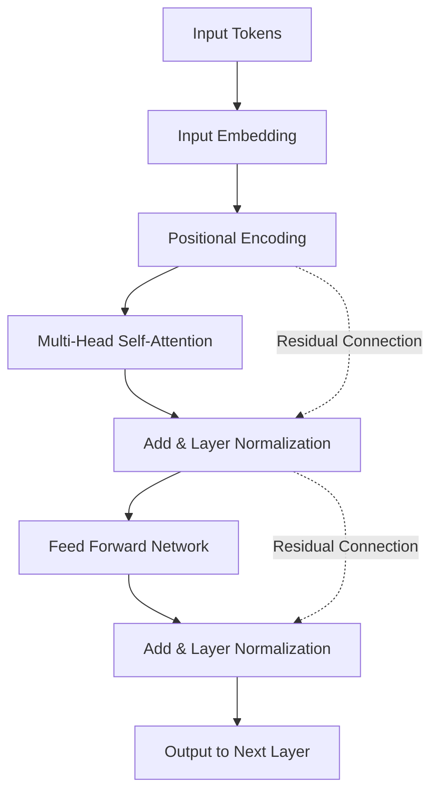
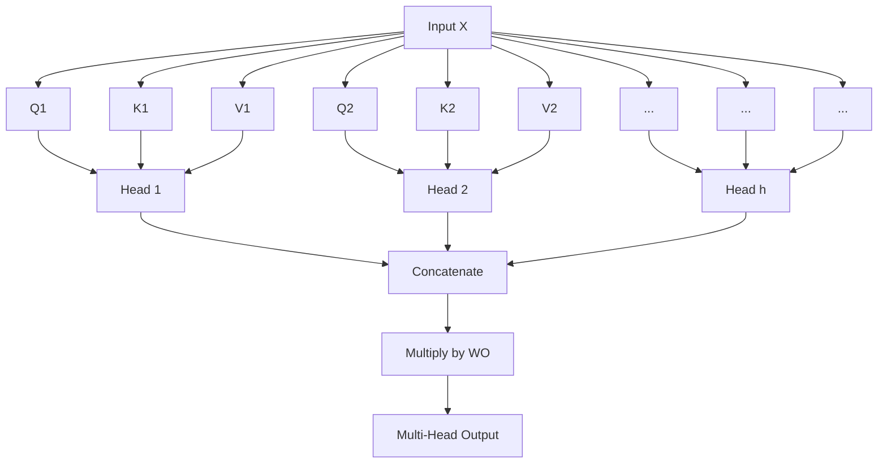

# Introduction: Why Learn the Mathematics of Transformers?

It is no exaggeration to say that the "Transformer" is the architecture that rewrote the history of modern Natural Language Processing (NLP) and AI as a whole. First proposed in the 2017 paper "Attention Is All You Need" by Google researchers, this model serves as the heart of Large Language Models (LLMs) that are currently taking the world by storm, such as OpenAI's GPT series (the foundational technology of ChatGPT), Google's BERT, and Anthropic's Claude.

However, while qualitative explanations like "understanding context using Attention mechanisms" are commonly seen regarding how Transformers work, surprisingly few resources dive deep into the **mathematical structure** behind it for beginners. To truly understand how AI processes "words" as "mathematical formulas" and generates incredibly natural sentences, deciphering its mathematical mechanisms is essential.

This article is aimed at those with a basic understanding of mathematics and programming (those who grasp high school-level concepts of matrices and derivatives). It thoroughly and clearly uncovers the mathematical structures of the Transformer's core components: the "Self-Attention mechanism," the "Query-Key-Value (Q/K/V) model," "normalization using the Softmax function," and "Positional Encoding."

You might be overwhelmed by the list of mathematical formulas, but each calculation has a clear "meaning." By the time you finish reading this article, you should understand that the Transformer is not just a magical black box, but an exquisitely designed crystallization of mathematics and statistics.

---

# 1. Limitations of Conventional Methods and the Innovativeness of the Transformer

Before the advent of the Transformer, the mainstream of natural language processing was Recurrent Neural Networks (RNNs) and their derivative, LSTM (Long Short-Term Memory). RNNs are designed to process time-series data, reading sentences sequentially from the beginning, word by word.

However, RNNs had two fatal weaknesses:
1. **Difficulty in learning long-term dependencies**: As sentences get longer, the information of the words inputted at the beginning fades by the time it reaches the end (the vanishing gradient problem).
2. **Inability to compute in parallel**: Because words must be processed sequentially, large-scale parallel computation using GPUs is difficult, requiring an enormous amount of time for training.

The Transformer caused a paradigm shift by completely discarding the RNN structure and grasping context using only "Attention." This allowed for no loss of information no matter how long the sequence is, and made it possible to maximize GPU performance by parallelizing computations.

---

# 2. Overall Architecture of the Transformer

First, let's take a bird's-eye view of the overall Transformer architecture. The Transformer is broadly composed of two blocks: the "Encoder" and the "Decoder." Taking a translation task as an example, the Encoder converts the input language (e.g., English) into mathematical vector representations, and the Decoder generates the output language (e.g., Japanese) based on those vector representations.

The following diagram is a simplified internal structure of the Encoder block.



From here, let's look step by step at the mathematical operations being performed in each component.

---

# 3. Word Vectorization and Positional Encoding

Computers cannot understand text as it is. The inputted text is first divided into units called "Tokens," and each is converted into a fixed-length vector. This is **Input Embedding**.

## 3.1 Mathematics of Input Embedding
Let the size of the vocabulary be $V$, and the dimensionality of the embedding vector be $d_{model}$ (in the original paper, $d_{model} = 512$). Each word $w_i$ is converted into a vector $x_i \in \mathbb{R}^{d_{model}}$ using the embedding matrix $W_E \in \mathbb{R}^{V \times d_{model}}$.

$$ x_i = W_E \cdot \text{one\_hot}(w_i) $$

As a result, the entire sentence is represented as a matrix $X \in \mathbb{R}^{N \times d_{model}}$ (where $N$ is the length of the sentence).

## 3.2 The Need for Positional Encoding and its Formulas
Unlike RNNs, the Transformer does not process words sequentially but processes all words in parallel simultaneously. This is a significant advantage in terms of computational speed, but at the same time, it causes the problem that **important information of "word order" is lost**. For example, "A dog bites a man" and "A man bites a dog" have the exact same set of input words, but their meanings are completely different.

**Positional Encoding** was devised to provide this word order information to the model.
The Positional Encoding $PE$ for the $i$-th dimension of a word at position $pos$ is calculated using the following trigonometric functions:

$$ PE_{(pos, 2i)} = \sin\left(\frac{pos}{10000^{2i/d_{model}}}\right) $$
$$ PE_{(pos, 2i+1)} = \cos\left(\frac{pos}{10000^{2i/d_{model}}}\right) $$

Here, $pos$ is the position of the word ($0, 1, 2, \dots, N-1$), and $i$ is the index of the vector's dimension ($0, 1, \dots, d_{model}/2 - 1$).

### Why Use Sine and Cosine?
At first glance, it looks like a very complex and strange mathematical formula, but there is a profound mathematical reason for this. By using trigonometric functions, the model can easily learn not only the **"absolute position" but also the difference in "relative position"**.

Recall the addition theorems of trigonometric functions learned in high school math:
$$ \sin(\alpha + \beta) = \sin\alpha \cos\beta + \cos\alpha \sin\beta $$
$$ \cos(\alpha + \beta) = \cos\alpha \cos\beta - \sin\alpha \sin\beta $$

The Positional Encoding of a position $pos + k$, which is offset by $k$ from a certain position $pos$, can be expressed as a linear combination of the Positional Encoding of position $pos$. In other words, using a matrix $M_k$, it can be written as follows:

$$ PE_{pos+k} = M_k \cdot PE_{pos} $$

This allows the Attention mechanism to easily recognize the relative distance, or "how far apart" words are, through dot product calculations. Another advantage is that by combining multiple sine and cosine waves of different wavelengths, a unique position vector can be generated no matter how long the sentence is.

The final input matrix $X_{input}$ is the sum of the word embedding vectors and this positional encoding.

$$ X_{input} = X + PE $$

---

# 4. The Profound Mathematics of Self-Attention

We will finally step into the **Self-Attention** mechanism, the most critical component of the Transformer. The purpose of Self-Attention is "to calculate the degree of relevance between all words in a sentence and update the vector of each word into a richer representation that takes context into account."

Here, an analogy of a "search system" is used.
- **Query (Q)**: The query (search term). "What information am I looking for right now?"
- **Key (K)**: The key (heading). "What information do I have?"
- **Value (V)**: The value (entity). "What information do I actually provide?"

## 4.1 Generation of Matrices $Q, K, V$
For the input matrix $X \in \mathbb{R}^{N \times d_{model}}$ (we ignore batch size here for simplicity), we calculate the query $Q$, key $K$, and value $V$ by multiplying it with learnable weight matrices $W^Q, W^K, W^V \in \mathbb{R}^{d_{model} \times d_k}$. (Usually $d_k = d_v = d_{model} / h$)

$$ Q = X W^Q $$
$$ K = X W^K $$
$$ V = X W^V $$

Here, $Q, K, V$ are all matrices in $\mathbb{R}^{N \times d_k}$.

## 4.2 Calculation of Attention Scores (Dot Product)
To measure how much each word's Query is related to the Keys of all other words, we calculate the **dot product** of the vectors. Written as a matrix operation, it looks like this:

$$ \text{Scores} = Q K^T $$

Each element $s_{ij}$ of the matrix $\text{Scores} \in \mathbb{R}^{N \times N}$ obtained by this calculation represents the dot product of the $i$-th word's Query and the $j$-th word's Key, that is, the "strength of relevance".

## 4.3 Scaling (Scale)
There is one problem with calculating scores via dot products. As the dimensionality $d_k$ of the vectors becomes larger, the values of the dot product can become extremely large or small.

Let's prove this mathematically.
Assume that each element $q$ of the query and $k$ of the key follows an independent standard normal distribution: $q \sim \mathcal{N}(0, 1)$ and $k \sim \mathcal{N}(0, 1)$.
We find the mean and variance of the dot product $q \cdot k = \sum_{i=1}^{d_k} q_i k_i$.
Mean: $\mathbb{E}[q_i k_i] = \mathbb{E}[q_i] \mathbb{E}[k_i] = 0 \times 0 = 0$, so the mean of the sum is also $0$.
Variance: The variance of $q_i k_i$ is, from independence, $\text{Var}(q_i k_i) = \mathbb{E}[(q_i k_i)^2] - (\mathbb{E}[q_i k_i])^2 = 1 \times 1 - 0 = 1$.
Therefore, the variance of the entire dot product is equal to the number of dimensions $d_k$.

$$ \text{Var}(q \cdot k) = d_k $$

When the variance becomes large, in the Softmax function applied subsequently, the gradients for values other than the maximum become extremely small, leading to "vanishing gradients", and learning stops progressing.
To prevent this, the scores are divided (scaled) by $\sqrt{d_k}$ so that the variance is constantly kept at $1$.

$$ \text{Scaled Scores} = \frac{Q K^T}{\sqrt{d_k}} $$

## 4.4 Probabilization by Softmax Function
To convert the obtained scores into a probability distribution (weights) that sums to $1$, the **Softmax function** is applied row by row.

$$ a_{ij} = \text{softmax}(s_i)_j = \frac{\exp(s_{ij} / \sqrt{d_k})}{\sum_{m=1}^N \exp(s_{im} / \sqrt{d_k})} $$

The matrix $A \in \mathbb{R}^{N \times N}$ is called the Attention Weight matrix. Looking at each row $i$ of this matrix, it expresses "how much attention should be paid to other words $j$ in order to understand word $i$" as a value between 0 and 1.

## 4.5 Weighted Sum of Value
Finally, using the obtained Attention Weight matrix $A$, we calculate the weighted sum of the Value matrix $V$.

$$ \text{Output} = A V = \text{softmax}\left(\frac{Q K^T}{\sqrt{d_k}}\right) V $$

The matrix $Z \in \mathbb{R}^{N \times d_v}$ output by this operation is a collection of "word vector representations updated to account for context".
This is the complete picture of the **Scaled Dot-Product Attention** defined in the paper.

---

# 5. Multi-Head Attention

A single Attention calculation (single-head) might only capture context from one perspective (for example, "grammatical relationships"). Therefore, to simultaneously capture the diverse semantic and syntactic relationships of language (such as "subject and predicate" or "pronouns and their referents"), **Multi-Head Attention** was introduced.

The generation of $Q, K, V$ and Attention calculation described earlier are performed in parallel $h$ times (the number of heads. In the original paper, $h=8$).

$$ \text{head}_i = \text{Attention}(X W_i^Q, X W_i^K, X W_i^V) $$

Here, $W_i^Q, W_i^K, W_i^V \in \mathbb{R}^{d_{model} \times d_k}$ are learnable weight matrices dedicated to the $i$-th head.

The results output from each head, $\text{head}_i \in \mathbb{R}^{N \times d_v}$, are concatenated horizontally.

$$ \text{Concat}(\text{head}_1, \dots, \text{head}_h) \in \mathbb{R}^{N \times (h \cdot d_v)} $$

Usually, it is set such that $h \cdot d_v = d_{model}$, so the concatenated dimension returns to the original $d_{model}$. Finally, this matrix is multiplied by a weight matrix $W^O \in \mathbb{R}^{d_{model} \times d_{model}}$ to obtain the final output.

$$ \text{MultiHead}(Q, K, V) = \text{Concat}(\text{head}_1, \dots, \text{head}_h) W^O $$



---

# 6. Feed-Forward Neural Network (FFN)

The output of Multi-Head Attention is next inputted into the **Position-wise Feed-Forward Network (FFN)**.
This is a two-layer fully connected neural network applied "independently to each position (word)" in the sequence.

Expressed as a formula, it is as follows:

$$ \text{FFN}(x) = \max(0, x W_1 + b_1) W_2 + b_2 $$

Here, $\max(0, z)$ represents the ReLU (Rectified Linear Unit) activation function (recently, GELU or SwiGLU are also often used in modern models).

The role of this network is extremely important. While the Attention mechanism learns "relationships between words (spatial/sequential relationships)", the FFN is responsible for "non-linear feature transformation of each word vector itself".
Usually, the dimension is temporarily expanded greatly by the weights of the first layer $W_1$ (for example, expanding by 4 times from $d_{model}=512$ to $d_{ff}=2048$), and after performing complex calculations in the feature space, it is returned to the original dimension by the weights of the second layer $W_2$. Through this "expansion and contraction of dimensions", the expressive power of the model is dramatically enhanced.

---

# 7. Residual Connection and Layer Normalization

In deep learning, as the layers of a network become deeper, problems arise where gradients vanish or explode during training, making it impossible to learn properly. To prevent this, **Residual Connections** and **Layer Normalization** are placed around each sublayer (Attention and FFN) of the Transformer.

Written mathematically, the output of the sublayer is processed as follows:

$$ \text{Output} = \text{LayerNorm}(x + \text{Sublayer}(x)) $$

## 7.1 Residual Connection ($x + \text{Sublayer}(x)$)
The input $x$ is directly added to the output of the sublayer. By doing this, gradients can propagate directly to shallower layers through shortcuts during backpropagation, stabilizing learning even when the layers are deepened.

## 7.2 Mathematics of Layer Normalization
Layer Normalization is a technique that calculates the mean and variance along the feature dimension direction to normalize data. For an input with batch size $B$, sequence length $N$, and dimensionality $d_{model}$, normalization is performed on a single word vector $x \in \mathbb{R}^{d_{model}}$.

Calculate the mean $\mu$ and variance $\sigma^2$:
$$ \mu = \frac{1}{d_{model}} \sum_{i=1}^{d_{model}} x_i $$
$$ \sigma^2 = \frac{1}{d_{model}} \sum_{i=1}^{d_{model}} (x_i - \mu)^2 $$

Then, obtain the normalized output $\hat{x}$:
$$ \text{LN}(x) = \frac{x - \mu}{\sqrt{\sigma^2 + \epsilon}} \odot \gamma + \beta $$
(where $\epsilon$ is a small constant to prevent division by zero, and $\gamma, \beta$ are learnable scale and shift parameters)

The reason for adopting Layer Normalization instead of Batch Normalization is that when processing sequential data of variable length, like sentences, batch-wise statistics tend to become unstable. Thanks to Layer Normalization, the Transformer is capable of stable learning independent of batch size.

---

# 8. Decoder-Specific Structures: Masked Attention and Cross-Attention

The structure explained so far is for the Encoder. In the Decoder block that generates text, the structure is slightly different.

## 8.1 Masked Multi-Head Attention
The role of the Decoder is "to predict the next word from past words". Therefore, "looking ahead at future words" during training would be cheating. The mathematical operation to prevent this is **Masking**.

To the score matrix $Q K^T$, we add a mask matrix $M$ that sets extremely small values close to $-\infty$ for the upper triangular part (corresponding to future information).

$$ M_{ij} = \begin{cases} 0 & (i \le j) \\ -\infty & (i > j) \end{cases} $$

$$ \text{Masked Attention}(Q, K, V) = \text{softmax}\left(\frac{Q K^T + M}{\sqrt{d_k}}\right) V $$

When calculating the Softmax function, since $\exp(-\infty) = 0$, the Attention Weight for future words becomes exactly $0$. This enables autoregressive generation while preserving causality.

## 8.2 Encoder-Decoder Cross-Attention
The second sublayer of the Decoder is **Cross-Attention**, which references the output from the Encoder.
Here, $Q$ is generated from the previous decoder layer, while $K$ and $V$ are generated from the output of the final encoder layer.

$$ Q_{decoder} = X_{dec} W^Q $$
$$ K_{encoder} = X_{enc} W^K $$
$$ V_{encoder} = X_{enc} W^V $$

Through this calculation, in tasks like translation, the model can learn "which parts of the original foreign language sentence the currently translating word is strongly related to".

---

# 9. Computational Complexity and Mathematics of Modern Optimization

The Transformer is a brilliant model, but it also has "weaknesses" due to its mathematical structure.
Consider the computational complexity of Self-Attention. Calculating the score matrix $Q K^T$ involves multiplying an $(N \times d_k)$ matrix with a $(d_k \times N)$ matrix, so its computational complexity is **$O(N^2 \cdot d_{model})$**.

In other words, **the computational complexity and memory usage increase quadratically with respect to the sequence length $N$**.
This is not a problem when sentences are short, but if you try to input an enormous context like a whole book into an LLM, $N$ reaches tens to hundreds of thousands, and conventional Attention calculations will immediately exhaust GPU memory.

To break this curse of $O(N^2)$, various optimizations from mathematical and hardware approaches have been proposed in recent years.
A representative example is **FlashAttention**. FlashAttention is an algorithm that divides the Attention calculation into tiles (Tiling) to minimize data transfer (memory access) between GPU memory hierarchies (SRAM and HBM). Even though mathematically it outputs exactly the same result as standard Attention (Exact Attention), it achieves dramatic speedups and memory reduction through hardware-level optimization, enabling the realization of long-context models like GPT-4.

In addition, research on Sparse Attention and Linear Attention, which approximate the computational complexity to $O(N \log N)$ or $O(N)$, is also actively being conducted.

---

# 10. Implementation Concept (PyTorch-style Pseudocode)

When translating the mathematical structures up to this point into actual programming code (Python / PyTorch), you'll see that it can be written surprisingly simply. Here is the pseudocode for the core part of Self-Attention.

```python
import torch
import torch.nn.functional as F
import math

def scaled_dot_product_attention(q, k, v, mask=None):
    # Shape of q, k, v: [batch_size, num_heads, seq_length, d_k]
    d_k = q.size(-1)
    
    # 1. Score calculation via dot product: Q * K^T
    # Transpose the last two dimensions to calculate matrix multiplication
    scores = torch.matmul(q, k.transpose(-2, -1))
    
    # 2. Scaling
    scores = scores / math.sqrt(d_k)
    
    # 3. Masking (for Masked Attention)
    if mask is not None:
        scores = scores.masked_fill(mask == 0, -1e9)
        
    # 4. Probabilization by Softmax
    attention_weights = F.softmax(scores, dim=-1)
    
    # 5. Multiplication with Value matrix
    output = torch.matmul(attention_weights, v)
    
    return output, attention_weights
```

You can intuitively see that $Q K^T / \sqrt{d_k}$ expressed mathematically is implemented as `torch.matmul(q, k.transpose(-2, -1)) / math.sqrt(d_k)`. The fact that mathematical theories can be realized in just a few lines of code with the help of advanced optimization libraries is a highly fascinating aspect of deep learning.

---

# Conclusion: The Shape of "Intelligence" Seen Through Mathematical Formulas

In this article, we have deciphered the deep mathematical structures of the Transformer model.

Embedding maps words into a multi-dimensional vector space, Positional Encoding represents position information through the composition of triangular waves, and the Self-Attention mechanism is a matrix dot product calculation born from an information retrieval analogy. Each of these components is merely an accumulation of fundamental mathematics such as linear algebra, calculus, and probability statistics.

However, when these simple matrix operations are layered over and over, learning patterns from massive datasets through billions or hundreds of billions of parameters, a "shape of intelligence" emerges—one that seems to understand our "words", perform logical reasoning, and sometimes generate creative ideas.

As the provocative title "Attention Is All You Need" suggests, the beauty of this architecture, which discards complex recurrent or convolutional processing and specializes purely in calculating "attention (relevance)", lies exactly in its mathematical simplicity.

While there is a possibility that new architectures surpassing the Transformer (such as Mamba, a State Space Model) may appear in the future, the mathematical framework of "context understanding through Attention" built by the Transformer will surely be etched in the history of AI forever.

If you have the opportunity to use LLMs like ChatGPT or Claude in the future, imagine the trillions of $Q K^T$ matrix multiplications being calculated per second in the background, with the Softmax function spitting out probabilities. Your resolution regarding the technology will increase, and you should find the world of AI even more fascinating.

### References
- Vaswani, A., et al. (2017). "Attention Is All You Need." *Advances in Neural Information Processing Systems*.
- Alammar, J. (2018). "The Illustrated Transformer." 

---
*This article was written as a guide for those learning the mathematical foundations of natural language processing and AI. If you have any questions or discussions, please let us know in the comments!*
