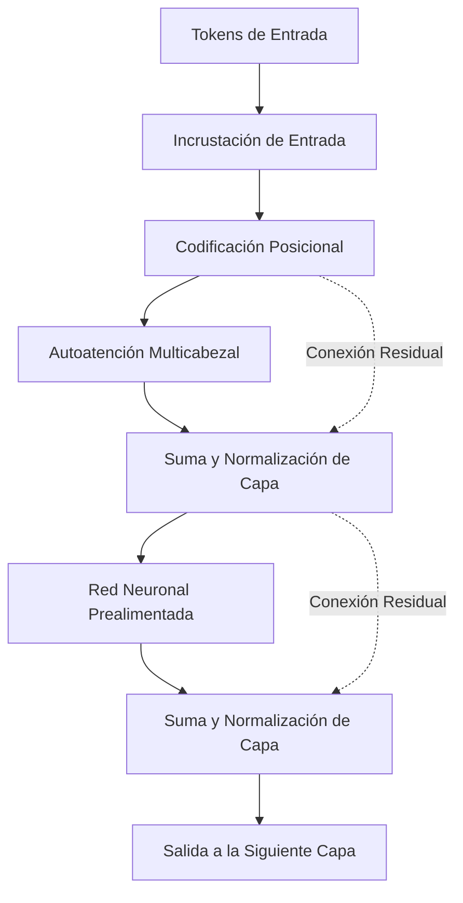
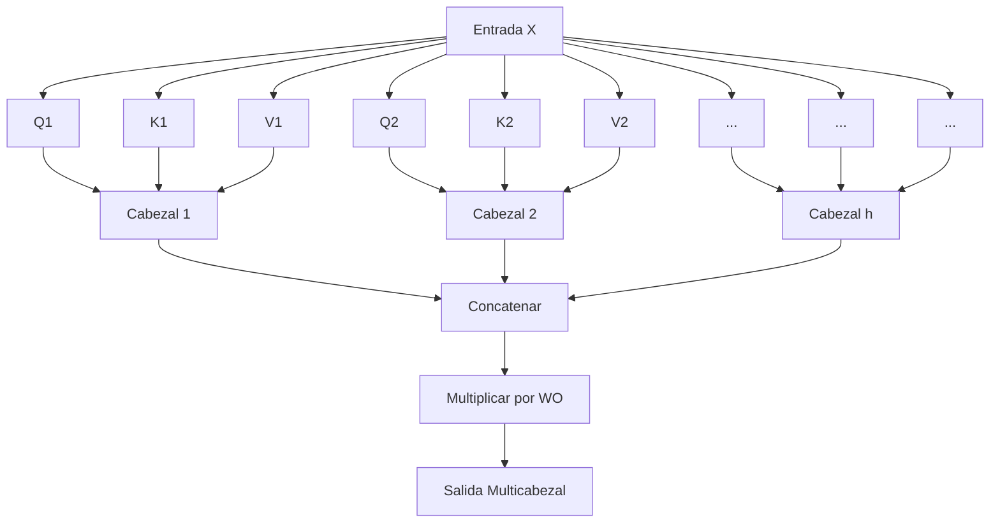

# Introducción: ¿Por qué aprender las matemáticas de Transformer?

No sería exagerado decir que "Transformer" es la arquitectura que reescribió la historia del procesamiento del lenguaje natural (NLP) moderno y de toda la IA en general. Propuesto por primera vez en 2017 por investigadores de Google en el artículo "Attention Is All You Need", este modelo funciona actualmente como el corazón de los grandes modelos de lenguaje (LLM) que dominan el mundo, como la serie GPT de OpenAI (la tecnología base de ChatGPT), BERT de Google y Claude de Anthropic.

Sin embargo, aunque es común encontrar explicaciones cualitativas sobre cómo funciona Transformer, como "utiliza un mecanismo de Attention (atención) para comprender el contexto", en realidad hay muy pocas explicaciones profundas dirigidas a principiantes sobre la **estructura matemática** que hay detrás. Para comprender verdaderamente cómo la IA procesa las "palabras" como "fórmulas matemáticas" y genera oraciones asombrosamente naturales, es indispensable descifrar su mecanismo matemático.

En este artículo, dirigido a personas con conocimientos básicos de matemáticas y programación (aquellos que comprenden conceptos de nivel de secundaria como matrices y derivadas), desentrañaremos de manera exhaustiva y fácil de entender la estructura matemática de los componentes centrales de Transformer: el "Mecanismo de Self-Attention", el "Modelo de Consulta, Clave y Valor (Q/K/V)", la "Normalización con la función Softmax" y el "Positional Encoding".

Es posible que te sientas abrumado por la cantidad de fórmulas matemáticas, pero cada cálculo tiene un "significado" claro. Para cuando termines de leer este artículo, deberías poder comprender que Transformer no es simplemente una caja negra mágica, sino un cristal de matemáticas y estadísticas diseñado con gran precisión.

---

# 1. Limitaciones de los métodos tradicionales y la innovación de Transformer

Antes de la aparición de Transformer, la corriente principal en el procesamiento del lenguaje natural eran las Redes Neuronales Recurrentes (RNN) y su derivado, LSTM (Long Short-Term Memory). Las RNN están diseñadas para procesar datos de series temporales y leen el texto palabra por palabra, secuencialmente desde el principio.

Sin embargo, las RNN tenían dos debilidades fatales:
1. **Dificultad para aprender dependencias a largo plazo**: A medida que las oraciones se vuelven más largas, la información de las primeras palabras ingresadas se desvanece antes de llegar al final (problema del desvanecimiento del gradiente).
2. **Imposibilidad de realizar cálculos en paralelo**: Dado que las palabras deben procesarse en orden, es difícil realizar cálculos paralelos a gran escala utilizando GPUs, lo que hace que el entrenamiento lleve una enorme cantidad de tiempo.

Transformer abandonó por completo la estructura de las RNN y provocó un cambio de paradigma al capturar el contexto utilizando únicamente "Attention". Esto hizo posible que, sin importar cuán larga sea la secuencia, no haya pérdida de información y se puedan paralelizar los cálculos para aprovechar al máximo el rendimiento de la GPU.

---

# 2. Arquitectura general de Transformer

Primero, demos un vistazo general a la arquitectura de Transformer. Transformer se compone principalmente de dos bloques: el "Encoder" (codificador) y el "Decoder" (decodificador). Tomando como ejemplo una tarea de traducción, el Encoder convierte el idioma de entrada (ej: inglés) en una representación vectorial matemática, y el Decoder genera el idioma de salida (ej: japonés) basándose en esa representación vectorial.

El siguiente diagrama es una simplificación de la estructura interna del bloque Encoder.



A partir de aquí, veamos paso a paso las operaciones matemáticas que se realizan en cada componente.

---

# 3. Vectorización de palabras y codificación posicional (Positional Encoding)

Las computadoras no pueden entender el texto tal cual. El texto de entrada primero se divide en unidades llamadas "Tokens", y cada uno se convierte en un vector de longitud fija. Esto es el **Input Embedding** (Incrustación de Entrada).

## 3.1 Las matemáticas de Input Embedding
Supongamos que el tamaño del vocabulario es $V$ y la dimensionalidad de los vectores de incrustación es $d_{model}$ (en el artículo original $d_{model} = 512$). Cada palabra $w_i$ se convierte en un vector $x_i \in \mathbb{R}^{d_{model}}$ utilizando una matriz de incrustación $W_E \in \mathbb{R}^{V \times d_{model}}$.

$$ x_i = W_E \cdot \text{one\_hot}(w_i) $$

Con esto, toda la oración se representa como una matriz $X \in \mathbb{R}^{N \times d_{model}}$ ($N$ es la longitud de la oración).

## 3.2 La necesidad y fórmulas de Positional Encoding (Codificación Posicional)
A diferencia de las RNN, Transformer no procesa las palabras en orden secuencial, sino que procesa todas las palabras de forma simultánea y paralela. Esto es una gran ventaja en términos de velocidad de cálculo, pero al mismo tiempo causa el problema de que **se pierde la importante información del "orden de las palabras"**. Por ejemplo, "El perro muerde al hombre" y "El hombre muerde al perro" tienen el mismo conjunto de palabras de entrada, pero significados completamente diferentes.

Para proporcionar esta información del orden de las palabras al modelo, se ideó el **Positional Encoding**.
El Positional Encoding $PE$ para la dimensión $i$-ésima de una palabra en la posición $pos$ se calcula utilizando las siguientes funciones trigonométricas.

$$ PE_{(pos, 2i)} = \sin\left(\frac{pos}{10000^{2i/d_{model}}}\right) $$
$$ PE_{(pos, 2i+1)} = \cos\left(\frac{pos}{10000^{2i/d_{model}}}\right) $$

Donde $pos$ es la posición de la palabra ($0, 1, 2, \dots, N-1$) e $i$ es el índice de la dimensión del vector ($0, 1, \dots, d_{model}/2 - 1$).

### ¿Por qué usar seno y coseno?
A simple vista parece una fórmula extremadamente compleja y extraña, pero hay una profunda razón matemática para esto. Al usar funciones trigonométricas, el modelo puede aprender fácilmente no solo la **"posición absoluta"**, sino también **la diferencia de "posición relativa"**.

Recuerda los teoremas de suma de funciones trigonométricas que se aprenden en la escuela secundaria.
$$ \sin(\alpha + \beta) = \sin\alpha \cos\beta + \cos\alpha \sin\beta $$
$$ \cos(\alpha + \beta) = \cos\alpha \cos\beta - \sin\alpha \sin\beta $$

El Positional Encoding de una posición $pos + k$, que está desplazada por un offset $k$ de una posición $pos$, se puede expresar como una combinación lineal del Positional Encoding de la posición $pos$. Es decir, utilizando una matriz $M_k$, se puede escribir de la siguiente manera:

$$ PE_{pos+k} = M_k \cdot PE_{pos} $$

De esta manera, el mecanismo de Attention puede reconocer fácilmente la distancia relativa entre las palabras ("qué tan lejos están") a través del cálculo del producto punto. Además, al combinar múltiples ondas senoidales y cosenoidales con diferentes longitudes de onda, existe la ventaja de poder generar vectores de posición únicos sin importar cuán larga sea la oración.

La matriz de entrada final $X_{input}$ será la suma de los vectores de incrustación de las palabras y esta codificación posicional.

$$ X_{input} = X + PE $$

---

# 4. Las matemáticas profundas de Self-Attention (Mecanismo de Autoatención)

Por fin, nos adentramos en el componente más importante de Transformer: **Self-Attention**. El propósito de Self-Attention es "calcular el grado de relación entre todas las palabras dentro de una oración y actualizar el vector de cada palabra a una representación más rica que tenga en cuenta el contexto".

Aquí se utiliza la analogía de un "sistema de búsqueda".
- **Query (Q)**: Consulta (Término de búsqueda). "¿Qué información estoy buscando ahora?"
- **Key (K)**: Clave (Encabezado). "¿Qué información poseo?"
- **Value (V)**: Valor (Entidad). "¿Qué información proporciono realmente?"

## 4.1 Generación de las matrices $Q, K, V$
Para una matriz de entrada $X \in \mathbb{R}^{N \times d_{model}}$ (ignoraremos el tamaño del lote aquí para simplificar), multiplicamos por las matrices de pesos aprendibles $W^Q, W^K, W^V \in \mathbb{R}^{d_{model} \times d_k}$ para calcular la consulta $Q$, la clave $K$ y el valor $V$. (Normalmente $d_k = d_v = d_{model} / h$)

$$ Q = X W^Q $$
$$ K = X W^K $$
$$ V = X W^V $$

Aquí, $Q, K, V$ son todas matrices de $\mathbb{R}^{N \times d_k}$.

## 4.2 Cálculo del Attention Score (Producto Punto)
Para medir qué tan relacionada está la Query de cada palabra con la Key de todas las demás palabras, calculamos el **producto punto** de los vectores. Expresado en operaciones de matrices, queda de la siguiente manera:

$$ \text{Scores} = Q K^T $$

Cada elemento $s_{ij}$ de la matriz resultante $\text{Scores} \in \mathbb{R}^{N \times N}$ obtenida por este cálculo representa el producto punto entre la Query de la palabra $i$ y la Key de la palabra $j$, es decir, la "fuerza de la relación".

## 4.3 Escalamiento (Scale)
Hay un problema con el cálculo de la puntuación mediante el producto punto. Cuando la dimensionalidad $d_k$ de los vectores se vuelve grande, el valor del producto punto puede volverse extremadamente grande o pequeño.

Demostremos esto matemáticamente.
Supongamos que cada elemento de la consulta $q \sim \mathcal{N}(0, 1)$ y cada elemento de la clave $k \sim \mathcal{N}(0, 1)$ siguen distribuciones normales estándar independientes.
Encontremos la media y la varianza del producto punto $q \cdot k = \sum_{i=1}^{d_k} q_i k_i$.
Media: Dado que $\mathbb{E}[q_i k_i] = \mathbb{E}[q_i] \mathbb{E}[k_i] = 0 \times 0 = 0$, la media de la suma también es $0$.
Varianza: La varianza de $q_i k_i$ es, debido a la independencia, $\text{Var}(q_i k_i) = \mathbb{E}[(q_i k_i)^2] - (\mathbb{E}[q_i k_i])^2 = 1 \times 1 - 0 = 1$.
Por lo tanto, la varianza de todo el producto punto será igual a la dimensionalidad $d_k$.

$$ \text{Var}(q \cdot k) = d_k $$

Si la varianza se vuelve grande, al aplicar la función Softmax más adelante, el gradiente para todo valor que no sea el máximo se volverá extremadamente pequeño (lo que se conoce como "desvanecimiento del gradiente"), lo que impedirá que el aprendizaje avance.
Para evitar esto, dividimos (escalamos) las puntuaciones por $\sqrt{d_k}$ para mantener la varianza siempre en $1$.

$$ \text{Scaled Scores} = \frac{Q K^T}{\sqrt{d_k}} $$

## 4.4 Probabilización mediante la función Softmax
Para convertir las puntuaciones obtenidas en una distribución de probabilidad (pesos) cuya suma sea $1$, aplicamos la **función Softmax** fila por fila.

$$ a_{ij} = \text{softmax}(s_i)_j = \frac{\exp(s_{ij} / \sqrt{d_k})}{\sum_{m=1}^N \exp(s_{im} / \sqrt{d_k})} $$

La matriz $A \in \mathbb{R}^{N \times N}$ se denomina matriz de Attention Weight (Pesos de Atención). Al observar cada fila $i$ de esta matriz, podemos ver expresado como un valor de 0 a 1 "a qué otras palabras $j$ y en qué medida se debe prestar atención (Attention) para comprender la palabra $i$".

## 4.5 Suma ponderada de Value
Finalmente, utilizamos la matriz de Attention Weight $A$ obtenida para calcular la suma ponderada de la matriz Value $V$.

$$ \text{Output} = A V = \text{softmax}\left(\frac{Q K^T}{\sqrt{d_k}}\right) V $$

La matriz $Z \in \mathbb{R}^{N \times d_v}$ obtenida mediante esta operación es un conjunto de "representaciones vectoriales de palabras actualizadas teniendo en cuenta el contexto".
Esta es la totalidad del **Scaled Dot-Product Attention** definido en el artículo.

---

# 5. Multi-Head Attention (Atención Multicabezal)

Con un solo cálculo de Attention (cabezal único), existe la posibilidad de que solo se capture el contexto desde un único punto de vista (por ejemplo, la "relación gramatical"). Por lo tanto, para capturar simultáneamente diversas relaciones semánticas y sintácticas del lenguaje (como "sujeto y predicado", "pronombre y su referente", etc.), se introdujo el **Multi-Head Attention**.

Realizamos la generación anterior de $Q, K, V$ y el cálculo de Attention en paralelo $h$ veces (número de cabezales, $h=8$ en el artículo original).

$$ \text{head}_i = \text{Attention}(X W_i^Q, X W_i^K, X W_i^V) $$

Aquí, $W_i^Q, W_i^K, W_i^V \in \mathbb{R}^{d_{model} \times d_k}$ son matrices de pesos aprendibles dedicadas para el cabezal $i$-ésimo.

Los resultados emitidos desde cada cabezal $\text{head}_i \in \mathbb{R}^{N \times d_v}$ se concatenan horizontalmente (Concatenate).

$$ \text{Concat}(\text{head}_1, \dots, \text{head}_h) \in \mathbb{R}^{N \times (h \cdot d_v)} $$

Normalmente se configura para que $h \cdot d_v = d_{model}$, de modo que la dimensionalidad después de la concatenación vuelva a ser $d_{model}$ como en la entrada. Finalmente, multiplicamos esta matriz por una matriz de pesos $W^O \in \mathbb{R}^{d_{model} \times d_{model}}$ para obtener la salida final.

$$ \text{MultiHead}(Q, K, V) = \text{Concat}(\text{head}_1, \dots, \text{head}_h) W^O $$



---

# 6. Feed-Forward Neural Network (FFN)

La salida de Multi-Head Attention se introduce a continuación en una **Position-wise Feed-Forward Network (FFN)**.
Esta es una red neuronal totalmente conectada de dos capas que se aplica "independientemente para cada posición (palabra)" en la secuencia.

Expresado matemáticamente, se ve de la siguiente manera:

$$ \text{FFN}(x) = \max(0, x W_1 + b_1) W_2 + b_2 $$

Aquí, $\max(0, z)$ representa la función de activación ReLU (Rectified Linear Unit) (en los modelos recientes se usan a menudo GELU o SwiGLU).

El papel de esta red es sumamente importante. Mientras que el mecanismo de Attention aprende "las relaciones entre palabras (relaciones espaciales/secuenciales)", la FFN se encarga de "la transformación no lineal de características de cada vector de palabra en sí".
Normalmente, la dimensionalidad se expande significativamente en la primera capa mediante los pesos $W_1$ (por ejemplo, de $d_{model}=512$ a $d_{ff}=2048$, expandiéndose 4 veces), se realizan cálculos complejos en el espacio de características y, luego, en la segunda capa se vuelve a la dimensión original utilizando los pesos $W_2$. Esta "expansión y reducción de dimensiones" aumenta dramáticamente el poder de representación del modelo.

---

# 7. Conexiones Residuales (Residual Connection) y Normalización de Capas (Layer Normalization)

En el aprendizaje profundo, al hacer que las redes sean más profundas, los gradientes tienden a desvanecerse o explotar durante el entrenamiento, lo que provoca que el aprendizaje falle. Para prevenir esto, alrededor de cada subcapa (Attention y FFN) de Transformer, se han colocado una **Conexión Residual (Residual Connection)** y una **Normalización de Capas (Layer Normalization)**.

Matemáticamente, la salida de la subcapa se procesa de la siguiente manera:

$$ \text{Output} = \text{LayerNorm}(x + \text{Sublayer}(x)) $$

## 7.1 Conexión Residual ($x + \text{Sublayer}(x)$)
La entrada $x$ se suma directamente a la salida de la subcapa. Esto permite que el gradiente viaje directamente a las capas más superficiales a través del atajo durante la retropropagación, estabilizando así el aprendizaje incluso si se añaden más capas.

## 7.2 Las matemáticas de Layer Normalization
La Layer Normalization es una técnica que calcula la media y la varianza a lo largo de la dimensión de las características y normaliza los datos. En una entrada con tamaño de lote $B$, longitud de secuencia $N$ y dimensionalidad $d_{model}$, la normalización se realiza para un único vector de palabra $x \in \mathbb{R}^{d_{model}}$.

Se calculan la media $\mu$ y la varianza $\sigma^2$:
$$ \mu = \frac{1}{d_{model}} \sum_{i=1}^{d_{model}} x_i $$
$$ \sigma^2 = \frac{1}{d_{model}} \sum_{i=1}^{d_{model}} (x_i - \mu)^2 $$

Y se obtiene la salida normalizada $\hat{x}$:
$$ \text{LN}(x) = \frac{x - \mu}{\sqrt{\sigma^2 + \epsilon}} \odot \gamma + \beta $$
(Donde $\epsilon$ es una constante minúscula para evitar la división por cero. $\gamma$ y $\beta$ son parámetros de escala y desplazamiento aprendibles).

La razón por la que se adoptó la normalización a lo largo de las capas (Layer Normalization) en lugar de la normalización a lo largo de los lotes (Batch Normalization) es que las estadísticas entre lotes tienden a volverse inestables al procesar datos de secuencia de longitudes variables, como las oraciones. Con Layer Normalization, Transformer puede realizar un aprendizaje estable de forma independiente del tamaño del lote.

---

# 8. Estructuras específicas del Decoder: Masked Attention y Cross-Attention

La estructura que hemos explicado hasta ahora es la del Encoder. En el bloque del Decoder que genera las oraciones, la estructura es un poco diferente.

## 8.1 Masked Multi-Head Attention
El papel del Decoder es "predecir la siguiente palabra a partir de las palabras pasadas". Por lo tanto, si "mira las palabras futuras" durante el entrenamiento, sería hacer trampa. La operación matemática para prevenir esto es el **Masking** (Enmascaramiento).

A la matriz de puntuaciones $Q K^T$, le sumamos una matriz de máscara $M$ que establece un valor extremadamente pequeño cercano a $-\infty$ en la parte triangular superior (correspondiente a la información futura).

$$ M_{ij} = \begin{cases} 0 & (i \le j) \\ -\infty & (i > j) \end{cases} $$

$$ \text{Masked Attention}(Q, K, V) = \text{softmax}\left(\frac{Q K^T + M}{\sqrt{d_k}}\right) V $$

Al calcular la función Softmax, dado que $\exp(-\infty) = 0$, el Attention Weight para las palabras futuras se vuelve completamente $0$. Esto permite una generación autorregresiva manteniendo la causalidad (Causality).

## 8.2 Encoder-Decoder Cross-Attention
La segunda subcapa del Decoder es el **Cross-Attention**, que hace referencia a la salida del Encoder.
Aquí, $Q$ se genera a partir de la capa anterior del Decoder, mientras que $K$ y $V$ se generan a partir de la salida de la capa final del Encoder.

$$ Q_{decoder} = X_{dec} W^Q $$
$$ K_{encoder} = X_{enc} W^K $$
$$ V_{encoder} = X_{enc} W^V $$

Con este cálculo, en tareas como la traducción, el modelo puede aprender "a qué parte de la oración original extranjera está fuertemente relacionada la palabra que se está traduciendo ahora".

---

# 9. Complejidad computacional y las matemáticas de la optimización moderna

Aunque Transformer es un modelo maravilloso, también tiene "debilidades" debidas a su estructura matemática.
Preste atención a la complejidad computacional del Self-Attention. En el cálculo de la matriz de puntuación $Q K^T$, multiplicamos una matriz de $(N \times d_k)$ por una matriz de $(d_k \times N)$, por lo que la complejidad es **$O(N^2 \cdot d_{model})$**.

Es decir, **el costo computacional y el uso de memoria aumentan de manera cuadrática con respecto a la longitud de la secuencia $N$**.
Cuando las oraciones son cortas esto no es un problema, pero si intentas ingresar a un LLM un contexto extremadamente largo, como el de un libro entero, $N$ alcanza las decenas o cientos de miles, y el cálculo tradicional de Attention agotará inmediatamente la memoria de la GPU.

Para romper esta maldición de $O(N^2)$, en los últimos años se han propuesto varias optimizaciones desde perspectivas matemáticas y de hardware.
El ejemplo más representativo es **FlashAttention**. FlashAttention es un algoritmo que divide el cálculo de Attention en mosaicos (Tiling) para minimizar la transferencia de datos (accesos a memoria) entre la jerarquía de memoria de la GPU (SRAM y HBM). A pesar de arrojar matemáticamente el mismo resultado exacto que el Attention estándar (Exact Attention), ha logrado una aceleración y reducción de memoria dramáticas gracias a la optimización a nivel de hardware, haciendo posible la realización de modelos de contexto largo como GPT-4.

Además, se están investigando activamente otras aproximaciones de la complejidad computacional como $O(N \log N)$ y $O(N)$, tales como Sparse Attention y Linear Attention.

---

# 10. Imagen de implementación (Pseudocódigo al estilo PyTorch)

Si trasladamos la estructura matemática explicada hasta aquí a un código de programación real (Python / PyTorch), veremos que se puede escribir de una forma asombrosamente simple. Aquí mostramos el pseudocódigo del núcleo de Self-Attention.

```python
import torch
import torch.nn.functional as F
import math

def scaled_dot_product_attention(q, k, v, mask=None):
    # formas de q, k, v: [batch_size, num_heads, seq_length, d_k]
    d_k = q.size(-1)
    
    # 1. Cálculo de puntuación mediante producto punto: Q * K^T
    # Se calculan los productos de las matrices transponiendo las dos últimas dimensiones
    scores = torch.matmul(q, k.transpose(-2, -1))
    
    # 2. Escalamiento
    scores = scores / math.sqrt(d_k)
    
    # 3. Enmascaramiento (En el caso de Masked Attention)
    if mask is not None:
        scores = scores.masked_fill(mask == 0, -1e9)
        
    # 4. Probabilización mediante Softmax
    attention_weights = F.softmax(scores, dim=-1)
    
    # 5. Multiplicación por la matriz Value
    output = torch.matmul(attention_weights, v)
    
    return output, attention_weights
```

Podemos ver que el $Q K^T / \sqrt{d_k}$ expresado matemáticamente, se implementa de manera intuitiva como `torch.matmul(q, k.transpose(-2, -1)) / math.sqrt(d_k)`. Es un aspecto sumamente interesante del aprendizaje profundo que la teoría matemática pueda materializarse en unas pocas líneas de código con la ayuda de bibliotecas de optimización avanzadas.

---

# Conclusión: La forma de la "Inteligencia" vista desde las fórmulas matemáticas

En este artículo, hemos desentrañado la estructura matemática profunda del modelo Transformer.

El Embedding que asigna palabras a un espacio vectorial multidimensional, el Positional Encoding que expresa la información de posición como la composición de ondas trigonométricas, y el mecanismo de Self-Attention, un cálculo de producto punto de matrices nacido de una analogía con la recuperación de información. Cada uno de estos componentes no es más que una acumulación de matemáticas fundamentales como el álgebra lineal, el cálculo diferencial e integral, y la probabilidad y estadística.

Sin embargo, cuando estas simples operaciones matriciales se apilan en numerosas capas y aprenden patrones de gigantescos conjuntos de datos a través de miles de millones o billones de parámetros, surge una "forma de inteligencia" que parece comprender nuestras "palabras", realizar deducciones lógicas y, a veces, generar ideas creativas.

Como sugiere el provocador título "Attention Is All You Need", la belleza de esta arquitectura, que descarta los complejos procesamientos recurrentes o convolucionales y se especializa en el puro cálculo de "Atención" (grado de relación), reside precisamente en su simplicidad matemática.

En el futuro, podrían surgir nuevas arquitecturas que superen a Transformer (como los State Space Models, por ejemplo, Mamba), pero el marco matemático de "comprensión del contexto mediante Attention" forjado por Transformer quedará grabado para siempre en la historia de la IA.

Si en el futuro tienes la oportunidad de usar LLMs como ChatGPT o Claude, imagina los billones de multiplicaciones de matrices de $Q K^T$ por segundo y las funciones Softmax calculando probabilidades en segundo plano. Esto aumentará tu resolución sobre la tecnología y hará que el mundo de la IA te parezca aún más fascinante.

### Referencias
- Vaswani, A., et al. (2017). "Attention Is All You Need." *Advances in Neural Information Processing Systems*.
- Alammar, J. (2018). "The Illustrated Transformer." 

---
*Este artículo fue escrito como una guía para aquellos que aprenden los fundamentos matemáticos del procesamiento de lenguaje natural y la inteligencia artificial. ¡Si tienes alguna pregunta o discusión, por favor háznoslo saber en la sección de comentarios!*
