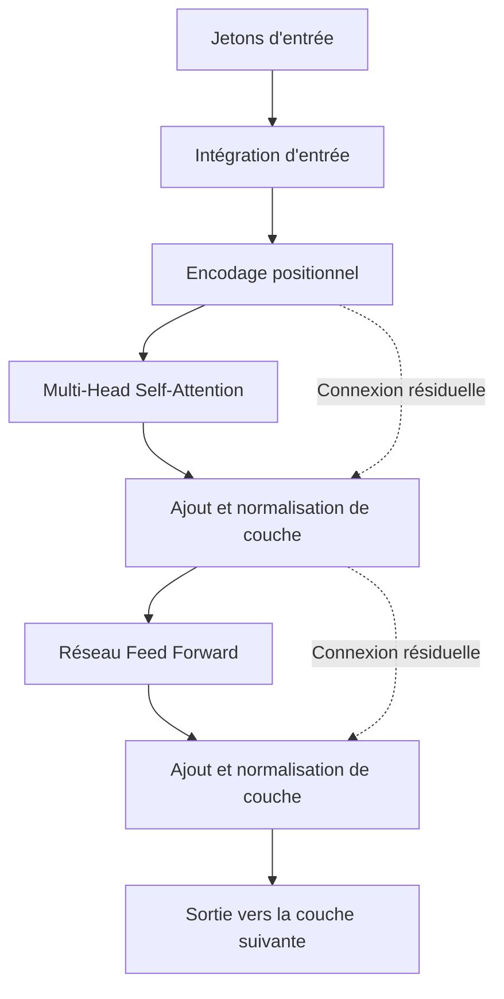
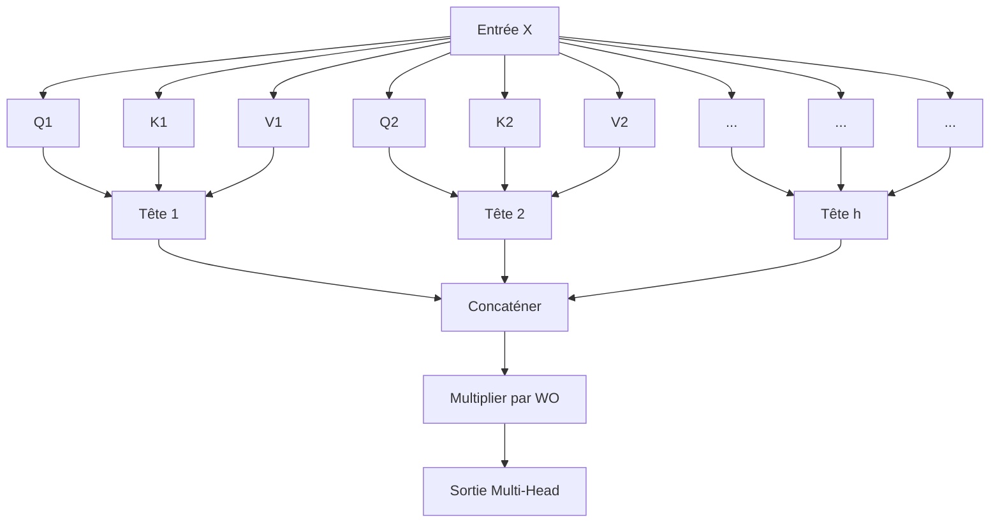

# Introduction : Pourquoi apprendre les mathématiques du Transformer ?

Il n'est pas exagéré de dire que le "Transformer" est l'architecture qui a réécrit l'histoire du traitement du langage naturel (NLP) moderne et de l'IA dans son ensemble. Ce modèle, proposé pour la première fois dans l'article "Attention Is All You Need" publié par des chercheurs de Google en 2017, sert de cœur aux grands modèles de langage (LLM) qui dominent actuellement le monde, tels que la série GPT d'OpenAI (la technologie sous-jacente de ChatGPT), BERT de Google et Claude d'Anthropic.

Cependant, bien que l'on trouve souvent des explications qualitatives sur le fonctionnement du Transformer telles que "comprendre le contexte en utilisant l'Attention (mécanisme d'attention)", il existe actuellement très peu d'explications approfondies destinées aux débutants sur la **structure mathématique** qui se cache derrière. Pour vraiment comprendre comment l'IA traite les "mots" comme des "formules mathématiques" et génère des textes étonnamment naturels, il est essentiel de décrypter son mécanisme mathématique.

Dans cet article, destiné à ceux qui ont des connaissances de base en mathématiques et en programmation (ceux qui comprennent les concepts de matrices et de dérivées au niveau du lycée), nous allons décrypter de manière exhaustive et compréhensible les structures mathématiques qui constituent le cœur du Transformer, telles que le "mécanisme de Self-Attention", le modèle "Requête-Clé-Valeur (Q/K/V)", la "normalisation par la fonction Softmax" et le "Positional Encoding".

Vous pourriez être submergé par la liste des formules, mais chaque calcul a une "signification" claire. À la fin de cet article, vous devriez comprendre que le Transformer n'est pas simplement une boîte noire magique, mais l'aboutissement de mathématiques et de statistiques conçues avec précision.

---

# 1. Les limites des méthodes traditionnelles et l'innovation du Transformer

Avant l'apparition du Transformer, le courant principal du traitement du langage naturel était les réseaux de neurones récurrents (RNN) et leurs dérivés, les LSTM (Long Short-Term Memory). Les RNN ont été conçus pour traiter des données chronologiques et lisent les phrases mot par mot, dans l'ordre, depuis le début.

Cependant, les RNN présentaient deux faiblesses fatales.
1. **Difficulté d'apprentissage des dépendances à long terme** : Lorsque les phrases deviennent longues, les informations des mots saisis au début s'estompent avant d'atteindre la fin (problème de la disparition du gradient).
2. **Impossibilité de calcul parallèle** : Comme les mots doivent être traités séquentiellement, il est difficile d'effectuer des calculs parallèles à grande échelle à l'aide de GPU, ce qui nécessite un temps énorme pour l'apprentissage.

Le Transformer a complètement abandonné la structure des RNN et a provoqué un changement de paradigme consistant à capturer le contexte en utilisant uniquement l'"Attention". Grâce à cela, quelle que soit la longueur de la séquence, il n'y a aucune perte d'information, et il est devenu possible de paralléliser les calculs pour maximiser les performances du GPU.

---

# 2. L'architecture globale du Transformer

Commençons par examiner l'architecture globale du Transformer. Le Transformer est composé principalement de deux blocs : l'"Encoder" (encodeur) et le "Decoder" (décodeur). Si l'on prend l'exemple d'une tâche de traduction, l'Encoder convertit la langue source (ex : anglais) en une représentation vectorielle mathématique, et le Decoder génère la langue cible (ex : japonais) à partir de cette représentation vectorielle.

Le diagramme ci-dessous est une simplification de la structure interne du bloc Encoder.



À partir d'ici, examinons étape par étape les opérations mathématiques effectuées dans chaque composant.

---

# 3. Vectorisation des mots et encodage positionnel (Positional Encoding)

Un ordinateur ne peut pas comprendre le texte tel quel. Le texte d'entrée est d'abord divisé en unités appelées "jetons" (Tokens), et chacun est converti en un vecteur de longueur fixe. C'est ce qu'on appelle l'**Input Embedding** (Intégration d'entrée).

## 3.1 Les mathématiques de l'Input Embedding
Soit $V$ la taille du vocabulaire et $d_{model}$ la dimension des vecteurs d'intégration (dans l'article original, $d_{model} = 512$). Chaque mot $w_i$ est converti en un vecteur $x_i \in \mathbb{R}^{d_{model}}$ à l'aide de la matrice d'intégration $W_E \in \mathbb{R}^{V \times d_{model}}$.

$$ x_i = W_E \cdot \text{one\_hot}(w_i) $$

Ainsi, la phrase entière est représentée comme une matrice $X \in \mathbb{R}^{N \times d_{model}}$ ($N$ étant la longueur de la phrase).

## 3.2 La nécessité et les formules du Positional Encoding (Encodage positionnel)
Le Transformer ne traite pas les mots séquentiellement comme les RNN, mais traite tous les mots simultanément et en parallèle. Bien que cela soit un grand avantage du point de vue de la vitesse de calcul, cela pose le problème que **l'information importante de "l'ordre des mots" est perdue**. Par exemple, "Un chien mord un homme" et "Un homme mord un chien" ont le même ensemble de mots en entrée, mais des significations complètement différentes.

Le **Positional Encoding** a été conçu pour fournir cette information d'ordre des mots au modèle.
Le Positional Encoding $PE$ pour la dimension $i$ du mot situé à la position $pos$ est calculé à l'aide des fonctions trigonométriques suivantes.

$$ PE_{(pos, 2i)} = \sin\left(\frac{pos}{10000^{2i/d_{model}}}\right) $$
$$ PE_{(pos, 2i+1)} = \cos\left(\frac{pos}{10000^{2i/d_{model}}}\right) $$

Où $pos$ est la position du mot ($0, 1, 2, \dots, N-1$), et $i$ est l'indice de la dimension du vecteur ($0, 1, \dots, d_{model}/2 - 1$).

### Pourquoi utiliser le sinus et le cosinus ?
À première vue, cela ressemble à une formule très complexe et étrange, mais il y a une raison mathématique profonde à cela. En utilisant des fonctions trigonométriques, le modèle peut facilement apprendre non seulement les **"positions absolues" mais aussi les différences de "positions relatives"**.

Rappelez-vous les formules d'addition trigonométriques apprises au lycée.
$$ \sin(\alpha + \beta) = \sin\alpha \cos\beta + \cos\alpha \sin\beta $$
$$ \cos(\alpha + \beta) = \cos\alpha \cos\beta - \sin\alpha \sin\beta $$

Le Positional Encoding d'une position $pos + k$ décalée d'un offset $k$ par rapport à une position $pos$ peut être exprimé comme une combinaison linéaire du Positional Encoding de la position $pos$. C'est-à-dire, en utilisant une matrice $M_k$, cela peut s'écrire ainsi :

$$ PE_{pos+k} = M_k \cdot PE_{pos} $$

Ainsi, le mécanisme d'Attention peut facilement reconnaître la distance relative "à quelle distance" se trouvent les mots les uns par rapport aux autres grâce au calcul du produit scalaire. De plus, en combinant plusieurs ondes de sinus et cosinus de longueurs d'onde différentes, il y a l'avantage de pouvoir générer un vecteur de position unique, quelle que soit la longueur de la phrase.

La matrice d'entrée finale $X_{input}$ est la somme des vecteurs d'intégration des mots et de cet encodage positionnel.

$$ X_{input} = X + PE $$

---

# 4. Les mathématiques profondes de la Self-Attention (Mécanisme d'auto-attention)

Nous entrons enfin dans le composant le plus important du Transformer, la **Self-Attention** (mécanisme d'auto-attention). L'objectif de la Self-Attention est de "calculer le degré de pertinence entre tous les mots de la phrase et de mettre à jour le vecteur de chaque mot vers une représentation plus riche qui prend en compte le contexte".

Ici, nous utilisons l'analogie d'un "système de recherche".
- **Query (Q)** : Requête (terme de recherche). "Quelle est l'information que je cherche maintenant ?"
- **Key (K)** : Clé (en-tête). "Quelle est l'information que je possède ?"
- **Value (V)** : Valeur (entité). "Quelle est l'information que je fournis réellement ?"

## 4.1 Génération des matrices $Q, K, V$
Pour la matrice d'entrée $X \in \mathbb{R}^{N \times d_{model}}$ (pour simplifier, nous ignorons la taille du batch ici), nous calculons la requête $Q$, la clé $K$ et la valeur $V$ en multipliant par les matrices de poids apprenables $W^Q, W^K, W^V \in \mathbb{R}^{d_{model} \times d_k}$. (Généralement $d_k = d_v = d_{model} / h$)

$$ Q = X W^Q $$
$$ K = X W^K $$
$$ V = X W^V $$

Ici, $Q, K, V$ sont toutes des matrices de $\mathbb{R}^{N \times d_k}$.

## 4.2 Calcul de l'Attention Score (Produit scalaire)
Pour mesurer à quel point la Query de chaque mot est liée aux Key de tous les autres mots, nous calculons le **produit scalaire** des vecteurs. Écrit en opérations matricielles, cela donne :

$$ \text{Scores} = Q K^T $$

Chaque élément $s_{ij}$ de la matrice $\text{Scores} \in \mathbb{R}^{N \times N}$ obtenue par ce calcul représente le produit scalaire entre la Query du $i$-ème mot et la Key du $j$-ème mot, c'est-à-dire "l'intensité de la pertinence".

## 4.3 Mise à l'échelle (Scale)
Il y a un problème avec le calcul du score par produit scalaire. Lorsque la dimension des vecteurs $d_k$ augmente, la valeur du produit scalaire devient extrêmement grande ou petite.

Prouvons-le mathématiquement.
Supposons que chaque élément de la requête $q \sim \mathcal{N}(0, 1)$ et chaque élément de la clé $k \sim \mathcal{N}(0, 1)$ suivent des distributions normales centrées réduites indépendantes.
Nous cherchons la moyenne et la variance du produit scalaire $q \cdot k = \sum_{i=1}^{d_k} q_i k_i$.
Moyenne : Comme $\mathbb{E}[q_i k_i] = \mathbb{E}[q_i] \mathbb{E}[k_i] = 0 \times 0 = 0$, la moyenne de la somme est aussi $0$.
Variance : La variance de $q_i k_i$ est, par indépendance, $\text{Var}(q_i k_i) = \mathbb{E}[(q_i k_i)^2] - (\mathbb{E}[q_i k_i])^2 = 1 \times 1 - 0 = 1$.
Par conséquent, la variance totale du produit scalaire est égale à la dimension $d_k$.

$$ \text{Var}(q \cdot k) = d_k $$

Si la variance devient grande, la fonction Softmax appliquée par la suite entraînera une "disparition du gradient" où les gradients des valeurs autres que le maximum deviendront extrêmement petits, ce qui empêchera l'apprentissage de progresser.
Pour éviter cela, nous divisons (mettons à l'échelle) les scores par $\sqrt{d_k}$ afin de maintenir la variance toujours à $1$.

$$ \text{Scaled Scores} = \frac{Q K^T}{\sqrt{d_k}} $$

## 4.4 Probabilisation par la fonction Softmax
Afin de convertir les scores obtenus en une distribution de probabilité (poids) dont la somme est de $1$, nous appliquons la **fonction Softmax** ligne par ligne.

$$ a_{ij} = \text{softmax}(s_i)_j = \frac{\exp(s_{ij} / \sqrt{d_k})}{\sum_{m=1}^N \exp(s_{im} / \sqrt{d_k})} $$

La matrice $A \in \mathbb{R}^{N \times N}$ est appelée matrice de poids d'attention (Attention Weight). Si l'on regarde chaque ligne $i$ de cette matrice, "dans quelle mesure faut-il prêter attention au mot $j$ pour comprendre le mot $i$" est exprimé par une valeur allant de 0 à 1.

## 4.5 Somme pondérée des Value
Enfin, en utilisant la matrice Attention Weight $A$ obtenue, nous calculons la somme pondérée de la matrice Value $V$.

$$ \text{Output} = A V = \text{softmax}\left(\frac{Q K^T}{\sqrt{d_k}}\right) V $$

La matrice $Z \in \mathbb{R}^{N \times d_v}$ produite par cette opération est un ensemble de "représentations vectorielles de mots mises à jour en tenant compte du contexte".
C'est la vue d'ensemble du **Scaled Dot-Product Attention** défini dans l'article.

---

# 5. Multi-Head Attention (Attention multi-têtes)

Avec un seul calcul d'Attention (tête unique), il est possible de ne capturer le contexte que d'un seul point de vue (par exemple, "la relation grammaticale"). Par conséquent, pour capturer simultanément les diverses relations sémantiques et syntaxiques du langage (comme "sujet et prédicat", "pronom et son référent", etc.), la **Multi-Head Attention** a été introduite.

La génération de $Q, K, V$ et le calcul de l'Attention précédents sont effectués en parallèle $h$ fois (nombre de têtes. Dans l'article original $h=8$).

$$ \text{head}_i = \text{Attention}(X W_i^Q, X W_i^K, X W_i^V) $$

Ici, $W_i^Q, W_i^K, W_i^V \in \mathbb{R}^{d_{model} \times d_k}$ sont des matrices de poids apprenables dédiées à la $i$-ème tête.

Les résultats $\text{head}_i \in \mathbb{R}^{N \times d_v}$ de chaque tête sont concaténés horizontalement.

$$ \text{Concat}(\text{head}_1, \dots, \text{head}_h) \in \mathbb{R}^{N \times (h \cdot d_v)} $$

Habituellement, on paramètre de telle sorte que $h \cdot d_v = d_{model}$, donc la dimension après concaténation revient à $d_{model}$, identique à l'entrée. Enfin, cette matrice est multipliée par une matrice de poids $W^O \in \mathbb{R}^{d_{model} \times d_{model}}$ pour obtenir la sortie finale.

$$ \text{MultiHead}(Q, K, V) = \text{Concat}(\text{head}_1, \dots, \text{head}_h) W^O $$



---

# 6. Réseau de neurones Feed-Forward (FFN)

La sortie de la Multi-Head Attention est ensuite introduite dans un **Position-wise Feed-Forward Network (FFN)**.
Il s'agit d'un réseau de neurones entièrement connecté à deux couches appliqué "indépendamment à chaque position (mot)" de la séquence.

Exprimé par des formules, cela donne :

$$ \text{FFN}(x) = \max(0, x W_1 + b_1) W_2 + b_2 $$

Ici, $\max(0, z)$ représente la fonction d'activation ReLU (Rectified Linear Unit) (dans les modèles récents, GELU ou SwiGLU sont souvent utilisés).

Le rôle de ce réseau est très important. Le mécanisme d'Attention apprend les "relations entre les mots (relations spatiales et séquentielles)", tandis que le FFN se charge de la "transformation de caractéristiques non linéaires du vecteur de chaque mot lui-même".
Habituellement, la dimension est temporairement considérablement augmentée par le poids $W_1$ de la première couche (par exemple, augmentée 4 fois, de $d_{model}=512$ à $d_{ff}=2048$), et après avoir effectué des calculs complexes dans l'espace des caractéristiques, elle est ramenée à sa dimension d'origine par le poids $W_2$ de la deuxième couche. Cette "expansion et réduction de dimension" augmente considérablement la puissance expressive du modèle.

---

# 7. Connexions résiduelles (Residual Connection) et Layer Normalization

En apprentissage profond, lorsque les couches du réseau sont approfondies, il y a un problème de disparition ou d'explosion des gradients pendant l'apprentissage, ce qui empêche un apprentissage correct. Pour éviter cela, des **connexions résiduelles (Residual Connection)** et une **Layer Normalization (normalisation de couche)** sont placées autour de chaque sous-couche (Attention et FFN) du Transformer.

Écrit mathématiquement, la sortie de la sous-couche est traitée comme suit :

$$ \text{Output} = \text{LayerNorm}(x + \text{Sublayer}(x)) $$

## 7.1 Connexion résiduelle ($x + \text{Sublayer}(x)$)
L'entrée $x$ est directement ajoutée à la sortie de la sous-couche. Ainsi, lors de la rétropropagation, le gradient est transmis directement aux couches peu profondes via ce raccourci, ce qui stabilise l'apprentissage même si les couches sont profondes.

## 7.2 Les mathématiques de la Layer Normalization
La Layer Normalization est une technique de normalisation des données en calculant la moyenne et la variance le long de la dimension des caractéristiques. Pour une entrée de taille de batch $B$, de longueur de séquence $N$ et de dimension $d_{model}$, la normalisation est effectuée sur un seul vecteur de mot $x \in \mathbb{R}^{d_{model}}$.

On calcule la moyenne $\mu$ et la variance $\sigma^2$.
$$ \mu = \frac{1}{d_{model}} \sum_{i=1}^{d_{model}} x_i $$
$$ \sigma^2 = \frac{1}{d_{model}} \sum_{i=1}^{d_{model}} (x_i - \mu)^2 $$

Et nous obtenons la sortie normalisée $\hat{x}$.
$$ \text{LN}(x) = \frac{x - \mu}{\sqrt{\sigma^2 + \epsilon}} \odot \gamma + \beta $$
($\epsilon$ est une petite constante pour éviter la division par zéro. $\gamma, \beta$ sont des paramètres apprenables de mise à l'échelle et de décalage)

La raison d'adopter la normalisation de couche (Layer Normalization) plutôt que la normalisation de batch (Batch Normalization) est que lors du traitement de données séquentielles de longueur variable comme des phrases, les statistiques entre les batchs ont tendance à devenir instables. Grâce à la Layer Normalization, le Transformer peut effectuer un apprentissage stable indépendamment de la taille du batch.

---

# 8. Structures spécifiques au décodeur : Masked Attention et Cross-Attention

La structure expliquée jusqu'à présent est celle de l'encodeur. Dans le bloc décodeur qui génère les phrases, la structure est légèrement différente.

## 8.1 Masked Multi-Head Attention
Le rôle du décodeur est de "prédire le mot suivant à partir des mots passés". Par conséquent, regarder les "mots futurs" pendant l'entraînement s'apparenterait à tricher. L'opération mathématique pour éviter cela est le **Masking (masquage)**.

À la matrice de scores $Q K^T$, on ajoute une matrice de masque $M$ qui définit des valeurs très petites proches de $-\infty$ dans la partie triangulaire supérieure (correspondant aux informations futures).

$$ M_{ij} = \begin{cases} 0 & (i \le j) \\ -\infty & (i > j) \end{cases} $$

$$ \text{Masked Attention}(Q, K, V) = \text{softmax}\left(\frac{Q K^T + M}{\sqrt{d_k}}\right) V $$

Lors du calcul de la fonction Softmax, puisque $\exp(-\infty) = 0$, l'Attention Weight pour les mots futurs devient complètement $0$. Cela permet une génération autorégressive en préservant la causalité (Causality).

## 8.2 Encoder-Decoder Cross-Attention
La deuxième sous-couche du décodeur est la **Cross-Attention** qui se réfère à la sortie de l'encodeur.
Ici, $Q$ est généré à partir de la couche de décodage précédente, mais $K$ et $V$ sont générés à partir de la sortie de la dernière couche de l'encodeur.

$$ Q_{decoder} = X_{dec} W^Q $$
$$ K_{encoder} = X_{enc} W^K $$
$$ V_{encoder} = X_{enc} W^V $$

Grâce à ce calcul, le modèle peut apprendre, par exemple dans une tâche de traduction, "à quelle partie de la phrase en langue étrangère d'origine le mot actuellement traduit est-il fortement lié".

---

# 9. Complexité de calcul et mathématiques de l'optimisation moderne

Le Transformer est un modèle formidable, mais il a aussi des "faiblesses" dues à sa structure mathématique.
Faites attention à la complexité de calcul de la Self-Attention. Le calcul de la matrice de scores $Q K^T$ nécessite de multiplier une matrice de $(N \times d_k)$ par une matrice de $(d_k \times N)$, sa complexité de calcul est donc de **$O(N^2 \cdot d_{model})$**.

En d'autres termes, **la quantité de calculs et l'utilisation de la mémoire augmentent de manière quadratique par rapport à la longueur de la séquence $N$**.
Cela ne pose pas de problème si la phrase est courte, mais si vous essayez de saisir un long contexte tel qu'un livre entier dans un LLM, $N$ atteint des dizaines à des centaines de milliers, et la mémoire du GPU s'épuise immédiatement avec le calcul classique de l'Attention.

Pour briser cette malédiction de $O(N^2)$, diverses optimisations basées sur des approches mathématiques et matérielles ont été proposées ces dernières années.
Un exemple typique est **FlashAttention**. FlashAttention est un algorithme qui divise le calcul de l'Attention en tuiles (Tiling) afin de minimiser le transfert de données (accès mémoire) entre la hiérarchie de la mémoire GPU (SRAM et HBM). Bien que mathématiquement il produise exactement le même résultat que l'Attention standard (Exact Attention), les optimisations au niveau matériel permettent de réaliser une accélération spectaculaire et une réduction de la mémoire, rendant possible des modèles à long contexte comme GPT-4.

De plus, des recherches sur Sparse Attention et Linear Attention, qui estiment la complexité de calcul à $O(N \log N)$ ou $O(N)$, sont également activement menées.

---

# 10. Image d'implémentation (Pseudo-code de type PyTorch)

Si l'on transpose la structure mathématique vue jusqu'ici dans un code de programmation réel (Python / PyTorch), on s'aperçoit qu'elle peut être décrite de manière étonnamment simple. Voici le pseudo-code de la partie centrale de la Self-Attention.

```python
import torch
import torch.nn.functional as F
import math

def scaled_dot_product_attention(q, k, v, mask=None):
    # formes de q, k, v : [batch_size, num_heads, seq_length, d_k]
    d_k = q.size(-1)
    
    # 1. Calcul du score par produit scalaire : Q * K^T
    # Transposer les deux dernières dimensions et calculer le produit matriciel
    scores = torch.matmul(q, k.transpose(-2, -1))
    
    # 2. Mise à l'échelle
    scores = scores / math.sqrt(d_k)
    
    # 3. Masking (dans le cas de la Masked Attention)
    if mask is not None:
        scores = scores.masked_fill(mask == 0, -1e9)
        
    # 4. Probabilisation par Softmax
    attention_weights = F.softmax(scores, dim=-1)
    
    # 5. Multiplication de la matrice Value
    output = torch.matmul(attention_weights, v)
    
    return output, attention_weights
```

Vous pouvez voir que la formule mathématique $Q K^T / \sqrt{d_k}$ est implémentée de manière intuitive comme `torch.matmul(q, k.transpose(-2, -1)) / math.sqrt(d_k)`. C'est un aspect très intéressant de l'apprentissage profond de voir que les théories mathématiques peuvent être réalisées en quelques lignes de code avec l'aide de bibliothèques d'optimisation avancées.

---

# Conclusion : La forme de l'"intelligence" vue à travers les mathématiques

Dans cet article, nous avons décrypté la structure mathématique profonde du modèle Transformer.

L'Embedding qui mappe les mots dans un espace vectoriel multidimensionnel, le Positional Encoding qui exprime les informations de position par la synthèse d'ondes triangulaires, et le mécanisme de Self-Attention qui est un calcul de produit scalaire matriciel né de l'analogie de la recherche d'informations. Chacun de ces composants n'est qu'une accumulation de mathématiques fondamentales telles que l'algèbre linéaire, le calcul différentiel et intégral, et les probabilités et statistiques.

Cependant, lorsque ces simples opérations matricielles se superposent sur de nombreuses couches et apprennent des modèles à partir d'énormes ensembles de données via des milliards et des centaines de milliards de paramètres, une "forme d'intelligence" émerge, semblant comprendre nos "mots", effectuer des raisonnements logiques et parfois générer des idées créatives.

Comme l'indique le titre provocateur "Attention Is All You Need", la beauté de cette architecture, qui a abandonné les traitements récurrents et convolutifs complexes pour se spécialiser uniquement dans le calcul de "l'attention (degré de pertinence)", réside véritablement dans sa simplicité mathématique.

À l'avenir, il est possible que de nouvelles architectures dépassant le Transformer (telles que Mamba, qui est un State Space Model) apparaissent, mais le cadre mathématique de "compréhension du contexte par Attention" construit par le Transformer restera à jamais gravé dans l'histoire de l'IA.

Si vous avez l'occasion d'utiliser des LLM comme ChatGPT ou Claude à l'avenir, essayez d'imaginer les billions de produits matriciels $Q K^T$ calculés chaque seconde en arrière-plan, et la fonction Softmax crachant des probabilités. Votre résolution de compréhension de la technologie augmentera, et vous trouverez probablement le monde de l'IA encore plus fascinant.

### Références
- Vaswani, A., et al. (2017). "Attention Is All You Need." *Advances in Neural Information Processing Systems*.
- Alammar, J. (2018). "The Illustrated Transformer." 

---
*Cet article a été rédigé comme un guide pour ceux qui apprennent les bases mathématiques du traitement du langage naturel et de l'IA. Si vous avez des questions ou des discussions, n'hésitez pas à nous le faire savoir dans la section des commentaires !*
