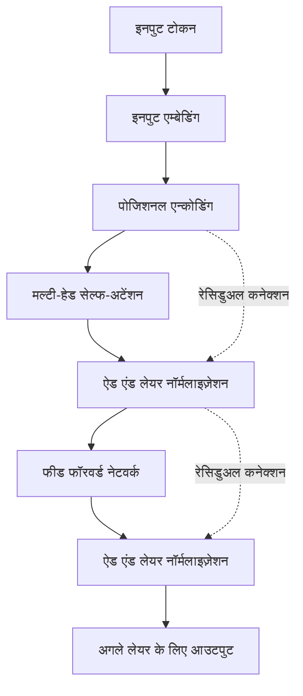
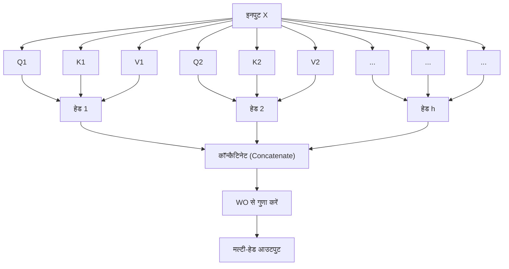

# परिचय: Transformer का गणित क्यों सीखें?

यह कहना अतिशयोक्ति नहीं होगी कि "Transformer" वह आर्किटेक्चर है जिसने आधुनिक प्राकृतिक भाषा प्रसंस्करण (NLP) और समग्र रूप से AI के इतिहास को फिर से लिखा है। 2017 में Google के शोधकर्ताओं द्वारा प्रकाशित पेपर "Attention Is All You Need" में पहली बार प्रस्तावित यह मॉडल, OpenAI की GPT सीरीज़ (ChatGPT की आधारभूत तकनीक), Google के BERT, और Anthropic के Claude जैसे बड़े भाषा मॉडल (LLMs) के मुख्य भाग (दिल) के रूप में कार्य करता है, जो आज दुनिया पर राज कर रहे हैं।

हालांकि, अक्सर "Attention (ध्यान तंत्र) का उपयोग करके संदर्भ को समझने" जैसी गुणात्मक व्याख्याएं Transformer के काम करने के तरीके के बारे में देखने को मिलती हैं, लेकिन वास्तविकता यह है कि शुरुआती लोगों के लिए इसके पीछे की **गणितीय संरचना** में गहराई से जाने वाले स्पष्टीकरण आश्चर्यजनक रूप से कम हैं। यह वास्तव में समझने के लिए कि AI "शब्दों" को "गणितीय सूत्रों" के रूप में कैसे संसाधित करता है और आश्चर्यजनक रूप से प्राकृतिक पाठ कैसे उत्पन्न करता है, इसके गणितीय तंत्र को समझना आवश्यक है।

इस लेख में, हम उन लोगों के लिए जो गणित और प्रोग्रामिंग का बुनियादी ज्ञान रखते हैं (जो हाई स्कूल स्तर के मैट्रिक्स और डिफरेंशियल कैलकुलस की अवधारणाओं को समझते हैं), Transformer के मुख्य भागों जैसे "Self-Attention तंत्र", "क्वेरी-की-वैल्यू (Q/K/V) मॉडल", "Softmax फ़ंक्शन द्वारा सामान्यीकरण", और "Positional Encoding" की गणितीय संरचना को पूरी तरह से और आसानी से समझने योग्य तरीके से स्पष्ट करेंगे।

आप गणितीय सूत्रों की झड़ी से अभिभूत हो सकते हैं, लेकिन हर एक गणना का एक स्पष्ट "अर्थ" होता है। जब तक आप इस लेख को पढ़ना समाप्त करेंगे, तब तक आपको यह समझ आ जाएगा कि Transformer केवल एक जादुई ब्लैक बॉक्स नहीं deeply नहीं है, बल्कि सूक्ष्मता से डिज़ाइन किए गए गणित और सांख्यिकी का एक क्रिस्टल है।

---

# 1. पारंपरिक तरीकों की सीमाएँ और Transformer का नवाचार

Transformer के आगमन से पहले, प्राकृतिक भाषा प्रसंस्करण की मुख्यधारा रिकरंट न्यूरल नेटवर्क (RNN) और इसके डेरिवेटिव जैसे LSTM (Long Short-Term Memory) थे। RNN को समय-श्रृंखला (time-series) डेटा को संसाधित करने के लिए डिज़ाइन किया गया था, और यह वाक्यों को शुरुआत से लेकर शब्द दर शब्द अनुक्रमिक रूप से पढ़ता है।

लेकिन, RNN में दो गंभीर कमज़ोरियाँ थीं:
1. **दीर्घकालिक निर्भरता (Long-term dependencies) सीखने में कठिनाई**: जैसे-जैसे वाक्य लंबा होता है, शुरुआत में इनपुट किए गए शब्दों की जानकारी अंत तक पहुँचने तक फीकी पड़ जाती है (वैनिशिंग ग्रेडिएंट समस्या / Vanishing gradient problem)।
2. **समानांतर गणना (Parallel computation) असंभव**: चूंकि शब्दों को क्रमिक रूप से संसाधित किया जाना चाहिए, GPU का उपयोग करके बड़े पैमाने पर समानांतर गणना मुश्किल है, और प्रशिक्षण में भारी मात्रा में समय लगता है।

Transformer ने RNN संरचना को पूरी तरह से त्याग कर और संदर्भ को पकड़ने के लिए केवल "Attention" का उपयोग करके एक पैराडाइम शिफ्ट (प्रतिमान बदलाव) लाया। इसने अनुक्रम (sequence) की लंबाई चाहे कितनी भी हो, बिना किसी जानकारी के नुकसान के, और गणनाओं को समानांतर करके GPU के प्रदर्शन को अधिकतम करने के लिए इसे संभव बना दिया।

---

# 2. Transformer का समग्र आर्किटेक्चर

सबसे पहले, आइए समग्र Transformer आर्किटेक्चर का विहंगावलोकन करें। Transformer मुख्य रूप से दो ब्लॉकों से बना है: "Encoder" (एनकोडर) और "Decoder" (डिकोडर)। अनुवाद कार्य को एक उदाहरण के रूप में लेते हुए, Encoder इनपुट भाषा (जैसे: अंग्रेजी) को एक गणितीय वेक्टर प्रतिनिधित्व में परिवर्तित करता है, और Decoder उस वेक्टर प्रतिनिधित्व के आधार पर आउटपुट भाषा (जैसे: जापानी) उत्पन्न करता है।

नीचे दिया गया चित्र Encoder ब्लॉक की आंतरिक संरचना का सरलीकृत संस्करण है।



अब से, आइए प्रत्येक घटक में किए जा रहे गणितीय कार्यों को एक-एक करके देखें।

---

# 3. शब्दों का वेक्टराइज़ेशन और पोजिशनल एन्कोडिंग (Positional Encoding)

कंप्यूटर सीधे तौर पर टेक्स्ट को नहीं समझ सकते हैं। इनपुट टेक्स्ट को सबसे पहले "टोकन (Token)" नामक इकाइयों में विभाजित किया जाता है, और प्रत्येक को एक निश्चित लंबाई वाले वेक्टर में बदल दिया जाता है। इसे **Input Embedding** कहा जाता है।

## 3.1 Input Embedding का गणित
मान लें कि शब्दावली (vocabulary) का आकार $V$ है, और एम्बेडिंग वेक्टर का डायमेंशन $d_{model}$ है (मूल पेपर में $d_{model} = 512$)। एम्बेडिंग मैट्रिक्स $W_E \in \mathbb{R}^{V \times d_{model}}$ का उपयोग करके प्रत्येक शब्द $w_i$ को एक वेक्टर $x_i \in \mathbb{R}^{d_{model}}$ में बदल दिया जाता है।

$$ x_i = W_E \cdot \text{one\_hot}(w_i) $$

नतीजतन, पूरे वाक्य को एक मैट्रिक्स $X \in \mathbb{R}^{N \times d_{model}}$ के रूप में दर्शाया जाता है ($N$ वाक्य की लंबाई है)।

## 3.2 Positional Encoding की आवश्यकता और सूत्र
Transformer, RNN की तरह क्रमिक रूप से शब्दों को संसाधित नहीं करता है, बल्कि सभी शब्दों को एक साथ समानांतर में संसाधित करता है। गणना गति के दृष्टिकोण से यह एक बड़ा लाभ है, लेकिन साथ ही यह **"शब्दों का क्रम (Word order)" जैसी महत्वपूर्ण जानकारी खो जाने** की समस्या का कारण बनता है। उदाहरण के लिए, "कुत्ता आदमी को काटता है" और "आदमी कुत्ते को काटता है" में समान इनपुट शब्द सेट हैं, लेकिन उनके अर्थ पूरी तरह से अलग हैं।

इस शब्द क्रम की जानकारी को मॉडल में प्रदान करने के लिए **Positional Encoding** तैयार किया गया था।
स्थिति $pos$ पर शब्द के $i$-वें डायमेंशन के लिए Positional Encoding $PE$ की गणना निम्नलिखित त्रिकोणमितीय कार्यों (Trigonometric functions) का उपयोग करके की जाती है:

$$ PE_{(pos, 2i)} = \sin\left(\frac{pos}{10000^{2i/d_{model}}}\right) $$
$$ PE_{(pos, 2i+1)} = \cos\left(\frac{pos}{10000^{2i/d_{model}}}\right) $$

यहाँ, $pos$ शब्द की स्थिति ($0, 1, 2, \dots, N-1$) है, और $i$ वेक्टर डायमेंशन का इंडेक्स ($0, 1, \dots, d_{model}/2 - 1$) है।

### साइन (Sine) और कोसाइन (Cosine) का उपयोग क्यों करें?
पहली नज़र में, यह एक बहुत ही जटिल और अजीब सूत्र लग सकता है, लेकिन इसके पीछे एक गहरा गणितीय कारण है। त्रिकोणमितीय कार्यों का उपयोग करके, मॉडल न केवल **"पूर्ण स्थिति (Absolute position)"** बल्कि **"सापेक्ष स्थिति (Relative position)" में अंतर** को भी आसानी से सीख सकता है।

हाई स्कूल गणित में सीखे गए त्रिकोणमितीय कार्यों के योग प्रमेय (Addition theorem) को याद करें:
$$ \sin(\alpha + \beta) = \sin\alpha \cos\beta + \cos\alpha \sin\beta $$
$$ \cos(\alpha + \beta) = \cos\alpha \cos\beta - \sin\alpha \sin\beta $$

एक स्थिति $pos$ से $k$ ऑफ़सेट की दूरी पर स्थित स्थिति $pos + k$ की Positional Encoding को स्थिति $pos$ के Positional Encoding के रैखिक संयोजन (Linear combination) के रूप में व्यक्त किया जा सकता है। दूसरे शब्दों में, मैट्रिक्स $M_k$ का उपयोग करके इसे इस प्रकार लिखा जा सकता है:

$$ PE_{pos+k} = M_k \cdot PE_{pos} $$

यह Attention तंत्र को डॉट-प्रोडक्ट (Dot-product) गणना के माध्यम से आसानी से यह पहचानने की अनुमति देता है कि शब्द एक-दूसरे से "कितनी दूर" हैं। इसके अलावा, विभिन्न तरंग दैर्ध्य (wavelengths) के साथ कई साइन और कोसाइन तरंगों को मिलाकर, इसका यह भी लाभ है कि यह एक अद्वितीय स्थिति वेक्टर उत्पन्न कर सकता है चाहे वाक्य कितना भी लंबा क्यों न हो।

अंतिम इनपुट मैट्रिक्स $X_{input}$, शब्द एम्बेडिंग वेक्टर और इस स्थिति एन्कोडिंग को जोड़कर बनता है।

$$ X_{input} = X + PE $$

---

# 4. Self-Attention (सेल्फ-अटेंशन) का गहरा गणित

अब हम अंततः Transformer के सबसे महत्वपूर्ण घटक, **Self-Attention (स्व-ध्यान तंत्र)** में कदम रखते हैं। Self-Attention का उद्देश्य "एक वाक्य में सभी शब्दों के बीच प्रासंगिकता (relevance) की गणना करना और संदर्भ को ध्यान में रखते हुए प्रत्येक शब्द के वेक्टर को एक समृद्ध प्रतिनिधित्व में अपडेट करना" है।

यहाँ, एक "खोज प्रणाली (Search system)" की सादृश्यता (Analogy) का उपयोग किया जाता है।
- **Query (Q)**: क्वेरी (खोज शब्द)। "मैं अभी क्या जानकारी ढूंढ रहा हूँ?"
- **Key (K)**: की (शीर्षक)। "मेरे पास क्या जानकारी है?"
- **Value (V)**: वैल्यू (सामग्री)। "मैं वास्तव में कौन सी जानकारी प्रदान करता हूँ?"

## 4.1 मैट्रिक्स $Q, K, V$ का निर्माण
इनपुट मैट्रिक्स $X \in \mathbb{R}^{N \times d_{model}}$ के लिए (सरलता के लिए यहां बैच आकार को अनदेखा कर रहे हैं), हम इसे सीखने योग्य वेट मैट्रिक्स (learnable weight matrices) $W^Q, W^K, W^V \in \mathbb{R}^{d_{model} \times d_k}$ से गुणा करके क्वेरी $Q$, की $K$, और वैल्यू $V$ की गणना करते हैं। (आमतौर पर $d_k = d_v = d_{model} / h$)

$$ Q = X W^Q $$
$$ K = X W^K $$
$$ V = X W^V $$

यहाँ, $Q, K, V$ सभी $\mathbb{R}^{N \times d_k}$ के मैट्रिक्स बन जाते हैं।

## 4.2 Attention Score की गणना (डॉट-प्रोडक्ट)
यह मापने के लिए कि प्रत्येक शब्द की क्वेरी (Query) अन्य सभी शब्दों की की (Key) से कितनी संबंधित है, हम वेक्टर्स के **डॉट-प्रोडक्ट (Dot-product)** की गणना करते हैं। मैट्रिक्स संचालन के रूप में लिखे जाने पर यह निम्न प्रकार होता है:

$$ \text{Scores} = Q K^T $$

इस गणना से प्राप्त मैट्रिक्स $\text{Scores} \in \mathbb{R}^{N \times N}$ का प्रत्येक तत्व $s_{ij}$, $i$-वें शब्द की Query और $j$-वें शब्द की Key का डॉट-प्रोडक्ट है, यानी यह "प्रासंगिकता की ताकत" को दर्शाता है।

## 4.3 स्केलिंग (Scaling)
डॉट-प्रोडक्ट का उपयोग करके स्कोर की गणना करने में एक समस्या है। जैसे-जैसे वेक्टर डायमेंशन $d_k$ बढ़ता है, डॉट-प्रोडक्ट का मूल्य अत्यधिक बड़ा या छोटा हो जाता है।

आइए इसे गणितीय रूप से सिद्ध करें।
मान लें कि क्वेरी का प्रत्येक तत्व $q \sim \mathcal{N}(0, 1)$ और की का प्रत्येक तत्व $k \sim \mathcal{N}(0, 1)$ स्वतंत्र मानक सामान्य वितरण (Standard normal distribution) का पालन करता है।
डॉट-प्रोडक्ट $q \cdot k = \sum_{i=1}^{d_k} q_i k_i$ का माध्य (mean) और प्रसरण (variance) ज्ञात करें।
माध्य: चूँकि $\mathbb{E}[q_i k_i] = \mathbb{E}[q_i] \mathbb{E}[k_i] = 0 \times 0 = 0$ है, योग का माध्य भी $0$ है।
प्रसरण: $q_i k_i$ का प्रसरण, स्वतंत्रता के कारण $\text{Var}(q_i k_i) = \mathbb{E}[(q_i k_i)^2] - (\mathbb{E}[q_i k_i])^2 = 1 \times 1 - 0 = 1$ है।
इसलिए, पूरे डॉट-प्रोडक्ट का प्रसरण डायमेंशन $d_k$ के बराबर होगा।

$$ \text{Var}(q \cdot k) = d_k $$

जैसे-जैसे प्रसरण बढ़ता है, इसके बाद लागू किए जाने वाले Softmax फ़ंक्शन में, अधिकतम मान (maximum value) के अलावा अन्य ग्रेडिएंट अत्यधिक छोटे हो जाते हैं, जिससे "वैनिशिंग ग्रेडिएंट (Vanishing gradient)" होता है, और सीखना रुक जाता है।
इसे रोकने के लिए, स्कोर को $\sqrt{d_k}$ से विभाजित (स्केल) किया जाता है ताकि प्रसरण हमेशा $1$ पर बना रहे।

$$ \text{Scaled Scores} = \frac{Q K^T}{\sqrt{d_k}} $$

## 4.4 Softmax फ़ंक्शन द्वारा संभाव्यता (Probabilization)
प्राप्त स्कोर को एक संभाव्यता वितरण (Probability distribution) (वेट/weights) में बदलने के लिए जिसका योग $1$ है, हम प्रत्येक पंक्ति (row) पर **Softmax फ़ंक्शन** लागू करते हैं।

$$ a_{ij} = \text{softmax}(s_i)_j = \frac{\exp(s_{ij} / \sqrt{d_k})}{\sum_{m=1}^N \exp(s_{im} / \sqrt{d_k})} $$

मैट्रिक्स $A \in \mathbb{R}^{N \times N}$ को Attention Weight (अटेंशन वेट) मैट्रिक्स कहा जाता है। इस मैट्रिक्स की प्रत्येक पंक्ति $i$ को देखकर, "शब्द $i$ को समझने के लिए किसी अन्य शब्द $j$ पर कितना ध्यान (Attention) दिया जाना चाहिए" इसे 0 से 1 के मान के रूप में व्यक्त किया जाता है।

## 4.5 Value का भारित योग (Weighted sum)
अंत में, प्राप्त Attention Weight मैट्रिक्स $A$ का उपयोग करके, Value मैट्रिक्स $V$ के भारित योग (Weighted sum) की गणना की जाती है।

$$ \text{Output} = A V = \text{softmax}\left(\frac{Q K^T}{\sqrt{d_k}}\right) V $$

इस ऑपरेशन द्वारा आउटपुट मैट्रिक्स $Z \in \mathbb{R}^{N \times d_v}$, "संदर्भ को ध्यान में रखकर अपडेट किए गए शब्द वेक्टर अभ्यावेदन (representations)" का एक संग्रह है।
यह पेपर में परिभाषित **Scaled Dot-Product Attention** की पूरी तस्वीर है।

---

# 5. Multi-Head Attention (मल्टी-हेड अटेंशन)

केवल एक Attention गणना (सिंगल हेड) के साथ, यह संभावना है कि यह केवल एक दृष्टिकोण (उदाहरण के लिए, "व्याकरणिक संबंध") से संदर्भ को पकड़ सकता है। इसलिए, भाषा के विविध अर्थ संबंधी और वाक्य रचनात्मक संबंधों (जैसे "विषय और विधेय (Subject and predicate)", "सर्वनाम और उसका संदर्भ") को एक साथ पकड़ने के लिए, **Multi-Head Attention** को पेश किया गया था।

हम पहले की तरह $Q, K, V$ के निर्माण और Attention गणना को समानांतर में $h$ बार (हेड्स की संख्या। मूल पेपर में $h=8$) करते हैं।

$$ \text{head}_i = \text{Attention}(X W_i^Q, X W_i^K, X W_i^V) $$

यहाँ, $W_i^Q, W_i^K, W_i^V \in \mathbb{R}^{d_{model} \times d_k}$ $i$-वें हेड के लिए समर्पित सीखने योग्य वेट मैट्रिक्स हैं।

प्रत्येक हेड से आउटपुट परिणाम $\text{head}_i \in \mathbb{R}^{N \times d_v}$ को क्षैतिज रूप से जोड़ा (Concatenate) जाता है।

$$ \text{Concat}(\text{head}_1, \dots, \text{head}_h) \in \mathbb{R}^{N \times (h \cdot d_v)} $$

आमतौर पर, इसे इस प्रकार सेट किया जाता है कि $h \cdot d_v = d_{model}$ हो, इसलिए संयोजन के बाद डायमेंशन फिर से इनपुट के समान $d_{model}$ पर वापस आ जाता है। अंत में, इस मैट्रिक्स को वेट मैट्रिक्स $W^O \in \mathbb{R}^{d_{model} \times d_{model}}$ से गुणा करके अंतिम आउटपुट प्राप्त किया जाता है।

$$ \text{MultiHead}(Q, K, V) = \text{Concat}(\text{head}_1, \dots, \text{head}_h) W^O $$



---

# 6. Feed-Forward Neural Network (FFN)

Multi-Head Attention का आउटपुट फिर **Position-wise Feed-Forward Network (FFN)** में इनपुट किया जाता है।
यह एक 2-लेयर पूरी तरह से जुड़ा हुआ न्यूरल नेटवर्क (fully connected neural network) है जिसे अनुक्रम के "प्रत्येक स्थिति (शब्द) के लिए स्वतंत्र रूप से" लागू किया जाता है।

गणितीय रूप से, इसे इस प्रकार दर्शाया जाता है:

$$ \text{FFN}(x) = \max(0, x W_1 + b_1) W_2 + b_2 $$

यहाँ, $\max(0, z)$ ReLU (Rectified Linear Unit) एक्टिवेशन फ़ंक्शन को दर्शाता है (हाल के मॉडल में अक्सर GELU या SwiGLU का उपयोग किया जाता है)।

इस नेटवर्क की भूमिका बहुत महत्वपूर्ण है। Attention तंत्र "शब्दों के बीच संबंध (स्थानिक और अनुक्रमिक संबंध)" सीखता है, जबकि FFN "प्रत्येक शब्द वेक्टर के गैर-रैखिक फीचर ट्रांसफॉर्मेशन (Non-linear feature transformation)" के लिए ज़िम्मेदार है।
आमतौर पर, डायमेंशन को अस्थायी रूप से पहले लेयर के वेट $W_1$ द्वारा बहुत बढ़ाया जाता है (उदाहरण के लिए, $d_{model}=512$ से $d_{ff}=2048$ तक 4 गुना विस्तारित किया जाता है), और फीचर स्पेस पर जटिल गणना करने के बाद, इसे दूसरे लेयर के वेट $W_2$ के साथ फिर से मूल डायमेंशन में लाया जाता है। इस "डायमेंशन के विस्तार और संकुचन" से मॉडल की अभिव्यंजक शक्ति में नाटकीय रूप से वृद्धि होती है।

---

# 7. अवशिष्ट कनेक्शन (Residual Connection) और लेयर नॉर्मलाइज़ेशन (Layer Normalization)

डीप लर्निंग में, जैसे-जैसे नेटवर्क में लेयर्स गहरी होती जाती हैं, प्रशिक्षण के दौरान ग्रेडिएंट गायब हो जाते हैं या फट जाते हैं (Exploding gradient), जिससे एक समस्या उत्पन्न होती है कि वे अच्छी तरह से नहीं सीख पाते। इसे रोकने के लिए, Transformer के प्रत्येक सब-लेयर (Attention और FFN) के चारों ओर **अवशिष्ट कनेक्शन (Residual Connection)** और **लेयर नॉर्मलाइज़ेशन (Layer Normalization)** को रखा गया है।

गणितीय रूप से, सब-लेयर के आउटपुट को इस प्रकार संसाधित किया जाता है:

$$ \text{Output} = \text{LayerNorm}(x + \text{Sublayer}(x)) $$

## 7.1 अवशिष्ट कनेक्शन ($x + \text{Sublayer}(x)$)
इनपुट $x$ को सीधे सब-लेयर के आउटपुट में जोड़ा जाता है। इससे, बैकप्रोपेगेशन (Backpropagation) के दौरान ग्रेडिएंट शॉर्टकट के माध्यम से सीधे उथले लेयर्स (shallow layers) तक पहुंचता है, जिससे लेयर्स के गहरे होने पर भी सीखना स्थिर रहता है।

## 7.2 Layer Normalization का गणित
Layer Normalization एक तकनीक है जो फीचर डायमेंशन की दिशा में माध्य और प्रसरण की गणना करके डेटा को सामान्य (normalize) करती है। बैच आकार $B$, अनुक्रम लंबाई $N$, और डायमेंशन $d_{model}$ के इनपुट में, किसी एक शब्द वेक्टर $x \in \mathbb{R}^{d_{model}}$ के लिए सामान्यीकरण किया जाता है।

माध्य $\mu$ और प्रसरण $\sigma^2$ की गणना करें:
$$ \mu = \frac{1}{d_{model}} \sum_{i=1}^{d_{model}} x_i $$
$$ \sigma^2 = \frac{1}{d_{model}} \sum_{i=1}^{d_{model}} (x_i - \mu)^2 $$

फिर, सामान्यीकृत आउटपुट $\hat{x}$ प्राप्त करें:
$$ \text{LN}(x) = \frac{x - \mu}{\sqrt{\sigma^2 + \epsilon}} \odot \gamma + \beta $$
($\epsilon$ शून्य से विभाजन (division by zero) को रोकने के लिए एक बहुत छोटा स्थिरांक है। $\gamma, \beta$ सीखने योग्य स्केल और शिफ्ट पैरामीटर हैं)

बैच दिशा में सामान्यीकरण (Batch Normalization) के बजाय लेयर दिशा में सामान्यीकरण (Layer Normalization) को अपनाने का कारण यह है कि वाक्यों जैसे चर लंबाई (variable-length) वाले अनुक्रम डेटा को संसाधित करते समय, बैचों के बीच आँकड़े अस्थिर होने का खतरा होता है। Layer Normalization के माध्यम से, Transformer बैच आकार पर निर्भर किए बिना स्थिर प्रशिक्षण प्राप्त करने में सक्षम होता है।

---

# 8. डिकोडर-विशिष्ट संरचना: Masked Attention और Cross-Attention

अब तक बताई गई संरचना एनकोडर की है। वाक्यों को उत्पन्न करने वाले डिकोडर ब्लॉक में, संरचना थोड़ी अलग होती है।

## 8.1 Masked Multi-Head Attention
डिकोडर की भूमिका "पिछले शब्दों से अगले शब्द की भविष्यवाणी करना" है। इसलिए, यदि यह प्रशिक्षण के दौरान "भविष्य के शब्दों" को देख लेता है, तो यह नकल (चीटिंग) होगी। इसे रोकने के लिए किया जाने वाला गणितीय संचालन **Masking (मास्किंग)** है।

स्कोर मैट्रिक्स $Q K^T$ में, एक मास्क मैट्रिक्स $M$ जोड़ा जाता है जो ऊपरी त्रिकोणीय हिस्से (upper triangular part, भविष्य की जानकारी के अनुरूप) में $-\infty$ के करीब बहुत छोटा मान सेट करता है।

$$ M_{ij} = \begin{cases} 0 & (i \le j) \\ -\infty & (i > j) \end{cases} $$

$$ \text{Masked Attention}(Q, K, V) = \text{softmax}\left(\frac{Q K^T + M}{\sqrt{d_k}}\right) V $$

Softmax फ़ंक्शन की गणना करते समय, क्योंकि $\exp(-\infty) = 0$ होता है, भविष्य के शब्दों के लिए Attention Weight पूरी तरह से $0$ हो जाता है। यह कारणता (Causality) को बनाए रखते हुए ऑटो-रिग्रेसिव (autoregressive) पीढ़ी (generation) को संभव बनाता है।

## 8.2 Encoder-Decoder Cross-Attention
डिकोडर का दूसरा सब-लेयर **Cross-Attention** है, जो एनकोडर के आउटपुट को संदर्भित करता है।
यहाँ, $Q$ पिछले डिकोडर लेयर से उत्पन्न होता है, लेकिन $K$ और $V$ एनकोडर के अंतिम लेयर के आउटपुट से उत्पन्न होते हैं।

$$ Q_{decoder} = X_{dec} W^Q $$
$$ K_{encoder} = X_{enc} W^K $$
$$ V_{encoder} = X_{enc} W^V $$

इस गणना के माध्यम से, मॉडल अनुवाद कार्यों में यह सीख सकता है कि "वर्तमान में अनुवाद किया जा रहा शब्द, मूल विदेशी भाषा के वाक्य के किस भाग से दृढ़ता से संबंधित है"।

---

# 9. कम्प्यूटेशनल कॉम्प्लेक्सिटी और आधुनिक अनुकूलन (Optimization) का गणित

Transformer एक बेहतरीन मॉडल है, लेकिन इसकी गणितीय संरचना के कारण इसकी कुछ "कमज़ोरियाँ" भी हैं।
Self-Attention की कम्प्यूटेशनल जटिलता (Computational complexity) पर ध्यान दें। स्कोर मैट्रिक्स $Q K^T$ की गणना में, $(N \times d_k)$ के मैट्रिक्स को $(d_k \times N)$ के मैट्रिक्स से गुणा किया जाता है, इसलिए इसकी गणना की जटिलता **$O(N^2 \cdot d_{model})$** है।

दूसरे शब्दों में, **अनुक्रम लंबाई $N$ के सापेक्ष गणना की मात्रा और मेमोरी का उपयोग वर्ग (square) में बढ़ता है**।
यदि वाक्य छोटा है तो यह कोई समस्या नहीं है, लेकिन यदि आप एक पूरी किताब जैसा लंबा संदर्भ LLM में इनपुट करने का प्रयास करते हैं, तो $N$ दसियों हज़ार से लेकर लाखों तक पहुँच सकता है, और पारंपरिक Attention गणना GPU मेमोरी को तुरंत समाप्त कर देगी।

इस $O(N^2)$ के अभिशाप को तोड़ने के लिए, हाल के वर्षों में गणितीय और हार्डवेयर दृष्टिकोण से विभिन्न अनुकूलन प्रस्तावित किए गए हैं।
इसका एक प्रमुख उदाहरण **FlashAttention** है। FlashAttention एक एल्गोरिथ्म है जो GPU के मेमोरी पदानुक्रम (SRAM और HBM) के बीच डेटा ट्रांसफर (मेमोरी एक्सेस) को कम करने के लिए Attention गणना को टाइल-जैसी संरचना (Tiling) में विभाजित करता है। यद्यपि गणितीय रूप से यह मानक Attention (Exact Attention) के समान परिणाम देता है, फिर भी हार्डवेयर स्तर के अनुकूलन के माध्यम से यह नाटकीय गति और मेमोरी में कमी प्राप्त करता है, जिससे GPT-4 जैसे लंबे-संदर्भ वाले मॉडल संभव हो सके।

इसके अलावा, Sparse Attention और Linear Attention पर भी बहुत शोध किया जा रहा है, जो कम्प्यूटेशनल जटिलता को $O(N \log N)$ या $O(N)$ के अनुमानित स्तर पर लाते हैं।

---

# 10. कार्यान्वयन (Implementation) की कल्पना (PyTorch-स्टाइल स्यूडो-कोड)

यदि हम अब तक की गणितीय संरचना को वास्तविक प्रोग्रामिंग कोड (Python / PyTorch) में लागू करते हैं, तो हम देखेंगे कि इसे आश्चर्यजनक रूप से सरलता से लिखा जा सकता है। नीचे Self-Attention के मुख्य भाग के लिए स्यूडो-कोड दिया गया है।

```python
import torch
import torch.nn.functional as F
import math

def scaled_dot_product_attention(q, k, v, mask=None):
    # q, k, v का आकार (Shape): [batch_size, num_heads, seq_length, d_k]
    d_k = q.size(-1)
    
    # 1. डॉट-प्रोडक्ट द्वारा स्कोर गणना: Q * K^T
    # अंतिम 2 डायमेंशन को ट्रांसपोज़ (Transpose) करके मैट्रिक्स गुणन (Matrix multiplication)
    scores = torch.matmul(q, k.transpose(-2, -1))
    
    # 2. स्केलिंग (Scaling)
    scores = scores / math.sqrt(d_k)
    
    # 3. मास्किंग (Masked Attention के मामले में)
    if mask is not None:
        scores = scores.masked_fill(mask == 0, -1e9)
        
    # 4. Softmax द्वारा संभाव्यता
    attention_weights = F.softmax(scores, dim=-1)
    
    # 5. Value मैट्रिक्स का गुणन
    output = torch.matmul(attention_weights, v)
    
    return output, attention_weights
```

आप देख सकते हैं कि गणितीय सूत्र $Q K^T / \sqrt{d_k}$ को `torch.matmul(q, k.transpose(-2, -1)) / math.sqrt(d_k)` के रूप में सहजता से लागू किया गया है। यह डीप लर्निंग का एक बहुत ही दिलचस्प पहलू है कि गणितीय सिद्धांतों को उन्नत अनुकूलन पुस्तकालयों (Optimization libraries) की मदद से केवल कुछ लाइनों के कोड में साकार किया जा सकता है।

---

# निष्कर्ष: गणितीय सूत्रों से उभरने वाला "बुद्धिमत्ता" का स्वरूप

इस लेख में, हमने Transformer मॉडल के भीतर गहराई में छिपी गणितीय संरचना को उजागर किया है।

शब्दों को बहु-आयामी (Multi-dimensional) वेक्टर स्पेस में मैप करने वाली Embedding, स्थिति की जानकारी को त्रिकोणमितीय तरंगों के संयोजन के रूप में व्यक्त करने वाली Positional Encoding, और सूचना पुनर्प्राप्ति (Information retrieval) की सादृश्यता से पैदा हुआ मैट्रिक्स डॉट-प्रोडक्ट गणना वाला Self-Attention तंत्र। ये सभी घटक केवल रैखिक बीजगणित (Linear algebra), कैलकुलस (Calculus), और प्रायिकता-सांख्यिकी (Probability & Statistics) जैसे बुनियादी गणित का एक संचय हैं।

लेकिन, जब ये सरल मैट्रिक्स गणनाएँ कई लेयर्स में जुड़ जाती हैं, और अरबों-खरबों मापदंडों (Parameters) के माध्यम से विशाल डेटासेट से पैटर्न सीखती हैं, तो यह हमारी "भाषा" को समझने, तार्किक तर्क करने, और कभी-कभी रचनात्मक विचार उत्पन्न करने वाले "बुद्धिमत्ता के स्वरूप" के रूप में सामने आती है।

जैसा कि भड़काऊ शीर्षक "Attention Is All You Need" से पता चलता है, जटिल रिकरंट और कनवल्शनल (Convolutional) प्रोसेसिंग को त्यागकर पूरी तरह से "अटेंशन (प्रासंगिकता)" गणना पर केंद्रित इस आर्किटेक्चर की सुंदरता इसकी गणितीय सरलता में ही निहित है।

भविष्य में, Transformer को पार करने वाले नए आर्किटेक्चर (जैसे स्टेट स्पेस मॉडल Mamba) उभर सकते हैं, लेकिन Transformer द्वारा स्थापित "Attention के माध्यम से संदर्भ समझ" का गणितीय ढांचा AI के इतिहास में हमेशा के लिए उकेरा जाएगा।

यदि आपको भविष्य में ChatGPT या Claude जैसे LLM का उपयोग करने का अवसर मिलता है, तो ज़रा कल्पना करें कि बैकग्राउंड में हर सेकंड ट्रिलियन बार $Q K^T$ के मैट्रिक्स गुणन की गणना की जा रही है और Softmax फ़ंक्शन संभावनाओं का उत्पादन कर रहा है। तकनीक के प्रति आपकी समझ (Resolution) बढ़ेगी, और आपको AI की दुनिया और भी दिलचस्प लगने लगेगी।

### संदर्भ
- Vaswani, A., et al. (2017). "Attention Is All You Need." *Advances in Neural Information Processing Systems*.
- Alammar, J. (2018). "The Illustrated Transformer." 

---
*यह लेख उन लोगों के लिए एक मार्गदर्शिका के रूप में लिखा गया था जो प्राकृतिक भाषा प्रसंस्करण (NLP) और AI के गणितीय आधार सीख रहे हैं। यदि आपके कोई प्रश्न या विचार-विमर्श हैं, तो कृपया हमें टिप्पणी अनुभाग में बताएं!*
