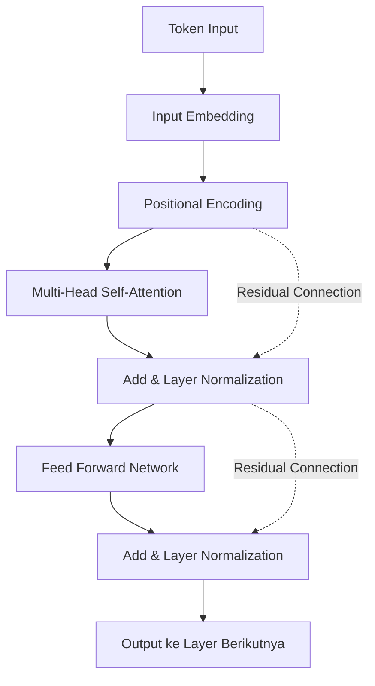
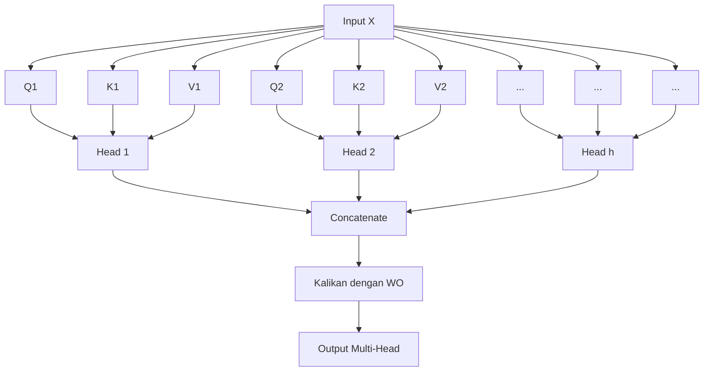

# Pendahuluan: Mengapa Belajar Matematika Transformer?

Arsitektur yang dapat dikatakan telah menulis ulang sejarah Pemrosesan Bahasa Alami (NLP) modern, dan bahkan seluruh AI, adalah "Transformer". Diusulkan pertama kali dalam makalah "Attention Is All You Need" yang diterbitkan oleh para peneliti Google pada tahun 2017, model ini sekarang berfungsi sebagai jantung dari Model Bahasa Besar (LLM) yang menyapu dunia, seperti seri GPT OpenAI (teknologi dasar ChatGPT), BERT dari Google, dan Claude dari Anthropic.

Namun, meskipun penjelasan kualitatif seperti "memahami konteks menggunakan Attention (mekanisme perhatian)" untuk cara kerja Transformer sering ditemukan, saat ini ternyata masih sedikit penjelasan mendalam tentang **struktur matematis** di baliknya yang ditujukan untuk pemula. Untuk benar-benar memahami bagaimana AI memproses "kata-kata" sebagai "rumus matematika" dan menghasilkan teks yang sangat alami, sangat penting untuk menguraikan mekanisme matematisnya.

Dalam artikel ini, bagi mereka yang memiliki pengetahuan dasar matematika dan pemrograman (mereka yang memahami konsep matriks dan turunan tingkat sekolah menengah), kami akan menguraikan secara menyeluruh dan dengan cara yang mudah dipahami tentang struktur matematis seperti "Mekanisme Self-Attention", "Model Query, Key, Value (Q/K/V)", "Normalisasi dengan Fungsi Softmax", dan "Positional Encoding" yang merupakan inti dari Transformer.

Anda mungkin akan kewalahan oleh deretan rumus matematika, tetapi setiap perhitungan memiliki "makna" yang jelas. Pada saat Anda selesai membaca artikel ini, Anda seharusnya dapat memahami bahwa Transformer bukanlah sekadar kotak hitam ajaib, melainkan kristalisasi dari matematika dan statistik yang dirancang secara presisi.

---

# 1. Keterbatasan Metode Konvensional dan Inovasi Transformer

Sebelum munculnya Transformer, arus utama pemrosesan bahasa alami adalah Recurrent Neural Network (RNN) dan turunannya, LSTM (Long Short-Term Memory). RNN dirancang untuk memproses data deret waktu, dan membaca kalimat kata demi kata dari awal secara berurutan.

Namun, RNN memiliki dua kelemahan fatal.
1. **Kesulitan dalam mempelajari ketergantungan jangka panjang (Long-term dependencies)**: Seiring bertambahnya panjang kalimat, informasi dari kata-kata yang dimasukkan di awal akan memudar pada saat mencapai akhir (masalah gradien menghilang atau vanishing gradient problem).
2. **Komputasi paralel tidak mungkin dilakukan**: Karena kata-kata harus diproses secara berurutan, komputasi paralel skala besar menggunakan GPU menjadi sulit, dan pelatihan memakan waktu yang sangat lama.

Transformer sepenuhnya membuang struktur RNN dan menyebabkan pergeseran paradigma dengan menangkap konteks menggunakan "Attention" saja. Hal ini memungkinkan tidak adanya kehilangan informasi terlepas dari seberapa panjang deretannya, sekaligus menyejajarkan (paralel) perhitungan untuk memaksimalkan kinerja GPU.

---

# 2. Arsitektur Keseluruhan Transformer

Pertama-tama, mari kita lihat arsitektur Transformer secara keseluruhan. Transformer secara garis besar terdiri dari dua blok: "Encoder" dan "Decoder". Mengambil tugas terjemahan sebagai contoh, Encoder mengubah bahasa input (misalnya: Bahasa Inggris) menjadi representasi vektor matematis, dan Decoder menghasilkan bahasa output (misalnya: Bahasa Indonesia) berdasarkan representasi vektor tersebut.

Gambar berikut menyederhanakan struktur internal dari blok Encoder.



Mulai dari sini, mari kita ikuti operasi matematis yang dilakukan di setiap komponen langkah demi langkah.

---

# 3. Vektorisasi Kata dan Positional Encoding

Komputer tidak dapat memahami teks secara langsung. Teks yang dimasukkan pertama-tama dibagi menjadi unit yang disebut "Token", dan masing-masing diubah menjadi vektor dengan panjang tetap. Inilah yang disebut **Input Embedding**.

## 3.1 Matematika dari Input Embedding
Misalkan ukuran kosa kata (vocabulary) adalah $V$, dan dimensi vektor embedding adalah $d_{model}$ (dalam makalah aslinya $d_{model} = 512$). Setiap kata $w_i$ diubah menjadi vektor $x_i \in \mathbb{R}^{d_{model}}$ menggunakan matriks embedding $W_E \in \mathbb{R}^{V \times d_{model}}$.

$$ x_i = W_E \cdot \text{one\_hot}(w_i) $$

Dengan ini, seluruh kalimat direpresentasikan sebagai matriks $X \in \mathbb{R}^{N \times d_{model}}$ (di mana $N$ adalah panjang kalimat).

## 3.2 Kebutuhan dan Rumus dari Positional Encoding
Transformer tidak memproses kata-kata secara berurutan seperti RNN, melainkan memproses semua kata secara serentak secara paralel. Ini merupakan keuntungan besar dari segi kecepatan komputasi, tetapi pada saat yang sama menimbulkan masalah **hilangnya informasi penting tentang "urutan kata"**. Misalnya, "Anjing menggigit orang" dan "Orang menggigit anjing" memiliki kumpulan kata input yang sama tetapi maknanya sama sekali berbeda.

Untuk memberikan informasi urutan kata ini kepada model, **Positional Encoding** dirancang.
Positional Encoding $PE$ untuk dimensi ke-$i$ dari kata yang berada di posisi $pos$ dihitung menggunakan fungsi trigonometri berikut.

$$ PE_{(pos, 2i)} = \sin\left(\frac{pos}{10000^{2i/d_{model}}}\right) $$
$$ PE_{(pos, 2i+1)} = \cos\left(\frac{pos}{10000^{2i/d_{model}}}\right) $$

Di sini, $pos$ adalah posisi kata ($0, 1, 2, \dots, N-1$), dan $i$ adalah indeks dimensi vektor ($0, 1, \dots, d_{model}/2 - 1$).

### Mengapa menggunakan sinus dan kosinus?
Sekilas ini terlihat sebagai rumus yang sangat kompleks dan aneh, tetapi ada alasan matematis yang mendalam untuk hal ini. Dengan menggunakan fungsi trigonometri, model dapat dengan mudah mempelajari **bukan hanya "posisi absolut", melainkan juga selisih "posisi relatif"**.

Ingat kembali teorema penjumlahan fungsi trigonometri yang dipelajari dalam matematika sekolah menengah.
$$ \sin(\alpha + \beta) = \sin\alpha \cos\beta + \cos\alpha \sin\beta $$
$$ \cos(\alpha + \beta) = \cos\alpha \cos\beta - \sin\alpha \sin\beta $$

Positional Encoding dari posisi $pos + k$ yang digeser sejauh offset $k$ dari suatu posisi $pos$ dapat diekspresikan sebagai kombinasi linier dari Positional Encoding posisi $pos$. Artinya, dapat ditulis sebagai berikut dengan menggunakan matriks $M_k$.

$$ PE_{pos+k} = M_k \cdot PE_{pos} $$

Berkat ini, mekanisme Attention dapat dengan mudah mengenali jarak relatif "seberapa jauh" antar kata melalui perhitungan perkalian titik (dot product). Selain itu, dengan menggabungkan beberapa gelombang sinus dan kosinus dengan panjang gelombang yang berbeda, ada keuntungan bahwa vektor posisi unik dapat dihasilkan terlepas dari seberapa panjang kalimatnya.

Matriks input akhir $X_{input}$ akan menjadi hasil penjumlahan dari vektor embedding kata dan Positional Encoding ini.

$$ X_{input} = X + PE $$

---

# 4. Matematika Mendalam dari Self-Attention (Mekanisme Perhatian Diri)

Akhirnya, kita melangkah ke komponen terpenting dari Transformer, yaitu **Self-Attention**. Tujuan dari Self-Attention adalah "untuk menghitung tingkat relevansi antara semua kata dalam kalimat, dan memperbarui vektor dari masing-masing kata menjadi representasi yang lebih kaya yang mempertimbangkan konteks".

Di sini, analogi "sistem pencarian" digunakan.
- **Query (Q)**: Kueri (Kata pencarian). "Informasi apa yang sedang saya cari sekarang?"
- **Key (K)**: Kunci (Label/Judul). "Informasi apa yang saya miliki?"
- **Value (V)**: Nilai (Entitas). "Informasi apa yang sebenarnya saya berikan?"

## 4.1 Pembuatan Matriks $Q, K, V$
Untuk matriks input $X \in \mathbb{R}^{N \times d_{model}}$ (untuk menyederhanakan, kita abaikan ukuran batch di sini), dengan mengalikannya dengan matriks bobot yang dapat dipelajari $W^Q, W^K, W^V \in \mathbb{R}^{d_{model} \times d_k}$, kita menghitung Query $Q$, Key $K$, dan Value $V$. (Biasanya $d_k = d_v = d_{model} / h$)

$$ Q = X W^Q $$
$$ K = X W^K $$
$$ V = X W^V $$

Di sini, $Q, K, V$ semuanya menjadi matriks berukuran $\mathbb{R}^{N \times d_k}$.

## 4.2 Perhitungan Skor Attention (Perkalian Titik/Dot Product)
Untuk mengukur seberapa relevan Query dari setiap kata dengan Key dari semua kata lainnya, kita menghitung **perkalian titik (dot product)** dari vektor. Jika ditulis dalam operasi matriks, akan menjadi seperti berikut.

$$ \text{Scores} = Q K^T $$

Setiap elemen $s_{ij}$ dari matriks $\text{Scores} \in \mathbb{R}^{N \times N}$ yang diperoleh dari perhitungan ini merepresentasikan perkalian titik antara Query dari kata ke-$i$ dan Key dari kata ke-$j$, yang berarti "tingkat kekuatan relevansi".

## 4.3 Penskalaan (Scaling)
Ada satu masalah dengan perhitungan skor menggunakan perkalian titik. Seiring membesarnya dimensi vektor $d_k$, nilai perkalian titik bisa menjadi sangat besar atau sangat kecil.

Mari kita buktikan ini secara matematis.
Misalkan setiap elemen kueri $q \sim \mathcal{N}(0, 1)$ dan setiap elemen kunci $k \sim \mathcal{N}(0, 1)$ mengikuti distribusi normal standar yang independen.
Kita cari rata-rata dan varians dari perkalian titik $q \cdot k = \sum_{i=1}^{d_k} q_i k_i$.
Rata-rata: Karena $\mathbb{E}[q_i k_i] = \mathbb{E}[q_i] \mathbb{E}[k_i] = 0 \times 0 = 0$, rata-rata dari penjumlahan juga $0$.
Varians: Varians dari $q_i k_i$ adalah, berdasarkan independensi, $\text{Var}(q_i k_i) = \mathbb{E}[(q_i k_i)^2] - (\mathbb{E}[q_i k_i])^2 = 1 \times 1 - 0 = 1$.
Oleh karena itu, varians dari keseluruhan perkalian titik sama dengan jumlah dimensi $d_k$.

$$ \text{Var}(q \cdot k) = d_k $$

Ketika varians menjadi besar, pada fungsi Softmax yang diterapkan setelah ini, gradien selain nilai maksimum akan menjadi sangat kecil sehingga terjadi "vanishing gradient" (gradien menghilang), dan pembelajaran tidak akan mengalami kemajuan.
Untuk mencegah hal ini, dengan membagi (menskalakan) skor dengan $\sqrt{d_k}$, kita menjaga agar varians selalu dipertahankan pada $1$.

$$ \text{Scaled Scores} = \frac{Q K^T}{\sqrt{d_k}} $$

## 4.4 Probabilisasi dengan Fungsi Softmax
Untuk mengubah skor yang diperoleh menjadi distribusi probabilitas (bobot) yang jumlah totalnya menjadi $1$, **fungsi Softmax** diterapkan pada setiap baris.

$$ a_{ij} = \text{softmax}(s_i)_j = \frac{\exp(s_{ij} / \sqrt{d_k})}{\sum_{m=1}^N \exp(s_{im} / \sqrt{d_k})} $$

Matriks $A \in \mathbb{R}^{N \times N}$ ini disebut matriks Attention Weight (Bobot Perhatian). Jika kita melihat setiap baris $i$ dari matriks ini, matriks tersebut mengekspresikan dengan nilai dari 0 hingga 1 tentang "seberapa banyak perhatian (Attention) yang harus diberikan pada kata lain $j$ dalam memahami kata $i$".

## 4.5 Penjumlahan Berbobot dari Value
Terakhir, dengan menggunakan matriks Attention Weight $A$ yang diperoleh, kita menghitung penjumlahan berbobot dari matriks Value $V$.

$$ \text{Output} = A V = \text{softmax}\left(\frac{Q K^T}{\sqrt{d_k}}\right) V $$

Matriks $Z \in \mathbb{R}^{N \times d_v}$ yang dihasilkan oleh operasi ini menjadi sekumpulan "representasi vektor kata yang diperbarui dengan mempertimbangkan konteks".
Inilah keseluruhan gambaran dari **Scaled Dot-Product Attention** yang didefinisikan dalam makalah.

---

# 5. Multi-Head Attention (Perhatian Multi-Kepala)

Dengan hanya satu kali perhitungan Attention (Single-Head), ada kemungkinan kita hanya bisa menangkap konteks dari satu sudut pandang saja (misalnya "hubungan tata bahasa"). Oleh karena itu, untuk menangkap berbagai hubungan semantik dan sintaksis yang dimiliki bahasa ("subjek dan predikat", "kata ganti dan rujukan panggilannya", dll.) secara bersamaan, **Multi-Head Attention** diperkenalkan.

Pembentukan $Q, K, V$ dan perhitungan Attention seperti sebelumnya dilakukan sebanyak $h$ kali secara paralel (jumlah kepala. Dalam makalah aslinya $h=8$).

$$ \text{head}_i = \text{Attention}(X W_i^Q, X W_i^K, X W_i^V) $$

Di sini, $W_i^Q, W_i^K, W_i^V \in \mathbb{R}^{d_{model} \times d_k}$ adalah matriks bobot yang dapat dipelajari khusus untuk kepala (head) ke-$i$.

Hasil $\text{head}_i \in \mathbb{R}^{N \times d_v}$ yang dikeluarkan dari setiap kepala digabungkan (Concatenate) secara horizontal.

$$ \text{Concat}(\text{head}_1, \dots, \text{head}_h) \in \mathbb{R}^{N \times (h \cdot d_v)} $$

Biasanya diatur agar $h \cdot d_v = d_{model}$, sehingga dimensi setelah digabungkan kembali menjadi $d_{model}$ yang sama seperti input. Terakhir, matriks ini dikalikan dengan matriks bobot $W^O \in \mathbb{R}^{d_{model} \times d_{model}}$ untuk mendapatkan output akhir.

$$ \text{MultiHead}(Q, K, V) = \text{Concat}(\text{head}_1, \dots, \text{head}_h) W^O $$



---

# 6. Feed-Forward Neural Network (FFN)

Output dari Multi-Head Attention selanjutnya dimasukkan ke dalam **Position-wise Feed-Forward Network (FFN)**.
Ini adalah jaringan saraf terhubung penuh (fully connected neural network) 2 lapis yang diterapkan "secara independen untuk setiap posisi (kata)" dalam deretan.

Jika diekspresikan dengan rumus matematika, bentuknya adalah sebagai berikut.

$$ \text{FFN}(x) = \max(0, x W_1 + b_1) W_2 + b_2 $$

Di sini, $\max(0, z)$ mewakili fungsi aktivasi ReLU (Rectified Linear Unit) (dalam model-model terbaru, GELU atau SwiGLU sering digunakan).

Peran dari jaringan ini sangatlah penting. Mekanisme Attention mempelajari "hubungan antarkata (hubungan spasial/sekuensial)", sedangkan FFN bertanggung jawab atas "transformasi fitur non-linier dari setiap vektor kata itu sendiri".
Biasanya, dimensi untuk sementara diperluas sangat besar oleh bobot $W_1$ di lapisan pertama (misalnya, diperbesar 4 kali dari $d_{model}=512$ menjadi $d_{ff}=2048$), melakukan perhitungan kompleks pada ruang fitur, dan kemudian dikembalikan ke dimensi aslinya di lapisan kedua dengan bobot $W_2$. Dengan "perluasan dan penyusutan dimensi" ini, daya ekspresi model meningkat secara dramatis.

---

# 7. Residual Connection dan Layer Normalization

Dalam deep learning, saat kita membuat lapisan jaringan semakin dalam, seringkali muncul masalah di mana gradien menghilang (vanishing) atau meledak (exploding) selama pembelajaran, sehingga model tidak dapat belajar dengan baik. Untuk mencegah hal ini, **Residual Connection (Koneksi Residu)** dan **Layer Normalization (Normalisasi Lapisan)** ditempatkan di sekitar setiap sub-lapisan (Attention dan FFN) dari Transformer.

Jika ditulis dalam rumus, output dari sub-lapisan diproses sebagai berikut.

$$ \text{Output} = \text{LayerNorm}(x + \text{Sublayer}(x)) $$

## 7.1 Residual Connection ($x + \text{Sublayer}(x)$)
Input $x$ ditambahkan langsung ke output sub-lapisan. Dengan ini, selama propagasi balik (backpropagation), gradien ditransmisikan langsung ke lapisan dangkal melalui jalan pintas, sehingga pembelajaran menjadi stabil meskipun lapisannya dalam.

## 7.2 Matematika Layer Normalization
Layer Normalization adalah teknologi untuk menghitung rata-rata dan varians di sepanjang arah dimensi fitur dan menormalisasi data. Untuk input dengan ukuran batch $B$, panjang urutan $N$, dan jumlah dimensi $d_{model}$, normalisasi dilakukan untuk salah satu vektor kata $x \in \mathbb{R}^{d_{model}}$.

Rata-rata $\mu$ dan varians $\sigma^2$ dihitung.
$$ \mu = \frac{1}{d_{model}} \sum_{i=1}^{d_{model}} x_i $$
$$ \sigma^2 = \frac{1}{d_{model}} \sum_{i=1}^{d_{model}} (x_i - \mu)^2 $$

Kemudian, output yang dinormalisasi $\hat{x}$ diperoleh.
$$ \text{LN}(x) = \frac{x - \mu}{\sqrt{\sigma^2 + \epsilon}} \odot \gamma + \beta $$
($\epsilon$ adalah konstanta yang sangat kecil untuk mencegah pembagian dengan nol. $\gamma, \beta$ adalah parameter skala dan pergeseran yang dapat dipelajari)

Alasan mengapa normalisasi pada arah lapisan (Layer Normalization) diadopsi, alih-alih normalisasi arah batch (Batch Normalization), adalah karena ketika memproses data deret (sekuensial) yang panjangnya tidak konstan seperti kalimat, statistik antar batch cenderung menjadi tidak stabil. Dengan Layer Normalization, Transformer dapat belajar dengan stabil tanpa bergantung pada ukuran batch.

---

# 8. Struktur Khusus Decoder: Masked Attention dan Cross-Attention

Struktur yang telah dijelaskan sejauh ini adalah milik Encoder. Pada blok Decoder yang menghasilkan teks, strukturnya sedikit berbeda.

## 8.1 Masked Multi-Head Attention
Peran dari Decoder adalah "untuk memprediksi kata berikutnya dari kata-kata di masa lalu". Oleh karena itu, jika model melihat "kata di masa depan" selama pelatihan, itu sama saja dengan menyontek. Operasi matematis untuk mencegah hal ini adalah **Masking (Penyamaran/Pemaskeran)**.

Ke dalam matriks skor $Q K^T$, sebuah matriks mask $M$ yang mengatur nilai yang sangat kecil mendekati $-\infty$ pada bagian segitiga atas (mewakili informasi di masa depan) ditambahkan.

$$ M_{ij} = \begin{cases} 0 & (i \le j) \\ -\infty & (i > j) \end{cases} $$

$$ \text{Masked Attention}(Q, K, V) = \text{softmax}\left(\frac{Q K^T + M}{\sqrt{d_k}}\right) V $$

Saat menghitung fungsi Softmax, karena $\exp(-\infty) = 0$, nilai Attention Weight ke kata di masa depan akan benar-benar menjadi $0$. Hal ini memungkinkan pembangkitan auto-regresif dengan mempertahankan hubungan sebab akibat (Causality).

## 8.2 Encoder-Decoder Cross-Attention
Sub-lapisan kedua dari Decoder adalah **Cross-Attention** yang merujuk pada output dari Encoder.
Di sini, $Q$ dihasilkan dari lapisan Decoder sebelumnya, tetapi $K$ dan $V$ dihasilkan dari output lapisan akhir Encoder.

$$ Q_{decoder} = X_{dec} W^Q $$
$$ K_{encoder} = X_{enc} W^K $$
$$ V_{encoder} = X_{enc} W^V $$

Berkat perhitungan ini, dalam tugas seperti terjemahan, model dapat belajar tentang "bagian mana dari kalimat bahasa asing asli yang sangat terkait dengan kata yang sedang diterjemahkan".

---

# 9. Kompleksitas Komputasi dan Matematika Optimasi Modern

Transformer adalah model yang luar biasa, tetapi ada juga "kelemahan" karena struktur matematisnya.
Perhatikan kompleksitas perhitungan dari Self-Attention. Dalam penghitungan matriks skor $Q K^T$, sebuah matriks berukuran $(N \times d_k)$ dan matriks $(d_k \times N)$ dikalikan, sehingga kompleksitas perhitungannya adalah **$O(N^2 \cdot d_{model})$**.

Artinya, **kompleksitas komputasi dan penggunaan memori meningkat secara kuadratik seiring dengan panjang urutan $N$**.
Ini tidak masalah untuk kalimat pendek, tetapi jika Anda mencoba memasukkan konteks yang sangat panjang seperti keseluruhan buku ke dalam LLM, maka nilai $N$ bisa mencapai puluhan ribu hingga ratusan ribu, dan memori GPU akan segera habis dengan perhitungan Attention konvensional.

Untuk memecahkan kutukan $O(N^2)$ ini, berbagai optimalisasi telah diusulkan dalam beberapa tahun terakhir dari pendekatan perangkat keras maupun matematis.
Contoh perwakilannya adalah **FlashAttention**. FlashAttention adalah algoritma yang melakukan perhitungan Attention dengan membaginya menjadi bentuk ubin (Tiling) sedemikian rupa untuk meminimalkan transfer data (akses memori) antara hierarki memori GPU (SRAM dan HBM). Meskipun secara matematis mengeluarkan hasil yang persis sama dengan Attention standar (Exact Attention), optimalisasi tingkat perangkat keras ini menghasilkan peningkatan kecepatan dan pengurangan memori yang drastis, sehingga memungkinkan terwujudnya model konteks panjang seperti GPT-4.

Selain itu, penelitian seperti Sparse Attention dan Linear Attention yang memperkirakan (mengaproksimasi) kompleksitas komputasi menjadi $O(N \log N)$ atau $O(N)$ juga sedang gencar dilakukan.

---

# 10. Gambaran Implementasi (Pseudocode bergaya PyTorch)

Jika struktur matematis sejauh ini dituangkan ke dalam kode pemrograman yang sebenarnya (Python / PyTorch), Anda akan menyadari bahwa strukturnya dapat ditulis dengan sangat sederhana. Berikut adalah kode semu (pseudocode) dari bagian inti Self-Attention.

```python
import torch
import torch.nn.functional as F
import math

def scaled_dot_product_attention(q, k, v, mask=None):
    # bentuk q, k, v: [batch_size, num_heads, seq_length, d_k]
    d_k = q.size(-1)
    
    # 1. Perhitungan skor dengan perkalian titik: Q * K^T
    # Menghitung perkalian matriks dengan mentranspos dua dimensi terakhir
    scores = torch.matmul(q, k.transpose(-2, -1))
    
    # 2. Penskalaan (Scaling)
    scores = scores / math.sqrt(d_k)
    
    # 3. Masking (Dalam hal Masked Attention)
    if mask is not None:
        scores = scores.masked_fill(mask == 0, -1e9)
        
    # 4. Probabilisasi dengan Softmax
    attention_weights = F.softmax(scores, dim=-1)
    
    # 5. Mengalikan dengan matriks Value
    output = torch.matmul(attention_weights, v)
    
    return output, attention_weights
```

Dapat dilihat bahwa rumus matematika $Q K^T / \sqrt{d_k}$ diimplementasikan secara intuitif sebagai `torch.matmul(q, k.transpose(-2, -1)) / math.sqrt(d_k)`. Fakta bahwa teori matematika diwujudkan dalam beberapa baris kode dengan bantuan perpustakaan (library) optimasi tingkat lanjut adalah salah satu aspek yang sangat menarik dari deep learning.

---

# Penutup: Bentuk "Kecerdasan" yang Terlihat dari Rumus Matematika

Dalam artikel ini, kita telah menguraikan struktur matematis di kedalaman model Transformer.

Embedding yang memetakan kata ke dalam ruang vektor multidimensi, Positional Encoding yang mengekspresikan informasi posisi melalui sintesis gelombang trigonometri, dan mekanisme Self-Attention yang merupakan perhitungan perkalian titik matriks yang lahir dari analogi temu balik informasi. Masing-masing komponen ini hanyalah akumulasi dari matematika dasar seperti aljabar linier, kalkulus, dan probabilitas & statistik.

Namun, ketika operasi matriks sederhana ini ditumpuk menjadi banyak lapisan dan mempelajari pola dari kumpulan data raksasa melalui miliaran bahkan triliunan parameter, di sanalah muncul sebuah "bentuk kecerdasan" yang seolah-olah mampu memahami "kata-kata" kita, melakukan inferensi logis, dan terkadang menghasilkan ide-ide kreatif.

Seperti judul provokatif "Attention Is All You Need", keindahan dari arsitektur yang membuang pemrosesan recurrent yang rumit maupun pemrosesan konvolusional dan berfokus murni pada perhitungan "Attention" (tingkat relevansi) ini, bisa dikatakan justru terletak pada kesederhanaan matematisnya.

Di masa depan, mungkin akan muncul arsitektur baru yang melampaui Transformer (seperti Mamba yang merupakan State Space Model), tetapi kerangka kerja matematis "pemahaman konteks oleh Attention" yang dibangun oleh Transformer pasti akan terukir selamanya dalam sejarah AI.

Jika Anda memiliki kesempatan untuk menggunakan LLM seperti ChatGPT atau Claude di masa mendatang, cobalah bayangkan bahwa di latar belakangnya terdapat triliunan kali perkalian matriks $Q K^T$ yang dihitung setiap detiknya, dan fungsi Softmax yang memunculkan probabilitas-probabilitasnya. Pemahaman (resolusi) terhadap teknologi ini akan meningkat, dan dunia AI akan terasa jauh lebih menarik bagi Anda.

### Referensi
- Vaswani, A., et al. (2017). "Attention Is All You Need." *Advances in Neural Information Processing Systems*.
- Alammar, J. (2018). "The Illustrated Transformer." 

---
*Artikel ini ditulis sebagai panduan bagi mereka yang mempelajari pemrosesan bahasa alami dan dasar matematis dari AI. Jika Anda memiliki pertanyaan atau ingin berdiskusi, silakan beri tahu di kolom komentar!*
