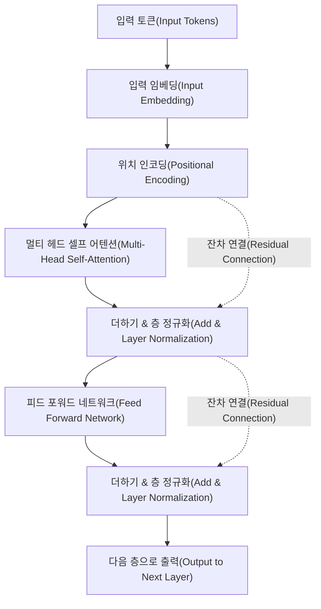
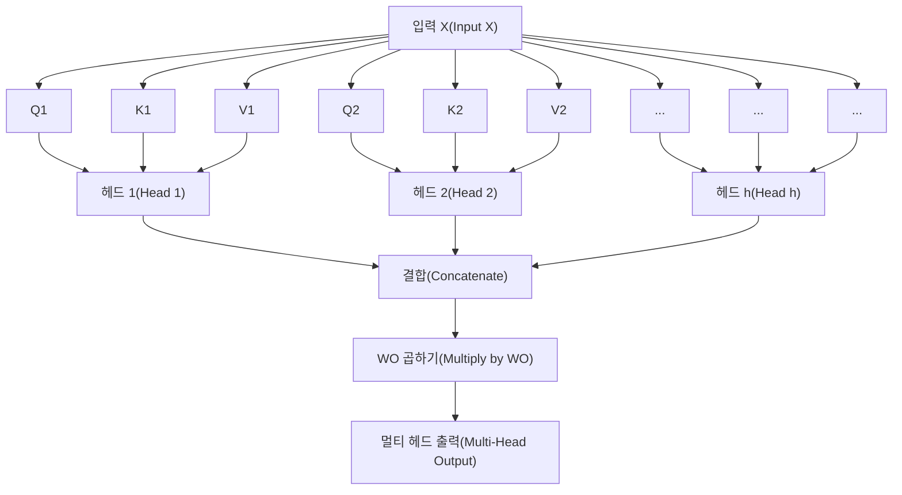

# 머리말: 왜 Transformer의 수학을 배우는가?

현대 자연어 처리(NLP), 그리고 AI 전체의 역사를 새로 썼다고 해도 과언이 아닌 아키텍처가 바로 'Transformer'입니다. 2017년 Google 연구진이 발표한 논문 『Attention Is All You Need』에서 처음 제안된 이 모델은, OpenAI의 GPT 시리즈(ChatGPT의 기반 기술)나 Google의 BERT, Anthropic의 Claude 등 현재 세계를 휩쓸고 있는 대규모 언어 모델(LLM)의 심장부로 기능하고 있습니다.

하지만 Transformer의 원리에 대해 'Attention(주의 메커니즘)을 사용하여 문맥을 이해한다'와 같은 정성적인 설명은 자주 볼 수 있지만, 그 이면에 있는 **수학적인 구조**에 대해 초보자를 위해 깊이 파고든 해설은 의외로 적은 것이 현실입니다. AI가 어떻게 '언어'를 '수식'으로 처리하고 놀라울 정도로 자연스러운 문장을 생성해 내는지 진정으로 이해하기 위해서는, 그 수학적 메커니즘을 파헤치는 것이 필수적입니다.

본 문서에서는 수학이나 프로그래밍에 대한 기초 지식(고등학교 수준의 행렬이나 미분 개념을 아는 분)을 가진 분들을 대상으로, Transformer의 심장부인 'Self-Attention 메커니즘', '쿼리·키·밸류(Q/K/V) 모델', 'Softmax 함수를 통한 정규화', 그리고 'Positional Encoding' 등의 수학적 구조를 철저하고 알기 쉽게 풀어내고자 합니다.

수식의 나열에 압도될 수도 있지만, 하나하나의 계산에는 명확한 '의미'가 있습니다. 이 글을 다 읽을 즈음에는 Transformer가 단순한 마법의 블랙박스가 아니라, 정교하게 설계된 수학과 통계의 결정체라는 것을 이해할 수 있을 것입니다.

---

# 1. 기존 기법의 한계와 Transformer의 혁신성

Transformer가 등장하기 전, 자연어 처리의 주류는 순환 신경망(RNN)이나 그 파생형인 LSTM(Long Short-Term Memory)이었습니다. RNN은 시계열 데이터를 처리하기 위해 설계되었으며, 문장을 단어 단위로 처음부터 순서대로 읽어 들입니다.

하지만 RNN에는 치명적인 약점이 두 가지 있었습니다.
1. **장기 의존성 학습이 어려움**: 문장이 길어지면 처음에 입력된 단어의 정보가 마지막에 도달할 때쯤이면 희미해집니다(기울기 소실 문제).
2. **병렬 계산이 불가능함**: 단어를 순서대로 처리해야 하므로, GPU를 이용한 대규모 병렬 계산이 어려워 학습에 막대한 시간이 걸립니다.

Transformer는 RNN의 구조를 완전히 버리고, 오직 'Attention'만을 사용하여 문맥을 파악한다는 패러다임 시프트를 일으켰습니다. 이를 통해 시퀀스 길이가 아무리 길어도 정보의 손실이 없으며, 연산을 병렬화하여 GPU의 성능을 극대화하는 것이 가능해진 것입니다.

---

# 2. Transformer의 전체 아키텍처

먼저 Transformer 전체의 아키텍처를 조감해 봅시다. Transformer는 크게 나누어 'Encoder(인코더)'와 'Decoder(디코더)'라는 두 개의 블록으로 구성되어 있습니다. 번역 작업을 예로 들면, Encoder가 입력 언어(예: 영어)를 수학적인 벡터 표현으로 변환하고, Decoder가 그 벡터 표현을 바탕으로 출력 언어(예: 한국어)를 생성합니다.

아래 그림은 Encoder 블록의 내부 구조를 간략화한 것입니다.



지금부터는 각 컴포넌트에서 수행되는 수학적인 조작을 순서대로 살펴보겠습니다.

---

# 3. 단어의 벡터화와 위치 인코딩(Positional Encoding)

컴퓨터는 텍스트를 있는 그대로 이해할 수 없습니다. 입력된 텍스트는 먼저 '토큰(Token)'이라는 단위로 분할되고, 각각이 고정 길이의 벡터로 변환됩니다. 이것이 **Input Embedding**입니다.

## 3.1 Input Embedding의 수학
어휘(Vocabulary)의 크기를 $V$, 임베딩 벡터의 차원 수를 $d_{model}$(원본 논문에서는 $d_{model} = 512$)이라고 합시다. 각 단어 $w_i$ 는 임베딩 행렬 $W_E \in \mathbb{R}^{V \times d_{model}}$ 을 사용하여 벡터 $x_i \in \mathbb{R}^{d_{model}}$ 로 변환됩니다.

$$ x_i = W_E \cdot \text{one\_hot}(w_i) $$

이에 따라 문장 전체는 행렬 $X \in \mathbb{R}^{N \times d_{model}}$ 로 표현됩니다($N$ 은 문장의 길이).

## 3.2 Positional Encoding(위치 인코딩)의 필요성과 수식
Transformer는 RNN처럼 단어를 순서대로 처리하는 것이 아니라, 모든 단어를 동시에 병렬 처리합니다. 이는 계산 속도 측면에서는 큰 장점이지만, 동시에 **'단어의 순서(어순)'라는 중요한 정보가 손실되어 버린다**는 문제를 야기합니다. 예를 들어 "개가 사람을 문다"와 "사람이 개를 문다"는 입력되는 단어 집합은 같지만 의미는 전혀 다릅니다.

이 어순 정보를 모델에 제공하기 위해 고안된 것이 **Positional Encoding**입니다.
위치 $pos$ 에 있는 단어의 $i$ 번째 차원에 대한 Positional Encoding $PE$ 는 다음 삼각 함수를 사용하여 계산됩니다.

$$ PE_{(pos, 2i)} = \sin\left(\frac{pos}{10000^{2i/d_{model}}}\right) $$
$$ PE_{(pos, 2i+1)} = \cos\left(\frac{pos}{10000^{2i/d_{model}}}\right) $$

여기서 $pos$ 는 단어의 위치($0, 1, 2, \dots, N-1$), $i$ 는 벡터 차원의 인덱스($0, 1, \dots, d_{model}/2 - 1$)입니다.

### 왜 사인과 코사인을 사용할까?
언뜻 보면 매우 복잡하고 기묘한 수식처럼 보이지만, 여기에는 깊은 수학적인 이유가 있습니다. 삼각 함수를 사용함으로써 모델은 **'절대적인 위치'뿐만 아니라 '상대적인 위치'의 차이**를 쉽게 학습할 수 있게 되는 것입니다.

고등학교 수학에서 배우는 삼각 함수의 덧셈 정리를 떠올려 보세요.
$$ \sin(\alpha + \beta) = \sin\alpha \cos\beta + \cos\alpha \sin\beta $$
$$ \cos(\alpha + \beta) = \cos\alpha \cos\beta - \sin\alpha \sin\beta $$

어떤 위치 $pos$ 에서 오프셋 $k$ 만큼 떨어진 위치 $pos + k$ 의 Positional Encoding은, 위치 $pos$ 의 Positional Encoding의 선형 결합으로 표현할 수 있습니다. 즉, 행렬 $M_k$ 를 사용하여 다음과 같이 쓸 수 있습니다.

$$ PE_{pos+k} = M_k \cdot PE_{pos} $$

이를 통해 Attention 메커니즘은 단어끼리 '얼마나 떨어져 있는지'라는 상대적 거리를 내적 계산을 통해 쉽게 인식할 수 있게 됩니다. 또한, 파장이 다른 여러 사인/코사인 파동을 조합함으로써 아무리 긴 문장이라도 고유한 위치 벡터를 생성할 수 있다는 장점도 있습니다.

최종적인 입력 행렬 $X_{input}$ 은 단어의 임베딩 벡터에 이 위치 인코딩을 더한 것이 됩니다.

$$ X_{input} = X + PE $$

---

# 4. Self-Attention(셀프 어텐션 메커니즘)의 심오한 수학

드디어 Transformer의 가장 중요한 컴포넌트인 **Self-Attention(셀프 어텐션 메커니즘)**으로 들어갑니다. Self-Attention의 목적은 '문장 내의 모든 단어들 사이의 연관도를 계산하여, 각 단어의 벡터를 문맥을 고려한 더 풍부한 표현으로 갱신하는 것'입니다.

여기서는 '검색 시스템'의 비유가 사용됩니다.
- **Query (Q)**: 쿼리(검색어). "내가 지금 찾고 있는 정보는 무엇인가?"
- **Key (K)**: 키(색인/제목). "내가 가지고 있는 정보는 무엇인가?"
- **Value (V)**: 밸류(실체/내용). "내가 실제로 제공할 정보는 무엇인가?"

## 4.1 행렬 $Q, K, V$ 의 생성
입력 행렬 $X \in \mathbb{R}^{N \times d_{model}}$ (여기서는 설명을 간단히 하기 위해 배치 크기는 무시합니다)에 대하여 학습 가능한 가중치 행렬 $W^Q, W^K, W^V \in \mathbb{R}^{d_{model} \times d_k}$ 를 곱함으로써 쿼리 $Q$, 키 $K$, 밸류 $V$ 를 계산합니다. (통상적으로 $d_k = d_v = d_{model} / h$)

$$ Q = X W^Q $$
$$ K = X W^K $$
$$ V = X W^V $$

여기서 $Q, K, V$ 는 모두 $\mathbb{R}^{N \times d_k}$ 의 행렬이 됩니다.

## 4.2 Attention Score의 계산(내적)
각 단어의 Query가 다른 모든 단어의 Key와 얼마나 연관되어 있는지를 측정하기 위해 벡터의 **내적**을 계산합니다. 행렬 연산으로 쓰면 다음과 같습니다.

$$ \text{Scores} = Q K^T $$

이 계산을 통해 얻어지는 행렬 $\text{Scores} \in \mathbb{R}^{N \times N}$ 의 각 원소 $s_{ij}$ 는, $i$ 번째 단어의 Query와 $j$ 번째 단어의 Key의 내적, 즉 '연관도의 강도'를 나타냅니다.

## 4.3 스케일링(Scale)
내적을 통한 점수 계산에는 한 가지 문제가 있습니다. 벡터의 차원 $d_k$ 가 커지면 내적의 값이 극단적으로 커지거나 작아져 버리는 것입니다.

이를 수학적으로 증명해 봅시다.
쿼리의 각 원소 $q \sim \mathcal{N}(0, 1)$, 키의 각 원소 $k \sim \mathcal{N}(0, 1)$ 이 독립적인 표준 정규 분포를 따른다고 가정합니다.
내적 $q \cdot k = \sum_{i=1}^{d_k} q_i k_i$ 의 평균과 분산을 구합니다.
평균： $\mathbb{E}[q_i k_i] = \mathbb{E}[q_i] \mathbb{E}[k_i] = 0 \times 0 = 0$ 이므로, 합의 평균도 $0$.
분산： $q_i k_i$ 의 분산은 독립성에 의해 $\text{Var}(q_i k_i) = \mathbb{E}[(q_i k_i)^2] - (\mathbb{E}[q_i k_i])^2 = 1 \times 1 - 0 = 1$.
따라서 내적 전체의 분산은 차원 수 $d_k$ 와 같아집니다.

$$ \text{Var}(q \cdot k) = d_k $$

분산이 커지면 이후에 적용할 Softmax 함수에서 최댓값 이외의 기울기가 극단적으로 작아지는 '기울기 소실(Gradient Vanishing)'이 발생하여 학습이 진행되지 않게 됩니다.
이를 방지하기 위해 점수를 $\sqrt{d_k}$ 로 나누어(스케일링하여) 분산을 항상 $1$ 로 유지하도록 합니다.

$$ \text{Scaled Scores} = \frac{Q K^T}{\sqrt{d_k}} $$

## 4.4 Softmax 함수를 통한 확률화
얻은 점수를 합계가 $1$ 이 되는 확률 분포(가중치)로 변환하기 위해 **Softmax 함수**를 행 단위로 적용합니다.

$$ a_{ij} = \text{softmax}(s_i)_j = \frac{\exp(s_{ij} / \sqrt{d_k})}{\sum_{m=1}^N \exp(s_{im} / \sqrt{d_k})} $$

행렬 $A \in \mathbb{R}^{N \times N}$ 은 Attention Weight(주의 가중치) 행렬이라고 불립니다. 이 행렬의 각 행 $i$ 를 보면 "단어 $i$ 를 이해하는 데 있어, 다른 어떤 단어 $j$ 에 얼마나 주목(Attention)해야 하는가"가 0에서 1 사이의 값으로 표현되어 있습니다.

## 4.5 Value의 가중합
마지막으로, 얻은 Attention Weight 행렬 $A$ 를 사용하여 Value 행렬 $V$ 의 가중합(Weighted Sum)을 계산합니다.

$$ \text{Output} = A V = \text{softmax}\left(\frac{Q K^T}{\sqrt{d_k}}\right) V $$

이 연산을 통해 출력되는 행렬 $Z \in \mathbb{R}^{N \times d_v}$ 는 '문맥을 고려하여 갱신된 단어의 벡터 표현'들의 집합이 됩니다.
이것이 논문에서 정의하고 있는 **Scaled Dot-Product Attention**의 전모입니다.

---

# 5. Multi-Head Attention(멀티 헤드 어텐션)

한 번의 Attention 계산(싱글 헤드)만으로는 하나의 관점(예를 들어 '문법적인 관계')에서밖에 문맥을 포착하지 못할 가능성이 있습니다. 그래서 언어가 가진 다양한 의미적·구문적 관계('주어와 서술어', '대명사와 그 지시 대상' 등)를 동시에 파악하기 위해 **Multi-Head Attention**이 도입되었습니다.

앞서 말한 $Q, K, V$ 의 생성과 Attention 계산을 병렬로 $h$ 번(헤드의 수. 원본 논문에서는 $h=8$) 수행합니다.

$$ \text{head}_i = \text{Attention}(X W_i^Q, X W_i^K, X W_i^V) $$

여기서 $W_i^Q, W_i^K, W_i^V \in \mathbb{R}^{d_{model} \times d_k}$ 는 $i$ 번째 헤드 전용의 학습 가능한 가중치 행렬입니다.

각 헤드에서 출력된 결과 $\text{head}_i \in \mathbb{R}^{N \times d_v}$ 는 가로로 결합(Concatenate)됩니다.

$$ \text{Concat}(\text{head}_1, \dots, \text{head}_h) \in \mathbb{R}^{N \times (h \cdot d_v)} $$

일반적으로 $h \cdot d_v = d_{model}$ 이 되도록 설정하기 때문에 결합 후의 차원은 다시 입력과 같은 $d_{model}$ 로 돌아옵니다. 마지막으로 이 행렬에 가중치 행렬 $W^O \in \mathbb{R}^{d_{model} \times d_{model}}$ 을 곱하여 최종적인 출력을 얻습니다.

$$ \text{MultiHead}(Q, K, V) = \text{Concat}(\text{head}_1, \dots, \text{head}_h) W^O $$



---

# 6. Feed-Forward Neural Network (FFN)

Multi-Head Attention의 출력은 다음으로 **Position-wise Feed-Forward Network (FFN)**에 입력됩니다.
이는 시퀀스의 '각 위치(단어)마다 독립적으로' 적용되는 2층의 완전 연결 신경망(Fully Connected Neural Network)입니다.

수식으로 나타내면 다음과 같습니다.

$$ \text{FFN}(x) = \max(0, x W_1 + b_1) W_2 + b_2 $$

여기서 $\max(0, z)$ 는 ReLU(Rectified Linear Unit) 활성화 함수를 나타냅니다(최근의 모델에서는 GELU나 SwiGLU가 사용되는 경우도 많습니다).

이 네트워크의 역할은 매우 중요합니다. Attention 메커니즘은 '단어 간의 관계성(공간적·순차적인 관계)'을 학습하지만, FFN은 '각 단어 벡터 자체의 비선형적인 특징 변환'을 담당합니다.
통상적으로 제1층의 가중치 $W_1$ 을 통해 차원을 일시적으로 크게 확대(예를 들어 $d_{model}=512$ 에서 $d_{ff}=2048$ 로 4배 확대)하여 특징 공간에서 복잡한 계산을 수행한 후, 제2층의 가중치 $W_2$ 로 다시 원래의 차원으로 되돌립니다. 이러한 '차원의 확대와 축소'를 통해 모델의 표현력이 비약적으로 향상됩니다.

---

# 7. 잔차 연결(Residual Connection)과 Layer Normalization

딥러닝에서 네트워크의 층을 깊게 쌓아가면 학습 시 기울기가 소실되거나 폭발해 버려 제대로 학습할 수 없게 되는 문제가 발생합니다. 이를 방지하기 위해 Transformer의 각 서브 레이어(Attention과 FFN) 주변에는 **잔차 연결(Residual Connection)**과 **Layer Normalization(층 정규화)**가 배치되어 있습니다.

수식으로 쓰면 서브 레이어의 출력은 다음과 같이 처리됩니다.

$$ \text{Output} = \text{LayerNorm}(x + \text{Sublayer}(x)) $$

## 7.1 잔차 연결 ($x + \text{Sublayer}(x)$)
입력 $x$ 를 서브 레이어의 출력에 직접 더합니다. 이를 통해 역전파(Backpropagation) 시 기울기가 지름길(Shortcut)을 통해 얕은 층으로 직접 전달되므로 층이 깊어져도 학습이 안정됩니다.

## 7.2 Layer Normalization의 수학
Layer Normalization은 특징 차원 방향의 평균과 분산을 계산하여 데이터를 정규화하는 기술입니다. 배치 크기 $B$, 시퀀스 길이 $N$, 차원 수 $d_{model}$ 의 입력에서 어떤 하나의 단어 벡터 $x \in \mathbb{R}^{d_{model}}$ 에 대해 정규화를 수행합니다.

평균 $\mu$ 와 분산 $\sigma^2$ 을 계산합니다.
$$ \mu = \frac{1}{d_{model}} \sum_{i=1}^{d_{model}} x_i $$
$$ \sigma^2 = \frac{1}{d_{model}} \sum_{i=1}^{d_{model}} (x_i - \mu)^2 $$

그리고 정규화된 출력 $\hat{x}$ 를 얻습니다.
$$ \text{LN}(x) = \frac{x - \mu}{\sqrt{\sigma^2 + \epsilon}} \odot \gamma + \beta $$
($\epsilon$ 은 0으로 나누는 것을 방지하기 위한 미소한 상수. $\gamma, \beta$ 는 학습 가능한 스케일 및 시프트 파라미터)

배치 방향의 정규화(Batch Normalization)가 아닌 층 방향의 정규화(Layer Normalization)를 채택한 이유는, 문장처럼 길이가 일정하지 않은 시퀀스 데이터를 처리할 때 배치 간의 통계량이 불안정해지기 쉽기 때문입니다. Layer Normalization을 통해 Transformer는 배치 크기에 의존하지 않고 안정적인 학습이 가능해집니다.

---

# 8. 디코더 특유의 구조: Masked Attention과 Cross-Attention

지금까지 해설한 구조는 인코더의 것입니다. 문장을 생성하는 디코더 블록에서는 구조가 조금 다릅니다.

## 8.1 Masked Multi-Head Attention
디코더의 역할은 '과거의 단어로부터 다음 단어를 예측하는 것'입니다. 따라서 훈련 시에 '미래의 단어'를 보게 되면 부정행위(커닝)가 되어 버립니다. 이를 방지하기 위한 수학적 조작이 **Masking(마스킹)**입니다.

점수 행렬 $Q K^T$ 에 대해 상삼각 부분(미래의 정보에 해당)에 $-\infty$ 에 가까운 매우 작은 값을 설정하는 마스크 행렬 $M$ 을 더합니다.

$$ M_{ij} = \begin{cases} 0 & (i \le j) \\ -\infty & (i > j) \end{cases} $$

$$ \text{Masked Attention}(Q, K, V) = \text{softmax}\left(\frac{Q K^T + M}{\sqrt{d_k}}\right) V $$

Softmax 함수를 계산할 때 $\exp(-\infty) = 0$ 이 되므로 미래 단어에 대한 Attention Weight는 완전히 $0$ 이 됩니다. 이를 통해 인과 관계(Causality)를 유지한 자기 회귀적(Autoregressive)인 생성이 가능해집니다.

## 8.2 Encoder-Decoder Cross-Attention
디코더의 두 번째 서브 레이어는 인코더의 출력을 참조하는 **Cross-Attention**입니다.
여기서 $Q$ 는 직전 디코더 층에서 생성되지만, $K$ 와 $V$ 는 인코더의 최종 층 출력에서 생성됩니다.

$$ Q_{decoder} = X_{dec} W^Q $$
$$ K_{encoder} = X_{enc} W^K $$
$$ V_{encoder} = X_{enc} W^V $$

이 계산을 통해 번역 작업 등에서 '현재 번역하고 있는 단어가 원래 외국어 문장의 어느 부분과 강하게 연관되어 있는지'를 모델이 학습할 수 있게 됩니다.

---

# 9. 계산량과 현대의 최적화 수학

Transformer는 훌륭한 모델이지만 그 수학적 구조로 인한 '약점'도 존재합니다.
Self-Attention의 계산량에 주목해 봅시다. 점수 행렬 $Q K^T$ 의 계산에서는 $(N \times d_k)$ 의 행렬과 $(d_k \times N)$ 의 행렬을 곱해야 하므로, 그 계산량은 **$O(N^2 \cdot d_{model})$**이 됩니다.

즉, **시퀀스 길이 $N$ 에 대해 계산량과 메모리 사용량이 제곱으로 증가**하는 것입니다.
문장이 짧은 경우에는 문제가 되지 않지만, 책 한 권 전체와 같은 방대한 컨텍스트를 LLM에 입력하려고 하면 $N$ 이 수만~수십만에 달해 기존의 Attention 계산에서는 GPU 메모리가 즉시 고갈되고 맙니다.

이 $O(N^2)$ 의 저주를 끊어내기 위해 최근에는 수학적·하드웨어적 접근을 통한 다양한 최적화 기법이 제안되고 있습니다.
그 대표적인 예가 **FlashAttention**입니다. FlashAttention은 GPU의 메모리 계층(SRAM과 HBM) 간의 데이터 전송(메모리 액세스)을 최소화하도록 Attention 계산을 타일 모양으로 분할(Tiling)하여 수행하는 알고리즘입니다. 수식상으로는 표준적인 Attention과 완전히 같은 결과를 출력(Exact Attention)함에도 불구하고, 하드웨어 수준의 최적화를 통해 극적인 속도 향상과 메모리 절감을 실현하였고 GPT-4와 같은 긴 문맥 모델의 구현을 가능하게 했습니다.

그 밖에도 계산량을 $O(N \log N)$ 이나 $O(N)$ 으로 근사하는 Sparse Attention이나 Linear Attention 등의 연구도 활발히 진행되고 있습니다.

---

# 10. 구현의 이미지(PyTorch 스타일의 의사 코드)

지금까지의 수학적 구조를 실제 프로그래밍 코드(Python / PyTorch)로 구현해 보면 놀라울 정도로 단순하게 작성할 수 있다는 것을 알 수 있습니다. Self-Attention의 핵심 부분에 대한 의사 코드(Pseudo-code)를 보여드립니다.

```python
import torch
import torch.nn.functional as F
import math

def scaled_dot_product_attention(q, k, v, mask=None):
    # q, k, v의 형태: [batch_size, num_heads, seq_length, d_k]
    d_k = q.size(-1)
    
    # 1. 내적을 통한 점수 계산: Q * K^T
    # 마지막 두 차원을 전치(transpose)하여 행렬곱(matmul) 계산
    scores = torch.matmul(q, k.transpose(-2, -1))
    
    # 2. 스케일링
    scores = scores / math.sqrt(d_k)
    
    # 3. 마스킹 (Masked Attention의 경우)
    if mask is not None:
        scores = scores.masked_fill(mask == 0, -1e9)
        
    # 4. Softmax를 통한 확률화
    attention_weights = F.softmax(scores, dim=-1)
    
    # 5. Value 행렬 곱하기
    output = torch.matmul(attention_weights, v)
    
    return output, attention_weights
```

수식으로 표현된 $Q K^T / \sqrt{d_k}$ 가 `torch.matmul(q, k.transpose(-2, -1)) / math.sqrt(d_k)` 로 직관적으로 구현되어 있다는 것을 알 수 있습니다. 수학의 이론이 고도화된 최적화 라이브러리의 힘을 빌려 단 몇 줄의 코드로 구현된다는 것은 딥러닝의 매우 흥미로운 측면입니다.

---

# 맺음말: 수식에서 보이는 '지능'의 형태

본 문서에서는 Transformer 모델의 심오한 곳에 있는 수학적 구조를 파헤쳐 보았습니다.

단어를 다차원 벡터 공간에 매핑하는 Embedding, 위치 정보를 삼각파의 합성으로 표현하는 Positional Encoding, 그리고 정보 검색의 비유에서 비롯된 행렬의 내적 계산인 Self-Attention 메커니즘. 이들 하나하나의 컴포넌트는 선형대수학, 미적분학, 확률과 통계라는 기초적인 수학이 쌓여 이루어진 것에 불과합니다.

하지만 이러한 단순한 행렬 연산이 겹겹이 쌓이고, 수십억 수천억 개의 파라미터를 통해 거대한 데이터 세트로부터 패턴을 학습할 때, 그곳에는 우리의 '언어'를 이해하고 논리적인 추론을 하며 때로는 창의적인 아이디어를 만들어 내는 것 같은 '지능의 형태'가 나타납니다.

'Attention Is All You Need'라는 도발적인 제목이 보여주듯 복잡한 순환 처리나 합성곱 처리를 버리고 순수한 '어텐션(연관도)' 계산에 특화된 이 아키텍처의 아름다움은 바로 그 수학적인 단순함에 있다고 할 수 있을 것입니다.

앞으로 Transformer를 뛰어넘는 새로운 아키텍처(State Space Model인 Mamba 등)가 등장할 가능성도 있지만, Transformer가 구축한 'Attention을 통한 문맥 이해'의 수학적 프레임워크는 AI의 역사에 영원히 새겨질 것입니다.

만약 여러분이 앞으로 ChatGPT나 Claude 등의 LLM을 사용할 기회가 있다면, 그 백그라운드에서 초당 수조 번의 $Q K^T$ 행렬곱이 계산되고 Softmax 함수가 확률을 산출해 내는 모습을 상상해 보세요. 기술에 대한 해상도가 높아져 AI의 세계가 더욱 흥미롭게 느껴질 것입니다.

### 참고 문헌
- Vaswani, A., et al. (2017). "Attention Is All You Need." *Advances in Neural Information Processing Systems*.
- Alammar, J. (2018). "The Illustrated Transformer." 

---
*이 글은 자연어 처리와 AI의 수학적 기초를 배우려는 분들을 위한 가이드로 작성되었습니다. 질문이나 토론할 내용이 있다면 꼭 댓글로 알려주세요!*
