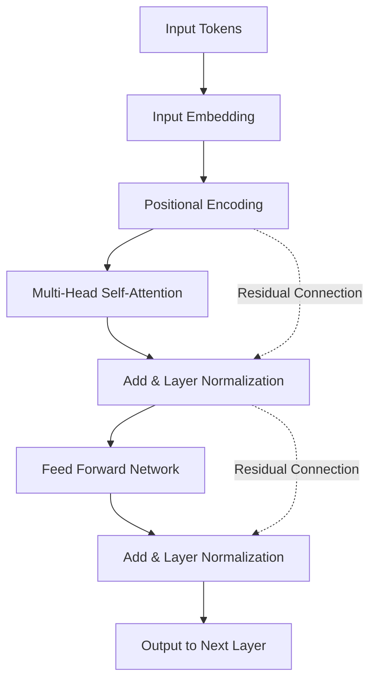
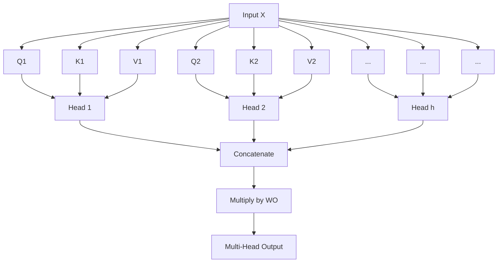

# はじめに：なぜTransformerの数学を学ぶのか？

現代の自然言語処理（NLP）、そしてAI全体の歴史を塗り替えたと言っても過言ではないアーキテクチャが「Transformer」です。2017年にGoogleの研究者らによって発表された論文『Attention Is All You Need』で初めて提案されたこのモデルは、OpenAIのGPTシリーズ（ChatGPTの基盤技術）やGoogleのBERT、AnthropicのClaudeなど、現在世界を席巻している大規模言語モデル（LLM）の心臓部として機能しています。

しかし、Transformerの仕組みについて「Attention（注意機構）を使って文脈を理解する」といった定性的な説明はよく見かけますが、その背後にある**数学的な構造**について初心者向けに深く掘り下げた解説は意外と少ないのが現状です。AIがどのようにして「言葉」を「数式」として処理し、驚くほど自然な文章を生成しているのかを真に理解するためには、その数学的メカニズムを読み解くことが不可欠です。

本記事では、数学やプログラミングの基礎知識を持つ方（高校レベルの行列や微分の概念がわかる方）を対象に、Transformerの心臓部である「Self-Attention機構」「クエリ・キー・バリュー（Q/K/V）モデル」「Softmax関数による正規化」、そして「Positional Encoding」などの数学的構造を徹底的に、かつわかりやすく解き明かしていきます。

数式の羅列に圧倒されるかもしれませんが、一つ一つの計算には明確な「意味」があります。この記事を読み終える頃には、Transformerが単なる魔法のブラックボックスではなく、精緻に設計された数学と統計の結晶であることが理解できるはずです。

---

# 1. 従来手法の限界とTransformerの革新性

Transformerが登場する前、自然言語処理の主流はリカレントニューラルネットワーク（RNN）や、その派生であるLSTM（Long Short-Term Memory）でした。RNNは時系列データを処理するために設計されており、文章を単語ごとに先頭から順番に読み込んでいきます。

しかし、RNNには致命的な弱点が2つありました。
1. **長期依存性の学習が困難**：文章が長くなると、最初の方に入力された単語の情報が、最後の方に到達するまでに薄れてしまう（勾配消失問題）。
2. **並列計算が不可能**：単語を順番に処理しなければならないため、GPUを用いた大規模な並列計算が難しく、学習に膨大な時間がかかる。

Transformerは、RNNの構造を完全に捨て去り、「Attention」のみを用いて文脈を捉えるというパラダイムシフトを起こしました。これにより、系列長がどれだけ長くても情報の損失がなく、かつ計算を並列化してGPUの性能を最大限に引き出すことが可能になったのです。

---

# 2. Transformerの全体アーキテクチャ

まずは、Transformer全体のアーキテクチャを俯瞰してみましょう。Transformerは大きく分けて「Encoder（エンコーダ）」と「Decoder（デコーダ）」の2つのブロックから構成されています。翻訳タスクを例にとると、Encoderが入力言語（例：英語）を数学的なベクトル表現に変換し、Decoderがそのベクトル表現をもとに出力言語（例：日本語）を生成します。

以下の図は、Encoderブロックの内部構造を簡略化したものです。



ここからは、各コンポーネントで行われている数学的な操作を順を追って見ていきましょう。

---

# 3. 単語のベクトル化と位置エンコーディング（Positional Encoding）

コンピュータはテキストをそのまま理解することはできません。入力されたテキストはまず「トークン（Token）」と呼ばれる単位に分割され、それぞれが固定長のベクトルに変換されます。これが**Input Embedding**です。

## 3.1 Input Embeddingの数学
語彙（ボキャブラリー）のサイズを $V$、埋め込みベクトルの次元数を $d_{model}$（元の論文では $d_{model} = 512$）とします。各単語 $w_i$ は、埋め込み行列 $W_E \in \mathbb{R}^{V \times d_{model}}$ を用いてベクトル $x_i \in \mathbb{R}^{d_{model}}$ に変換されます。

$$ x_i = W_E \cdot \text{one\_hot}(w_i) $$

これにより、文章全体は行列 $X \in \mathbb{R}^{N \times d_{model}}$ として表現されます（$N$ は文章の長さ）。

## 3.2 Positional Encoding（位置エンコーディング）の必要性と数式
TransformerはRNNのように単語を順番に処理するわけではなく、すべての単語を同時に並列処理します。これは計算速度の観点では大きなメリットですが、同時に**「単語の順番（語順）」という重要な情報が失われてしまう**という問題を引き起こします。例えば、「犬が人を噛む」と「人が犬を噛む」は、入力される単語集合は同じですが意味は全く異なります。

この語順情報をモデルに与えるために考案されたのが**Positional Encoding**です。
位置 $pos$ にある単語の $i$ 番目の次元に対するPositional Encoding $PE$ は、以下の三角関数を用いて計算されます。

$$ PE_{(pos, 2i)} = \sin\left(\frac{pos}{10000^{2i/d_{model}}}\right) $$
$$ PE_{(pos, 2i+1)} = \cos\left(\frac{pos}{10000^{2i/d_{model}}}\right) $$

ここで、$pos$ は単語の位置（$0, 1, 2, \dots, N-1$）、$i$ はベクトルの次元のインデックス（$0, 1, \dots, d_{model}/2 - 1$）です。

### なぜサインとコサインを使うのか？
一見すると非常に複雑で奇妙な数式に見えますが、これには深い数学的な理由があります。三角関数を使用することで、モデルは**「絶対的な位置」だけでなく「相対的な位置」の差分**を容易に学習できるようになるのです。

高校数学で学ぶ三角関数の加法定理を思い出してください。
$$ \sin(\alpha + \beta) = \sin\alpha \cos\beta + \cos\alpha \sin\beta $$
$$ \cos(\alpha + \beta) = \cos\alpha \cos\beta - \sin\alpha \sin\beta $$

ある位置 $pos$ からオフセット $k$ だけ離れた位置 $pos + k$ のPositional Encodingは、位置 $pos$ のPositional Encodingの線形結合として表すことができます。つまり、行列 $M_k$ を用いて次のように書けます。

$$ PE_{pos+k} = M_k \cdot PE_{pos} $$

これにより、Attention機構は単語同士が「どれくらい離れているか」という相対距離を、内積計算を通じて簡単に認識できるようになります。また、波長が異なる複数のサイン・コサイン波を組み合わせることで、どんなに長い文章であっても一意の位置ベクトルを生成できるという利点もあります。

最終的な入力行列 $X_{input}$ は、単語の埋め込みベクトルにこの位置エンコーディングを足し合わせたものになります。

$$ X_{input} = X + PE $$

---

# 4. Self-Attention（自己注意機構）の深淵なる数学

いよいよTransformerの最重要コンポーネントである**Self-Attention（自己注意機構）**に踏み込みます。Self-Attentionの目的は、「文章内のすべての単語同士の関連度を計算し、各単語のベクトルを、文脈を考慮したより豊かな表現に更新すること」です。

ここでは、「検索システム」のアナロジーが使われます。
- **Query (Q)**: クエリ（検索語）。「私が今探している情報は何か？」
- **Key (K)**: キー（見出し）。「私が持っている情報は何か？」
- **Value (V)**: バリュー（実体）。「私が実際に提供する情報は何か？」

## 4.1 行列 $Q, K, V$ の生成
入力行列 $X \in \mathbb{R}^{N \times d_{model}}$（ここでは話を簡単にするためバッチサイズは無視します）に対して、学習可能な重み行列 $W^Q, W^K, W^V \in \mathbb{R}^{d_{model} \times d_k}$ を掛け合わせることで、クエリ $Q$、キー $K$、バリュー $V$ を計算します。（通常 $d_k = d_v = d_{model} / h$）

$$ Q = X W^Q $$
$$ K = X W^K $$
$$ V = X W^V $$

ここで、$Q, K, V$ はすべて $\mathbb{R}^{N \times d_k}$ の行列になります。

## 4.2 Attention Scoreの計算（内積）
各単語のQueryが、他のすべての単語のKeyとどれくらい関連しているかを測るために、ベクトルの**内積**を計算します。行列演算で書くと以下のようになります。

$$ \text{Scores} = Q K^T $$

この計算により得られる行列 $\text{Scores} \in \mathbb{R}^{N \times N}$ の各要素 $s_{ij}$ は、$i$ 番目の単語のQueryと $j$ 番目の単語のKeyの内積、すなわち「関連度の強さ」を表します。

## 4.3 スケーリング（Scale）
内積によるスコア計算には一つの問題があります。ベクトルの次元 $d_k$ が大きくなると、内積の値が極端に大きくなったり小さくなったりしてしまうのです。

これを数学的に証明しましょう。
クエリの各要素 $q \sim \mathcal{N}(0, 1)$、キーの各要素 $k \sim \mathcal{N}(0, 1)$ が独立した標準正規分布に従うと仮定します。
内積 $q \cdot k = \sum_{i=1}^{d_k} q_i k_i$ の平均と分散を求めます。
平均： $\mathbb{E}[q_i k_i] = \mathbb{E}[q_i] \mathbb{E}[k_i] = 0 \times 0 = 0$ なので、和の平均も $0$。
分散： $q_i k_i$ の分散は、独立性から $\text{Var}(q_i k_i) = \mathbb{E}[(q_i k_i)^2] - (\mathbb{E}[q_i k_i])^2 = 1 \times 1 - 0 = 1$。
したがって、内積全体の分散は次元数 $d_k$ に等しくなります。

$$ \text{Var}(q \cdot k) = d_k $$

分散が大きくなると、この後適用するSoftmax関数において、最大値以外の勾配が極端に小さくなる「勾配消失」が発生し、学習が進まなくなってしまいます。
これを防ぐため、スコアを $\sqrt{d_k}$ で割る（スケーリングする）ことで、分散を常に $1$ に保つようにします。

$$ \text{Scaled Scores} = \frac{Q K^T}{\sqrt{d_k}} $$

## 4.4 Softmax関数による確率化
得られたスコアを、合計が $1$ になるような確率分布（重み）に変換するために **Softmax関数** を行ごとに適用します。

$$ a_{ij} = \text{softmax}(s_i)_j = \frac{\exp(s_{ij} / \sqrt{d_k})}{\sum_{m=1}^N \exp(s_{im} / \sqrt{d_k})} $$

行列 $A \in \mathbb{R}^{N \times N}$ はAttention Weight（注意の重み）行列と呼ばれます。この行列の各行 $i$ を見ると、「単語 $i$ を理解する上で、他のどの単語 $j$ にどれくらい注目（Attention）すべきか」が 0 から 1 の値で表現されています。

## 4.5 Valueの重み付き和
最後に、得られたAttention Weight行列 $A$ を用いて、Value行列 $V$ の重み付き和を計算します。

$$ \text{Output} = A V = \text{softmax}\left(\frac{Q K^T}{\sqrt{d_k}}\right) V $$

この演算によって出力される行列 $Z \in \mathbb{R}^{N \times d_v}$ は、「文脈を考慮して更新された単語のベクトル表現」の集まりとなります。
これが、論文で定義されている **Scaled Dot-Product Attention** の全容です。

---

# 5. Multi-Head Attention（マルチヘッド・アテンション）

一回のAttention計算（シングルヘッド）だけでは、一つの観点（例えば「文法的な関係」）しか文脈を捉えられない可能性があります。そこで、言語の持つ多様な意味的・構文的関係（「主語と述語」「代名詞とその指示先」など）を同時に捉えるために、**Multi-Head Attention** が導入されました。

先ほどの $Q, K, V$ の生成とAttention計算を、並列に $h$ 回（ヘッドの数。元の論文では $h=8$）行います。

$$ \text{head}_i = \text{Attention}(X W_i^Q, X W_i^K, X W_i^V) $$

ここで、$W_i^Q, W_i^K, W_i^V \in \mathbb{R}^{d_{model} \times d_k}$ は $i$ 番目のヘッド専用の学習可能な重み行列です。

各ヘッドから出力された結果 $\text{head}_i \in \mathbb{R}^{N \times d_v}$ は、横に結合（Concatenate）されます。

$$ \text{Concat}(\text{head}_1, \dots, \text{head}_h) \in \mathbb{R}^{N \times (h \cdot d_v)} $$

通常 $h \cdot d_v = d_{model}$ となるように設定されるため、結合後の次元は再び入力と同じ $d_{model}$ に戻ります。最後に、この行列に重み行列 $W^O \in \mathbb{R}^{d_{model} \times d_{model}}$ を掛けて、最終的な出力を得ます。

$$ \text{MultiHead}(Q, K, V) = \text{Concat}(\text{head}_1, \dots, \text{head}_h) W^O $$



---

# 6. Feed-Forward Neural Network (FFN)

Multi-Head Attentionの出力は、次に **Position-wise Feed-Forward Network (FFN)** に入力されます。
これは、系列の「各位置（単語）ごとに独立して」適用される2層の全結合ニューラルネットワークです。

数式で表すと以下のようになります。

$$ \text{FFN}(x) = \max(0, x W_1 + b_1) W_2 + b_2 $$

ここで、$\max(0, z)$ はReLU（Rectified Linear Unit）活性化関数を表しています（最近のモデルではGELUやSwiGLUが使われることも多いです）。

このネットワークの役割は非常に重要です。Attention機構は「単語間の関係性（空間的・系列的な関係）」を学習しますが、FFNは「各単語ベクトル自体の非線形な特徴変換」を担当します。
通常、第一層の重み $W_1$ によって次元を一時的に大きく拡大（例えば $d_{model}=512$ から $d_{ff}=2048$ に4倍拡大）し、特徴空間上で複雑な計算を行った後、第二層の重み $W_2$ で再び元の次元に戻します。この「次元の拡大と縮小」によって、モデルの表現力が飛躍的に高まっています。

---

# 7. 残差接続（Residual Connection）とLayer Normalization

ディープラーニングにおいて、ネットワークの層を深くしていくと、学習時に勾配が消失または爆発してしまい、うまく学習できなくなる問題が発生します。これを防ぐために、Transformerの各サブレイヤー（AttentionとFFN）の周囲には、**残差接続（Residual Connection）** と **Layer Normalization（層正規化）** が配置されています。

数式で書くと、サブレイヤーの出力は次のように処理されます。

$$ \text{Output} = \text{LayerNorm}(x + \text{Sublayer}(x)) $$

## 7.1 残差接続 ($x + \text{Sublayer}(x)$)
入力 $x$ をサブレイヤーの出力に直接足し合わせます。これにより、逆伝播時に勾配がショートカットを通って直接浅い層に伝わるため、層を深くしても学習が安定します。

## 7.2 Layer Normalizationの数学
Layer Normalizationは、特徴次元方向の平均と分散を計算し、データを正規化する技術です。バッチサイズ $B$、系列長 $N$、次元数 $d_{model}$ の入力において、ある一つの単語ベクトル $x \in \mathbb{R}^{d_{model}}$ に対して正規化を行います。

平均 $\mu$ と分散 $\sigma^2$ を計算します。
$$ \mu = \frac{1}{d_{model}} \sum_{i=1}^{d_{model}} x_i $$
$$ \sigma^2 = \frac{1}{d_{model}} \sum_{i=1}^{d_{model}} (x_i - \mu)^2 $$

そして、正規化された出力 $\hat{x}$ を得ます。
$$ \text{LN}(x) = \frac{x - \mu}{\sqrt{\sigma^2 + \epsilon}} \odot \gamma + \beta $$
（$\epsilon$ はゼロ除算を防ぐための微小な定数。$\gamma, \beta$ は学習可能なスケールとシフトのパラメータ）

バッチ方向の正規化（Batch Normalization）ではなく、層方向の正規化（Layer Normalization）を採用した理由は、文章のように長さが一定でない系列データを処理する際、バッチ間の統計量が不安定になりやすいためです。Layer Normalizationにより、Transformerはバッチサイズに依存せずに安定した学習が可能になります。

---

# 8. デコーダ特有の構造：Masked AttentionとCross-Attention

ここまで解説した構造はエンコーダのものです。文章を生成するデコーダブロックでは、構造が少し異なります。

## 8.1 Masked Multi-Head Attention
デコーダの役割は「過去の単語から次の単語を予測すること」です。したがって、訓練時に「未来の単語」を見てしまってはカンニングになってしまいます。これを防ぐための数学的操作が **Masking（マスキング）** です。

スコア行列 $Q K^T$ に対して、上三角部分（未来の情報に相当）に $-\infty$ に近い非常に小さな値を設定するマスク行列 $M$ を足し合わせます。

$$ M_{ij} = \begin{cases} 0 & (i \le j) \\ -\infty & (i > j) \end{cases} $$

$$ \text{Masked Attention}(Q, K, V) = \text{softmax}\left(\frac{Q K^T + M}{\sqrt{d_k}}\right) V $$

Softmax関数を計算する際、$\exp(-\infty) = 0$ となるため、未来の単語へのAttention Weightは完全に $0$ になります。これにより、因果関係（Causality）を保持した自己回帰的な生成が可能になります。

## 8.2 Encoder-Decoder Cross-Attention
デコーダの2つ目のサブレイヤーは、エンコーダからの出力を参照する **Cross-Attention** です。
ここでは、$Q$ は一つ前のデコーダ層から生成されますが、$K$ と $V$ はエンコーダの最終層の出力から生成されます。

$$ Q_{decoder} = X_{dec} W^Q $$
$$ K_{encoder} = X_{enc} W^K $$
$$ V_{encoder} = X_{enc} W^V $$

この計算により、翻訳タスクなどで「今翻訳している単語が、元の外国語の文章のどの部分に強く関連しているか」をモデルが学習できるようになります。

---

# 9. 計算量と現代における最適化の数学

Transformerは素晴らしいモデルですが、その数学的構造ゆえの「弱点」も存在します。
Self-Attentionの計算量に注目してください。スコア行列 $Q K^T$ の計算では、$(N \times d_k)$ の行列と $(d_k \times N)$ の行列を掛け合わせるため、その計算量は **$O(N^2 \cdot d_{model})$** となります。

つまり、**系列長 $N$ に対して計算量とメモリ使用量が二乗で増加する**のです。
文章が短い場合は問題になりませんが、書籍丸ごと一冊のような長大なコンテキストをLLMに入力しようとすると、$N$ が数万〜数十万に達し、従来のAttention計算ではGPUのメモリが即座に枯渇してしまいます。

この $O(N^2)$ の呪いを断ち切るために、近年では数学的・ハードウェア的アプローチから様々な最適化が提案されています。
その代表例が **FlashAttention** です。FlashAttentionは、GPUのメモリ階層（SRAMとHBM）間のデータ転送（メモリアクセス）を最小限に抑えるよう、Attention計算をタイル状に分割（Tiling）して行うアルゴリズムです。数式上は標準的なAttentionと全く同じ結果を出力する（Exact Attention）にもかかわらず、ハードウェアレベルの最適化により劇的な高速化とメモリ削減を実現し、GPT-4などの長文脈モデルの実現を可能にしました。

他にも、計算量を $O(N \log N)$ や $O(N)$ に近似する Sparse Attention や Linear Attention などの研究も盛んに行われています。

---

# 10. 実装のイメージ（PyTorch風の擬似コード）

ここまでの数学的構造を、実際のプログラミングコード（Python / PyTorch）に落とし込むと、驚くほどシンプルに記述できることがわかります。Self-Attentionのコア部分の擬似コードを示します。

```python
import torch
import torch.nn.functional as F
import math

def scaled_dot_product_attention(q, k, v, mask=None):
    # q, k, vの形状: [batch_size, num_heads, seq_length, d_k]
    d_k = q.size(-1)
    
    # 1. 内積によるスコア計算: Q * K^T
    # 最後の2つの次元を転置して行列積を計算
    scores = torch.matmul(q, k.transpose(-2, -1))
    
    # 2. スケーリング
    scores = scores / math.sqrt(d_k)
    
    # 3. マスキング (Masked Attentionの場合)
    if mask is not None:
        scores = scores.masked_fill(mask == 0, -1e9)
        
    # 4. Softmaxによる確率化
    attention_weights = F.softmax(scores, dim=-1)
    
    # 5. Value行列の掛け合わせ
    output = torch.matmul(attention_weights, v)
    
    return output, attention_weights
```

数式で表された $Q K^T / \sqrt{d_k}$ が `torch.matmul(q, k.transpose(-2, -1)) / math.sqrt(d_k)` として直感的に実装されていることがわかります。数学の理論が、高度な最適化ライブラリの力を借りて数行のコードで実現されるのは、ディープラーニングの非常に面白い側面です。

---

# おわりに：数式から見えてくる「知能」の形

本記事では、Transformerモデルの深奥にある数学的構造を解き明かしてきました。

単語を多次元ベクトル空間にマッピングするEmbedding、位置情報を三角波の合成で表現するPositional Encoding、そして情報検索のアナロジーから生まれた行列の内積計算であるSelf-Attention機構。これら一つ一つのコンポーネントは、線形代数、微積分、確率統計といった基礎的な数学の積み重ねにすぎません。

しかし、これらの単純な行列演算が何層にも重なり、何十億、何千億というパラメータを通じて巨大なデータセットからパターンを学習するとき、そこには私たちの「言葉」を解し、論理的な推論を行い、時に創造的なアイデアを生み出すかのような「知能の形」が立ち現れます。

「Attention Is All You Need」という挑発的なタイトルが示す通り、複雑なリカレント処理や畳み込み処理を捨て去り、純粋な「アテンション（関連度）」の計算に特化したこのアーキテクチャの美しさは、その数学的なシンプルさにこそあると言えるでしょう。

今後、Transformerを超える新たなアーキテクチャ（State Space ModelであるMambaなど）が登場する可能性もありますが、Transformerが築き上げた「Attentionによる文脈理解」の数学的枠組みは、AIの歴史に永遠に刻まれるはずです。

もしあなたが今後、ChatGPTやClaudeなどのLLMを使う機会があれば、そのバックグラウンドで毎秒何兆回もの $Q K^T$ の行列積が計算され、Softmax関数が確率を弾き出している様子を想像してみてください。技術に対する解像度が上がり、よりAIの世界が面白く感じられるはずです。

### 参考文献
- Vaswani, A., et al. (2017). "Attention Is All You Need." *Advances in Neural Information Processing Systems*.
- Alammar, J. (2018). "The Illustrated Transformer." 

---
*この記事は、自然言語処理とAIの数学的基礎を学ぶ方々へのガイドとして執筆されました。質問や議論があれば、ぜひコメント欄でお知らせください！*
