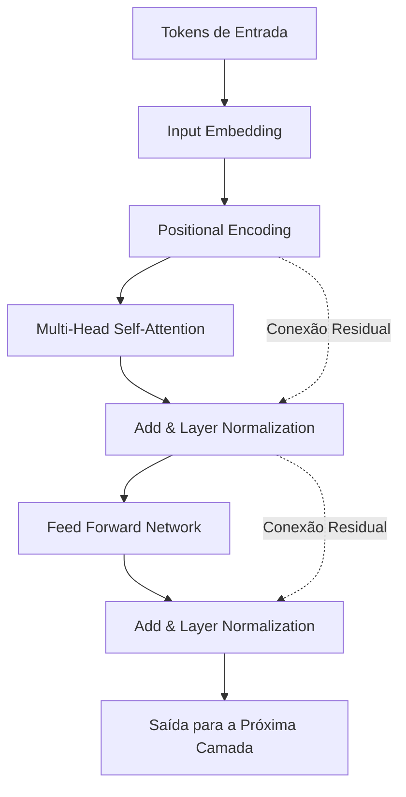
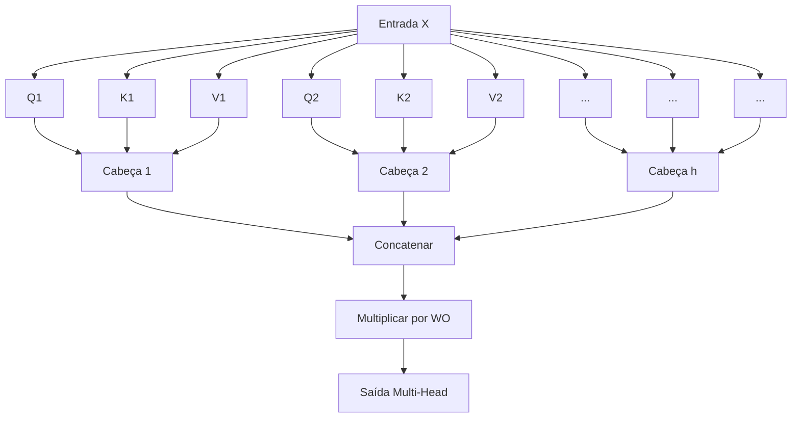

# Introdução: Por que aprender a matemática do Transformer?

Não é exagero dizer que a arquitetura "Transformer" reescreveu a história do Processamento de Linguagem Natural (NLP) e da IA moderna como um todo. Proposto pela primeira vez no artigo "Attention Is All You Need", publicado por pesquisadores do Google em 2017, este modelo atua como o coração dos Grandes Modelos de Linguagem (LLMs) que dominam o mundo hoje, como a série GPT da OpenAI (a tecnologia base do ChatGPT), o BERT do Google e o Claude da Anthropic.

No entanto, embora vejamos frequentemente explicações qualitativas sobre o funcionamento do Transformer, como "usar Attention (mecanismo de atenção) para entender o contexto", a realidade é que existem surpreendentemente poucas explicações aprofundadas para iniciantes sobre a **estrutura matemática** por trás disso. Para realmente entender como a IA processa "palavras" como "fórmulas matemáticas" e gera textos incrivelmente naturais, é essencial desvendar seus mecanismos matemáticos.

Neste artigo, direcionado a pessoas com conhecimento básico em matemática e programação (que compreendem conceitos de matrizes e derivadas em nível de ensino médio), explicaremos de forma completa e acessível as estruturas matemáticas que formam o núcleo do Transformer: o mecanismo de "Self-Attention", o modelo "Query, Key, Value (Q/K/V)", a "Normalização com a função Softmax" e o "Positional Encoding".

Você pode se sentir sobrecarregado pela sucessão de fórmulas, mas cada cálculo tem um "significado" claro. Quando terminar de ler este artigo, você deverá compreender que o Transformer não é apenas uma caixa preta mágica, mas uma cristalização de matemática e estatística meticulosamente projetada.

---

# 1. Limitações dos métodos tradicionais e a inovação do Transformer

Antes do surgimento do Transformer, a corrente principal do processamento de linguagem natural eram as Redes Neurais Recorrentes (RNN) e sua derivação, o LSTM (Long Short-Term Memory). As RNNs são projetadas para processar dados de séries temporais, lendo o texto sequencialmente, palavra por palavra, a partir do início.

No entanto, as RNNs tinham duas fraquezas fatais:
1. **Dificuldade em aprender dependências de longo prazo**: À medida que a frase se torna mais longa, as informações das palavras inseridas no início desaparecem quando chegam ao fim (problema do desaparecimento do gradiente).
2. **Impossibilidade de computação paralela**: Como as palavras devem ser processadas sequencialmente, a computação paralela em larga escala usando GPUs é difícil, e o treinamento exige uma quantidade enorme de tempo.

O Transformer causou uma mudança de paradigma ao abandonar completamente a estrutura da RNN e usar apenas a "Attention" para capturar o contexto. Isso tornou possível processar sequências de qualquer tamanho sem perda de informação e, ao mesmo tempo, paralelizar os cálculos para maximizar o desempenho das GPUs.

---

# 2. Arquitetura geral do Transformer

Primeiro, vamos dar uma visão geral da arquitetura do Transformer. O Transformer é amplamente dividido em dois blocos: "Encoder" (Codificador) e "Decoder" (Decodificador). Tomando uma tarefa de tradução como exemplo, o Encoder converte o idioma de entrada (ex.: inglês) em uma representação vetorial matemática, e o Decoder usa essa representação vetorial para gerar o idioma de saída (ex.: japonês).

O diagrama abaixo é uma versão simplificada da estrutura interna do bloco Encoder.



A partir daqui, vamos analisar passo a passo as operações matemáticas que ocorrem em cada componente.

---

# 3. Vetorização de palavras e Positional Encoding (Codificação Posicional)

Os computadores não podem entender o texto como ele é. O texto de entrada é primeiro dividido em unidades chamadas "Tokens", e cada um é convertido em um vetor de comprimento fixo. Este é o **Input Embedding**.

## 3.1 A matemática do Input Embedding
Seja $V$ o tamanho do vocabulário e $d_{model}$ a dimensão do vetor de embedding (no artigo original, $d_{model} = 512$). Cada palavra $w_i$ é convertida em um vetor $x_i \in \mathbb{R}^{d_{model}}$ usando a matriz de embedding $W_E \in \mathbb{R}^{V \times d_{model}}$.

$$ x_i = W_E \cdot \text{one\_hot}(w_i) $$

Desta forma, o texto inteiro é representado como uma matriz $X \in \mathbb{R}^{N \times d_{model}}$ (onde $N$ é o comprimento da frase).

## 3.2 A necessidade e as fórmulas do Positional Encoding
O Transformer não processa palavras sequencialmente como uma RNN, mas processa todas as palavras simultaneamente em paralelo. Esta é uma grande vantagem em termos de velocidade de cálculo, mas ao mesmo tempo causa o problema de **perda da informação crucial sobre a "ordem das palavras"**. Por exemplo, "o cachorro morde o homem" e "o homem morde o cachorro" têm o mesmo conjunto de palavras de entrada, mas os significados são completamente diferentes.

O que foi idealizado para fornecer essa informação sobre a ordem das palavras ao modelo é o **Positional Encoding**.
O Positional Encoding $PE$ para a $i$-ésima dimensão de uma palavra na posição $pos$ é calculado usando as seguintes funções trigonométricas:

$$ PE_{(pos, 2i)} = \sin\left(\frac{pos}{10000^{2i/d_{model}}}\right) $$
$$ PE_{(pos, 2i+1)} = \cos\left(\frac{pos}{10000^{2i/d_{model}}}\right) $$

Aqui, $pos$ é a posição da palavra ($0, 1, 2, \dots, N-1$) e $i$ é o índice da dimensão do vetor ($0, 1, \dots, d_{model}/2 - 1$).

### Por que usar seno e cosseno?
À primeira vista, parecem fórmulas muito complexas e estranhas, mas há uma razão matemática profunda para isso. Ao usar funções trigonométricas, o modelo pode aprender facilmente **não apenas a "posição absoluta", mas também a diferença na "posição relativa"**.

Lembre-se do teorema de adição para funções trigonométricas aprendido na matemática do ensino médio:
$$ \sin(\alpha + \beta) = \sin\alpha \cos\beta + \cos\alpha \sin\beta $$
$$ \cos(\alpha + \beta) = \cos\alpha \cos\beta - \sin\alpha \sin\beta $$

O Positional Encoding de uma posição $pos + k$ deslocada por um offset $k$ a partir de uma certa posição $pos$ pode ser expresso como uma combinação linear do Positional Encoding da posição $pos$. Em outras palavras, pode ser escrito da seguinte forma usando uma matriz $M_k$:

$$ PE_{pos+k} = M_k \cdot PE_{pos} $$

Com isso, o mecanismo de Attention pode reconhecer facilmente a distância relativa, ou seja, "o quão distantes" as palavras estão umas das outras, através do cálculo do produto escalar. Além disso, ao combinar múltiplas ondas de seno e cosseno com comprimentos de onda diferentes, há a vantagem de poder gerar vetores de posição únicos, não importa quão longa seja a frase.

A matriz de entrada final $X_{input}$ é a soma dos vetores de embedding das palavras e deste Positional Encoding.

$$ X_{input} = X + PE $$

---

# 4. A profunda matemática do Self-Attention (Mecanismo de Auto-Atenção)

Agora vamos entrar no componente mais importante do Transformer: o **Self-Attention**. O objetivo do Self-Attention é "calcular o grau de relacionamento entre todas as palavras na frase e atualizar o vetor de cada palavra para uma representação mais rica que leve em conta o contexto".

Aqui, usamos a analogia de um "sistema de busca".
- **Query (Q)**: Consulta (termo de busca). "Qual informação estou procurando agora?"
- **Key (K)**: Chave (título). "Quais informações eu tenho?"
- **Value (V)**: Valor (entidade). "Qual informação eu realmente forneço?"

## 4.1 Geração das matrizes $Q, K, V$
Para a matriz de entrada $X \in \mathbb{R}^{N \times d_{model}}$ (ignoraremos o tamanho do batch aqui por simplicidade), calculamos as consultas $Q$, chaves $K$ e valores $V$ multiplicando pelas matrizes de pesos treináveis $W^Q, W^K, W^V \in \mathbb{R}^{d_{model} \times d_k}$. (Geralmente $d_k = d_v = d_{model} / h$)

$$ Q = X W^Q $$
$$ K = X W^K $$
$$ V = X W^V $$

Aqui, $Q, K, V$ são todas matrizes em $\mathbb{R}^{N \times d_k}$.

## 4.2 Cálculo do Attention Score (Produto Escalar)
Para medir o quão relacionada está a Query de cada palavra com as Keys de todas as outras palavras, calculamos o **produto escalar** dos vetores. Escrito como uma operação de matriz, fica da seguinte forma:

$$ \text{Scores} = Q K^T $$

Cada elemento $s_{ij}$ da matriz $\text{Scores} \in \mathbb{R}^{N \times N}$ obtida por este cálculo representa o produto escalar da Query da $i$-ésima palavra e a Key da $j$-ésima palavra, ou seja, a "força da relação".

## 4.3 Dimensionamento (Scale)
Existe um problema com o cálculo da pontuação por produto escalar. Quando a dimensão do vetor $d_k$ aumenta, o valor do produto escalar pode se tornar extremamente grande ou pequeno.

Vamos provar isso matematicamente.
Suponha que cada elemento de uma consulta $q \sim \mathcal{N}(0, 1)$ e cada elemento de uma chave $k \sim \mathcal{N}(0, 1)$ sigam distribuições normais padrão independentes.
Calculamos a média e a variância do produto escalar $q \cdot k = \sum_{i=1}^{d_k} q_i k_i$.
Média: Como $\mathbb{E}[q_i k_i] = \mathbb{E}[q_i] \mathbb{E}[k_i] = 0 \times 0 = 0$, a média da soma também é $0$.
Variância: Devido à independência, a variância de $q_i k_i$ é $\text{Var}(q_i k_i) = \mathbb{E}[(q_i k_i)^2] - (\mathbb{E}[q_i k_i])^2 = 1 \times 1 - 0 = 1$.
Portanto, a variância de todo o produto escalar será igual à dimensão $d_k$.

$$ \text{Var}(q \cdot k) = d_k $$

Se a variância se tornar grande, na função Softmax aplicada posteriormente, o gradiente para valores além do valor máximo se tornará extremamente pequeno (ocorrendo o "desaparecimento do gradiente"), e o aprendizado não progredirá.
Para evitar isso, dividimos as pontuações por $\sqrt{d_k}$ (escalonamento) para manter a variância sempre em $1$.

$$ \text{Scaled Scores} = \frac{Q K^T}{\sqrt{d_k}} $$

## 4.4 Transformação em probabilidades com a função Softmax
Aplicamos a **função Softmax** a cada linha para converter as pontuações obtidas em uma distribuição de probabilidade (pesos) cuja soma seja $1$.

$$ a_{ij} = \text{softmax}(s_i)_j = \frac{\exp(s_{ij} / \sqrt{d_k})}{\sum_{m=1}^N \exp(s_{im} / \sqrt{d_k})} $$

A matriz $A \in \mathbb{R}^{N \times N}$ é chamada de matriz de Attention Weight (Pesos de Atenção). Observando cada linha $i$ desta matriz, vemos expressa em valores de 0 a 1 "quanta atenção (Attention) deve ser dada a qualquer outra palavra $j$ a fim de compreender a palavra $i$".

## 4.5 Soma ponderada dos Values
Finalmente, usando a matriz de Attention Weight $A$ obtida, calculamos a soma ponderada da matriz Value $V$.

$$ \text{Output} = A V = \text{softmax}\left(\frac{Q K^T}{\sqrt{d_k}}\right) V $$

A matriz $Z \in \mathbb{R}^{N \times d_v}$ gerada por esta operação é um conjunto de "representações vetoriais de palavras atualizadas considerando o contexto".
Esta é toda a estrutura do **Scaled Dot-Product Attention** definida no artigo.

---

# 5. Multi-Head Attention (Atenção Multi-Cabeças)

Com apenas um cálculo de Attention (single head), o contexto pode ser capturado sob apenas uma perspectiva (por exemplo, "relação gramatical"). Portanto, para capturar simultaneamente as diversas relações semânticas e sintáticas da linguagem (como "sujeito e predicado", "pronome e seu referente", etc.), o **Multi-Head Attention** foi introduzido.

O processo de geração de $Q, K, V$ e o cálculo de Attention vistos anteriormente são realizados em paralelo $h$ vezes (o número de cabeças. No artigo original, $h=8$).

$$ \text{head}_i = \text{Attention}(X W_i^Q, X W_i^K, X W_i^V) $$

Aqui, $W_i^Q, W_i^K, W_i^V \in \mathbb{R}^{d_{model} \times d_k}$ são matrizes de pesos treináveis dedicadas à $i$-ésima cabeça.

Os resultados produzidos por cada cabeça, $\text{head}_i \in \mathbb{R}^{N \times d_v}$, são concatenados (Concatenate) horizontalmente.

$$ \text{Concat}(\text{head}_1, \dots, \text{head}_h) \in \mathbb{R}^{N \times (h \cdot d_v)} $$

Normalmente, isso é configurado de modo que $h \cdot d_v = d_{model}$, para que a dimensão após a concatenação volte a ser $d_{model}$, assim como na entrada. Por fim, multiplicamos esta matriz por uma matriz de pesos $W^O \in \mathbb{R}^{d_{model} \times d_{model}}$ para obter a saída final.

$$ \text{MultiHead}(Q, K, V) = \text{Concat}(\text{head}_1, \dots, \text{head}_h) W^O $$



---

# 6. Feed-Forward Neural Network (FFN)

A saída do Multi-Head Attention é então inserida em uma **Position-wise Feed-Forward Network (FFN)**.
Esta é uma rede neural de duas camadas totalmente conectada aplicada "independentemente a cada posição (palavra)" da sequência.

Expresso em uma fórmula matemática, isso se parece com o seguinte:

$$ \text{FFN}(x) = \max(0, x W_1 + b_1) W_2 + b_2 $$

Aqui, $\max(0, z)$ representa a função de ativação ReLU (Rectified Linear Unit) (em modelos recentes, GELU ou SwiGLU são frequentemente utilizados).

O papel dessa rede é extremamente importante. O mecanismo de Attention aprende "as relações entre as palavras (relações espaciais e sequenciais)", enquanto a FFN é responsável pela "transformação não-linear de características de cada vetor de palavra em si".
Normalmente, a dimensão é primeiro bastante expandida pelos pesos da primeira camada $W_1$ (por exemplo, multiplicada por 4, de $d_{model}=512$ para $d_{ff}=2048$), e depois de realizar cálculos complexos no espaço de características, ela retorna à dimensão original através dos pesos da segunda camada $W_2$. Com essa "expansão e contração de dimensões", a expressividade do modelo aumenta drasticamente.

---

# 7. Conexão Residual (Residual Connection) e Layer Normalization (Normalização de Camada)

No deep learning, à medida que a rede se torna mais profunda, pode ocorrer o problema do desaparecimento ou da explosão dos gradientes durante o treinamento, o que impede a aprendizagem adequada. Para evitar isso, uma **Conexão Residual (Residual Connection)** e uma **Layer Normalization (Normalização de Camada)** são colocadas em torno de cada subcamada (Attention e FFN) do Transformer.

Matematicamente, a saída de uma subcamada é processada da seguinte forma:

$$ \text{Output} = \text{LayerNorm}(x + \text{Sublayer}(x)) $$

## 7.1 Conexão Residual ($x + \text{Sublayer}(x)$)
A entrada $x$ é adicionada diretamente à saída da subcamada. Com isso, os gradientes durante a retropropagação passam por um atalho (shortcut) e são transmitidos diretamente para as camadas mais superficiais, permitindo que o treinamento seja estabilizado mesmo com um aumento na profundidade das camadas.

## 7.2 A matemática da Layer Normalization
Layer Normalization é uma técnica para normalizar os dados, calculando a média e a variância ao longo da dimensão das características. Para uma entrada com um tamanho de batch $B$, comprimento da sequência $N$ e dimensão $d_{model}$, a normalização é feita de forma independente para cada vetor de palavra $x \in \mathbb{R}^{d_{model}}$.

Calculamos a média $\mu$ e a variância $\sigma^2$:
$$ \mu = \frac{1}{d_{model}} \sum_{i=1}^{d_{model}} x_i $$
$$ \sigma^2 = \frac{1}{d_{model}} \sum_{i=1}^{d_{model}} (x_i - \mu)^2 $$

E então obtemos a saída normalizada $\hat{x}$:
$$ \text{LN}(x) = \frac{x - \mu}{\sqrt{\sigma^2 + \epsilon}} \odot \gamma + \beta $$
(Onde $\epsilon$ é uma pequena constante para evitar a divisão por zero. $\gamma$ e $\beta$ são parâmetros treináveis de escala e deslocamento)

A razão pela qual se adotou a Layer Normalization em vez da Batch Normalization (normalização ao longo da dimensão do batch) é que estatísticas entre os batches tendem a ficar instáveis ao lidar com dados sequenciais de comprimentos variados, como textos. Graças à Layer Normalization, o Transformer pode alcançar um aprendizado estável, independentemente do tamanho do batch.

---

# 8. Estrutura específica do Decoder: Masked Attention e Cross-Attention

A estrutura explicada até agora diz respeito ao codificador (encoder). O bloco decodificador (decoder), que gera o texto, possui uma estrutura ligeiramente diferente.

## 8.1 Masked Multi-Head Attention
A função do decodificador é "prever a próxima palavra com base nas palavras passadas". Consequentemente, olhar para "palavras futuras" durante o treinamento seria trapaça. A operação matemática para evitar isso é o **Masking (Mascaramento)**.

À matriz de pontuações $Q K^T$, adicionamos uma matriz de máscara $M$ que define a parte triangular superior (correspondente às informações futuras) com valores extremamente pequenos, próximos de $-\infty$.

$$ M_{ij} = \begin{cases} 0 & (i \le j) \\ -\infty & (i > j) \end{cases} $$

$$ \text{Masked Attention}(Q, K, V) = \text{softmax}\left(\frac{Q K^T + M}{\sqrt{d_k}}\right) V $$

Quando a função Softmax é calculada, como $\exp(-\infty) = 0$, os pesos de atenção (Attention Weights) para as palavras futuras tornam-se completamente $0$. Dessa forma, é possível realizar uma geração autorregressiva que preserva a causalidade (Causality).

## 8.2 Encoder-Decoder Cross-Attention
A segunda subcamada no decodificador é a **Cross-Attention**, que faz referência à saída do codificador.
Aqui, a Query $Q$ é gerada pela camada de decodificação anterior, mas as chaves $K$ e os valores $V$ são gerados a partir da saída da camada final do codificador.

$$ Q_{decoder} = X_{dec} W^Q $$
$$ K_{encoder} = X_{enc} W^K $$
$$ V_{encoder} = X_{enc} W^V $$

Este cálculo permite que o modelo aprenda, por exemplo em tarefas de tradução, "a qual parte da frase no idioma estrangeiro original a palavra sendo traduzida agora está fortemente associada".

---

# 9. Complexidade computacional e a matemática das otimizações modernas

O Transformer é um modelo excelente, mas as "fraquezas" inerentes à sua estrutura matemática também existem.
Considere a complexidade computacional do Self-Attention. O cálculo da matriz de pontuação $Q K^T$ envolve multiplicar uma matriz de tamanho $(N \times d_k)$ por uma de tamanho $(d_k \times N)$, então sua complexidade computacional é **$O(N^2 \cdot d_{model})$**.

Em outras palavras, **a quantidade de cálculo e o uso de memória crescem quadraticamente em relação ao comprimento da sequência $N$**.
Quando as frases são curtas, isso não é um problema, mas se você tentar alimentar um LLM com um contexto vasto como o conteúdo de um livro inteiro, $N$ atinge dezenas a centenas de milhares, e o cálculo tradicional da Attention esgotará imediatamente a memória da GPU.

Para quebrar essa maldição do $O(N^2)$, várias otimizações têm sido propostas nos últimos anos com base em abordagens matemáticas e de hardware.
Um exemplo representativo é o **FlashAttention**. FlashAttention é um algoritmo que minimiza a transferência de dados (acesso à memória) entre a hierarquia de memória da GPU (SRAM e HBM) ao realizar cálculos de Attention particionados em blocos (Tiling). Embora matematicamente produza exatamente os mesmos resultados que a Attention padrão (Exact Attention), otimizações no nível do hardware proporcionaram acelerações drásticas e reduções de memória, tornando viáveis modelos de contexto longo como o GPT-4.

Existem também muitas pesquisas ativas focadas em Sparse Attention e Linear Attention, que buscam aproximar a complexidade computacional em $O(N \log N)$ e $O(N)$.

---

# 10. Exemplo de implementação (Pseudocódigo no estilo PyTorch)

Quando traduzimos a estrutura matemática descrita até agora para um código de programação real (Python / PyTorch), percebemos que ela pode ser escrita de forma surpreendentemente simples. O código a seguir mostra o pseudocódigo para a parte central do Self-Attention.

```python
import torch
import torch.nn.functional as F
import math

def scaled_dot_product_attention(q, k, v, mask=None):
    # Formato de q, k, v: [batch_size, num_heads, seq_length, d_k]
    d_k = q.size(-1)
    
    # 1. Cálculo da pontuação pelo produto escalar: Q * K^T
    # Transpondo as últimas duas dimensões para calcular o produto de matrizes
    scores = torch.matmul(q, k.transpose(-2, -1))
    
    # 2. Dimensionamento (Scaling)
    scores = scores / math.sqrt(d_k)
    
    # 3. Mascaramento (para o caso de Masked Attention)
    if mask is not None:
        scores = scores.masked_fill(mask == 0, -1e9)
        
    # 4. Transformação em probabilidades pelo Softmax
    attention_weights = F.softmax(scores, dim=-1)
    
    # 5. Multiplicação pela matriz Value
    output = torch.matmul(attention_weights, v)
    
    return output, attention_weights
```

Podemos ver intuitivamente que a fórmula matemática $Q K^T / \sqrt{d_k}$ é implementada como `torch.matmul(q, k.transpose(-2, -1)) / math.sqrt(d_k)`. É um aspecto muito fascinante do deep learning como a teoria matemática ganha vida em apenas algumas linhas de código com o poder de bibliotecas avançadas de otimização.

---

# Conclusão: A forma da "inteligência" vista através da matemática

Neste artigo, desvendamos a profunda estrutura matemática que reside dentro do modelo Transformer.

O Embedding, que mapeia palavras em um espaço vetorial multidimensional, o Positional Encoding, que expressa a informação posicional ao combinar ondas trigonométricas, e o mecanismo de Self-Attention, que é o cálculo de produto escalar de matrizes nascido de uma analogia de recuperação de informação. Cada um desses componentes nada mais é do que o empilhamento de conceitos matemáticos básicos, como álgebra linear, cálculo diferencial, probabilidade e estatística.

No entanto, quando essas simples operações de matrizes são acumuladas em várias camadas e, através de bilhões a centenas de bilhões de parâmetros, padrões são extraídos de bancos de dados massivos, surge uma "forma de inteligência" capaz de compreender nossas "palavras", fazer raciocínios lógicos e, ocasionalmente, conceber ideias criativas.

Como o título provocativo "Attention Is All You Need" sugere, a beleza dessa arquitetura - que descarta o processamento recursivo complexo e o processamento convolucional para se especializar totalmente no cálculo puro de "atenção (grau de relevância)" - encontra-se justamente na sua simplicidade matemática.

Pode ser que no futuro surjam novas arquiteturas que superem o Transformer (como a Mamba, que é um State Space Model), mas o framework matemático de "compreensão de contexto através da Attention", pavimentado pelo Transformer, certamente ficará gravado na história da IA para sempre.

Se você tiver a oportunidade de usar LLMs como ChatGPT e Claude no futuro, tente imaginar os trilhões de multiplicações de matrizes $Q K^T$ sendo calculadas nos bastidores a cada segundo, bem como as probabilidades sendo geradas pela função Softmax. Sua resolução tecnológica aumentará, e você sem dúvida achará o mundo da IA ainda mais interessante.

### Referências
- Vaswani, A., et al. (2017). "Attention Is All You Need." *Advances in Neural Information Processing Systems*.
- Alammar, J. (2018). "The Illustrated Transformer." 

---
*Este artigo foi escrito como um guia para aqueles que desejam aprender os fundamentos matemáticos do processamento de linguagem natural e da IA. Sinta-se à vontade para deixar suas dúvidas ou comentários na seção de discussão abaixo!*
