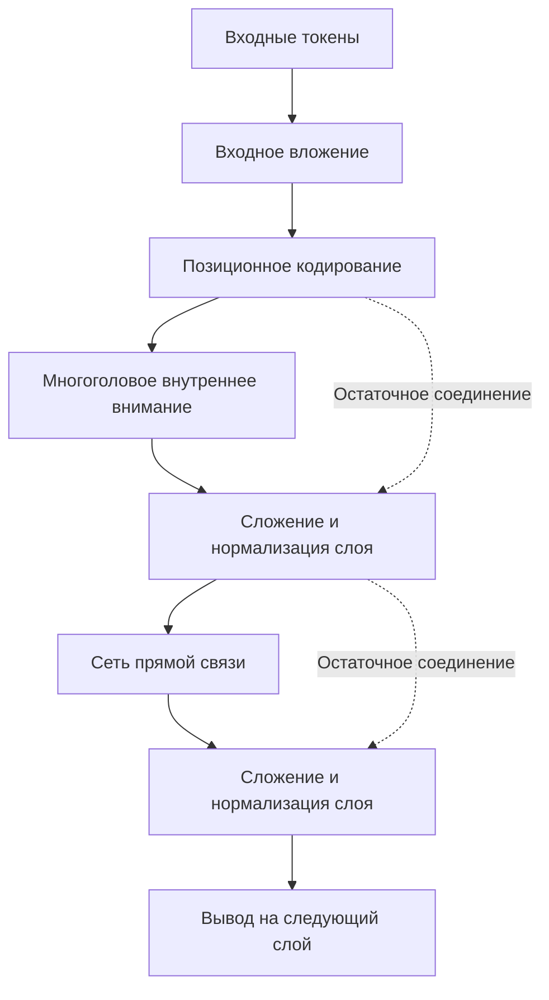
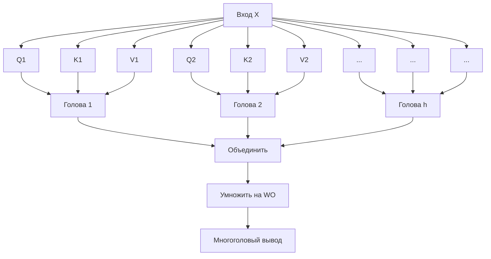

# Введение: зачем изучать математику Transformer?

Архитектура «Transformer» — это архитектура, о которой можно смело сказать, что она переписала историю современной обработки естественного языка (NLP) и ИИ в целом. Впервые предложенная в 2017 году исследователями Google в статье «Attention Is All You Need», эта модель функционирует как сердце крупномасштабных языковых моделей (LLM), которые сейчас доминируют в мире, таких как серия GPT от OpenAI (базовая технология ChatGPT), BERT от Google и Claude от Anthropic.

Однако, хотя часто встречаются качественные объяснения работы Transformer, такие как «понимание контекста с помощью механизма внимания (Attention)», на самом деле существует на удивление мало подробных объяснений **математической структуры**, стоящей за этим, для начинающих. Чтобы по-настоящему понять, как ИИ обрабатывает «слова» как «математические формулы» и генерирует удивительно естественные тексты, необходимо разобраться в его математических механизмах.

В этой статье мы подробно и доступно объясним математическую структуру, которая является сердцем Transformer: «Механизм внутреннего внимания (Self-Attention)», «Модель Запрос-Ключ-Значение (Q/K/V)», «Нормализация с помощью функции Softmax» и «Позиционное кодирование (Positional Encoding)». Статья предназначена для тех, кто обладает базовыми знаниями в области математики и программирования (понимает концепции матриц и производных на уровне старшей школы).

Вас может ошеломить обилие формул, но за каждым вычислением стоит четкий «смысл». К тому моменту, как вы дочитаете эту статью, вы должны понять, что Transformer — это не просто волшебный черный ящик, а тщательно спроектированный кристалл математики и статистики.

---

# 1. Ограничения традиционных методов и инновационность Transformer

До появления Transformer в обработке естественного языка доминировали рекуррентные нейронные сети (RNN) и их производные, такие как LSTM (Long Short-Term Memory). RNN были разработаны для обработки временных рядов данных и читают текст слово за словом с самого начала.

Однако у RNN было два фатальных недостатка:
1. **Сложность изучения долгосрочных зависимостей**: Когда предложение становится длинным, информация о словах, введенных в начале, затухает к тому времени, когда достигается конец (проблема исчезающего градиента).
2. **Невозможность параллельных вычислений**: Поскольку слова необходимо обрабатывать последовательно, трудно выполнять крупномасштабные параллельные вычисления с использованием GPU, что требует огромного времени на обучение.

Transformer полностью отбросил структуру RNN и произвел сдвиг парадигмы, используя исключительно «Attention» (внимание) для понимания контекста. Благодаря этому, независимо от длины последовательности, не происходит потери информации, а также становится возможным распараллеливание вычислений для максимального использования производительности GPU.

---

# 2. Общая архитектура Transformer

Сначала давайте взглянем на общую архитектуру Transformer. Transformer в общих чертах состоит из двух блоков: «Encoder» (кодировщик) и «Decoder» (декодировщик). На примере задачи перевода: Encoder преобразует исходный язык (например, английский) в математическое векторное представление, а Decoder на основе этого векторного представления генерирует целевой язык (например, японский/русский).

Следующая диаграмма представляет собой упрощенную внутреннюю структуру блока Encoder.



С этого момента мы шаг за шагом рассмотрим математические операции, выполняемые в каждом компоненте.

---

# 3. Векторизация слов и позиционное кодирование (Positional Encoding)

Компьютеры не могут понимать текст как таковой. Введенный текст сначала разбивается на единицы, называемые «токенами (Token)», и каждый из них преобразуется в вектор фиксированной длины. Это и есть **Input Embedding**.

## 3.1 Математика Input Embedding
Пусть размер словаря (vocabulary) равен $V$, а размерность вектора вложения (embedding) равна $d_{model}$ (в оригинальной статье $d_{model} = 512$). Каждое слово $w_i$ преобразуется в вектор $x_i \in \mathbb{R}^{d_{model}}$ с использованием матрицы вложения $W_E \in \mathbb{R}^{V \times d_{model}}$.

$$ x_i = W_E \cdot \text{one\_hot}(w_i) $$

Таким образом, весь текст представляется как матрица $X \in \mathbb{R}^{N \times d_{model}}$ (где $N$ — длина текста).

## 3.2 Необходимость и формулы позиционного кодирования (Positional Encoding)
Transformer не обрабатывает слова последовательно, как RNN, а обрабатывает все слова одновременно параллельно. С точки зрения скорости вычислений это большое преимущество, но в то же время вызывает проблему **потери важной информации о «порядке слов»**. Например, «собака кусает человека» и «человек кусает собаку» имеют один и тот же набор входных слов, но совершенно разный смысл.

Чтобы предоставить модели эту информацию о порядке слов, было придумано **Positional Encoding**.
Позиционное кодирование $PE$ для $i$-го измерения слова, находящегося в позиции $pos$, вычисляется с использованием следующих тригонометрических функций:

$$ PE_{(pos, 2i)} = \sin\left(\frac{pos}{10000^{2i/d_{model}}}\right) $$
$$ PE_{(pos, 2i+1)} = \cos\left(\frac{pos}{10000^{2i/d_{model}}}\right) $$

Где $pos$ — это позиция слова ($0, 1, 2, \dots, N-1$), а $i$ — индекс размерности вектора ($0, 1, \dots, d_{model}/2 - 1$).

### Почему используются синус и косинус?
На первый взгляд это выглядит как очень сложная и странная формула, но для этого есть глубокая математическая причина. Использование тригонометрических функций позволяет модели легко изучать **разницу не только в «абсолютной позиции», но и в «относительной позиции»**.

Вспомните теоремы сложения для тригонометрических функций, которые изучают в старшей школе:
$$ \sin(\alpha + \beta) = \sin\alpha \cos\beta + \cos\alpha \sin\beta $$
$$ \cos(\alpha + \beta) = \cos\alpha \cos\beta - \sin\alpha \sin\beta $$

Позиционное кодирование для позиции $pos + k$, сдвинутой на $k$ относительно позиции $pos$, может быть представлено как линейная комбинация позиционного кодирования позиции $pos$. Другими словами, используя матрицу $M_k$, это можно записать следующим образом:

$$ PE_{pos+k} = M_k \cdot PE_{pos} $$

Благодаря этому механизм Attention позволяет легко распознавать относительное расстояние («насколько далеко друг от друга находятся слова») посредством вычисления скалярного произведения. Кроме того, комбинируя несколько синусоидальных и косинусоидальных волн с разной длиной волны, есть преимущество в том, что можно создать уникальный вектор позиции, независимо от длины текста.

Итоговая входная матрица $X_{input}$ представляет собой сумму вектора вложения слов и этого позиционного кодирования.

$$ X_{input} = X + PE $$

---

# 4. Глубокая математика внутреннего внимания (Self-Attention)

Наконец-то мы переходим к самому важному компоненту Transformer — **Self-Attention (Механизм внутреннего внимания)**. Цель Self-Attention — «вычислить степень связи между всеми словами в тексте и обновить вектор каждого слова до более богатого представления с учетом контекста».

Здесь используется аналогия с «поисковой системой»:
- **Query (Q)**: Запрос (поисковый запрос). «Какую информацию я сейчас ищу?»
- **Key (K)**: Ключ (заголовок). «Какая информация у меня есть?»
- **Value (V)**: Значение (сущность). «Какую информацию я на самом деле предоставляю?»

## 4.1 Создание матриц $Q, K, V$
Для входной матрицы $X \in \mathbb{R}^{N \times d_{model}}$ (для упрощения мы здесь игнорируем размер батча (batch size)), умножая на обучаемые весовые матрицы $W^Q, W^K, W^V \in \mathbb{R}^{d_{model} \times d_k}$, мы вычисляем запрос $Q$, ключ $K$ и значение $V$. (Обычно $d_k = d_v = d_{model} / h$)

$$ Q = X W^Q $$
$$ K = X W^K $$
$$ V = X W^V $$

Здесь $Q, K, V$ — все являются матрицами $\mathbb{R}^{N \times d_k}$.

## 4.2 Вычисление оценки внимания (Attention Score) - Скалярное произведение
Чтобы измерить, насколько Query каждого слова связан с Key всех остальных слов, мы вычисляем **скалярное произведение** векторов. В матричном виде это записывается следующим образом:

$$ \text{Scores} = Q K^T $$

Каждый элемент $s_{ij}$ полученной таким образом матрицы $\text{Scores} \in \mathbb{R}^{N \times N}$ представляет собой скалярное произведение Query $i$-го слова и Key $j$-го слова, то есть «силу связи».

## 4.3 Масштабирование (Scale)
При вычислении оценки (score) с помощью скалярного произведения возникает одна проблема. Если размерность вектора $d_k$ становится большой, значение скалярного произведения может стать экстремально большим или маленьким.

Давайте докажем это математически.
Предположим, что каждый элемент запроса $q \sim \mathcal{N}(0, 1)$ и каждый элемент ключа $k \sim \mathcal{N}(0, 1)$ следуют независимому стандартному нормальному распределению.
Найдем среднее и дисперсию скалярного произведения $q \cdot k = \sum_{i=1}^{d_k} q_i k_i$.
Среднее: Так как $\mathbb{E}[q_i k_i] = \mathbb{E}[q_i] \mathbb{E}[k_i] = 0 \times 0 = 0$, среднее суммы также равно $0$.
Дисперсия: Из независимости дисперсия $q_i k_i$ равна $\text{Var}(q_i k_i) = \mathbb{E}[(q_i k_i)^2] - (\mathbb{E}[q_i k_i])^2 = 1 \times 1 - 0 = 1$.
Следовательно, дисперсия всего скалярного произведения будет равна размерности $d_k$.

$$ \text{Var}(q \cdot k) = d_k $$

Когда дисперсия становится большой, градиенты функции Softmax, применяемой после этого, становятся экстремально маленькими для значений, отличных от максимального, происходит «исчезновение градиента», и обучение останавливается.
Чтобы предотвратить это, оценка (score) делится (масштабируется) на $\sqrt{d_k}$, чтобы дисперсия всегда оставалась равной $1$.

$$ \text{Scaled Scores} = \frac{Q K^T}{\sqrt{d_k}} $$

## 4.4 Преобразование в вероятности с помощью функции Softmax
К полученным оценкам по строкам применяется **функция Softmax**, чтобы преобразовать их в распределение вероятностей (веса), сумма которых равна $1$.

$$ a_{ij} = \text{softmax}(s_i)_j = \frac{\exp(s_{ij} / \sqrt{d_k})}{\sum_{m=1}^N \exp(s_{im} / \sqrt{d_k})} $$

Матрица $A \in \mathbb{R}^{N \times N}$ называется матрицей весов внимания (Attention Weight). Глядя на каждую строку $i$ этой матрицы, мы видим значения от 0 до 1, которые показывают, «насколько много внимания (Attention) следует уделить любому другому слову $j$ для понимания слова $i$».

## 4.5 Взвешенная сумма Value
Наконец, используя полученную матрицу весов внимания $A$, вычисляется взвешенная сумма матрицы Value $V$.

$$ \text{Output} = A V = \text{softmax}\left(\frac{Q K^T}{\sqrt{d_k}}\right) V $$

Матрица $Z \in \mathbb{R}^{N \times d_v}$, полученная в результате этой операции, представляет собой набор «векторных представлений слов, обновленных с учетом контекста».
Это и есть полная картина **Scaled Dot-Product Attention**, определенная в оригинальной статье.

---

# 5. Multi-Head Attention (Многоголовое внимание)

Возможно, что с помощью всего одного вычисления Attention (одна голова) контекст будет понят только с одной точки зрения (например, «грамматические отношения»). Поэтому для одновременного учета разнообразных семантических и синтаксических отношений в языке (таких как «подлежащее и сказуемое», «местоимение и его референт» и т.д.) был введен механизм **Multi-Head Attention**.

Ранее описанные процессы генерации $Q, K, V$ и вычисления Attention выполняются параллельно $h$ раз (количество голов, в оригинальной статье $h=8$).

$$ \text{head}_i = \text{Attention}(X W_i^Q, X W_i^K, X W_i^V) $$

Здесь $W_i^Q, W_i^K, W_i^V \in \mathbb{R}^{d_{model} \times d_k}$ — обучаемые весовые матрицы, специфичные для $i$-й головы.

Результаты $\text{head}_i \in \mathbb{R}^{N \times d_v}$, выведенные каждой головой, объединяются (Concatenate) по горизонтали.

$$ \text{Concat}(\text{head}_1, \dots, \text{head}_h) \in \mathbb{R}^{N \times (h \cdot d_v)} $$

Поскольку обычно устанавливается так, что $h \cdot d_v = d_{model}$, размерность после объединения возвращается к исходной $d_{model}$. Наконец, эта матрица умножается на весовую матрицу $W^O \in \mathbb{R}^{d_{model} \times d_{model}}$ для получения окончательного вывода.

$$ \text{MultiHead}(Q, K, V) = \text{Concat}(\text{head}_1, \dots, \text{head}_h) W^O $$



---

# 6. Сеть прямой связи (Feed-Forward Neural Network, FFN)

Вывод Multi-Head Attention затем передается в **Position-wise Feed-Forward Network (FFN)**.
Это двухслойная полносвязная нейронная сеть, применяемая «независимо к каждой позиции (слову)» в последовательности.

В виде формулы это выражается следующим образом:

$$ \text{FFN}(x) = \max(0, x W_1 + b_1) W_2 + b_2 $$

Где $\max(0, z)$ представляет функцию активации ReLU (Rectified Linear Unit) (в недавних моделях также часто используются GELU или SwiGLU).

Роль этой сети чрезвычайно важна. В то время как механизм Attention изучает «отношения между словами (пространственные и последовательные отношения)», FFN отвечает за «нелинейное преобразование признаков каждого вектора слова самого по себе».
Обычно вес первого слоя $W_1$ временно значительно увеличивает размерность (например, в 4 раза с $d_{model}=512$ до $d_{ff}=2048$), выполняет сложные вычисления в пространстве признаков, а затем вес второго слоя $W_2$ возвращает её к исходной размерности. Благодаря этому «расширению и сжатию размерности» выразительная сила модели резко возрастает.

---

# 7. Остаточное соединение (Residual Connection) и Нормализация слоя (Layer Normalization)

В глубоком обучении по мере углубления слоев сети возникает проблема исчезновения или взрыва градиентов во время обучения, из-за чего обучение проходит неудачно. Для предотвращения этого вокруг каждого подслоя (Attention и FFN) в Transformer размещены **Остаточное соединение (Residual Connection)** и **Нормализация слоя (Layer Normalization)**.

В виде формулы вывод подслоя обрабатывается следующим образом:

$$ \text{Output} = \text{LayerNorm}(x + \text{Sublayer}(x)) $$

## 7.1 Остаточное соединение ($x + \text{Sublayer}(x)$)
Вход $x$ напрямую прибавляется к выводу подслоя. Благодаря этому при обратном распространении ошибки градиенты напрямую передаются в более мелкие слои по короткому пути, что стабилизирует обучение даже при глубокой структуре слоев.

## 7.2 Математика нормализации слоя (Layer Normalization)
Layer Normalization — это технология, которая вычисляет среднее и дисперсию по направлению размерности признаков и нормализует данные. Для входа с размером батча $B$, длиной последовательности $N$ и размерностью $d_{model}$, нормализация выполняется для одного вектора слова $x \in \mathbb{R}^{d_{model}}$.

Вычисляются среднее $\mu$ и дисперсия $\sigma^2$:
$$ \mu = \frac{1}{d_{model}} \sum_{i=1}^{d_{model}} x_i $$
$$ \sigma^2 = \frac{1}{d_{model}} \sum_{i=1}^{d_{model}} (x_i - \mu)^2 $$

Затем получается нормализованный вывод $\hat{x}$:
$$ \text{LN}(x) = \frac{x - \mu}{\sqrt{\sigma^2 + \epsilon}} \odot \gamma + \beta $$
(где $\epsilon$ — малая константа для предотвращения деления на ноль, а $\gamma, \beta$ — обучаемые параметры масштаба и сдвига)

Причина выбора нормализации по слоям (Layer Normalization) вместо нормализации по батчам (Batch Normalization) заключается в том, что при обработке данных последовательностей переменной длины, таких как текст, статистические показатели между батчами становятся нестабильными. Благодаря Layer Normalization, Transformer может обучаться стабильно независимо от размера батча.

---

# 8. Специфическая структура декодера: Masked Attention и Cross-Attention

Описанная до сих пор структура принадлежит кодировщику. В блоке декодера, генерирующем текст, структура немного отличается.

## 8.1 Masked Multi-Head Attention
Роль декодера заключается в «предсказании следующего слова на основе предыдущих слов». Следовательно, во время обучения недопустимо заглядывать в «будущие слова», иначе это будет похоже на списывание. Математическая операция, предотвращающая это, называется **Masking (Маскирование)**.

К матрице оценок $Q K^T$ прибавляется матрица маски $M$, в которой верхнетреугольная часть (соответствующая будущей информации) заполнена очень маленькими значениями, близкими к $-\infty$.

$$ M_{ij} = \begin{cases} 0 & (i \le j) \\ -\infty & (i > j) \end{cases} $$

$$ \text{Masked Attention}(Q, K, V) = \text{softmax}\left(\frac{Q K^T + M}{\sqrt{d_k}}\right) V $$

При вычислении функции Softmax $\exp(-\infty) = 0$, поэтому веса внимания (Attention Weight) для будущих слов становятся полностью равными $0$. Это обеспечивает авторегрессионную генерацию с сохранением причинно-следственной связи (Causality).

## 8.2 Encoder-Decoder Cross-Attention
Второй подслой декодера — это **Cross-Attention**, который обращается к выводу кодировщика.
Здесь $Q$ генерируется из предыду слоя декодера, а $K$ и $V$ генерируются из вывода последнего слоя кодировщика.

$$ Q_{decoder} = X_{dec} W^Q $$
$$ K_{encoder} = X_{enc} W^K $$
$$ V_{encoder} = X_{enc} W^V $$

С помощью этого вычисления модель может изучать в задачах, таких как перевод, «с какой частью исходного предложения на иностранном языке сильнее всего связано переводимое в данный момент слово».

---

# 9. Вычислительная сложность и математика оптимизации в современную эпоху

Transformer — великолепная модель, но из-за ее математической структуры у нее есть свои «слабые стороны».
Обратите внимание на вычислительную сложность Self-Attention. При вычислении матрицы оценок $Q K^T$ матрица размера $(N \times d_k)$ умножается на матрицу размера $(d_k \times N)$, поэтому вычислительная сложность составляет **$O(N^2 \cdot d_{model})$**.

Другими словами, **вычислительная сложность и использование памяти растут квадратично относительно длины последовательности $N$**.
Это не проблема для коротких текстов, но если попытаться ввести в LLM длинный контекст, например целую книгу, $N$ достигнет десятков или сотен тысяч, и память GPU мгновенно исчерпается при традиционных вычислениях Attention.

Чтобы разорвать это проклятие $O(N^2)$, в последние годы были предложены различные оптимизации с точки зрения математики и аппаратного обеспечения.
Типичным примером является **FlashAttention**. FlashAttention — это алгоритм, который делит вычисления Attention на плитки (Tiling), чтобы минимизировать передачу данных (доступ к памяти) между иерархиями памяти GPU (SRAM и HBM). Хотя математически он выдает точно такой же результат, как стандартный Attention (Exact Attention), оптимизация на аппаратном уровне обеспечивает резкое ускорение и сокращение используемой памяти, что сделало возможным создание моделей с длинным контекстом, таких как GPT-4.

Кроме того, активно ведутся исследования таких подходов, как Sparse Attention и Linear Attention, которые аппроксимируют вычислительную сложность до $O(N \log N)$ или $O(N)$.

---

# 10. Пример реализации (псевдокод в стиле PyTorch)

Если перевести описанную математическую структуру в реальный программный код (Python / PyTorch), то окажется, что она описывается удивительно просто. Вот псевдокод ядра Self-Attention.

```python
import torch
import torch.nn.functional as F
import math

def scaled_dot_product_attention(q, k, v, mask=None):
    # форма q, k, v: [batch_size, num_heads, seq_length, d_k]
    d_k = q.size(-1)
    
    # 1. Вычисление оценки скалярным произведением: Q * K^T
    # Транспонируем последние два измерения для умножения матриц
    scores = torch.matmul(q, k.transpose(-2, -1))
    
    # 2. Масштабирование
    scores = scores / math.sqrt(d_k)
    
    # 3. Маскирование (в случае Masked Attention)
    if mask is not None:
        scores = scores.masked_fill(mask == 0, -1e9)
        
    # 4. Преобразование в вероятности с помощью Softmax
    attention_weights = F.softmax(scores, dim=-1)
    
    # 5. Умножение на матрицу Value
    output = torch.matmul(attention_weights, v)
    
    return output, attention_weights
```

Как можно видеть, формула $Q K^T / \sqrt{d_k}$ интуитивно реализована как `torch.matmul(q, k.transpose(-2, -1)) / math.sqrt(d_k)`. Тот факт, что математическая теория реализуется в несколько строк кода с помощью продвинутых библиотек оптимизации, является очень интересным аспектом глубокого обучения.

---

# Заключение: форма «интеллекта», видимая через формулы

В этой статье мы раскрыли математическую структуру, лежащую в глубине модели Transformer.

Embedding, отображающий слова в многомерное векторное пространство, Positional Encoding, выражающее информацию о позиции через сложение тригонометрических волн, и механизм Self-Attention, который представляет собой вычисление скалярного произведения матриц, рожденное из аналогии с информационным поиском. Каждый из этих компонентов — не более чем наложение базовой математики: линейной алгебры, дифференциального и интегрального исчисления, а также теории вероятностей и статистики.

Однако, когда эти простые матричные операции накладываются друг на друга во множество слоев и изучают закономерности из огромных наборов данных через миллиарды и сотни миллиардов параметров, возникает «форма интеллекта», которая кажется способной понимать наши «слова», выполнять логические рассуждения и порой генерировать творческие идеи.

Как и предполагает провокационное название «Attention Is All You Need» (Внимание - это все, что вам нужно), красота этой архитектуры, отбросившей сложную рекуррентную и сверточную обработку и специализирующейся исключительно на вычислении «внимания (степени связи)», заключается именно в ее математической простоте.

Возможно, в будущем появятся новые архитектуры, превосходящие Transformer (например, Mamba, являющаяся State Space Model), но математическая база «понимания контекста с помощью Attention», созданная Transformer, навсегда останется в истории ИИ.

Если у вас будет возможность использовать LLM, такие как ChatGPT или Claude в будущем, представьте себе, как в фоновом режиме каждую секунду вычисляются триллионы матричных умножений $Q K^T$, а функция Softmax выдает вероятности. Разрешение вашего понимания технологий повысится, и мир ИИ покажется вам еще более интересным.

### Литература
- Vaswani, A., et al. (2017). "Attention Is All You Need." *Advances in Neural Information Processing Systems*.
- Alammar, J. (2018). "The Illustrated Transformer." 

---
*Эта статья была написана как руководство для тех, кто изучает математические основы обработки естественного языка и ИИ. Если у вас есть вопросы или вы хотите что-то обсудить, пожалуйста, дайте знать в комментариях!*
