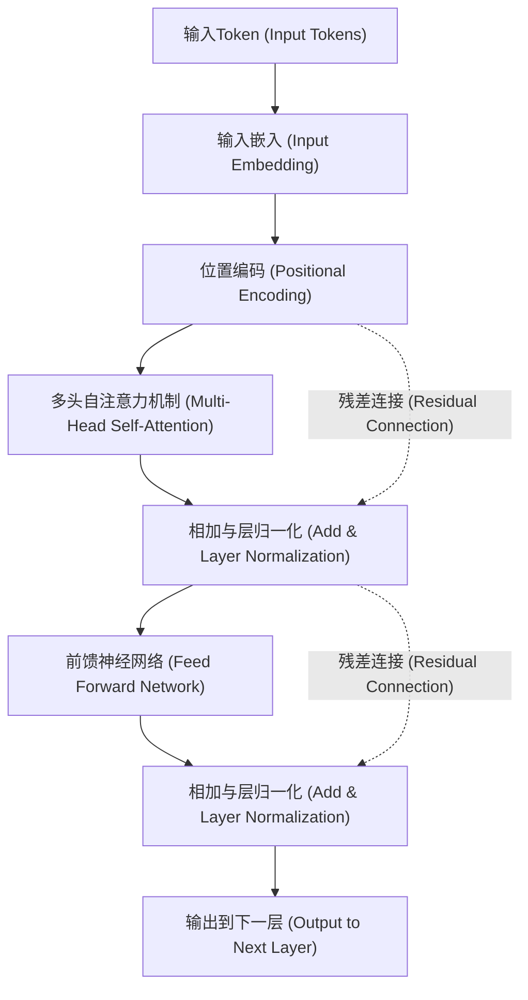
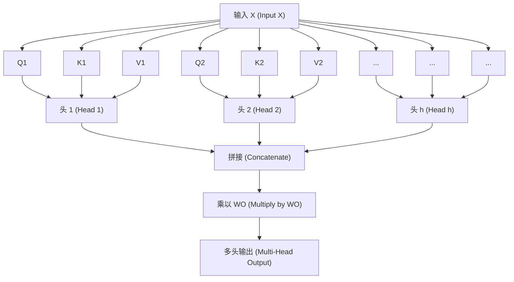

# 引言：为什么要学习Transformer的数学原理？

毫不夸张地说，“Transformer”架构改写了现代自然语言处理（NLP）乃至整个AI的历史。该模型在2017年由Google的研究人员们在论文《Attention Is All You Need》中首次提出，目前作为OpenAI的GPT系列（ChatGPT的基础技术）、Google的BERT以及Anthropic的Claude等席卷全球的大型语言模型（LLM）的核心组件而发挥着作用。

然而，目前的情况是，关于Transformer的工作原理，虽然经常能看到诸如“使用Attention（注意力机制）来理解上下文”这样的定性解释，但针对初学者的关于其背后的**数学结构**的深入解说是出乎意料地少的。为了真正理解AI是如何将“语言”作为“数学公式”来处理，并生成令人惊叹的自然文章的，解读其数学机制是不可或缺的。

在本文中，将以具备数学和编程基础知识的人（了解高中水平的矩阵和微分概念的人）为对象，彻底且通俗易懂地解开Transformer核心部分的“Self-Attention机制”、“查询·键·值（Q/K/V）模型”、“通过Softmax函数的归一化”以及“Positional Encoding”等数学结构。

你可能会被一连串的数学公式所压倒，但每一个计算都有其明确的“意义”。当读完这篇文章时，你应该能够理解Transformer并不是什么魔法般的黑盒，而是经过精心设计的数学和统计学的结晶。

---

# 1. 传统方法的局限性与Transformer的创新性

在Transformer出现之前，自然语言处理的主流是循环神经网络（RNN）及其派生的LSTM（Long Short-Term Memory）。RNN是为了处理时间序列数据而设计的，它会逐个单词地从开头按顺序读取文章。

但是，RNN存在两个致命的弱点。
1. **难以学习长期依赖关系**：当文章变长时，最开始输入的单词信息在到达最后时会变得淡薄（梯度消失问题）。
2. **无法进行并行计算**：因为必须按顺序处理单词，所以很难利用GPU进行大规模的并行计算，训练需要花费大量的时间。

Transformer彻底抛弃了RNN的结构，引发了一场只使用“Attention”来捕捉上下文的范式转换。由此，无论序列长度有多长，都不会发生信息丢失，并且能够并行化计算，从而最大限度地发挥GPU的性能。

---

# 2. Transformer的整体架构

首先，让我们俯瞰一下Transformer的整体架构。Transformer大致可以分为“Encoder（编码器）”和“Decoder（解码器）”两个模块。以翻译任务为例，Encoder将输入语言（例如：英语）转换为数学上的向量表示，而Decoder则根据该向量表示生成输出语言（例如：日语）。

下图简化的展示了Encoder模块的内部结构。



从这里开始，让我们按顺序来看看各个组件中进行的数学操作。

---

# 3. 单词的向量化与位置编码（Positional Encoding）

计算机无法直接理解文本。输入的文本首先会被分割成被称为“Token（词元）”的单位，然后每一个Token都会被转换为固定长度的向量。这就是**Input Embedding**。

## 3.1 Input Embedding的数学
假设词汇表（Vocabulary）的大小为 $V$，嵌入向量的维度数为 $d_{model}$（在原论文中 $d_{model} = 512$）。每个单词 $w_i$ 使用嵌入矩阵 $W_E \in \mathbb{R}^{V \times d_{model}}$ 转换为向量 $x_i \in \mathbb{R}^{d_{model}}$。

$$ x_i = W_E \cdot \text{one\_hot}(w_i) $$

由此，整篇文章被表示为矩阵 $X \in \mathbb{R}^{N \times d_{model}}$（$N$ 是文章的长度）。

## 3.2 Positional Encoding（位置编码）的必要性与数学公式
Transformer并不像RNN那样按顺序处理单词，而是同时并行处理所有单词。从计算速度的角度来看这是一个很大的优势，但同时也会引起**丢失“单词顺序（语序）”这一重要信息**的问题。例如，“狗咬人”和“人咬狗”，虽然输入的单词集合相同，但含义却完全不同。

为了将这种语序信息提供给模型，人们设计出了**Positional Encoding**。
位置 $pos$ 处的单词的第 $i$ 个维度的Positional Encoding $PE$ 是使用以下三角函数来计算的。

$$ PE_{(pos, 2i)} = \sin\left(\frac{pos}{10000^{2i/d_{model}}}\right) $$
$$ PE_{(pos, 2i+1)} = \cos\left(\frac{pos}{10000^{2i/d_{model}}}\right) $$

这里，$pos$ 是单词的位置（$0, 1, 2, \dots, N-1$），$i$ 是向量维度的索引（$0, 1, \dots, d_{model}/2 - 1$）。

### 为什么要使用正弦和余弦？
乍一看这似乎是非常复杂和奇怪的数学公式，但其中有着深刻的数学原因。通过使用三角函数，模型不仅能够容易地学习到**“绝对位置”**，还能容易地学习到**“相对位置”的差异**。

请回想一下高中数学中学到的三角函数加法定理。
$$ \sin(\alpha + \beta) = \sin\alpha \cos\beta + \cos\alpha \sin\beta $$
$$ \cos(\alpha + \beta) = \cos\alpha \cos\beta - \sin\alpha \sin\beta $$

距离某个位置 $pos$ 偏移了 $k$ 的位置 $pos + k$ 的Positional Encoding，可以表示为位置 $pos$ 的Positional Encoding的线性组合。也就是说，可以使用矩阵 $M_k$ 将其写成如下形式：

$$ PE_{pos+k} = M_k \cdot PE_{pos} $$

由此，Attention机制就可以通过内积计算，轻松识别单词之间“相距多远”这种相对距离。此外，通过组合不同波长的多个正弦和余弦波，它还具有这样一个优点：无论文章多长，都能生成唯一的位置向量。

最终的输入矩阵 $X_{input}$，是将单词的嵌入向量与此位置编码相加而得的结果。

$$ X_{input} = X + PE $$

---

# 4. Self-Attention（自注意力机制）的深渊数学

终于我们要踏入Transformer最重要的组件——**Self-Attention（自注意力机制）**了。Self-Attention的目的是“计算文章中所有单词彼此之间的相关度，并将每个单词的向量更新为考虑到上下文的更丰富的表示”。

在这里，使用了“搜索系统”的类比。
- **Query (Q)**: 查询（搜索词）。“我现在正在寻找的信息是什么？”
- **Key (K)**: 键（标题）。“我所拥有的信息是什么？”
- **Value (V)**: 值（实体）。“我实际提供的信息是什么？”

## 4.1 矩阵 $Q, K, V$ 的生成
对于输入矩阵 $X \in \mathbb{R}^{N \times d_{model}}$（为了简化说明，这里忽略批次大小），通过将其与可学习的权重矩阵 $W^Q, W^K, W^V \in \mathbb{R}^{d_{model} \times d_k}$ 相乘，来计算查询 $Q$、键 $K$、值 $V$。（通常 $d_k = d_v = d_{model} / h$）

$$ Q = X W^Q $$
$$ K = X W^K $$
$$ V = X W^V $$

这里，$Q, K, V$ 全都是 $\mathbb{R}^{N \times d_k}$ 的矩阵。

## 4.2 Attention Score的计算（内积）
为了衡量每个单词的Query与其他所有单词的Key之间有多大程度的关联，需要计算向量的**内积**。用矩阵运算来写的话如下所示：

$$ \text{Scores} = Q K^T $$

通过该计算得到的矩阵 $\text{Scores} \in \mathbb{R}^{N \times N}$ 的每个元素 $s_{ij}$，表示第 $i$ 个单词的Query与第 $j$ 个单词的Key的内积，即“相关度的强度”。

## 4.3 缩放（Scale）
通过内积计算得分存在一个问题。当向量的维度 $d_k$ 变大时，内积的值会变得极端地大或极端地小。

让我们从数学上证明这一点。
假设查询的每个元素 $q \sim \mathcal{N}(0, 1)$、键的每个元素 $k \sim \mathcal{N}(0, 1)$ 服从独立的标准正态分布。
求内积 $q \cdot k = \sum_{i=1}^{d_k} q_i k_i$ 的均值和方差。
均值：因为 $\mathbb{E}[q_i k_i] = \mathbb{E}[q_i] \mathbb{E}[k_i] = 0 \times 0 = 0$，所以总和的均值也是 $0$。
方差：由于独立性，$q_i k_i$ 的方差为 $\text{Var}(q_i k_i) = \mathbb{E}[(q_i k_i)^2] - (\mathbb{E}[q_i k_i])^2 = 1 \times 1 - 0 = 1$。
因此，整个内积的方差等于维度数 $d_k$。

$$ \text{Var}(q \cdot k) = d_k $$

当方差变大时，在之后应用的Softmax函数中，除最大值以外的梯度会变得极其小，发生“梯度消失”，导致学习无法进行。
为了防止这种情况，将得分除以 $\sqrt{d_k}$（进行缩放），从而使方差始终保持在 $1$。

$$ \text{Scaled Scores} = \frac{Q K^T}{\sqrt{d_k}} $$

## 4.4 通过Softmax函数实现概率化
为了将得到的得分转换为总和为 $1$ 的概率分布（权重），对每一行应用 **Softmax函数**。

$$ a_{ij} = \text{softmax}(s_i)_j = \frac{\exp(s_{ij} / \sqrt{d_k})}{\sum_{m=1}^N \exp(s_{im} / \sqrt{d_k})} $$

矩阵 $A \in \mathbb{R}^{N \times N}$ 被称为Attention Weight（注意力权重）矩阵。查看该矩阵的每一行 $i$，它用0到1的值表示了“在理解单词 $i$ 时，应该对其他哪个单词 $j$ 给予多大的关注（Attention）”。

## 4.5 Value的加权和
最后，使用得到的Attention Weight矩阵 $A$，计算Value矩阵 $V$ 的加权和。

$$ \text{Output} = A V = \text{softmax}\left(\frac{Q K^T}{\sqrt{d_k}}\right) V $$

通过该运算输出的矩阵 $Z \in \mathbb{R}^{N \times d_v}$，就是“考虑到上下文而更新的单词向量表示”的集合。
这就是论文中所定义的 **Scaled Dot-Product Attention** 的全貌。

---

# 5. Multi-Head Attention（多头注意力机制）

如果只进行一次Attention计算（单头），可能只能捕捉到一个视角（例如“语法关系”）的上下文。因此，为了同时捕捉语言所具有的多种语义和句法关系（如“主语和谓语”、“代词及其指代对象”等），引入了 **Multi-Head Attention**。

将前面的 $Q, K, V$ 的生成与Attention计算并行进行 $h$ 次（头的数量。在原论文中 $h=8$）。

$$ \text{head}_i = \text{Attention}(X W_i^Q, X W_i^K, X W_i^V) $$

这里，$W_i^Q, W_i^K, W_i^V \in \mathbb{R}^{d_{model} \times d_k}$ 是第 $i$ 个头专用的可学习的权重矩阵。

从各个头输出的结果 $\text{head}_i \in \mathbb{R}^{N \times d_v}$ 在横向上进行拼接（Concatenate）。

$$ \text{Concat}(\text{head}_1, \dots, \text{head}_h) \in \mathbb{R}^{N \times (h \cdot d_v)} $$

通常设定使得 $h \cdot d_v = d_{model}$，因此拼接后的维度将再次恢复为与输入相同的 $d_{model}$。最后，将此矩阵乘以权重矩阵 $W^O \in \mathbb{R}^{d_{model} \times d_{model}}$，从而得到最终的输出。

$$ \text{MultiHead}(Q, K, V) = \text{Concat}(\text{head}_1, \dots, \text{head}_h) W^O $$



---

# 6. Feed-Forward Neural Network (FFN)

Multi-Head Attention的输出接下来将被输入到 **Position-wise Feed-Forward Network (FFN)** 中。
这是一个应用于序列中“每个位置（单词）独立”的两层全连接神经网络。

用数学公式表示如下：

$$ \text{FFN}(x) = \max(0, x W_1 + b_1) W_2 + b_2 $$

这里，$\max(0, z)$ 表示ReLU（Rectified Linear Unit）激活函数（在最近的模型中也经常使用GELU或SwiGLU）。

这个网络的作用非常重要。Attention机制学习的是“单词之间的关系（空间・序列关系）”，而FFN负责的是“每个单词向量本身的非线性特征变换”。
通常，通过第一层的权重 $W_1$ 暂时将维度大幅扩大（例如从 $d_{model}=512$ 扩大到4倍的 $d_{ff}=2048$），在特征空间上进行复杂的计算后，再通过第二层的权重 $W_2$ 恢复到原来的维度。这种“维度的扩大与缩小”使模型的表达能力得到了飞跃性的提升。

---

# 7. 残差连接（Residual Connection）与层归一化（Layer Normalization）

在深度学习中，如果加深网络的层数，在训练时就会出现梯度消失或爆炸的问题，导致无法很好地学习。为了防止这种情况发生，在Transformer的每个子层（Attention和FFN）周围，都配置了 **残差连接（Residual Connection）** 和 **层归一化（Layer Normalization）**。

用数学公式来写，子层的输出将被如下处理：

$$ \text{Output} = \text{LayerNorm}(x + \text{Sublayer}(x)) $$

## 7.1 残差连接 ($x + \text{Sublayer}(x)$)
将输入 $x$ 直接加到子层的输出上。这样一来，在反向传播时梯度会通过捷径直接传递到较浅的层，因此即使层数加深，训练也能保持稳定。

## 7.2 Layer Normalization的数学
Layer Normalization是计算特征维度方向上的均值和方差，并对数据进行归一化的技术。在批次大小 $B$、序列长度 $N$、维度数 $d_{model}$ 的输入中，对某一个单词向量 $x \in \mathbb{R}^{d_{model}}$ 进行归一化。

计算均值 $\mu$ 和方差 $\sigma^2$。
$$ \mu = \frac{1}{d_{model}} \sum_{i=1}^{d_{model}} x_i $$
$$ \sigma^2 = \frac{1}{d_{model}} \sum_{i=1}^{d_{model}} (x_i - \mu)^2 $$

然后，得到归一化后的输出 $\hat{x}$。
$$ \text{LN}(x) = \frac{x - \mu}{\sqrt{\sigma^2 + \epsilon}} \odot \gamma + \beta $$
（$\epsilon$ 是防止除以零的极小常数。$\gamma, \beta$ 是可学习的缩放和平移参数）

之所以采用层方向的归一化（Layer Normalization）而不是批次方向的归一化（Batch Normalization），是因为在处理像文章这样长度不固定的序列数据时，批次间的统计量容易变得不稳定。通过Layer Normalization，Transformer可以实现不依赖于批次大小的稳定学习。

---

# 8. 解码器特有的结构：Masked Attention与Cross-Attention

到目前为止讲解的结构都是编码器的。在生成文章的解码器模块中，结构稍有不同。

## 8.1 Masked Multi-Head Attention
解码器的作用是“根据过去的单词预测下一个单词”。因此，如果在训练时看到了“未来的单词”，那就等于作弊了。为了防止这种情况发生的数学操作就是 **Masking（掩码）**。

对于得分矩阵 $Q K^T$，将其加上一个在上三角部分（相当于未来信息）设置为接近 $-\infty$ 的极小值的掩码矩阵 $M$。

$$ M_{ij} = \begin{cases} 0 & (i \le j) \\ -\infty & (i > j) \end{cases} $$

$$ \text{Masked Attention}(Q, K, V) = \text{softmax}\left(\frac{Q K^T + M}{\sqrt{d_k}}\right) V $$

在计算Softmax函数时，因为 $\exp(-\infty) = 0$，所以对未来单词的Attention Weight将完全变为 $0$。由此，就可以实现保留了因果关系（Causality）的自回归生成。

## 8.2 Encoder-Decoder Cross-Attention
解码器的第二个子层是参考编码器输出的 **Cross-Attention**。
在这里，$Q$ 是从前一个解码器层生成的，而 $K$ 和 $V$ 则是从编码器的最后一层的输出中生成的。

$$ Q_{decoder} = X_{dec} W^Q $$
$$ K_{encoder} = X_{enc} W^K $$
$$ V_{encoder} = X_{enc} W^V $$

通过这个计算，在翻译等任务中，模型就能学习到“现在正在翻译的单词，与原外语文章的哪个部分有着很强的关联”。

---

# 9. 计算复杂度与现代优化的数学

Transformer是一个出色的模型，但也存在源于其数学结构的“弱点”。
请关注Self-Attention的计算复杂度。在计算得分矩阵 $Q K^T$ 时，因为要将 $(N \times d_k)$ 的矩阵与 $(d_k \times N)$ 的矩阵相乘，所以其计算复杂度为 **$O(N^2 \cdot d_{model})$**。

也就是说，**相对于序列长度 $N$，计算复杂度和内存使用量呈平方级增长**。
如果文章很短则不成问题，但如果想将像一整本书这样超长的上下文输入到LLM中，$N$ 就会达到数万至数十万，在传统的Attention计算下GPU的内存会瞬间耗尽。

为了打破这种 $O(N^2)$ 的诅咒，近年来从数学和硬件方法的角度提出了各种各样的优化方案。
其中具有代表性的例子就是 **FlashAttention**。FlashAttention是一种为了将GPU的内存层级（SRAM和HBM）之间的数据传输（内存访问）降至最低，将Attention计算分割成瓦片状（Tiling）来执行的算法。尽管在数学公式上它输出的是与标准Attention完全相同的结果（Exact Attention），但通过硬件级别的优化实现了惊人的速度提升和内存削减，使得GPT-4等长上下文模型的实现成为了可能。

除此之外，将计算复杂度近似为 $O(N \log N)$ 或 $O(N)$ 的 Sparse Attention 和 Linear Attention 等研究也正在积极进行中。

---

# 10. 实现的印象（类似PyTorch的伪代码）

如果将到目前为止的数学结构落实到实际的编程代码（Python / PyTorch）中，你会发现它可以用令人惊讶的简单方式编写出来。下面展示了Self-Attention核心部分的伪代码。

```python
import torch
import torch.nn.functional as F
import math

def scaled_dot_product_attention(q, k, v, mask=None):
    # q, k, v的形状: [batch_size, num_heads, seq_length, d_k]
    d_k = q.size(-1)
    
    # 1. 通过内积计算得分: Q * K^T
    # 转置最后两个维度以计算矩阵乘积
    scores = torch.matmul(q, k.transpose(-2, -1))
    
    # 2. 缩放
    scores = scores / math.sqrt(d_k)
    
    # 3. 掩码 (适用于Masked Attention的情况)
    if mask is not None:
        scores = scores.masked_fill(mask == 0, -1e9)
        
    # 4. 通过Softmax实现概率化
    attention_weights = F.softmax(scores, dim=-1)
    
    # 5. 乘以Value矩阵
    output = torch.matmul(attention_weights, v)
    
    return output, attention_weights
```

可以直观地看到，用数学公式表达的 $Q K^T / \sqrt{d_k}$ 被直接实现为了 `torch.matmul(q, k.transpose(-2, -1)) / math.sqrt(d_k)`。借助于高级优化库的力量，只需几行代码就能实现数学理论，这是深度学习非常有趣的一面。

---

# 结语：从数学公式中看到的“智能”的形状

在本文中，我们解开了Transformer模型深处的数学结构。

将单词映射到多维向量空间的Embedding、通过合成三角波来表示位置信息的Positional Encoding、以及源于信息检索类比的矩阵内积计算——Self-Attention机制。这每一个组件，不过是线性代数、微积分、概率统计等基础数学知识的累积罢了。

然而，当这些简单的矩阵运算重叠了无数层，通过几十亿、几千亿的参数从庞大的数据集中学习模式时，在那之中就浮现出了仿佛能理解我们的“语言”、进行逻辑推理、时而还能产生创造性想法的“智能的形状”。

正如“Attention Is All You Need”这个带有挑衅性的标题所示，彻底抛弃复杂的循环处理和卷积处理，专注于纯粹的“Attention（相关度）”计算，这种架构的美，正是在于其数学上的简洁性。

未来，也许会出现超越Transformer的全新架构（例如State Space Model的Mamba等），但Transformer所建立的“通过Attention理解上下文”的数学框架，必将被永远铭刻在AI的历史中。

如果你今后有机会使用ChatGPT或Claude等LLM，请想象一下在它们的后台中，每秒正进行着数万亿次 $Q K^T$ 的矩阵乘法运算，以及Softmax函数正在计算着概率的情景。这样你对技术的清晰度会提升，也一定能感受到AI的世界更加有趣。

### 参考文献
- Vaswani, A., et al. (2017). "Attention Is All You Need." *Advances in Neural Information Processing Systems*.
- Alammar, J. (2018). "The Illustrated Transformer." 

---
*这篇文章是为学习自然语言处理和AI的数学基础的人们撰写的指南。如果有任何疑问或讨论，请务必在评论区告诉我！*
