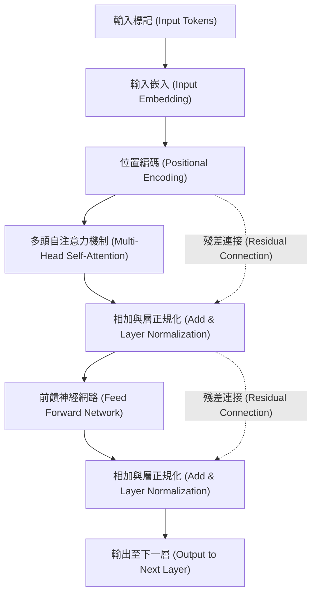
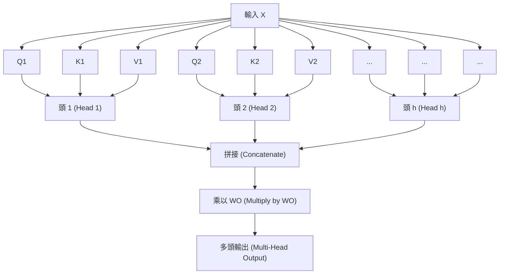

# 前言：為什麼要學習Transformer的數學？

可以毫不誇張地說，「Transformer」是改寫了現代自然語言處理（NLP）乃至整個人工智慧歷史的架構。這個模型首次由Google研究人員在2017年的論文《Attention Is All You Need》中提出，現在作為席捲全球的大型語言模型（LLM）——如OpenAI的GPT系列（ChatGPT的底層技術）、Google的BERT以及Anthropic的Claude——的核心運作著。

然而，現狀是我們經常看到關於Transformer機制的定性解釋，例如「使用Attention（注意力機制）來理解上下文」，但針對初學者深入探討其背後**數學結構**的解說卻意外地少。為了真正理解AI是如何將「語言」作為「數學公式」進行處理，並生成出令人驚訝地自然的文本，解讀其數學機制是不可或缺的。

本文針對具備數學和程式設計基礎知識（了解高中程度的矩陣和微分概念）的讀者，將徹底且淺顯易懂地解開Transformer核心的「Self-Attention機制」、「Query-Key-Value（Q/K/V）模型」、「透過Softmax函數進行的正規化」，以及「Positional Encoding」等數學結構。

你可能會被一連串的數學公式給震撼，但每一個計算都有其明確的「意義」。當你讀完這篇文章時，你應該能夠理解Transformer並不僅僅是一個神奇的黑盒子，而是經過精心設計的數學與統計學結晶。

---

# 1. 傳統方法的局限性與Transformer的創新性

在Transformer出現之前，自然語言處理的主流是遞歸神經網路（RNN）及其衍生模型LSTM（Long Short-Term Memory）。RNN專為處理時間序列資料而設計，會從頭開始依序逐個詞地讀取句子。

然而，RNN有兩個致命的弱點：
1. **難以學習長期依賴性**：當句子變長時，最先輸入的詞彙資訊在到達最後時會變得淡薄（梯度消失問題）。
2. **無法平行運算**：因為必須依序處理詞彙，難以使用GPU進行大規模的平行運算，導致訓練需要耗費大量時間。

Transformer完全捨棄了RNN的結構，引起了僅使用「Attention」來捕捉上下文的典範轉移。藉此，無論序列長度多長都不會遺失資訊，並且能夠將計算平行化，最大限度地發揮GPU的效能。

---

# 2. Transformer的整體架構

首先，讓我們俯瞰Transformer的整體架構。Transformer大致由「Encoder（編碼器）」和「Decoder（解碼器）」兩個區塊組成。以翻譯任務為例，Encoder將輸入語言（例：英語）轉換為數學的向量表示，而Decoder則根據該向量表示生成輸出語言（例：日語或中文）。

下圖簡化了Encoder區塊的內部結構。



從這裡開始，我們將逐步探討各個組件中所進行的數學操作。

---

# 3. 詞彙的向量化與位置編碼（Positional Encoding）

電腦無法直接理解文本。輸入的文本會先被分割為稱為「標記（Token）」的單位，並且每一個標記都會被轉換為固定長度的向量。這就是**Input Embedding**。

## 3.1 Input Embedding 的數學
假設詞彙表（Vocabulary）的大小為 $V$，嵌入向量的維度數為 $d_{model}$（在原始論文中 $d_{model} = 512$）。每個詞彙 $w_i$ 將使用嵌入矩陣 $W_E \in \mathbb{R}^{V \times d_{model}}$ 轉換為向量 $x_i \in \mathbb{R}^{d_{model}}$。

$$ x_i = W_E \cdot \text{one\_hot}(w_i) $$

藉此，整篇文章將被表示為矩陣 $X \in \mathbb{R}^{N \times d_{model}}$（其中 $N$ 是文章的長度）。

## 3.2 Positional Encoding（位置編碼）的必要性與數學公式
Transformer並不像RNN那樣依序處理詞彙，而是同時對所有詞彙進行平行處理。這在計算速度上是個巨大的優勢，但同時也引發了**「詞彙順序（語序）」這個重要資訊會遺失**的問題。例如，「狗咬人」與「人咬狗」，雖然輸入的詞彙集合相同，但意義卻完全不同。

為了將這個語序資訊提供給模型，所發明的方法就是**Positional Encoding**。
位於位置 $pos$ 的詞彙之第 $i$ 個維度的Positional Encoding $PE$，是使用以下的三角函數來計算的：

$$ PE_{(pos, 2i)} = \sin\left(\frac{pos}{10000^{2i/d_{model}}}\right) $$
$$ PE_{(pos, 2i+1)} = \cos\left(\frac{pos}{10000^{2i/d_{model}}}\right) $$

這裡，$pos$ 是詞彙的位置（$0, 1, 2, \dots, N-1$），$i$ 是向量維度的索引（$0, 1, \dots, d_{model}/2 - 1$）。

### 為什麼要使用正弦與餘弦？
乍看之下這似乎是個非常複雜且奇怪的數學公式，但這背後有著深刻的數學原因。透過使用三角函數，模型不僅能學習到**「絕對位置」**，也能夠輕易地學習到**「相對位置」的差異**。

回想一下高中數學學過的三角函數加法定理：
$$ \sin(\alpha + \beta) = \sin\alpha \cos\beta + \cos\alpha \sin\beta $$
$$ \cos(\alpha + \beta) = \cos\alpha \cos\beta - \sin\alpha \sin\beta $$

從某個位置 $pos$ 偏移距離 $k$ 的位置 $pos + k$ 的Positional Encoding，可以表示為位置 $pos$ 的Positional Encoding的線性組合。也就是說，可以使用矩陣 $M_k$ 寫成如下形式：

$$ PE_{pos+k} = M_k \cdot PE_{pos} $$

這使得Attention機制能夠透過內積計算，輕鬆辨識出詞彙之間「距離有多遠」的相對距離。此外，結合多個不同波長的正弦與餘弦波，還有一個好處，那就是無論文章多長，都能夠生成出唯一的位置向量。

最終的輸入矩陣 $X_{input}$，就是將詞彙的嵌入向量與這個位置編碼相加的結果：

$$ X_{input} = X + PE $$

---

# 4. Self-Attention（自注意力機制）的深奧數學

終於要進入Transformer最重要的組件：**Self-Attention（自注意力機制）**。Self-Attention的目的是「計算文章內所有詞彙之間的關聯度，並將各個詞彙的向量更新為考慮了上下文的更豐富表示」。

這裡常使用「搜尋系統」的比喻：
- **Query (Q)**: 查詢（搜尋詞）。「我現在正在尋找什麼資訊？」
- **Key (K)**: 鍵（標題）。「我擁有什麼資訊？」
- **Value (V)**: 值（實體）。「我實際提供什麼資訊？」

## 4.1 矩陣 $Q, K, V$ 的生成
對於輸入矩陣 $X \in \mathbb{R}^{N \times d_{model}}$（為了簡化說明，這裡忽略批次大小（batch size）），透過乘上可學習的權重矩陣 $W^Q, W^K, W^V \in \mathbb{R}^{d_{model} \times d_k}$，來計算出查詢 $Q$、鍵 $K$、值 $V$。（通常 $d_k = d_v = d_{model} / h$）

$$ Q = X W^Q $$
$$ K = X W^K $$
$$ V = X W^V $$

這裡，$Q, K, V$ 全部都是 $\mathbb{R}^{N \times d_k}$ 的矩陣。

## 4.2 Attention Score的計算（內積）
為了衡量每個詞彙的Query與其他所有詞彙的Key之間有多大程度的關聯，我們計算向量的**內積**。用矩陣運算來寫的話如下：

$$ \text{Scores} = Q K^T $$

透過這個計算所得到的矩陣 $\text{Scores} \in \mathbb{R}^{N \times N}$ 中的每個元素 $s_{ij}$，代表了第 $i$ 個詞彙的Query與第 $j$ 個詞彙的Key的內積，也就是「關聯度的強度」。

## 4.3 縮放（Scale）
透過內積計算分數有一個問題：當向量的維度 $d_k$ 變大時，內積的值會變得極端的大或極端的小。

讓我們用數學來證明這一點。
假設查詢的各個元素 $q \sim \mathcal{N}(0, 1)$，鍵的各個元素 $k \sim \mathcal{N}(0, 1)$ 皆服從獨立的標準常態分佈。
求內積 $q \cdot k = \sum_{i=1}^{d_k} q_i k_i$ 的平均值與變異數。
平均值： $\mathbb{E}[q_i k_i] = \mathbb{E}[q_i] \mathbb{E}[k_i] = 0 \times 0 = 0$，因此總和的平均值也為 $0$。
變異數： $q_i k_i$ 的變異數由獨立性可知 $\text{Var}(q_i k_i) = \mathbb{E}[(q_i k_i)^2] - (\mathbb{E}[q_i k_i])^2 = 1 \times 1 - 0 = 1$。
因此，整個內積的變異數等於維度數 $d_k$。

$$ \text{Var}(q \cdot k) = d_k $$

當變異數變大時，在之後套用Softmax函數時，最大值以外的梯度會變得極端的小，發生「梯度消失」，導致學習無法進行。
為了防止這種情況，將分數除以 $\sqrt{d_k}$（進行縮放），以保持變異數始終為 $1$。

$$ \text{Scaled Scores} = \frac{Q K^T}{\sqrt{d_k}} $$

## 4.4 透過Softmax函數轉換為機率
為了將得到的分數轉換為總和為 $1$ 的機率分佈（權重），我們對每一行套用 **Softmax函數**。

$$ a_{ij} = \text{softmax}(s_i)_j = \frac{\exp(s_{ij} / \sqrt{d_k})}{\sum_{m=1}^N \exp(s_{im} / \sqrt{d_k})} $$

矩陣 $A \in \mathbb{R}^{N \times N}$ 被稱為Attention Weight（注意力權重）矩陣。觀察這個矩陣的每一行 $i$，它用 0 到 1 的值表達了「在理解詞彙 $i$ 時，應該對其他哪個詞彙 $j$ 投入多少關注（Attention）」。

## 4.5 Value的加權總和
最後，使用得到的Attention Weight矩陣 $A$，來計算Value矩陣 $V$ 的加權總和。

$$ \text{Output} = A V = \text{softmax}\left(\frac{Q K^T}{\sqrt{d_k}}\right) V $$

透過這個運算輸出的矩陣 $Z \in \mathbb{R}^{N \times d_v}$，就是「考慮了上下文後所更新的詞彙向量表示」的集合。
這就是論文中所定義的 **Scaled Dot-Product Attention** 的全貌。

---

# 5. Multi-Head Attention（多頭注意力機制）

僅靠一次的Attention計算（單頭），可能只能從一個觀點（例如「文法關係」）來捕捉上下文。因此，為了同時捕捉語言擁有的多樣化語意與句法關係（例如「主詞與動詞」、「代名詞與其指代對象」等），引入了 **Multi-Head Attention**。

將剛才的 $Q, K, V$ 生成與Attention計算，平行進行 $h$ 次（頭的數量。原始論文中 $h=8$）。

$$ \text{head}_i = \text{Attention}(X W_i^Q, X W_i^K, X W_i^V) $$

這裡，$W_i^Q, W_i^K, W_i^V \in \mathbb{R}^{d_{model} \times d_k}$ 是專屬於第 $i$ 個頭的可學習權重矩陣。

將每個頭輸出的結果 $\text{head}_i \in \mathbb{R}^{N \times d_v}$ 在橫向上拼接（Concatenate）起來。

$$ \text{Concat}(\text{head}_1, \dots, \text{head}_h) \in \mathbb{R}^{N \times (h \cdot d_v)} $$

通常會設定成 $h \cdot d_v = d_{model}$，所以拼接後的維度會再次回到與輸入相同的 $d_{model}$。最後，將這個矩陣乘上權重矩陣 $W^O \in \mathbb{R}^{d_{model} \times d_{model}}$，得到最終的輸出。

$$ \text{MultiHead}(Q, K, V) = \text{Concat}(\text{head}_1, \dots, \text{head}_h) W^O $$



---

# 6. Feed-Forward Neural Network (FFN)

Multi-Head Attention的輸出，接著會輸入到 **Position-wise Feed-Forward Network (FFN)** 中。
這是一個對序列的「每個位置（詞彙）獨立地」套用的兩層全連接神經網路。

用數學公式表示如下：

$$ \text{FFN}(x) = \max(0, x W_1 + b_1) W_2 + b_2 $$

這裡，$\max(0, z)$ 代表 ReLU（Rectified Linear Unit）激勵函數（在最近的模型中也常使用 GELU 或 SwiGLU）。

這個網路的作用非常重要。Attention機制學習了「詞彙間的關聯性（空間、序列關係）」，而 FFN 則負責「每個詞彙向量本身的非線性特徵轉換」。
通常，透過第一層的權重 $W_1$ 將維度暫時大幅擴增（例如從 $d_{model}=512$ 擴增4倍至 $d_{ff}=2048$），在特徵空間上進行複雜計算後，再透過第二層的權重 $W_2$ 縮回原本的維度。這種「維度的擴張與縮小」，讓模型的表達能力有了飛躍性的提升。

---

# 7. 殘差連接（Residual Connection）與 Layer Normalization

在深度學習中，如果網路層數變得太深，在訓練時會發生梯度消失或爆炸，導致無法順利學習的問題。為了防止這種情況，在Transformer每個子層（Attention 與 FFN）的周圍，都配置了 **殘差連接（Residual Connection）** 與 **Layer Normalization（層正規化）**。

用數學公式寫的話，子層的輸出會進行如下處理：

$$ \text{Output} = \text{LayerNorm}(x + \text{Sublayer}(x)) $$

## 7.1 殘差連接 ($x + \text{Sublayer}(x)$)
將輸入 $x$ 直接加到子層的輸出上。藉此，反向傳播時梯度能透過捷徑直接傳遞到較淺的層次，因此即使網路層數很深，訓練也能保持穩定。

## 7.2 Layer Normalization的數學
Layer Normalization是一種計算特徵維度方向的平均值與變異數，並將資料予以正規化的技術。在批次大小為 $B$、序列長度為 $N$、維度數為 $d_{model}$ 的輸入中，對某單一個詞彙向量 $x \in \mathbb{R}^{d_{model}}$ 進行正規化。

計算平均值 $\mu$ 與變異數 $\sigma^2$：
$$ \mu = \frac{1}{d_{model}} \sum_{i=1}^{d_{model}} x_i $$
$$ \sigma^2 = \frac{1}{d_{model}} \sum_{i=1}^{d_{model}} (x_i - \mu)^2 $$

接著，得到正規化後的輸出 $\hat{x}$：
$$ \text{LN}(x) = \frac{x - \mu}{\sqrt{\sigma^2 + \epsilon}} \odot \gamma + \beta $$
（$\epsilon$ 是一個微小的常數，用來防止除以零。$\gamma, \beta$ 是可學習的縮放（scale）與平移（shift）參數）

採用沿著層方向正規化（Layer Normalization）而不是沿著批次方向正規化（Batch Normalization）的原因在於，當處理像文章這種長度不固定的序列資料時，批次間的統計量容易變得不穩定。透過 Layer Normalization，Transformer 能夠不依賴批次大小而進行穩定的學習。

---

# 8. 解碼器特有的結構：Masked Attention 與 Cross-Attention

到目前為止解說的結構都是屬於編碼器（Encoder）的。在生成文章的解碼器（Decoder）區塊中，結構稍微有些不同。

## 8.1 Masked Multi-Head Attention
解碼器的作用是「根據過去的詞彙來預測下一個詞彙」。因此，在訓練時如果看到了「未來的詞彙」就等於是作弊。為了防止這種情況發生的數學操作就是 **Masking（遮罩）**。

對於分數矩陣 $Q K^T$，在相當於未來資訊的上三角部分，加上一個設定了接近 $-\infty$ 之極小值的遮罩矩陣 $M$。

$$ M_{ij} = \begin{cases} 0 & (i \le j) \\ -\infty & (i > j) \end{cases} $$

$$ \text{Masked Attention}(Q, K, V) = \text{softmax}\left(\frac{Q K^T + M}{\sqrt{d_k}}\right) V $$

在計算 Softmax 函數時，因為 $\exp(-\infty) = 0$，所以對未來詞彙的 Attention Weight 會完全變成 $0$。藉此，可以實現保持因果關係（Causality）的自迴歸生成。

## 8.2 Encoder-Decoder Cross-Attention
解碼器的第二個子層，是參考編碼器輸出的 **Cross-Attention**。
在這裡，$Q$ 是從前一層的解碼器層生成的，而 $K$ 和 $V$ 則是從編碼器的最後一層輸出生成的。

$$ Q_{decoder} = X_{dec} W^Q $$
$$ K_{encoder} = X_{enc} W^K $$
$$ V_{encoder} = X_{enc} W^V $$

透過這個計算，在翻譯任務等情況下，模型就能夠學習到「現在正在翻譯的詞彙，與原文（外語）文章的哪部分有強烈關聯」。

---

# 9. 計算複雜度與現代最佳化的數學

Transformer雖然是個很棒的模型，但因為其數學結構也存在著「弱點」。
請注意 Self-Attention 的計算複雜度。在計算分數矩陣 $Q K^T$ 時，需要將 $(N \times d_k)$ 的矩陣與 $(d_k \times N)$ 的矩陣相乘，因此其計算複雜度為 **$O(N^2 \cdot d_{model})$**。

換句話說，**相對於序列長度 $N$，計算複雜度與記憶體使用量會呈平方增長**。
當文章很短時不會成為問題，但如果想將整本書這樣超長的上下文輸入到 LLM 時，$N$ 會達到數萬至數十萬，在傳統的 Attention 計算下，GPU的記憶體會瞬間耗盡。

為了解開這個 $O(N^2)$ 的詛咒，近年來從數學與硬體角度提出了各種最佳化方法。
其中具代表性的例子就是 **FlashAttention**。FlashAttention 是一種將 Attention 計算以區塊（Tiling）方式分割進行的演算法，藉此將 GPU 記憶體階層（SRAM 與 HBM）之間的資料傳輸（記憶體存取）降到最低。儘管在數學公式上輸出的結果與標準的 Attention 完全相同（Exact Attention），但透過硬體層級的最佳化實現了戲劇性的加速與記憶體節省，使得像 GPT-4 這種長文本模型成為可能。

除此之外，也有許多研究正積極探討將計算複雜度近似為 $O(N \log N)$ 或 $O(N)$ 的 Sparse Attention 與 Linear Attention 等技術。

---

# 10. 實作概念（類似 PyTorch 的虛擬碼）

將截至目前為止的數學結構落實為實際的程式碼（Python / PyTorch）時，會發現可以寫得驚人地簡潔。以下展示 Self-Attention 核心部分的虛擬碼。

```python
import torch
import torch.nn.functional as F
import math

def scaled_dot_product_attention(q, k, v, mask=None):
    # q, k, v的形狀: [batch_size, num_heads, seq_length, d_k]
    d_k = q.size(-1)
    
    # 1. 透過內積計算分數: Q * K^T
    # 將最後兩個維度轉置並計算矩陣乘積
    scores = torch.matmul(q, k.transpose(-2, -1))
    
    # 2. 縮放
    scores = scores / math.sqrt(d_k)
    
    # 3. 遮罩 (在Masked Attention的情況下)
    if mask is not None:
        scores = scores.masked_fill(mask == 0, -1e9)
        
    # 4. 透過Softmax轉換為機率
    attention_weights = F.softmax(scores, dim=-1)
    
    # 5. 乘上Value矩陣
    output = torch.matmul(attention_weights, v)
    
    return output, attention_weights
```

可以直觀地看出，用數學公式表達的 $Q K^T / \sqrt{d_k}$ 被實作為 `torch.matmul(q, k.transpose(-2, -1)) / math.sqrt(d_k)`。數學理論能藉助高度最佳化的函式庫，只用幾行程式碼就實現出來，這是深度學習非常有趣的一面。

---

# 結語：從數學公式看見「智慧」的樣貌

在本文中，我們解開了Transformer模型深處的數學結構。

將詞彙映射到多維向量空間的 Embedding、透過三角波合成來表達位置資訊的 Positional Encoding，以及源自資訊檢索比喻、本質上是矩陣內積計算的 Self-Attention 機制。這些組件每一個都只不過是線性代數、微積分、機率統計等基礎數學的累積。

然而，當這些單純的矩陣運算層層疊加，並透過數十億、數千億個參數從巨大的資料集中學習模式時，那裡便浮現出一種彷彿能理解我們的「語言」、進行邏輯推論，甚至時而產生創造性想法的「智慧的樣貌」。

正如《Attention Is All You Need》這個充滿挑釁意味的標題所示，捨棄了複雜的遞歸處理與卷積處理，專注於純粹「注意力（關聯度）」計算的這種架構之美，可以說正是存在於其數學的簡潔性之中。

未來，或許會出現超越Transformer的全新架構（例如基於狀態空間模型 State Space Model 的 Mamba 等），但Transformer所建立的「透過 Attention 進行上下文理解」的數學框架，想必會永遠銘刻在人工智慧的歷史中。

如果你未來有機會使用 ChatGPT 或 Claude 等 LLM，請試著想像在它們的背景運作中，每秒正進行著數兆次的 $Q K^T$ 矩陣乘積計算，並由 Softmax 函數計算出機率的模樣。相信你對技術的解析度會隨之提升，也會覺得 AI 的世界更加有趣。

### 參考文獻
- Vaswani, A., et al. (2017). "Attention Is All You Need." *Advances in Neural Information Processing Systems*.
- Alammar, J. (2018). "The Illustrated Transformer." 

---
*本文旨在為學習自然語言處理與 AI 數學基礎的讀者提供指南。如果有任何問題或想討論的地方，歡迎在留言區告訴我們！*
