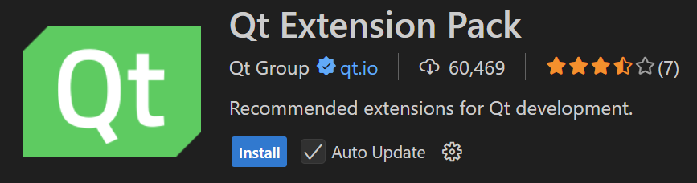

# Commencer le développement Qt dans VSCode : Comment installer le Qt Extension Pack

Bonjour, c'est Kenji.
Cette fois-ci, je vais vous présenter « comment configurer l'environnement de développement Qt dans Visual Studio Code (ci-après VSCode) ».

Récemment, en plus du Qt Creator officiel, il y a de plus en plus de personnes qui souhaitent développer des applications Qt en utilisant VSCode, qui est léger et hautement extensible.
Pour ces personnes, je recommande le **"Qt Extension Pack"** .
En installant simplement ce pack d'extensions, vous obtiendrez les principales extensions liées à Qt d'un seul coup.

---

## Public cible

* Ceux qui souhaitent commencer le développement d'applications GUI en utilisant Qt
* Ceux qui souhaitent développer dans VSCode plutôt que dans Qt Creator
* Ceux qui trouvent fastidieux de chercher les extensions une par une

---

## Prérequis

* VSCode doit être installé
  ([Vous pouvez le télécharger gratuitement sur le site officiel](https://code.visualstudio.com/))
* La bibliothèque Qt elle-même doit être installée ([Site officiel de Qt](https://www.qt.io/))

---

## Qu'est-ce que le Qt Extension Pack ?

Le Qt Extension Pack est un pack d'extensions pour VSCode.
En l'installant, les fonctionnalités suivantes sont automatiquement ajoutées :

* Prise en charge des fichiers `.ui` (Qt Designer)
* Coloration syntaxique pour les fichiers `.pro` et `.qrc`
* Complétion de code C++, prise en charge de la compilation et du débogage pour Qt
* Qt Resource Browser (référence des ressources)

---

## Instructions d'installation

### 1. Ouvrir VSCode

Tout d'abord, démarrez VSCode.

### 2. Ouvrir la vue des extensions

Cliquez sur la barre d'activité sur le côté gauche (icône de blocs carrés) pour afficher les « Extensions ».

Ou vous pouvez appuyer sur le raccourci
`Ctrl + Shift + X` .

### 3. Rechercher "Qt Extension Pack"

Entrez le mot-clé suivant dans la barre de recherche :

```
Qt Extension Pack
```



### 4. Cliquer sur le bouton d'installation

Lorsque le pack cible s'affiche, cliquez sur le bouton « Installer ».
Cela installera plusieurs extensions en une seule fois, telles que :

* Qt Language Support
* QML Support
* Qt Designer Integration
* CMake Tools (essentiel pour le développement Qt compatible avec CMake)

---

## Supplément de configuration du projet (Exemple CMake + Qt)

Si vous utilisez Qt basé sur CMake, nous vous recommandons de le combiner avec les extensions suivantes :

* [CMake Tools](https://marketplace.visualstudio.com/items?itemName=ms-vscode.cmake-tools)
* [CMake Language Support](https://marketplace.visualstudio.com/items?itemName=twxs.cmake)

De plus, si vous incluez la description suivante dans CMakeLists.txt, l'intégration avec Qt sera fluide :

```cmake
find_package(Qt6 REQUIRED COMPONENTS Widgets)
target_link_libraries(MyApp PRIVATE Qt6::Widgets)
```

---

## Bonus : Comment ouvrir les fichiers .ui ?

Les fichiers `.ui` peuvent être édités dans Qt Designer.
Dans VSCode, vous pourrez faire un clic droit sur le fichier `.ui` → sélectionner `Open with Qt Designer` (Qt Designer doit être inclus dans la variable d'environnement `PATH`).

---

## Résumé

| Étape | Contenu                          |
| -- | --------------------------- |
| 1  | Démarrer VSCode                    |
| 2  | Ouvrir le panneau des extensions                  |
| 3  | Rechercher "Qt Extension Pack" |
| 4  | Cliquer sur le bouton d'installation              |

Construire un environnement Qt dans VSCode est devenu beaucoup plus facile qu'auparavant.
Il possède suffisamment de fonctionnalités comme alternative à Qt Creator et est recommandé pour ceux qui veulent travailler de manière légère.

---

## Collection de liens recommandés

* [Site officiel de Qt](https://www.qt.io/)
* [Qt Extension Pack - Visual Studio Marketplace](https://marketplace.visualstudio.com/items?itemName=TheQtCompany.qt)
* [Site officiel de VSCode](https://code.visualstudio.com/)
* [Extension CMake Tools](https://marketplace.visualstudio.com/items?itemName=ms-vscode.cmake-tools)

---

## Pour finir

À l'avenir, je prévois de poursuivre le développement en utilisant les outils UI de Qt et QML dans cet environnement.
La prochaine fois, j'expliquerai **comment compiler et exécuter une application Hello World en Qt depuis VSCode** .

À bientôt !
