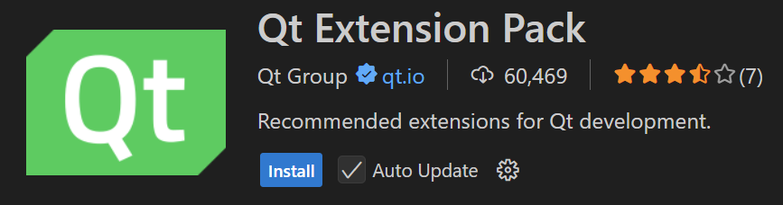

# VSCodeでQt開発を始める：Qt Extension Packをインストールする方法

こんにちは、Kenjiです。
今回は「Visual Studio Code（以下VSCode）でQtの開発環境を整える方法」について紹介します。

最近では、公式のQt Creatorに加えて、軽量で拡張性の高いVSCodeを使ってQtアプリを開発したい、という声も増えてきました。
そんな方におすすめなのが「**Qt Extension Pack**」。
この拡張パックをインストールするだけで、Qt関連の主要な拡張機能が一括でそろいます。

---

## 対象読者

* Qtを使ったGUIアプリ開発を始めたい方
* Qt Creatorではなく、VSCodeで開発したい方
* 拡張機能を1つずつ探すのが面倒な方

---

## 前提条件

* VSCodeがインストール済みであること
  （[公式サイトから無料でダウンロードできます](https://code.visualstudio.com/)）
* Qtライブラリ本体がインストールされていること（[Qt公式サイト](https://www.qt.io/)）

---

## Qt Extension Packとは？

Qt Extension Packは、VSCode用の拡張機能パックです。
インストールすることで、以下のような機能が自動的に追加されます：

* `.ui` ファイル（Qt Designer）のサポート
* `.pro` ファイルや `.qrc` ファイルの構文ハイライト
* Qt用のC++コード補完、ビルド、デバッグ支援
* Qt Resource Browser（リソースの参照）

---

## インストール手順

### 1. VSCodeを開く

まずはVSCodeを起動してください。

### 2. 拡張機能ビューを開く

左側のアクティビティバー（四角いブロックのアイコン）をクリックし、「拡張機能」を表示します。

またはショートカットで
`Ctrl + Shift + X` を押してもOKです。

### 3. 「Qt Extension Pack」と検索

検索バーに以下のキーワードを入力します：

```
Qt Extension Pack
```



### 4. インストールボタンをクリック

対象のパックが表示されたら、「インストール」ボタンをクリックします。
これで以下のような複数の拡張機能が一括でインストールされます：

* Qt Language Support
* QML Support
* Qt Designer Integration
* CMake Tools（CMake対応のQt開発では必須）

---

## プロジェクトの設定補足（CMake + Qtの例）

もし Qt を CMake ベースで使う場合は、以下の拡張機能との組み合わせがおすすめです：

* [CMake Tools](https://marketplace.visualstudio.com/items?itemName=ms-vscode.cmake-tools)
* [CMake Language Support](https://marketplace.visualstudio.com/items?itemName=twxs.cmake)

また、CMakeLists.txt に以下のような記述を入れておくと、Qtとの連携がスムーズです：

```cmake
find_package(Qt6 REQUIRED COMPONENTS Widgets)
target_link_libraries(MyApp PRIVATE Qt6::Widgets)
```

---

## おまけ：.uiファイルをどう開く？

`.ui` ファイルは Qt Designer で編集できます。
VSCode上で `.ui` ファイルを右クリック → `Open with Qt Designer` を選べるようになります（環境変数 `PATH` に Qt Designer が含まれている必要あり）。

---

## まとめ

| 手順 | 内容                          |
| -- | --------------------------- |
| 1  | VSCode起動                    |
| 2  | 拡張機能パネルを開く                  |
| 3  | 「Qt Extension Pack」で検索 |
| 4  | インストールボタンをクリック              |

VSCodeにQt環境を構築するのは以前よりかなり簡単になりました。
Qt Creatorの代替としても十分な機能があり、軽快に作業したい方にはおすすめです。

---

## おすすめリンク集

* [Qt公式](https://www.qt.io/)
* [Qt Extension Pack - Visual Studio Marketplace](https://marketplace.visualstudio.com/items?itemName=TheQtCompany.qt)
* [VSCode公式](https://code.visualstudio.com/)
* [CMake Tools 拡張](https://marketplace.visualstudio.com/items?itemName=ms-vscode.cmake-tools)

---

## さいごに

今後はこの環境で、QtのUIツールやQMLを活用した開発も進めていこうと思っています。
次回は、**QtでHello WorldアプリをVSCodeからビルド＆実行する方法**について解説予定です。

ではまた！