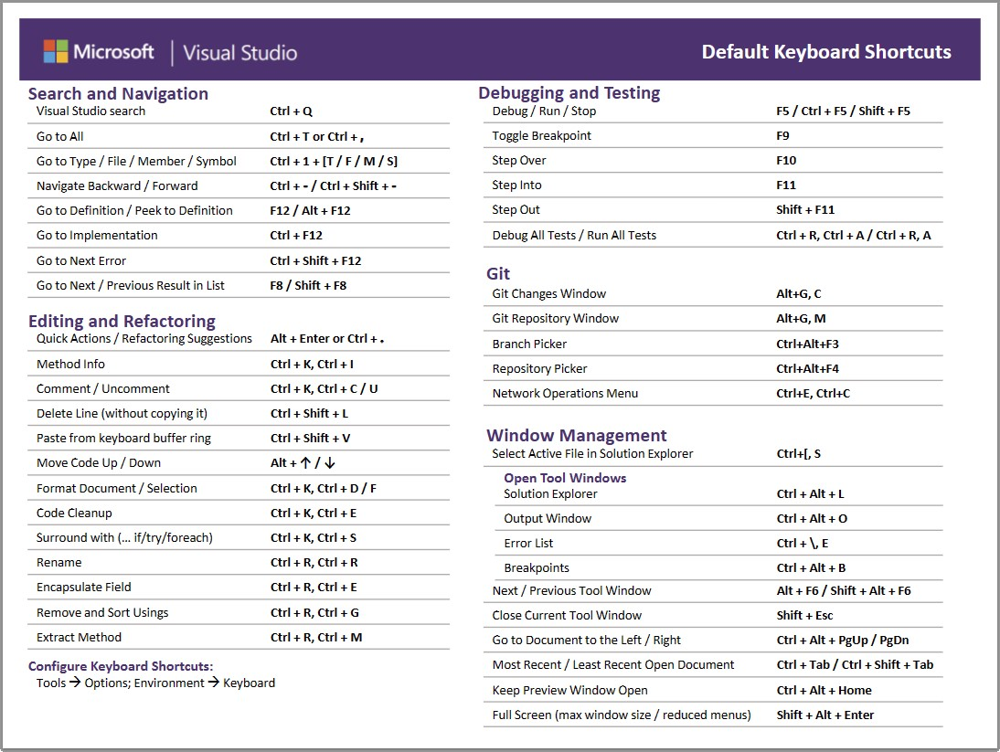

# Visual Studio 快捷键一览

以下整理了我个人经常使用的 Visual Studio 快捷键。
记住这些键盘操作快捷键，可以有效地提高开发效率。请务必加以利用。

※ 已在 Visual Studio 2022 中确认。

| 快捷键                       | 说明                       |
|-----------------------------|--------------------------|
| `F1`                        | 显示所选单词的帮助            |
| `F2`                        | 跳转到书签              |
| `Ctrl` + `F2`               | 添加书签                |
| `Ctrl` + `Shift` + `F2`     | 删除所有书签            |
| `F5`                        | 生成并运行（调试运行）          |
| `Ctrl` + `F5`               | 生成并运行（不调试）          |
| `F7`                        | 生成                      |
| `F9`                        | 在光标行添加断点        |
| `Ctrl` + `F9`               | 禁用光标行的断点     |
| `Shift` + `Ctrl` + `F9`     | 删除所有断点          |
| `F10`                       | 逐过程                 |
| `F11`                       | 逐语句                   |
| `F12`                       | 转到定义                  |
| `Ctrl` + `D`                | 复制光标行                 |
| `Ctrl` + `X`                | 没有选择范围时，剪切行         |
| `Ctrl` + `Shift` + `]`      | 选择到光标处括号对应的匹配括号   |
| `Alt` + `上下方向键`        | 上下移动光标行            |
| `Alt` + `Shift` + `方向键`  | 多光标/块状选择             |
| `Ctrl` + `Tab`              | 切换源代码/窗口显示       |
| `Ctrl` + `Shift` + `V`      | 显示剪贴板历史记录             |
| `Ctrl` + `K` 后 `Ctrl` + `C` | 注释光标行            |
| `Ctrl` + `K` 后 `Ctrl` + `U` | 取消注释光标行          |
| `Ctrl` + `G`                | 指定行号跳转             |
| `Ctrl` + `F`                | 查找                       |
| `Ctrl` + `Shift` + `F`      | 全局查找                  |
| `Ctrl` + `H`                | 替换                       |
| `Ctrl` + `Shift` + `F`      | 全局替换                  |
| `Ctrl` + `Tab`              | 切换源代码/窗口显示       |
| `Ctrl` + `Space`            | 单词补全                     |
| `Ctrl` + `Alt` + `L`        | 打开解决方案资源管理器窗口 |
| `Ctrl` + `Shift` + `E`      | 打开资源视图窗口        |
| `Ctrl` + `0` 后 `Ctrl` + `G` | 打开 Git 提交窗口         |

## 参考

- [Visual Studio 的键盘快捷键](https://learn.microsoft.com/zh-cn/visualstudio/ide/default-keyboard-shortcuts-in-visual-studio?view=vs-2022&utm_source=vshelp&wt.mc_id=visualstudio_inproduct_shortcuts_csaapp)

