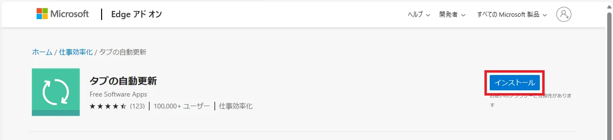
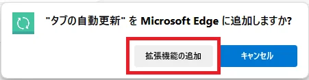
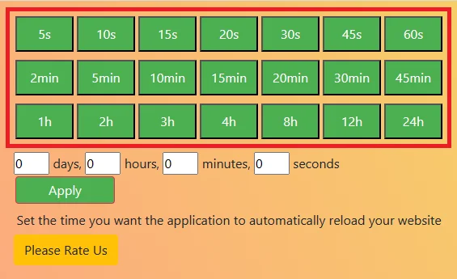
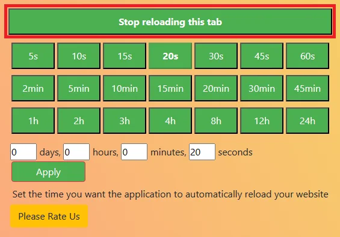

यहां "Tab Auto Refresh" नामक एक Edge ब्राउज़र एक्सटेंशन प्रस्तुत है जो वेब पेजों को स्वचालित रूप से रिफ्रेश करता है।

## Tab Auto Refresh स्थापित करना

[Tab Auto Refresh](https://microsoftedge.microsoft.com/addons/detail/%E3%82%BF%E3%83%96%E3%81%AE%E8%87%AA%E5%8B%95%E6%9B%B4%E6%96%B0/bicjibdndeejemialpbohjpiimehbapb)

ऊपर दी गई साइट पर जाएं और `इंस्टॉल करें` पर क्लिक करें।

`एक्सटेंशन जोड़ें` पर क्लिक करें।

## उपयोग कैसे करें

इंस्टॉलेशन पूरा होने के बाद, Edge के ऊपरी दाएं कोने में एक आइकन जुड़ जाएगा।

वह वेब पेज खोलें जिसे आप ऑटो-रिफ्रेश करना चाहते हैं और ऑटो-रिफ्रेश शुरू करने के लिए आइकन पर क्लिक करें।

हरे रंग से हाइलाइट किया गया क्षेत्र ऑटो-रिफ्रेश अंतराल है। ऑटो-रिफ्रेश के लिए समय चुनें।

ऑटो-रिफ्रेश को रोकने के लिए, आइकन पर क्लिक करें और फिर `Stop reloading this tab` पर क्लिक करें।

