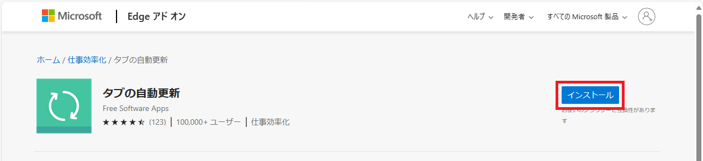
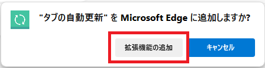
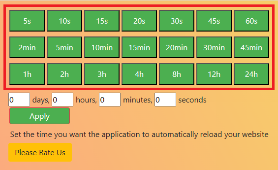
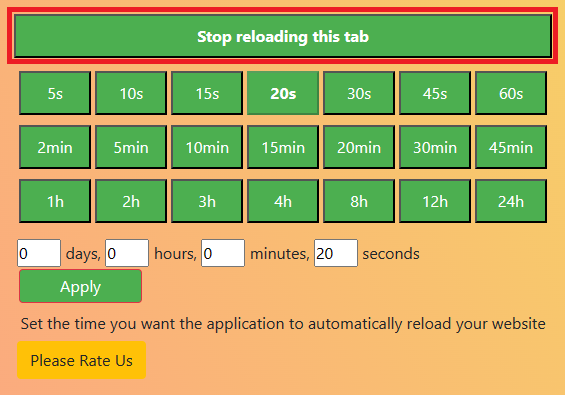

介绍一款用于自动刷新网页的 Edge 浏览器扩展程序“标签页自动刷新”。

## 安装标签页自动刷新

[标签页自动刷新](https://microsoftedge.microsoft.com/addons/detail/%E3%82%BF%E3%83%96%E3%81%AE%E8%87%AA%E5%8B%95%E6%9B%B4%E6%96%B0/bicjibdndeejemialpbohjpiimehbapb)

访问上述网站，然后点击`获取`。

点击`添加扩展`。

## 使用方法

安装完成后，Edge 的右上角会添加一个图标。

打开您想要自动刷新的网页，点击该图标，即可开始自动刷新。

绿框部分是自动刷新的间隔时间。请选择自动刷新的时机。

如果要停止自动刷新，请点击该图标，然后点击`Stop reloading this tab`。

