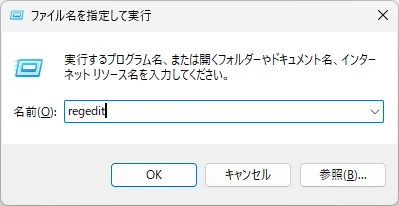
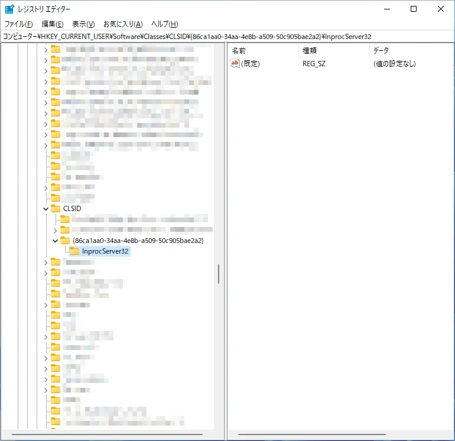

---
title: 'كيفية استعادة قائمة النقر بزر الماوس الأيمن في Windows 11 إلى الإصدار الكلاسيكي (المواصفات القديمة) [إعدادات السجل]'
slug: "Windows 11の右クリックメニューを従来版に戻す方法"
date: 2024-03-30T13:13:36+09:00
tags: ["Windows11", "مستكشف الملفات"]
draft: false
image: "img.webp"
categories: ["الكمبيوتر والأدوات"]
description: 'نشرح كيفية استعادة قائمة النقر بزر الماوس الأيمن الجديدة (قائمة السياق) في Windows 11 إلى الإصدار الكلاسيكي الخاص بـ Windows 10. نقدم خطوات بسيطة باستخدام محرر التسجيل لعرض القائمة بالمواصفات القديمة دائماً.'
---

# كيفية استعادة قائمة النقر بزر الماوس الأيمن الكلاسيكية في ويندوز 11

نقدم لكم طريقة لاستعادة قائمة النقر بزر الماوس الأيمن في ويندوز 11 إلى الإصدار الكلاسيكي.

1. افتح محرر التسجيل.

اضغط على `مفتاح Win` + `مفتاح R`، واكتب `regedit`، ثم اضغط على `مفتاح Enter`.
　

2. انتقل إلى `HKEY_CURRENT_USER\Software\Classes\CLSID\{86ca1aa0-34aa-4e8b-a509-50c905bae2a2}`. إذا لم يكن هذا المفتاح موجودًا، فقم بإنشائه.

4. انتقل إلى `HKEY_CURRENT_USER\Software\Classes\CLSID\{86ca1aa0-34aa-4e8b-a509-50c905bae2a2}\InprocServer32`. إذا لم يكن هذا المفتاح موجودًا، فقم بإنشائه.
5. تأكد من أن القيمة `(الافتراضي)` داخل `InprocServer32` فارغة.

6. أعد تشغيل الكمبيوتر.
7. تحقق من عودة قائمة النقر بزر الماوس الأيمن إلى الإصدار الكلاسيكي.
