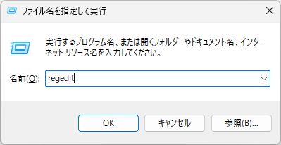
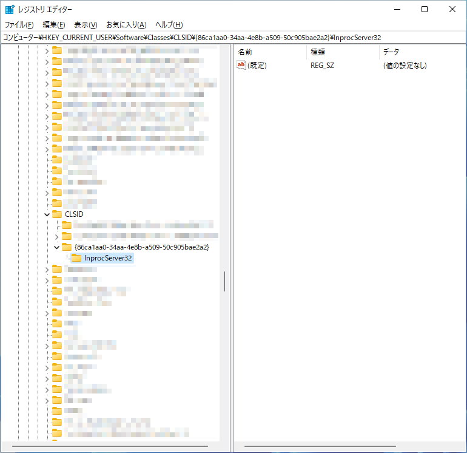

# 如何在 Windows 11 中恢復傳統的右鍵選單

我們將介紹如何在 Windows 11 中恢復傳統的右鍵選單。

1. 打開登錄編輯程式。

按下 `Win鍵` + `R鍵`，輸入 `regedit`，然後按 `Enter鍵`。
　

2. 前往 `HKEY_CURRENT_USER\Software\Classes\CLSID\{86ca1aa0-34aa-4e8b-a509-50c905bae2a2}`。如果這個機碼不存在，請建立它。

4. 前往 `HKEY_CURRENT_USER\Software\Classes\CLSID\{86ca1aa0-34aa-4e8b-a509-50c905bae2a2}\InprocServer32`。如果這個機碼不存在，請建立它。
5. 確認 `InprocServer32` 中的 `(預設值)` 為空值。

6. 重新啟動電腦。
7. 確認右鍵選單已恢復為傳統版本。
