---

title: "Windows 단축키・팁 모음"
date: 2022-09-18T23:49:29+09:00
tags: ["Windows","팁","단축키"]
draft: false
image: "img.png"
categories: ["PC・가젯"]
---

Windows에서 평소 사용하는 소소한 팁 모음입니다. Windows를 처음 사용하시는 분들이 읽어주시면 좋겠습니다.
Windows 11을 가정하고 있지만, 대부분 Windows 10에서도 사용할 수 있을 것입니다.

## 창 닫기
- 창이 활성화된 상태에서 `Alt + F4`
- 창이 활성화된 상태에서 `Ctrl + W`. 탭 또는 창을 닫기(지원하는 애플리케이션만)
- 창의 제목 표시줄 왼쪽 아이콘을 더블 클릭하기
- 창의 제목 표시줄의 `×`를 클릭하기

## 바탕 화면 표시
- `Win + D`. 2번 누르면 원래 창 상태로 돌아갑니다. 아주 잠깐 바탕 화면을 표시하고 싶을 때 유용합니다.
- `Win + M`. 모든 앱 최소화. 2번 눌러도 원래대로 돌아오지 않습니다.

## 음성 입력
- `Win + H`. 음성 입력을 시작합니다. 음성 입력을 종료하려면 `Esc` 또는 다시 `Win + H`를 누릅니다.

## 파일 탐색기에서 기존 우클릭 메뉴 표시하기
- `Shift + F10` 또는 애플리케이션 키를 누릅니다. 애플리케이션 키는 키보드 우측 하단에 있는 키입니다.

## 범위를 선택하여 화면 캡처
- `Win + Shift + S`로 범위를 선택하여 화면을 캡처할 수 있습니다.
- `Win + Print Screen` 또는 단순히 `Print Screen`으로 전체 화면을 캡처할 수 있습니다.
(`Win`을 붙인 경우에는 `C:\Users\사용자이름\Pictures\Screenshots`에 캡처 이미지가 출력됩니다.)
- `Alt + Print Screen`으로 현재 창을 캡처할 수 있습니다.

## 작업 표시줄에 등록된 앱 실행
- `Win + 숫자 키`로 작업 표시줄에 등록된 앱을 실행할 수 있습니다.  
  예를 들어 `Win + 1`을 누르면 작업 표시줄의 가장 왼쪽 앱이 실행됩니다.
- `Win + T`로 작업 표시줄 아이콘으로 포커스를 이동할 수 있으며, 이어서 여러 번 `Win + T`를 누르거나,
  `←` 또는 `→`로 선택을 이동시키고 `Enter` 키로 선택된 앱을 실행할 수 있습니다.

## 확대/축소
- `Win + +`로 Windows 돋보기가 실행됩니다. 추가로 `Win + + or -`로 화면을 확대/축소할 수 있습니다.
- 메모장이나 브라우저 등 `Ctrl + + or -`로 확대/축소할 수 있습니다. (지원하는 앱만)

## Windows 잠금
- `Win + L`
- `Ctrl + Alt + Del` → `Space` or `Enter`

## Windows 종료(셧다운)
- `Win + M`이나 `Win + D`로 바탕 화면을 표시한 상태 또는 `Win + T`나 `Win + B`로 작업 표시줄이 활성화된 상태에서 `Alt + F4`를 누르면 아래와 같은 대화 상자가 표시되므로 "시스템 종료"가 선택된 것을 확인하고 `Enter`
  `Win + R` → `Alt + F4` → `Alt + F4`도 가능.
  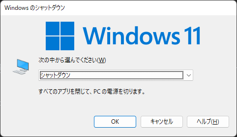
- `Win + X` → `U` → `U`로 종료할 수 있습니다.
- 명령 프롬프트나 `Win + R`의 "실행"에서 `shutdown /s /t 0`을 입력하면 종료할 수 있습니다. 추가로 `/f`를 붙이면 강제 종료가 됩니다.

## Windows 다시 시작
- `Win + M`이나 `Win + D`로 바탕 화면을 표시한 상태 또는 `Win + T`나 `Win + B`로 작업 표시줄이 활성화된 상태에서 `Alt + F4`를 누르면 아래와 같은 대화 상자가 표시되므로 1번 `↓`를 눌러 "다시 시작"을 선택하고 `Enter`
 　`Win + R` → `Alt + F4` → `Alt + F4`도 가능.
  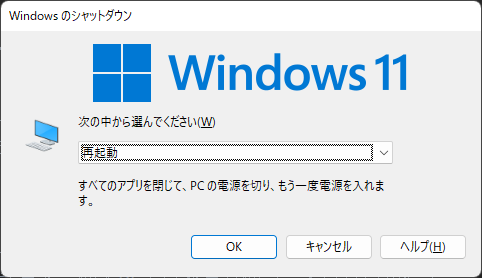
- `Win + X` → `U` → `R`로 다시 시작할 수 있습니다.
- `shutdown /r /t 0`으로 다시 시작할 수 있습니다. 추가로 `/f`를 붙이면 강제 다시 시작이 됩니다.

## Windows 절전 모드
- `Win + M`이나 `Win + D`로 바탕 화면을 표시한 상태 또는 `Win + T`나 `Win + B`로 작업 표시줄이 활성화된 상태에서 `Alt + F4`를 누르면 아래와 같은 대화 상자가 표시되므로 1번 `↑`를 눌러 "절전"을 선택하고 `Enter`
  `Win + R` → `Alt + F4` → `Alt + F4`도 가능.
  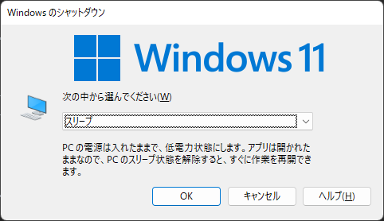
- `Win + R` → 또는 명령 프롬프트에서 `rundll32.exe powrprof.dll,SetSuspendState`를 입력하면 최대 절전 모드로 전환할 수 있습니다.

## Windows 로그아웃
- `Win + M`이나 `Win + D`로 바탕 화면을 표시한 상태 또는 `Win + T`나 `Win + B`로 작업 표시줄이 활성화된 상태에서 `Alt + F4`를 누르면 아래와 같은 대화 상자가 표시되므로 2번 `↑`를 눌러 "로그아웃"을 선택하고 `Enter`
  `Win + R` → `Alt + F4` → `Alt + F4`도 가능.
  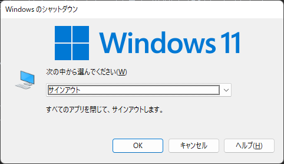
- `Win + X` → `U` → `I`
- `Ctrl + Alt + Del` → 2번 `Tab` or 2번 `↓` → `Enter` or `Space`
- `logoff`로 로그아웃할 수 있습니다.

## 키보드로 창 이동
- `Win + ←` : 왼쪽으로 이동
- `Win + →` : 오른쪽으로 이동
- `Win + ↑` : 위로 이동/최대화
- `Win + ↓` : 아래로 이동/최소화
- `Win + Shift + ← or →` : 멀티 모니터 간 이동
- `Win + Alt + ← or → or ↑ or ↓` : 최대화·최소화하지 않고 창 이동
- 최소화되지 않은 상태에서 `Alt + Space` 후에 `M` 그 후, 화살표 키로 이동.  
※ 마우스 커서에 창이 따라오는 상태가 되므로, 화면 밖으로 창이 표시된 상태에서도 구출할 수 있습니다.

## 작업 관리자에서 프로세스 종료

1. `Ctrl + Shift + Esc`로 작업 관리자를 실행할 수 있습니다.
2. `Ctrl + Tab`으로 탭을 전환할 수 있습니다.
3. `세부 정보` 탭에서 `Tab`을 누른 후, 키보드 영숫자 입력으로 프로세스를 전방 일치 검색할 수 있습니다.
4. 프로세스 이름이 선택된 상태에서 `Delete` 키, 이어서 `Enter` 키를 누르면 프로세스를 종료할 수 있습니다.

## 명령어로 프로세스 이름을 지정하여 종료
- `taskkill /f /im 프로세스이름`으로 프로세스를 종료할 수 있습니다.
예를 들어, `taskkill /f /im explorer.exe`로 파일 탐색기를 종료할 수 있습니다.

## 작업 표시줄의 아이콘에서 같은 프로그램 여러 개 실행
- 작업 표시줄에서 `Shift` 키를 누른 채로 마우스 왼쪽 클릭을 하면, 여러 개의 같은 프로그램을 실행할 수 있습니다. (다중 실행을 지원하는 앱만)

## 관리자 권한으로 프로그램 실행
- `Ctrl + Shift`를 누른 채로 프로그램을 실행하면 관리자 권한으로 프로그램을 실행할 수 있습니다.

## 파일 탐색기 실행
- `Win + E`로 파일 탐색기를 실행할 수 있습니다.
- `Win + R`로 "실행"을 표시하고 `explorer`를 입력한 후 `Enter`
- `Ctrl + Shift + N`으로 새 폴더를 만들 수 있습니다.

## 파일 탐색기에서 열려 있는 위치에서 명령 프롬프트 열기
- Windows 11의 경우 우클릭 메뉴의 "터미널"에서 명령 프롬프트를 실행할 수 있습니다.
- 또한, 주소 표시줄에 `cmd`라고 입력하고 `Enter` 키를 누르면 명령 프롬프트를 실행할 수 있습니다.

## 클립보드 검색 기록 표시
- `Win + V`로 클립보드 검색 기록을 표시할 수 있습니다.
과거에 복사한 텍스트나 이미지를 선택하면 다시 복사할 수 있습니다.

## 실행
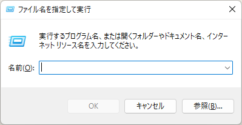
- `Win + R`로 "실행"을 열 수 있습니다.

다음은 "실행" 또는 명령 프롬프트에서 실행할 수 있는 명령어 몇 가지를 소개합니다.

## Edge 열기

- `msedge`를 입력하고 `Enter`

## Internet Explorer 11(IE11) 열기

- `powershell.exe -Command "(New-Object -ComObject InternetExplorer.Application).Visible = $true"`를 입력하고 `Enter`

## 터미널 열기

- `wt`를 입력하고 `Enter`

## 제어판 열기

- `control`을 입력하고 `Enter`
- `explorer.exe shell:::{26EE0668-A00A-44D7-9371-BEB064C98683}` 로도 열 수 있습니다.

## 메모장 실행

- `notepad`를 입력하고 `Enter`  

## 계산기 실행

- `calc`를 입력하고 `Enter`

## 그림판 실행

- `mspaint`를 입력하고 `Enter`  

## PowerShell 실행
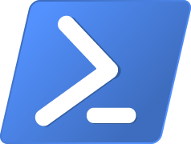
- `powershell`을 입력하고 `Enter`  

## Visual Studio Code 실행

- `code`를 입력하고 `Enter`

## Excel 실행

- `excel`을 입력하고 `Enter`  
※ Excel이 설치되어 있는 경우에만.

## Word 열기

- `winword`를 입력하고 `Enter`  
※ Word가 설치되어 있는 경우에만.

## PowerPoint 열기

- `powerpnt`를 입력하고 `Enter`  
  ※ PowerPoint가 설치되어 있는 경우에만.

## 시스템 구성 열기
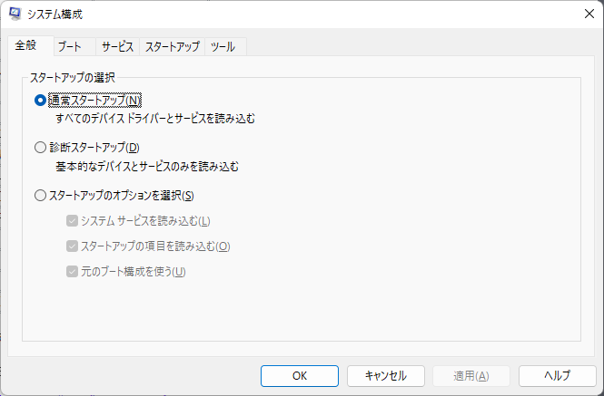
- `msconfig`를 입력하고 `Enter`  

## 시스템 속성 열기
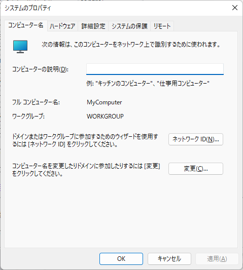
- `sysdm.cpl`을 입력하고 `Enter`

## Windows 버전 정보 열기
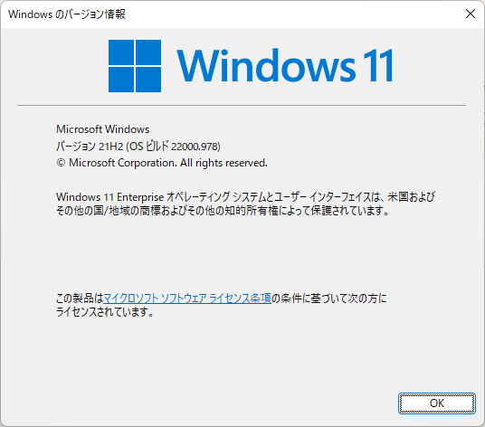
- `winver`를 입력하고 `Enter`

## 화상 키보드 열기
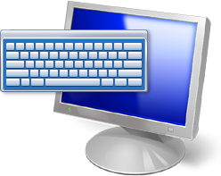
- `osk`를 입력하고 `Enter`

## 워드패드 열기

- `wordpad` 또는 `write`를 입력하고 `Enter`

## 레지스트리 편집기 열기

- `regedit`을 입력하고 `Enter`

## 프로그램 및 기능 열기
- `explorer.exe shell:::{7b81be6a-ce2b-4676-a29e-eb907a5126c5}`를 입력하고 `Enter`

## 키보드 속성 열기
- `explorer.exe shell:::{725BE8F7-668E-4C7B-8F90-46BDB0936430}`을 입력하고 `Enter`

## 마우스 속성 열기
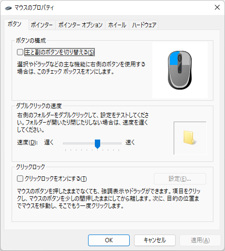
- `explorer.exe shell:::{6C8EEC18-8D75-41B2-A177-8831D59D2D50}`을 입력하고 `Enter`

## 소리 열기
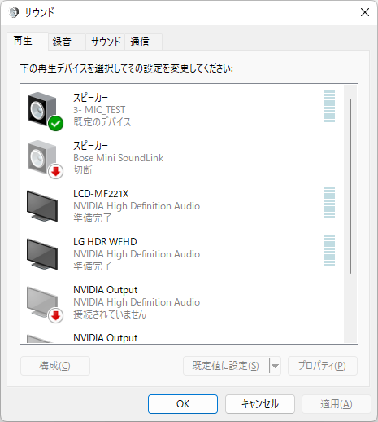
- `explorer.exe shell:::{F2DDFC82-8F12-4CDD-B7DC-D4FE1425AA4D}`를 입력하고 `Enter`

## 사용자 계정 열기
- `explorer.exe shell:::{60632754-c523-4b62-b45c-4172da012619}`를 입력하고 `Enter`

## 표준 메시지 상자의 문자열 복사
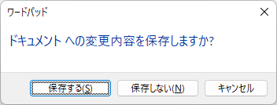
- `Ctrl + C`로 표준 메시지 상자의 문자열을 복사할 수 있습니다.
위의 메시지 상자를 복사하면 아래 내용이 클립보드에 복사됩니다.
```
[Window Title]
워드패드

[Main Instruction]
문서에 대한 변경 내용을 저장하시겠습니까?

[저장(S)] [저장 안 함(N)] [취소]
```

## 명령 프롬프트의 출력을 클립보드에 저장
`echo "hello" | clip` 등 명령어 뒤에 ` | clip`(파이프+clip)을 붙이면 표준 출력을 클립보드에 복사할 수 있습니다.

## 폴더 계층을 텍스트로 출력
명령 프롬프트에서 `tree` 명령어로 폴더 계층을 트리 형식으로 출력할 수 있습니다.

출력 샘플
```
C:.
├─.idea
│  └─libraries
├─binaryeditorbz
├─blog
│  ├─archetypes
│  ├─content
│  ├─data
│  ├─layouts
│  ├─static
│  └─themes
│      └─PaperMod
│          ├─.git
│          │  ├─branches
│          │  ├─hooks
│          │  ├─info
│          │  ├─logs
│          │  │  └─refs
│          │  │      ├─heads
│          │  │      └─remotes
│          │  │          └─origin
│          │  ├─objects
│          │  │  ├─info
│          │  │  └─pack
│          │  └─refs
│          │      ├─heads
│          │      ├─remotes
│          │      │  └─origin
│          │      └─tags
│          ├─.github
│          │  ├─ISSUE_TEMPLATE
│          │  └─workflows
│          ├─assets
│          │  ├─css
│          │  │  ├─common
│          │  │  ├─core
│          │  │  ├─extended
│          │  │  ├─hljs
│          │  │  └─includes
│          │  └─js
│          ├─i18n
│          ├─images
│          └─layouts
│              ├─partials
│              │  └─templates
│              ├─shortcodes
│              └─_default
│                  └─_markup
(이하 생략)
```

## 참고
- [Windows 키보드 단축키](https://support.microsoft.com/ko-kr/windows/windows%EC%9D%98-%ED%82%A4%EB%B3%B4%EB%93%9C-%EB%8B%A8%EC%B6%95%ED%82%A4-dcc61a57-8ff0-cffe-9796-cb9706c75eec)
