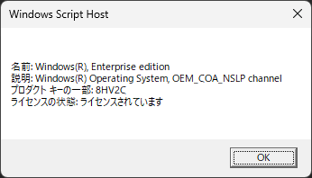

---


title: "'Windows 라이선스 상태를 확인하는 명령어'"
date: 2025-04-14T00:41:45+09:00
tags: ["Windows", "라이선스", "명령 프롬프트"]
draft: false
image: "img_1.png"
categories: ["PC・가젯"]
---


# [Windows] 라이선스 상태를 확인하는 방법 (명령어 하나로 OK)

Windows 라이선스가 정상적으로 인증되어 있는지 궁금했던 적이 있으신가요?

그럴 때 유용한 것이 **명령어 한 번으로 라이선스 정보를 확인할 수 있는 방법**입니다. 다음 단계를 실행하는 것만으로 현재 라이선스 상태를 쉽게 체크할 수 있습니다.

## 라이선스 상태를 확인하는 명령어

Windows에 기본 탑재된 스크립트 도구를 사용하여 라이선스 정보를 표시할 수 있습니다. 사용하는 명령어는 다음과 같습니다:

```
slmgr /dli
```

이 명령어를 실행하면 라이선스의 일부 정보가 창으로 표시됩니다.

## 실행 방법

1. **"시작 메뉴"에서 "cmd"를 입력하고, 명령 프롬프트를 우클릭 → "관리자 권한으로 실행"**합니다.

2. 명령 프롬프트에 다음을 입력하고 Enter 키를 누릅니다:

   ```
   slmgr /dli
   ```

3. 몇 초 기다리면 다음과 같은 라이선스 정보가 표시됩니다.

   

## 표시되는 주요 정보

* 제품 키의 일부
* 라이선스 종류 (리테일, OEM 등)
* 라이선스 상태 (유효, 만료, 미인증 등)

## 더 자세한 정보를 알고 싶다면?

다음과 같은 명령어도 있습니다:

* `slmgr /dlv` : 더 자세한 라이선스 정보를 표시
* `slmgr /xpr` : 라이선스 만료일(영구 여부 등)을 표시

## 요약

Windows 라이선스 상태는 명령어 하나로 쉽게 확인할 수 있습니다.

* **간단 확인** : `slmgr /dli`
* **자세한 확인** : `slmgr /dlv`
* **만료일 확인** : `slmgr /xpr`

라이선스에 문제가 있으면 업데이트나 일부 기능에 제한이 생길 수도 있으므로, 정기적으로 확인해 두면 안심할 수 있습니다.
