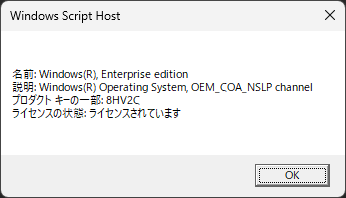

# 【Windows】ライセンスの状態を確認する方法（コマンド1つでOK）

Windowsのライセンスが正しく認証されているかどうか、気になったことはありませんか？

そんなときに便利なのが、**コマンド一発でライセンス情報を確認できる方法**です。以下の手順を実行するだけで、現在のライセンス状態を簡単にチェックできます。

## ライセンス状態を確認するコマンド

Windowsに標準搭載されているスクリプトツールを使って、ライセンスの情報を表示できます。使用するコマンドはこちら：

```
slmgr /dli
```

このコマンドを実行すると、ライセンスの一部情報がウィンドウで表示されます。

## 実行方法

1. \*\*「スタートメニュー」から「cmd」と入力して、コマンドプロンプトを右クリック →「管理者として実行」\*\*します。

2. コマンドプロンプトに以下を入力してEnterキーを押します：

   ```
   slmgr /dli
   ```

3. 数秒待つと、以下のようなライセンス情報が表示されます。

   

## 表示される主な情報

* プロダクトキーの一部
* ライセンスの種類（リテール、OEMなど）
* ライセンスの状態（有効、期限切れ、未認証など）

## もっと詳細な情報を知りたいときは？

以下のようなコマンドもあります：

* `slmgr /dlv`：より詳細なライセンス情報を表示
* `slmgr /xpr`：ライセンスの有効期限（永久かどうかなど）を表示

## まとめ

Windowsのライセンス状態は、コマンドひとつで簡単に確認できます。

* **簡易確認**：`slmgr /dli`
* **詳細確認**：`slmgr /dlv`
* **有効期限の確認**：`slmgr /xpr`

ライセンスに問題があると、アップデートや一部機能に制限が出ることもあるので、定期的に確認しておくと安心です。
