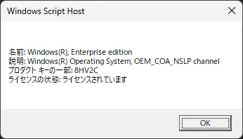

# 【Windows】Como verificar o status da licença (OK com 1 comando)

Você já se perguntou se a sua licença do Windows está autenticada corretamente?

Para esses momentos, uma forma conveniente é o **método de verificar as informações da licença com um único comando** . Você pode verificar facilmente o status atual da sua licença simplesmente executando os passos abaixo.

## Comando para verificar o status da licença

Você pode exibir as informações da sua licença usando uma ferramenta de script embutida no Windows. O comando a ser usado está aqui:

```
slmgr /dli
```

Quando você executa este comando, algumas informações sobre a sua licença serão exibidas em uma janela.

## Como executar

1. **Abra o "Menu Iniciar", digite "cmd", clique com o botão direito em Prompt de Comando → "Executar como administrador"** .

2. Digite o seguinte no Prompt de Comando e pressione Enter:

   ```
   slmgr /dli
   ```

3. Após esperar alguns segundos, informações da licença como as seguintes serão exibidas.

   

## Principais informações exibidas

* Parte da chave do produto
* Tipo de licença (Varejo, OEM, etc.)
* Status da licença (Ativa, expirada, não autenticada, etc.)

## E se você quiser saber informações mais detalhadas?

Também existem comandos como os seguintes:

* `slmgr /dlv` : Exibe informações mais detalhadas da licença
* `slmgr /xpr` : Exibe a data de expiração da licença (se é permanente, etc.)

## Resumo

O status da licença do Windows pode ser facilmente verificado com um único comando.

* **Verificação simples** : `slmgr /dli`
* **Verificação detalhada** : `slmgr /dlv`
* **Verificação da data de expiração** : `slmgr /xpr`

Se houver um problema com a sua licença, pode haver restrições em atualizações e certos recursos, por isso é seguro verificá-la periodicamente.
