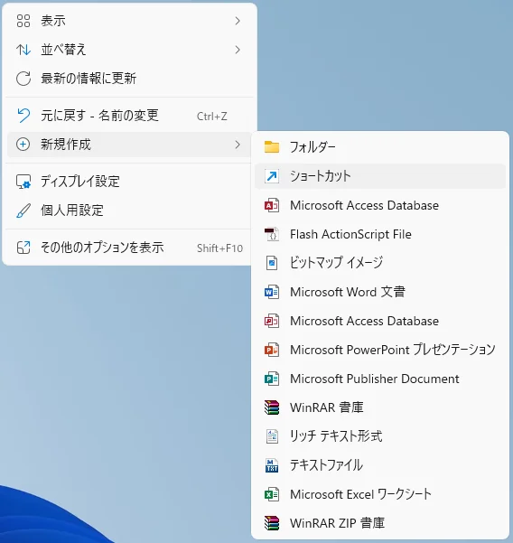
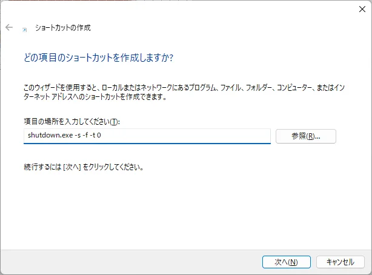
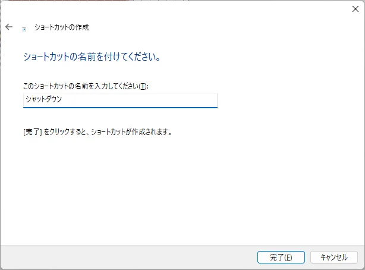
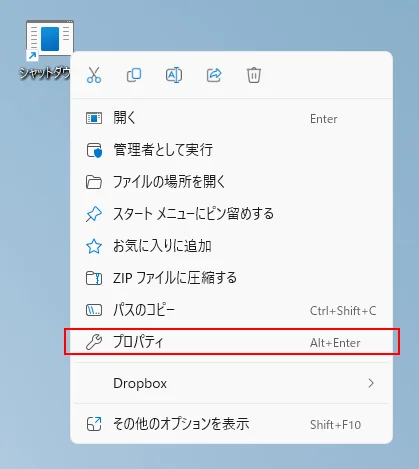
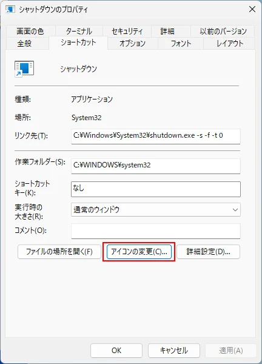
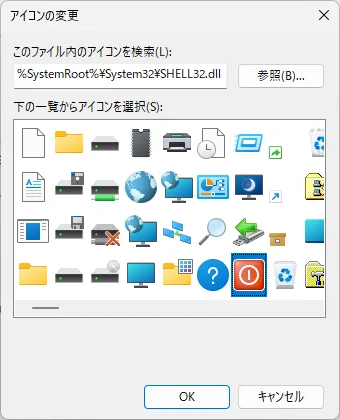

Hier wird beschrieben, wie Sie eine Verknüpfung zum Herunterfahren von Windows erstellen.

Es ist praktisch, da Sie den Computer durch einen Doppelklick auf die erstellte Verknüpfung, z. B. auf dem Desktop, herunterfahren können.

## Erstellungsmethode

#### 1. Klicken Sie mit der rechten Maustaste auf den Desktop und wählen Sie `Neu` > `Verknüpfung`

#### 2. Der Bildschirm zur Erstellung von Verknüpfungen wird angezeigt. Geben Sie `shutdown.exe -s -f -t 0` ein und klicken Sie auf `Weiter`

#### 3. Geben Sie den Namen der Verknüpfung `Herunterfahren` ein und klicken Sie auf `Fertig stellen`

#### 4. Ändern Sie das Symbol der erstellten Verknüpfung

Klicken Sie mit der rechten Maustaste auf die erstellte Verknüpfung und wählen Sie `Eigenschaften`

Klicken Sie auf `Anderes Symbol`

Wählen Sie das rote quadratische Symbol und klicken Sie auf `OK`. Klicken Sie dann erneut auf `OK`, um die Eigenschaften zu schließen.

Das war's.

Windows wird heruntergefahren, wenn Sie auf die erstellte Verknüpfung doppelklicken.

※ Hinweis: Es wird kein Bestätigungsdialog zum Herunterfahren angezeigt.
