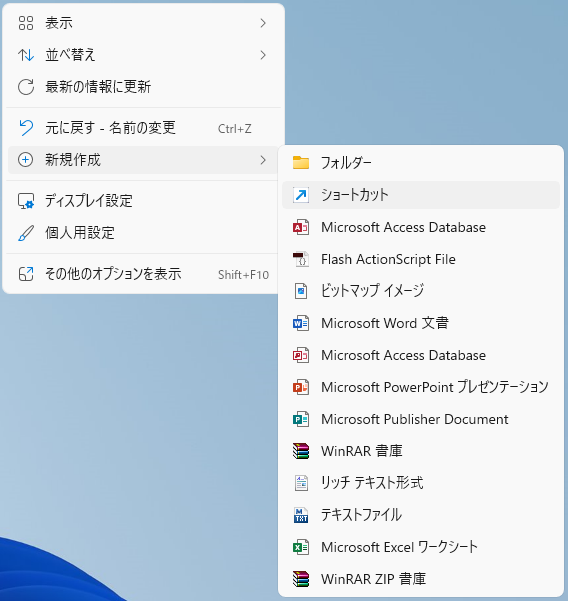
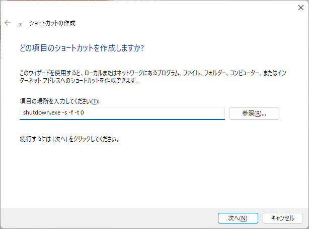
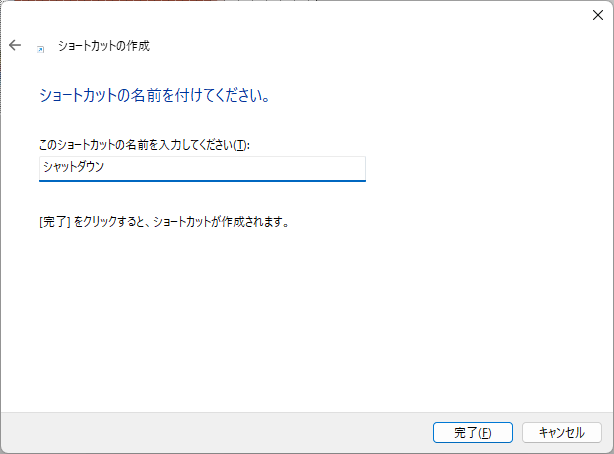
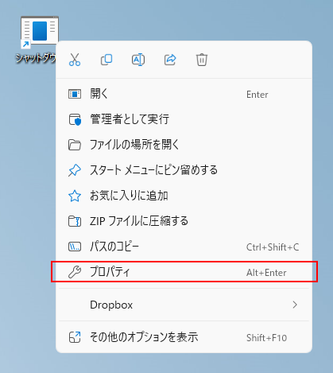
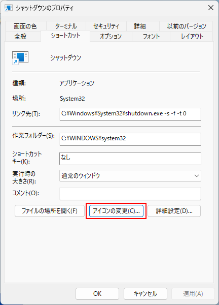
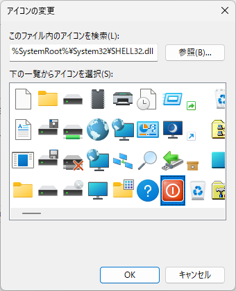

本文介绍如何创建关闭 Windows 的快捷方式。

将创建的快捷方式放在桌面上，双击即可关机，非常方便。

## 创建方法

#### 1. 在桌面上右击，选择`新建`＞`快捷方式`

#### 2. 弹出创建快捷方式的界面，输入 `shutdown.exe -s -f -t 0`，然后点击`下一步`

#### 3. 输入快捷方式的名称 `关机`，然后点击`完成`

#### 4. 更改已创建快捷方式的图标

右击创建的快捷方式，选择`属性`

点击`更改图标`

选择红色的方形图标，点击`确定`，再次点击`确定`关闭属性窗口。

完成。

双击创建的快捷方式，Windows 就会关机。

※注意：关机前不会显示确认对话框。
