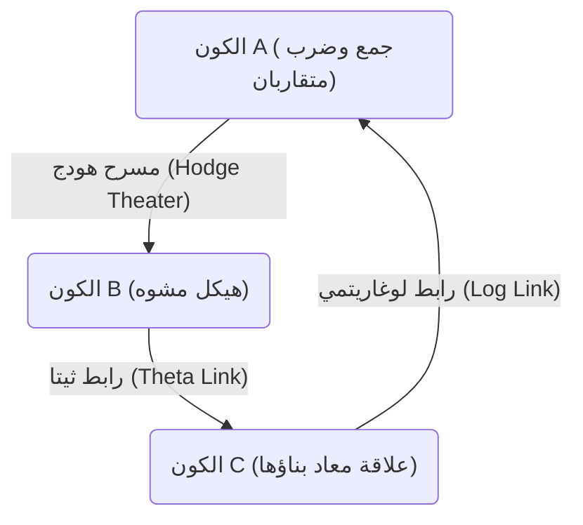
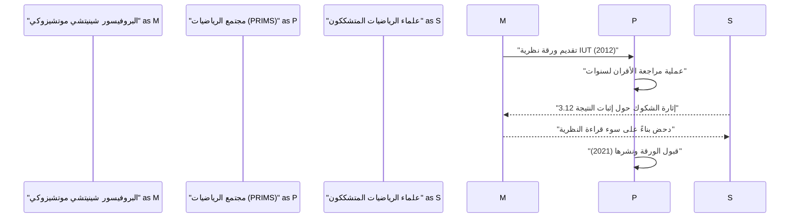

# مقدمة: ما هي [حدسية ABC](https://kenji.blog/ar/p/abc-conjecture/)؟

في مجال نظرية الأعداد، توجد العديد من المسائل غير المحلولة، ولكن من بين أهمها تبرز **[حدسية ABC](https://kenji.blog/ar/p/abc-conjecture/)** (ABC Conjecture). تمت صياغة هذه الحدسية بشكل مستقل في عام 1985 من قبل جوزيف أوسترلي (Joseph Oesterlé) وديفيد ماسر (David Masser).

تشير [حدسية ABC](https://kenji.blog/ar/p/abc-conjecture/) إلى علاقة عميقة بين جمع الأعداد الصحيحة وضربها (التحليل إلى العوامل الأولية). إنها تصف الخصائص المذهلة المخفية في المعادلة التي تبدو بسيطة $a + b = c$.

## التعريف الدقيق ل[حدسية ABC](https://kenji.blog/ar/p/abc-conjecture/)

لنفكر في مجموعة من الأعداد الصحيحة الموجبة الأولية فيما بينها $(a, b, c)$ والتي تحقق $a + b = c$. هنا، نعرّف **الجذر** (radical) للعدد الصحيح $n$ بأنه $\text{جذر}(n)$. وهذا هو حاصل ضرب العوامل الأولية المختلفة للعدد $n$.

$$ \text{جذر}(n) = \prod_{p | n} p $$

تنص [حدسية ABC](https://kenji.blog/ar/p/abc-conjecture/) على أنه لأي $\epsilon > 0$، يوجد عدد محدود فقط من ثلاثيات الأعداد الصحيحة الموجبة الأولية فيما بينها $(a, b, c)$ التي تحقق التالي:

$$ c > \text{جذر}(abc)^{1 + \epsilon} $$

تعني هذه المتباينة أنه إذا كان لدى $a$ و $b$ العديد من العوامل الأولية الصغيرة، فإن مجموعهما $c$ عادة ما يحتوي على عوامل أولية كبيرة (أي أن $\text{جذر}(c)$ يصبح كبيراً). يوضح هذا أن أكثر عمليتين أساسيتين في الرياضيات، الجمع والضرب، تقيدان بعضهما البعض بشدة.

# ظهور نظرية تايشمولر بين الأكوان (نظرية IUT)

لقد حير إثبات [حدسية ABC](https://kenji.blog/ar/p/abc-conjecture/) علماء الرياضيات لسنوات عديدة، ولكن في عام 2012، أعلن البروفيسور شينيتشي موتشيزوكي من جامعة كيوتو عن إثبات لهذه الحدسية باستخدام إطار رياضي جديد تمامًا يسمى **نظرية تايشمولر بين الأكوان** (Inter-Universal Teichmüller Theory، أو اختصاراً نظرية IUT).

تُعيد نظرية IUT بناء الأطر الرياضية التقليدية (مثل نظرية المجموعات والهندسة الجبرية القياسية) من الصفر، وقد أحدثت صدمة كبيرة في مجتمع الرياضيات بسبب تعقيدها وحداثتها.

## جوهر نظرية IUT: التواصل بين الأكوان

تتمثل الفكرة الأكثر ابتكارًا في نظرية IUT في مفهوم نقل المعلومات بين **أكوان رياضية** (mathematical universes) مختلفة. في الرياضيات العادية، يتم كل شيء ضمن كون واحد ثابت (نظام بديهي أو نموذج لنظرية المجموعات)، لكن البروفيسور موتشيزوكي فصل هياكل الجمع والضرب ووضع كلاً منها في أكوان مختلفة.

يوضح الشكل أعلاه بشكل مبسط مفهوم نقل المعلومات بين أكوان مختلفة في نظرية IUT. عند مقارنة ونقل الهياكل بين أكوان مختلفة، ينشأ نوع من "التشوه" أو "عدم اليقين". توفر نظرية IUT إطارًا عظيمًا لتقييم وقياس عدم اليقين هذا بدقة.

### الفُروبينيُويدات ومسرح هودج

كمفاهيم مهمة تشكل نظرية IUT، يوجد **الفروبينيويد** (Frobenioid) و **مسرح هودج** (Hodge Theater). هذه آليات لتشفير المعلومات المتعلقة بنظرية الأعداد هندسيًا من خلال عمل زمرة غالوا المطلقة أو الزمرة الأساسية للحقول العددية.

$$ \Theta \text{-رابط} : \mathcal{F}^{\circledast} \xrightarrow{\sim} \mathcal{F}^{\odot} $$

يلعب رابط ثيتا ($\Theta$-link) دورًا في نقل معلومات مونودرومي محددة (معلومات حول قيم دالة ثيتا) بين مسارح هودج المختلفة. بخلاف الهياكل التقليدية لنظرية الحلقات (التشاكلات التي تحافظ على كل من الجمع والضرب)، فإن هذا الرابط يحافظ جزئيًا فقط على هيكل الضرب بينما "يدمر" هيكل الجمع عن قصد، ثم يعيد بناءه.

# النتائج المذهلة المستخلصة من [حدسية ABC](https://kenji.blog/ar/p/abc-conjecture/)

إذا تم إثبات [حدسية ABC](https://kenji.blog/ar/p/abc-conjecture/) بالكامل (سواء بواسطة نظرية IUT أو بأي طريقة أخرى)، فسيتم استنتاج العديد من النظريات المهمة في نظرية الأعداد دفعة واحدة. دعونا نقارن هذا بـ **حدسية مورديل** (المعروفة الآن باسم نظرية فالتينغز) و **[مبرهنة فيرما الأخيرة](https://kenji.blog/ar/p/fermats-last-theorem/)** وغيرها.

## التطبيق على [مبرهنة فيرما الأخيرة](https://kenji.blog/ar/p/fermats-last-theorem/)

تنص [مبرهنة فيرما الأخيرة](https://kenji.blog/ar/p/fermats-last-theorem/) على أنه عندما يكون $n \ge 3$، لا توجد مجموعة من الأعداد الصحيحة الموجبة $(x, y, z)$ تحقق المعادلة $x^n + y^n = z^n$. تم إثبات ذلك بواسطة [أندرو وايلز](https://kenji.blog/ar/p/wiles/) في عام 1995، ولكن تم استخدام رياضيات متقدمة ومعقدة للغاية.

إذا افترضنا أن [حدسية ABC](https://kenji.blog/ar/p/abc-conjecture/) صحيحة، فمن المدهش أن [مبرهنة فيرما الأخيرة](https://kenji.blog/ar/p/fermats-last-theorem/) (على الأقل عندما يكون $n$ كبيرًا بما فيه الكفاية) يمكن إثباتها في بضعة أسطر فقط.

لنفرض أن $x^n + y^n = z^n$، وأن $(x, y, z)$ أولية فيما بينها. بتطبيق [حدسية ABC](https://kenji.blog/ar/p/abc-conjecture/) على $a=x^n$، $b=y^n$، $c=z^n$، نحصل على:

$$ z^n < \text{جذر}(x^n y^n z^n)^{1+\epsilon} = \text{جذر}(xyz)^{1+\epsilon} \le (xyz)^{1+\epsilon} < (z^3)^{1+\epsilon} $$

إذا أخذنا $\epsilon$ صغيرة بما يكفي، عندما يكون $n$ أكبر من $3(1+\epsilon)$ (أي حوالي $n \ge 4$)، فإن هذه المتباينة تؤدي إلى تناقض. لذلك، يتضح على الفور أنه لا توجد حلول عندما يكون $n$ كبيرًا. وبهذه الطريقة، تعمل [حدسية ABC](https://kenji.blog/ar/p/abc-conjecture/) بمثابة **مفتاح رئيسي** (master key) قوي في نظرية الأعداد.

# قبول ومناقشة نظرية IUT في مجتمع الرياضيات

منذ نشر الورقة البحثية في عام 2012، كانت نظرية IUT موضوع نقاش حاد في مجتمع الرياضيات. السبب الرئيسي لذلك هو أن المفاهيم والرموز الجديدة المستخدمة في بناء النظرية ضخمة جدًا، لدرجة أن حتى خبراء الرياضيات الحاليين يحتاجون إلى سنوات لفهمها.

أعرب بعض علماء الرياضيات البارزين (مثل بيتر شولز وجاكوب ستيكس) عن مخاوفهم من وجود فجوة في الجزء الأساسي من النظرية (خاصة إثبات "النتيجة 3.12"). من ناحية أخرى، يرد البروفيسور موتشيزوكي والباحثون المحيطون به بأن هذه الانتقادات هي سوء فهم ناتج عن محاولة تفسير النموذج الأساسي لنظرية IUT (مقارنة الهياكل عبر الأكوان) باستخدام الأطر التقليدية.

في عام 2021، تم نشر ورقة البروفيسور موتشيزوكي رسميًا في مجلة "PRIMS" المتخصصة التي يصدرها معهد أبحاث العلوم الرياضية بجامعة كيوتو (RIMS). ومع ذلك، لم يتم التوصل إلى إجماع كامل في مجتمع الرياضيات ككل، ولا يزال الحوار حول هذه النظرية مستمرًا حتى اليوم.

# الخاتمة والتطلعات المستقبلية

تعتبر [حدسية ABC](https://kenji.blog/ar/p/abc-conjecture/) ونظرية تايشمولر بين الأكوان واحدة من أعظم الدراما في رياضيات القرن الحادي والعشرين. إن العمق اللامحدود لأبسط المفاهيم التي نتعلمها في المدرسة الابتدائية، وهي الجمع والضرب، يختبر الآن حدود الذكاء البشري.

هل تفتح نظرية IUT حقًا آفاقًا رياضية جديدة، أم أنها بحاجة إلى مزيد من التعديلات؟ سيستغرق الأمر الكثير من الوقت والمزيد من البحث من قبل جيل جديد من علماء الرياضيات للوصول إلى الاستنتاج النهائي. ومع ذلك، فإن الرؤية التي طرحتها هذه النظرية، وهي **ربط أكوان رياضية مختلفة** ، ستستمر بلا شك في تقديم إلهام كبير لتطور الرياضيات في المستقبل.
