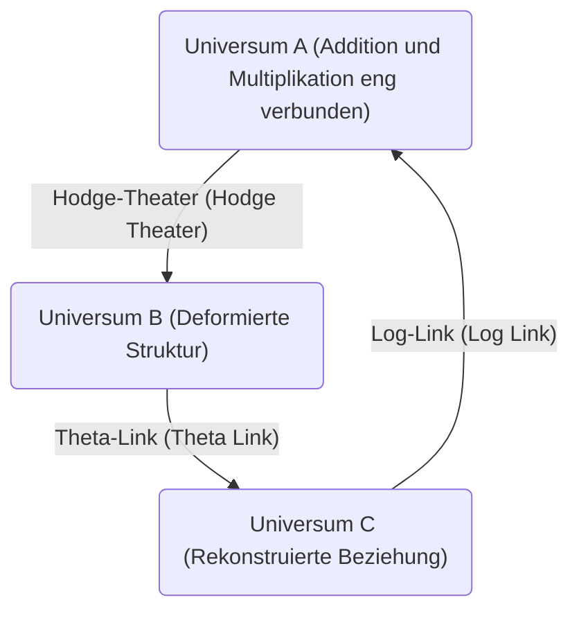
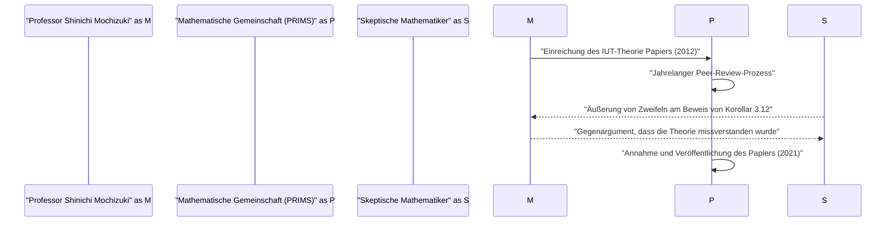

# Einführung: Was ist die ABC-Vermutung?

Im Bereich der Zahlentheorie gibt es viele ungelöste Probleme, aber eines, das als besonders wichtig erachtet wurde, ist die **ABC-Vermutung** (ABC Conjecture). Diese Vermutung wurde 1985 unabhängig voneinander von Joseph Oesterlé und David Masser formuliert.

[Die ABC-Vermutung](https://kenji.blog/p/abc-conjecture/) deutet auf eine tiefe Beziehung zwischen der Addition und der Multiplikation (Primfaktorzerlegung) von ganzen Zahlen hin. Auf den ersten Blick beschreibt sie eine erstaunliche Eigenschaft, die in der einfachen Gleichung $a + b = c$ verborgen ist.

## Die strenge Definition der ABC-Vermutung

Betrachten wir ein Tripel $(a, b, c)$ von teilerfremden positiven ganzen Zahlen, die $a + b = c$ erfüllen. Hier definieren wir das **Radikal** (Radical) einer ganzen Zahl $n$ als $\text{rad}(n)$. Dies ist das Produkt der paarweise verschiedenen Primfaktoren von $n$.

$$ \text{rad}(n) = \prod_{p | n} p $$

[Die ABC-Vermutung](https://kenji.blog/p/abc-conjecture/) besagt, dass es für jedes $\epsilon > 0$ nur endlich viele teilerfremde Tripel $(a, b, c)$ positiver ganzer Zahlen gibt, die folgendes erfüllen:

$$ c > \text{rad}(abc)^{1 + \epsilon} $$

Diese Ungleichung bedeutet, dass wenn $a$ und $b$ viele kleine Primfaktoren haben, ihre Summe $c$ normalerweise große Primfaktoren hat (das heißt, $\text{rad}(c)$ wird groß). Dies zeigt, dass Addition und Multiplikation, die zwei grundlegendsten Operationen der Mathematik, sich gegenseitig stark einschränken.

# Das Aufkommen der Inter-universalen Teichmüller-Theorie (IUT-Theorie)

Der Beweis der ABC-Vermutung hat Mathematiker viele Jahre lang vor ein Rätsel gestellt, aber im Jahr 2012 veröffentlichte Professor Shinichi Mochizuki von der Universität Kyoto einen Beweis für diese Vermutung unter Verwendung eines völlig neuen mathematischen Rahmens namens **Inter-universale Teichmüller-Theorie** (Inter-Universal Teichmüller Theory, abgekürzt IUT-Theorie).

Die IUT-Theorie rekonstruiert grundlegend die herkömmlichen mathematischen Rahmenbedingungen (Mengenlehre und Standard-algebraische Geometrie) und löste aufgrund ihrer Komplexität und Neuartigkeit einen großen Schock in der mathematischen Gemeinschaft aus.

## Der Kern der IUT-Theorie: Kommunikation zwischen Universen

Die innovativste Idee der IUT-Theorie ist das Konzept der Informationsübertragung zwischen verschiedenen **mathematischen Universen** (mathematical universes). In der normalen Mathematik findet alles in einem einzigen festen Universum statt (Axiomensystem oder Modell der Mengenlehre), aber Professor Mochizuki trennte die Strukturen von Addition und Multiplikation und platzierte jede in ein anderes Universum.

Das obige Diagramm zeigt vereinfacht das Konzept der Informationsübertragung zwischen verschiedenen Universen in der IUT-Theorie. Beim Vergleichen und Übertragen von Strukturen zwischen verschiedenen Universen entsteht eine Art von "Verzerrung" oder "Unbestimmtheit". Die IUT-Theorie bietet einen großartigen Rahmen zur präzisen Bewertung und Quantifizierung dieser Unbestimmtheit.

### Frobenioide und Hodge-Theater

Als wichtige Konzepte, die die IUT-Theorie bilden, gibt es **Frobenioide** (Frobenioid) und **Hodge-Theater** (Hodge Theater). Diese sind Mechanismen zur geometrischen Codierung zahlentheoretischer Informationen durch die Wirkung der absoluten Galois-Gruppe oder der Fundamentalgruppe von Zahlkörpern.

$$ \Theta \text{-Link} : \mathcal{F}^{\circledast} \xrightarrow{\sim} \mathcal{F}^{\odot} $$

Der Theta-Link ($\Theta$-Link) spielt die Rolle, spezifische Monodromie-Informationen (Informationen über den Wert der Theta-Funktion) zwischen verschiedenen Hodge-Theatern zu übertragen. Im Gegensatz zu herkömmlichen ringtheoretischen Strukturen (Isomorphismen, die sowohl Addition als auch Multiplikation erhalten) bewahrt dieser Link teilweise nur die multiplikative Struktur, "zerstört" absichtlich die additive Struktur und rekonstruiert sie dann.

# Erstaunliche Konsequenzen, die sich aus der ABC-Vermutung ergeben

Wenn die ABC-Vermutung (ob durch die IUT-Theorie oder auf andere Weise) vollständig bewiesen wird, würden viele wichtige zahlentheoretische Sätze auf einen Schlag abgeleitet werden. Vergleichen wir dies mit der **Mordell-Vermutung** (heute bekannt als der Satz von Faltings) oder **Fermats letztem Satz** .

## Anwendung auf Fermats letzten Satz

Fermats letzter Satz besagt, dass es für $n \ge 3$ keine positiven ganzen Zahlen $(x, y, z)$ gibt, die $x^n + y^n = z^n$ erfüllen. Er wurde 1995 von [Andrew Wiles](https://kenji.blog/p/wiles/) bewiesen, aber es wurde eine sehr fortgeschrittene und komplexe Mathematik verwendet.

Wenn wir annehmen, dass die ABC-Vermutung wahr ist, kann Fermats letzter Satz (zumindest für hinreichend große $n$) erstaunlicherweise in nur wenigen Zeilen bewiesen werden.

Nehmen wir $x^n + y^n = z^n$ an, wobei $(x, y, z)$ teilerfremd sind. Wenn wir die ABC-Vermutung auf $a=x^n$, $b=y^n$, $c=z^n$ anwenden, erhalten wir:

$$ z^n < \text{rad}(x^n y^n z^n)^{1+\epsilon} = \text{rad}(xyz)^{1+\epsilon} \le (xyz)^{1+\epsilon} < (z^3)^{1+\epsilon} $$

Wenn wir $\epsilon$ klein genug wählen, führt diese Ungleichung zu einem Widerspruch, wenn $n$ größer als $3(1+\epsilon)$ ist (also etwa $n \ge 4$). Daher wird sofort klar, dass für große $n$ keine Lösung existiert. Auf diese Weise fungiert die ABC-Vermutung als mächtiger **Meisterschlüssel** (master key) der Zahlentheorie.

# Akzeptanz und Diskussion der IUT-Theorie in der mathematischen Gemeinschaft

Seit der Veröffentlichung des Papiers im Jahr 2012 ist die IUT-Theorie Gegenstand heftiger Debatten in der mathematischen Gemeinschaft. Der Hauptgrund dafür ist, dass die neuen Konzepte und Notationen, die zum Aufbau der Theorie verwendet wurden, so umfangreich sind, dass selbst Experten der bestehenden Mathematik Jahre brauchen, um sie zu verstehen.

Einige prominente Mathematiker (wie Peter Scholze und Jakob Stix) äußerten Bedenken, dass es einen Sprung in dem Teil gibt, der den Kern der Theorie bildet (insbesondere im Beweis von "Korollar 3.12"). Andererseits entgegnen Professor Mochizuki und Forscher in seinem Umfeld, dass diese Kritik auf einem Missverständnis beruht, das durch den Versuch verursacht wird, das grundlegende Paradigma der IUT-Theorie (der Vergleich von Strukturen über Universen hinweg) im herkömmlichen Rahmen zu interpretieren.

# Schlussfolgerung und Zukunftsperspektiven

[Die ABC-Vermutung](https://kenji.blog/p/abc-conjecture/) und die Inter-universale Teichmüller-Theorie sind eines der größten Dramen in der Mathematik des 21. Jahrhunderts. Die unergründliche Tiefe der einfachsten Konzepte, Addition und Multiplikation, die man in der Grundschule lernt, testet gerade jetzt die Grenzen der menschlichen Intelligenz.

Ob die IUT-Theorie wirklich einen neuen mathematischen Horizont eröffnet oder ob weitere Modifikationen erforderlich sind. Bis eine endgültige Schlussfolgerung gezogen ist, wird es wahrscheinlich noch viel Zeit und Forschung durch eine neue Generation von Mathematikern erfordern. Die Vision der **Verbindung verschiedener mathematischer Universen** , die diese Theorie aufgeworfen hat, wird jedoch zweifellos weiterhin eine große Inspiration für die zukünftige Entwicklung der Mathematik sein.
