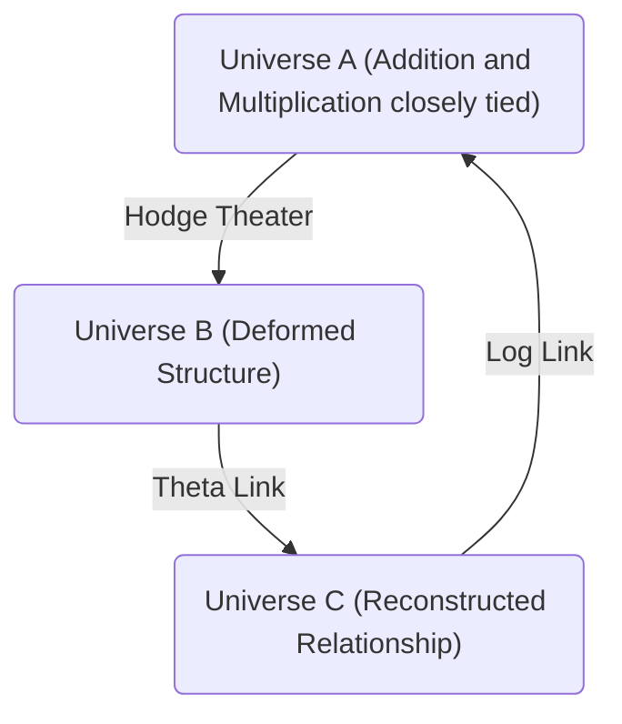
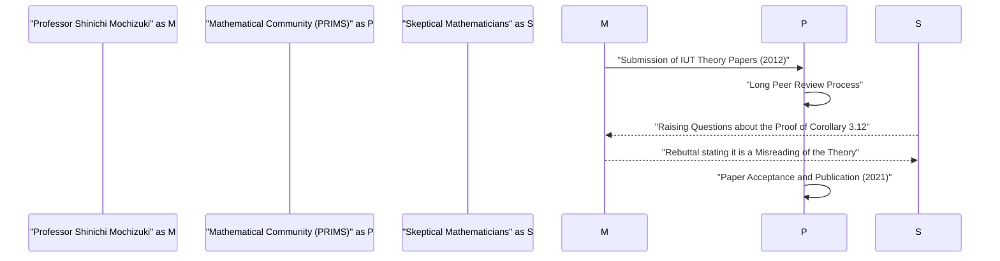

# Introduction: What is the ABC Conjecture?

In the field of number theory, there are many unsolved problems, but one of the most highly regarded among them is the **ABC Conjecture**. This conjecture was independently formulated in 1985 by Joseph Oesterlé and David Masser.

[The ABC Conjecture](https://kenji.blog/en/p/abc-conjecture/) suggests a deep relationship between the addition and multiplication (prime factorization) of integers. It describes surprising properties hidden in the seemingly simple equation $a + b = c$.

## Rigorous Definition of the ABC Conjecture

Consider a tuple of coprime positive integers $(a, b, c)$ that satisfies $a + b = c$. Here, we define the **radical** of an integer $n$ as $\text{rad}(n)$. This is the product of the distinct prime factors of $n$.

$$ \text{rad}(n) = \prod_{p | n} p $$

[The ABC Conjecture](https://kenji.blog/en/p/abc-conjecture/) claims that for any $\epsilon > 0$, there are only finitely many tuples of coprime positive integers $(a, b, c)$ that satisfy the following:

$$ c > \text{rad}(abc)^{1 + \epsilon} $$

This inequality means that if $a$ and $b$ have many small prime factors, their sum $c$ typically has large prime factors (that is, $\text{rad}(c)$ becomes large). It shows that addition and multiplication, the two most fundamental operations in mathematics, strongly constrain each other.

# The Advent of Inter-Universal Teichmüller Theory (IUT Theory)

The proof of the ABC Conjecture had troubled mathematicians for many years, but in 2012, Professor Shinichi Mochizuki of Kyoto University announced a proof of this conjecture using an entirely new mathematical framework called **Inter-Universal Teichmüller Theory** (abbreviated as IUT Theory).

IUT Theory fundamentally reconstructs the conventional framework of mathematics (set theory and standard algebraic geometry), and due to its difficulty and novelty, it delivered a major shock to the mathematical community.

## The Core of IUT Theory: Communication Between Universes

The most innovative idea of IUT Theory is the concept of transmitting information between different **mathematical universes**. In ordinary mathematics, everything is done within a single fixed universe (an axiom system or a model of set theory), but Professor Mochizuki separated the structures of addition and multiplication, and placed each in different universes.

The diagram above provides a simplified illustration of the concept of information transmission between different universes in IUT Theory. When comparing and transmitting structures between different universes, certain "distortions" or "indeterminacies" occur. IUT Theory provides a grand framework to precisely evaluate and quantify this indeterminacy.

### Frobenioids and Hodge Theaters

Important concepts constituting IUT Theory include **Frobenioids** and **Hodge Theaters**. These are mechanisms for geometrically encoding number-theoretic information through the action of the absolute Galois groups or fundamental groups of number fields.

$$ \Theta \text{-link} : \mathcal{F}^{\circledast} \xrightarrow{\sim} \mathcal{F}^{\odot} $$

The Theta-link ($\Theta$-link) plays the role of transmitting specific monodromy information (information regarding the values of theta functions) between different Hodge Theaters. Unlike conventional ring-theoretic structures (isomorphisms that preserve both addition and multiplication), this link partially preserves only the multiplicative structure while intentionally "destroying" and then reconstructing the additive structure.

# Astounding Consequences Derived from the ABC Conjecture

If the ABC Conjecture is completely proven (whether by IUT Theory or other methods), many important theorems in number theory would be derived all at once. Let us compare this with the **Mordell Conjecture** (now known as Faltings's theorem) and **[Fermat's Last Theorem](https://kenji.blog/en/p/fermats-last-theorem/)**.

## Application to [Fermat's Last Theorem](https://kenji.blog/en/p/fermats-last-theorem/)

[Fermat's Last Theorem](https://kenji.blog/en/p/fermats-last-theorem/) states that for $n \ge 3$, there are no tuples of positive integers $(x, y, z)$ that satisfy $x^n + y^n = z^n$. It was proven by [Andrew Wiles](https://kenji.blog/en/p/wiles/) in 1995, but it involved very advanced and complex mathematics.

If we assume the ABC Conjecture is correct, surprisingly, [Fermat's Last Theorem](https://kenji.blog/en/p/fermats-last-theorem/) (at least when $n$ is sufficiently large) can be proven in just a few lines.

Let $x^n + y^n = z^n$, and assume $(x, y, z)$ are coprime. Applying the ABC Conjecture to $a=x^n$, $b=y^n$, $c=z^n$:

$$ z^n < \text{rad}(x^n y^n z^n)^{1+\epsilon} = \text{rad}(xyz)^{1+\epsilon} \le (xyz)^{1+\epsilon} < (z^3)^{1+\epsilon} $$

By taking $\epsilon$ to be sufficiently small, if $n$ is greater than $3(1+\epsilon)$ (meaning roughly $n \ge 4$), this inequality leads to a contradiction. Therefore, it is immediately clear that no solutions exist when $n$ is large. In this way, the ABC Conjecture functions as a powerful **master key** in number theory.

# Reception and Debate of IUT Theory in the Mathematical Community

Since the publication of the papers in 2012, IUT Theory has been the subject of fierce debate within the mathematical community. The main reason is that the new concepts and notation used to build the theory are so vast that even experts in existing mathematics take years to understand them.

Some prominent mathematicians (such as Peter Scholze and Jakob Stix) expressed concerns that there is a leap in the core part of the theory (specifically, the proof of "Corollary 3.12"). On the other hand, Professor Mochizuki and researchers around him counter that these criticisms are misunderstandings caused by attempting to interpret the fundamental paradigm of IUT Theory (the comparison of structures across universes) within conventional frameworks.

In 2021, Professor Mochizuki's papers were officially published in "PRIMS," a specialized journal issued by the Research Institute for Mathematical Sciences (RIMS) at Kyoto University. However, a complete consensus within the entire mathematical community has not yet been reached, and the dialogue surrounding this theory continues today.

# Conclusion and Future Outlook

[The ABC Conjecture](https://kenji.blog/en/p/abc-conjecture/) and Inter-Universal Teichmüller Theory constitute one of the greatest dramas in 21st-century mathematics. The bottomless depth of addition and multiplication, the simplest concepts learned in elementary school, is right now testing the limits of human intelligence.

Whether IUT Theory truly opens up a new horizon in mathematics or requires further modifications, it will likely take much more time and research by a new generation of mathematicians before a final conclusion is reached. However, the vision proposed by this theory of **connecting different mathematical universes** will undoubtedly continue to provide great inspiration for the future development of mathematics.
