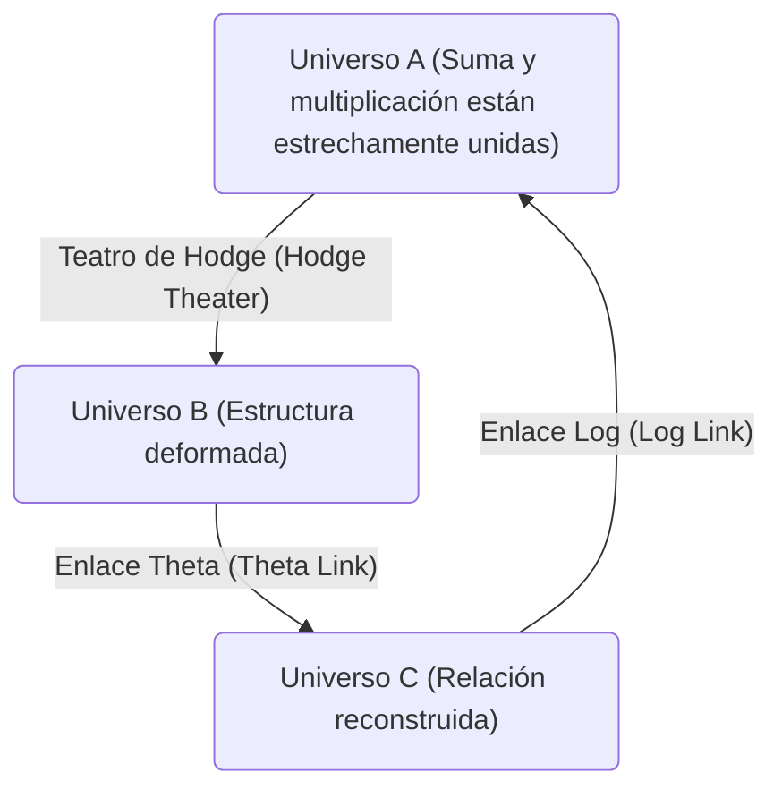
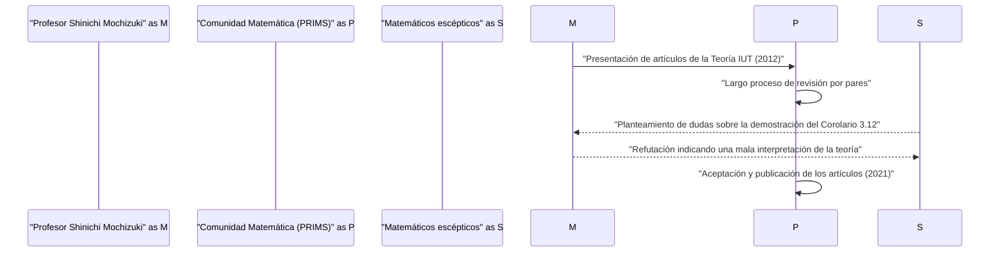

# Introducción: ¿Qué es la [Conjetura ABC](https://kenji.blog/es/p/abc-conjecture/)?

En el campo de la teoría de números, existen numerosos problemas sin resolver, pero entre ellos, la **conjetura ABC** (ABC Conjecture) ha sido considerada de particular importancia. Esta conjetura fue formulada de manera independiente por Joseph Oesterlé y David Masser en 1985.

La conjetura ABC sugiere una profunda relación entre la suma y la multiplicación (factorización en números primos) de los números enteros. Describe las sorprendentes propiedades ocultas en una ecuación aparentemente simple $a + b = c$.

## Definición rigurosa de la conjetura ABC

Consideremos una terna de números enteros positivos coprimos $(a, b, c)$ que satisfacen $a + b = c$. Aquí, definimos el **radical** (radical) de un número entero $n$ como $\text{radical}(n)$. Este es el producto de los distintos factores primos de $n$.

$$ \text{radical}(n) = \prod_{p | n} p $$

La conjetura ABC afirma que para cualquier $\epsilon > 0$, existe solo un número finito de ternas de números enteros positivos coprimos $(a, b, c)$ que satisfacen la siguiente condición:

$$ c > \text{radical}(abc)^{1 + \epsilon} $$

Esta desigualdad significa que cuando $a$ y $b$ tienen muchos factores primos pequeños, su suma $c$ generalmente tiene grandes factores primos (es decir, $\text{radical}(c)$ se vuelve grande). Esto demuestra que la suma y la multiplicación, las dos operaciones más básicas de las matemáticas, se restringen fuertemente entre sí.

# La aparición de la Teoría de Teichmüller Inter-Universal (Teoría IUT)

La demostración de la conjetura ABC ha desconcertado a los matemáticos durante muchos años, pero en 2012, el profesor Shinichi Mochizuki de la Universidad de Kioto anunció una demostración de esta conjetura utilizando un marco matemático completamente nuevo llamado **Teoría de Teichmüller Inter-Universal** (Inter-Universal Teichmüller Theory, abreviada como Teoría IUT).

La Teoría IUT reconstruye desde sus cimientos los marcos matemáticos convencionales (teoría de conjuntos y geometría algebraica estándar), y debido a su dificultad e innovación, causó un gran impacto en la comunidad matemática.

## El núcleo de la Teoría IUT: Comunicación entre universos

La idea más innovadora de la Teoría IUT es el concepto de transmitir información entre diferentes **universos matemáticos** (mathematical universes). En las matemáticas ordinarias, todo se desarrolla dentro de un único universo fijo (un sistema axiomático o modelo de teoría de conjuntos), pero el profesor Mochizuki separó las estructuras de suma y multiplicación, y colocó cada una en un universo diferente.

El diagrama anterior muestra de manera simplificada el concepto de transmisión de información entre diferentes universos en la Teoría IUT. Al comparar y transmitir estructuras entre distintos universos, se produce un tipo de "distorsión" o "incertidumbre". La Teoría IUT proporciona un marco monumental para evaluar y cuantificar de manera precisa esta incertidumbre.

### Frobenioide y Teatro de Hodge

Conceptos importantes que componen la Teoría IUT incluyen el **frobenioide** (Frobenioid) y el **teatro de Hodge** (Hodge Theater). Estos son mecanismos para codificar geométricamente la información de la teoría de números a través de la acción del grupo absoluto de [Galois](https://kenji.blog/es/p/galois/) o el grupo fundamental de un cuerpo numérico.

$$ \Theta \text{-enlace} : \mathcal{F}^{\circledast} \xrightarrow{\sim} \mathcal{F}^{\odot} $$

El enlace Theta ($\Theta$-enlace) juega el papel de transmitir información de monodromía específica (información sobre los valores de la función theta) entre diferentes teatros de Hodge. A diferencia de las estructuras de teoría de anillos convencionales (isomorfismos que preservan tanto la suma como la multiplicación), este enlace preserva parcialmente solo la estructura multiplicativa, mientras "destruye" intencionalmente y luego reconstruye la estructura aditiva.

# Consecuencias asombrosas de la conjetura ABC

Si la conjetura ABC se demostrara completamente (ya sea mediante la Teoría IUT o por otros métodos), conduciría inmediatamente a muchos teoremas importantes en la teoría de números. Comparemos esto con la **conjetura de Mordell** (ahora conocida como el teorema de Faltings) o el **último teorema de [Fermat](https://kenji.blog/es/p/fermat/)**.

## Aplicación al último teorema de [Fermat](https://kenji.blog/es/p/fermat/)

[El último teorema de Fermat](https://kenji.blog/es/p/fermats-last-theorem/) establece que para $n \ge 3$, no existe ninguna terna de números enteros positivos $(x, y, z)$ que satisfaga $x^n + y^n = z^n$. Fue demostrado por [Andrew Wiles](https://kenji.blog/es/p/wiles/) en 1995, pero se utilizaron matemáticas sumamente avanzadas y complejas.

Si asumimos que la conjetura ABC es cierta, sorprendentemente, el último teorema de [Fermat](https://kenji.blog/es/p/fermat/) (al menos cuando $n$ es suficientemente grande) puede demostrarse en apenas unas pocas líneas.

Supongamos $x^n + y^n = z^n$, y que $(x, y, z)$ son coprimos. Aplicando la conjetura ABC a $a=x^n$, $b=y^n$, $c=z^n$, obtenemos:

$$ z^n < \text{radical}(x^n y^n z^n)^{1+\epsilon} = \text{radical}(xyz)^{1+\epsilon} \le (xyz)^{1+\epsilon} < (z^3)^{1+\epsilon} $$

Si tomamos $\epsilon$ lo suficientemente pequeño, cuando $n$ es mayor que $3(1+\epsilon)$ (es decir, $n \ge 4$ aproximadamente), esta desigualdad conduce a una contradicción. Por lo tanto, se evidencia inmediatamente que no hay soluciones cuando $n$ es grande. De esta manera, la conjetura ABC funciona como una poderosa **llave maestra** (master key) de la teoría de números.

# Recepción y debate de la Teoría IUT en la comunidad matemática

Desde la publicación de los artículos en 2012, la Teoría IUT ha sido objeto de intensos debates en la comunidad matemática. La razón principal de esto es que los nuevos conceptos y notaciones utilizados para construir la teoría son tan vastos que incluso los expertos en matemáticas existentes requieren años para comprenderlos.

Algunos matemáticos prominentes (como Peter Scholze y Jakob Stix) han expresado su preocupación de que haya un salto lógico en el núcleo de la teoría (especialmente en la demostración del "Corolario 3.12"). Por otro lado, el profesor Mochizuki y los investigadores de su entorno han refutado esto, argumentando que estas críticas se basan en malentendidos causados por intentar interpretar el paradigma fundamental de la Teoría IUT (la comparación de estructuras a través de universos) dentro de los marcos convencionales.

En 2021, los artículos del profesor Mochizuki se publicaron formalmente en "PRIMS", la revista especializada editada por el Instituto de Investigación de Ciencias Matemáticas (RIMS) de la Universidad de Kioto. Sin embargo, no se ha alcanzado un consenso completo en toda la comunidad matemática, y el diálogo en torno a esta teoría continúa en la actualidad.

# Conclusión y perspectivas futuras

La conjetura ABC y la Teoría de Teichmüller Inter-Universal representan uno de los mayores dramas en las matemáticas del siglo XXI. La insondable profundidad de los conceptos más simples que aprendemos en la escuela primaria, la suma y la multiplicación, está poniendo a prueba los límites de la inteligencia humana en este mismo instante.

Si la Teoría IUT abrirá verdaderamente un nuevo horizonte en las matemáticas, o si requerirá modificaciones adicionales, todavía tomará mucho tiempo y el trabajo de una nueva generación de matemáticos antes de que se alcance una conclusión final. Sin embargo, la visión que esta teoría ha propuesto de **conectar diferentes universos matemáticos** sin duda seguirá siendo una gran inspiración para el desarrollo futuro de las matemáticas.
