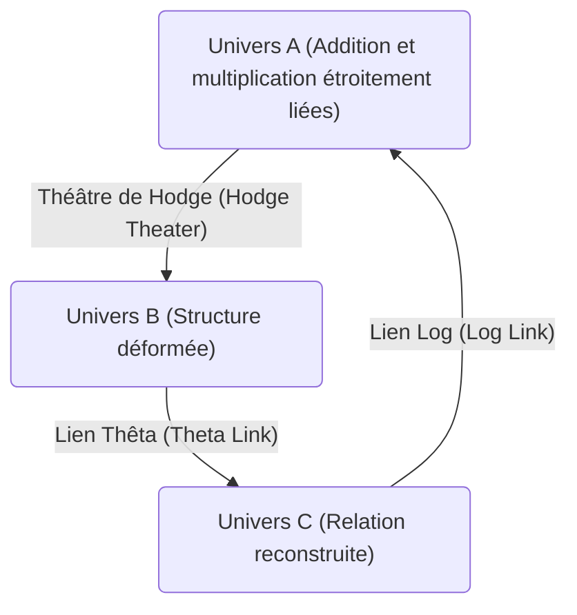
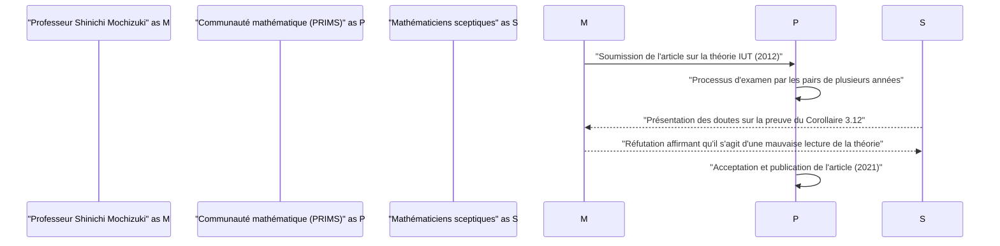

# Introduction : Qu'est-ce que la conjecture ABC ?

Dans le domaine de la théorie des nombres, il existe de nombreux problèmes non résolus, mais l'un des plus importants est la **conjecture ABC** (ABC Conjecture). Cette conjecture a été formulée indépendamment par Joseph Oesterlé et David Masser en 1985.

[La conjecture ABC](https://kenji.blog/fr/p/abc-conjecture/) suggère une relation profonde entre l'addition et la multiplication (factorisation en nombres premiers) des nombres entiers. Elle décrit les propriétés étonnantes cachées dans une équation apparemment simple, $a + b = c$.

## Définition rigoureuse de la conjecture ABC

Considérons un triplet d'entiers positifs premiers entre eux $(a, b, c)$ satisfaisant $a + b = c$. Ici, nous définissons le **radical** (radical) d'un entier $n$ par $\text{rad}(n)$. Il s'agit du produit des facteurs premiers distincts de $n$.

$$ \text{rad}(n) = \prod_{p | n} p $$

[La conjecture ABC](https://kenji.blog/fr/p/abc-conjecture/) affirme que pour tout $\epsilon > 0$, il n'existe qu'un nombre fini de triplets d'entiers positifs premiers entre eux $(a, b, c)$ satisfaisant la condition suivante.

$$ c > \text{rad}(abc)^{1 + \epsilon} $$

Cette inégalité signifie que si $a$ et $b$ ont beaucoup de petits facteurs premiers, leur somme $c$ a généralement de grands facteurs premiers (c'est-à-dire que $\text{rad}(c)$ devient grand). Cela montre que l'addition et la multiplication, les deux opérations les plus fondamentales en mathématiques, se contraignent fortement l'une l'autre.

# L'émergence de la théorie inter-universelle de Teichmüller (théorie IUT)

La preuve de la conjecture ABC a intrigué les mathématiciens pendant de nombreuses années, mais en 2012, le professeur Shinichi Mochizuki de l'Université de Kyoto a annoncé une preuve de cette conjecture en utilisant un tout nouveau cadre mathématique appelé la **théorie inter-universelle de Teichmüller** (Inter-Universal Teichmüller Theory, abrégée théorie IUT).

La théorie IUT reconstruit fondamentalement le cadre mathématique traditionnel (théorie des ensembles et géométrie algébrique standard) à partir de zéro, et en raison de sa difficulté et de sa nouveauté, elle a eu un impact majeur sur la communauté mathématique.

## Le cœur de la théorie IUT : La communication inter-universelle

L'idée la plus innovante de la théorie IUT est le concept de transmission d'informations entre différents **univers mathématiques** (mathematical universes). Dans les mathématiques ordinaires, tout se fait au sein d'un univers fixe (un système axiomatique ou un modèle de la théorie des ensembles), mais le professeur Mochizuki a séparé les structures de l'addition et de la multiplication et les a placées dans des univers différents.

Le diagramme ci-dessus montre une version simplifiée du concept de transmission d'informations entre différents univers dans la théorie IUT. Lors de la comparaison et de la transmission de structures entre différents univers, un certain type de "distorsion" ou d'"incertitude" se produit. La théorie IUT fournit un cadre grandiose pour évaluer et quantifier précisément cette incertitude.

### Frobenioïdes et théâtres de Hodge

En tant que concepts importants constituant la théorie IUT, il y a les **frobenioïdes** (Frobenioid) et les **théâtres de Hodge** (Hodge Theater). Ce sont des mécanismes qui encodent géométriquement des informations de la théorie des nombres par l'action du groupe de Galois absolu ou du groupe fondamental d'un corps de nombres.

$$ \Theta \text{-lien} : \mathcal{F}^{\circledast} \xrightarrow{\sim} \mathcal{F}^{\odot} $$

Le lien Thêta ($\Theta$-lien) joue le rôle de transmettre des informations de monodromie spécifiques (informations concernant les valeurs de la fonction thêta) entre différents théâtres de Hodge. Ce lien, contrairement aux structures traditionnelles de la théorie des anneaux (isomorphismes qui préservent à la fois l'addition et la multiplication), préserve partiellement la seule structure multiplicative tout en "détruisant" intentionnellement puis en reconstruisant la structure additive.

# Conséquences étonnantes de la conjecture ABC

Si la conjecture ABC était (par la théorie IUT ou par d'autres méthodes) complètement prouvée, un grand nombre de théorèmes importants de la théorie des nombres en découleraient d'un seul coup. Comparons cela avec la **conjecture de Mordell** (maintenant connue sous le nom de théorème de Faltings) et le **dernier théorème de Fermat** .

## Application au dernier théorème de Fermat

[Le dernier théorème de Fermat](https://kenji.blog/fr/p/fermats-last-theorem/) stipule que pour $n \ge 3$, il n'existe pas de triplet d'entiers positifs $(x, y, z)$ satisfaisant $x^n + y^n = z^n$. Il a été prouvé par [Andrew Wiles](https://kenji.blog/fr/p/wiles/) en 1995, mais des mathématiques extrêmement avancées et complexes ont été utilisées.

Si nous supposons que la conjecture ABC est vraie, étonnamment, le dernier théorème de Fermat (au moins lorsque $n$ est suffisamment grand) peut être prouvé en quelques lignes seulement.

Soit $x^n + y^n = z^n$, et supposons que $(x, y, z)$ sont premiers entre eux. En appliquant la conjecture ABC à $a=x^n$, $b=y^n$, $c=z^n$, on obtient :

$$ z^n < \text{rad}(x^n y^n z^n)^{1+\epsilon} = \text{rad}(xyz)^{1+\epsilon} \le (xyz)^{1+\epsilon} < (z^3)^{1+\epsilon} $$

Si l'on prend $\epsilon$ suffisamment petit, lorsque $n$ est plus grand que $3(1+\epsilon)$ (c'est-à-dire environ $n \ge 4$), cette inégalité conduit à une contradiction. Par conséquent, on voit immédiatement qu'il n'y a pas de solution lorsque $n$ est grand. Ainsi, la conjecture ABC fonctionne comme une puissante **clé passe-partout** (master key) de la théorie des nombres.

# Réception et débats de la théorie IUT dans la communauté mathématique

Depuis la publication de l'article en 2012, la théorie IUT a fait l'objet de vifs débats au sein de la communauté mathématique. La raison principale est que les nouveaux concepts et notations utilisés pour construire la théorie sont si vastes que même les experts en mathématiques existants ont besoin d'années pour la comprendre.

Certains mathématiciens de renom (tels que Peter Scholze et Jakob Stix) ont exprimé la crainte qu'il n'y ait un saut logique dans la partie centrale de la théorie (en particulier la preuve du "Corollaire 3.12"). D'autre part, le professeur Mochizuki et les chercheurs de son entourage rétorquent que ces critiques sont un malentendu causé par la tentative d'interpréter le paradigme fondamental de la théorie IUT (comparaison de structures à travers des univers) dans le cadre traditionnel.

En 2021, l'article du professeur Mochizuki a été officiellement publié dans "PRIMS", une revue spécialisée éditée par l'Institut de recherche en sciences mathématiques (RIMS) de l'Université de Kyoto. Cependant, un consensus complet au sein de l'ensemble de la communauté mathématique n'a pas été atteint, et le dialogue autour de cette théorie se poursuit encore aujourd'hui.

# Conclusion et perspectives d'avenir

[La conjecture ABC](https://kenji.blog/fr/p/abc-conjecture/) et la théorie inter-universelle de Teichmüller sont l'un des plus grands drames des mathématiques du 21e siècle. La profondeur insondable des concepts les plus simples appris à l'école primaire, l'addition et la multiplication, met actuellement à l'épreuve les limites de l'intelligence humaine.

La théorie IUT ouvre-t-elle véritablement un nouvel horizon mathématique, ou nécessite-t-elle des corrections supplémentaires ? Il faudra encore beaucoup de temps et de recherche par une nouvelle génération de mathématiciens avant qu'une conclusion finale ne soit atteinte. Cependant, la vision de **connecter différents univers mathématiques** proposée par cette théorie continuera sans aucun doute à fournir une grande inspiration pour le développement futur des mathématiques.
