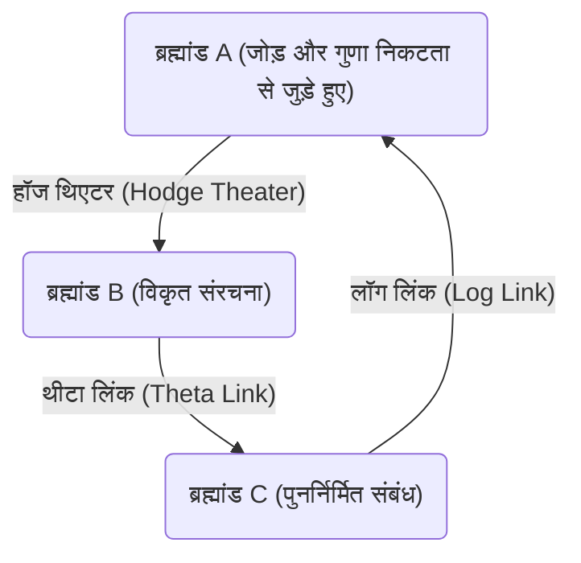
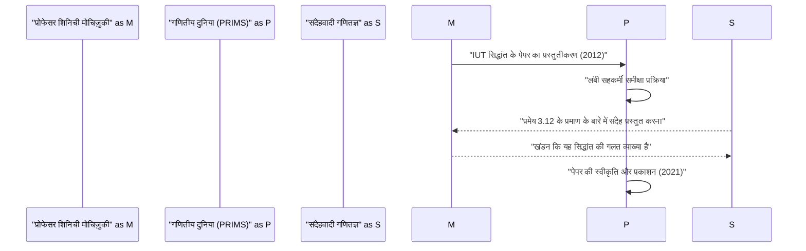

# परिचय: [एबीसी अनुमान](https://kenji.blog/hi/p/abc-conjecture/) क्या है?

संख्या सिद्धांत के क्षेत्र में कई अनसुलझी समस्याएं मौजूद हैं, लेकिन उनमें से जिसे विशेष रूप से महत्वपूर्ण माना गया है वह **[एबीसी अनुमान](https://kenji.blog/hi/p/abc-conjecture/)** (ABC Conjecture) है। यह अनुमान 1985 में जोसेफ ओस्टर्ले (Joseph Oesterlé) और डेविड मैसर (David Masser) द्वारा स्वतंत्र रूप से तैयार किया गया था।

[एबीसी अनुमान](https://kenji.blog/hi/p/abc-conjecture/) पूर्णांकों के जोड़ और गुणा (अभाज्य गुणनखंडन) के बीच एक गहरे संबंध का सुझाव देता है। यह पहली नज़र में सरल लगने वाले समीकरण $a + b = c$ में छिपे आश्चर्यजनक गुणों का वर्णन करता है।

## [एबीसी अनुमान](https://kenji.blog/hi/p/abc-conjecture/) की सख्त परिभाषा

सह-अभाज्य धनात्मक पूर्णांकों के त्रिक $(a, b, c)$ पर विचार करें जो $a + b = c$ को संतुष्ट करते हैं। यहाँ, हम पूर्णांक $n$ के **मूल** (radical) को $\text{मूल}(n)$ के रूप में परिभाषित करते हैं। यह $n$ के विशिष्ट अभाज्य गुणनखंडों का गुणनफल है।

$$ \text{मूल}(n) = \prod_{p | n} p $$

[एबीसी अनुमान](https://kenji.blog/hi/p/abc-conjecture/) यह दावा करता है कि किसी भी $\epsilon > 0$ के लिए, सह-अभाज्य धनात्मक पूर्णांकों $(a, b, c)$ के केवल परिमित त्रिक मौजूद हैं जो निम्नलिखित को संतुष्ट करते हैं:

$$ c > \text{मूल}(abc)^{1 + \epsilon} $$

इस असमानता का अर्थ यह है कि यदि $a$ और $b$ में कई छोटे अभाज्य गुणनखंड हैं, तो उनका योग $c$ आमतौर पर बड़े अभाज्य गुणनखंड रखता है (अर्थात $\text{मूल}(c)$ बड़ा हो जाता है)। यह दर्शाता है कि गणित के दो सबसे बुनियादी संचालन, जोड़ और गुणा, एक दूसरे को दृढ़ता से विवश करते हैं।

# इंटर-यूनिवर्सल टेकमुलर सिद्धांत (IUT सिद्धांत) का आगमन

[एबीसी अनुमान](https://kenji.blog/hi/p/abc-conjecture/) के प्रमाण ने गणितज्ञों को कई वर्षों तक परेशान किया, लेकिन 2012 में, क्योटो विश्वविद्यालय के प्रोफेसर शिनिची मोचिज़ुकी ने **इंटर-यूनिवर्सल टेकमुलर सिद्धांत** (Inter-Universal Teichmüller Theory, संक्षेप में IUT सिद्धांत) नामक एक पूरी तरह से नए गणितीय ढांचे का उपयोग करके इस अनुमान के प्रमाण की घोषणा की।

IUT सिद्धांत पारंपरिक गणितीय ढांचे (सेट सिद्धांत और मानक बीजगणितीय ज्यामिति) को जमीन से पुनर्निर्माण करता है, और इसकी जटिलता और नवीनता के कारण, इसने गणितीय दुनिया में एक बड़ा झटका दिया।

## IUT सिद्धांत का मूल: ब्रह्मांडों के बीच संचार

IUT सिद्धांत का सबसे नवीन विचार विभिन्न **गणितीय ब्रह्मांडों** (mathematical universes) के बीच सूचना प्रसारित करने की अवधारणा है। सामान्य गणित में, सब कुछ एक निश्चित ब्रह्मांड (अभिगृहीत प्रणाली या सेट सिद्धांत के मॉडल) के भीतर किया जाता है, लेकिन प्रोफेसर मोचिज़ुकी ने जोड़ और गुणा की संरचनाओं को अलग कर दिया और उन्हें अलग-अलग ब्रह्मांडों में रखा।

उपरोक्त आरेख IUT सिद्धांत में विभिन्न ब्रह्मांडों के बीच सूचना संचरण की अवधारणा को सरलीकृत रूप में दिखाता है। विभिन्न ब्रह्मांडों के बीच संरचनाओं की तुलना और संचार करते समय, एक प्रकार का "विरूपण" या "अनिश्चितता" उत्पन्न होती है। IUT सिद्धांत इस अनिश्चितता का सटीक मूल्यांकन और मात्रा निर्धारित करने के लिए एक भव्य ढांचा प्रदान करता है।

### फ्रोबेनियोइड और हॉज थिएटर

IUT सिद्धांत को बनाने वाली महत्वपूर्ण अवधारणाओं में **फ्रोबेनियोइड** (Frobenioid) और **हॉज थिएटर** (Hodge Theater) शामिल हैं। ये संख्या क्षेत्रों के निरपेक्ष गैलोइस समूह और मौलिक समूह की क्रियाओं के माध्यम से अंकगणितीय जानकारी को ज्यामितीय रूप से एन्कोड करने के तंत्र हैं।

$$ \Theta \text{-लिंक} : \mathcal{F}^{\circledast} \xrightarrow{\sim} \mathcal{F}^{\odot} $$

थीटा लिंक ($\Theta$-लिंक) विभिन्न हॉज थिएटरों के बीच विशिष्ट मोनोड्रोमी जानकारी (थीटा फ़ंक्शन मानों के बारे में जानकारी) प्रसारित करने का काम करता है। यह लिंक पारंपरिक रिंग-सैद्धांतिक संरचनाओं (आइसोमोर्फिज्म जो जोड़ और गुणा दोनों को संरक्षित करते हैं) से अलग है, जिसमें यह जानबूझकर गुणा संरचना को आंशिक रूप से संरक्षित करते हुए जोड़ संरचना को "नष्ट" करता है, और फिर इसे फिर से बनाता है।

# [एबीसी अनुमान](https://kenji.blog/hi/p/abc-conjecture/) से प्राप्त आश्चर्यजनक परिणाम

यदि [एबीसी अनुमान](https://kenji.blog/hi/p/abc-conjecture/) पूरी तरह से सिद्ध हो जाता है (IUT सिद्धांत द्वारा, या अन्य तरीकों से), तो संख्या सिद्धांत में कई महत्वपूर्ण प्रमेय एक ही बार में प्राप्त हो जाएंगे। आइए इसकी तुलना **मॉर्डेल अनुमान** (जिसे अब फाल्टिंग्स के प्रमेय के रूप में जाना जाता है) और **[फर्मेट का अंतिम प्रमेय](https://kenji.blog/hi/p/fermats-last-theorem/)** से करें।

## फर्मेट के अंतिम प्रमेय के लिए अनुप्रयोग

[फर्मेट का अंतिम प्रमेय](https://kenji.blog/hi/p/fermats-last-theorem/) बताता है कि जब $n \ge 3$ होता है, तो कोई धनात्मक पूर्णांक त्रिक $(x, y, z)$ मौजूद नहीं होता है जो $x^n + y^n = z^n$ को संतुष्ट करता हो। इसे 1995 में [एंड्रयू विल्स](https://kenji.blog/hi/p/wiles/) द्वारा सिद्ध किया गया था, लेकिन बहुत उन्नत और जटिल गणित का उपयोग किया गया था।

यदि हम मान लें कि [एबीसी अनुमान](https://kenji.blog/hi/p/abc-conjecture/) सही है, तो आश्चर्यजनक रूप से, [फर्मेट का अंतिम प्रमेय](https://kenji.blog/hi/p/fermats-last-theorem/) (कम से कम जब $n$ पर्याप्त रूप से बड़ा हो) केवल कुछ पंक्तियों में सिद्ध किया जा सकता है।

मान लें कि $x^n + y^n = z^n$ है, और $(x, y, z)$ सह-अभाज्य हैं। $a=x^n$, $b=y^n$, $c=z^n$ पर [एबीसी अनुमान](https://kenji.blog/hi/p/abc-conjecture/) लागू करने पर:

$$ z^n < \text{मूल}(x^n y^n z^n)^{1+\epsilon} = \text{मूल}(xyz)^{1+\epsilon} \le (xyz)^{1+\epsilon} < (z^3)^{1+\epsilon} $$

यदि हम $\epsilon$ को पर्याप्त रूप से छोटा लेते हैं, तो जब $n$, $3(1+\epsilon)$ से बड़ा होता है (अर्थात $n \ge 4$ के आसपास), यह असमानता एक विरोधाभास की ओर ले जाती है। इसलिए, यह तुरंत स्पष्ट हो जाता है कि $n$ बड़ा होने पर कोई समाधान मौजूद नहीं है। इस तरह, [एबीसी अनुमान](https://kenji.blog/hi/p/abc-conjecture/) संख्या सिद्धांत के लिए एक शक्तिशाली **मास्टर की** (master key) के रूप में कार्य करता है।

# गणितीय दुनिया में IUT सिद्धांत की स्वीकृति और बहस

2012 में पेपर के प्रकाशन के बाद से, IUT सिद्धांत गणितीय दुनिया में गहन बहस का विषय रहा है। इसका मुख्य कारण यह है कि सिद्धांत के निर्माण में प्रयुक्त नई अवधारणाएं और संकेतन इतने विशाल हैं कि यहां तक कि मौजूदा गणितीय विशेषज्ञों को भी इसे समझने में कई साल लग जाते हैं।

कुछ प्रमुख गणितज्ञों (जैसे पीटर स्कोल्ज़ और जैकब स्टिक्स) ने चिंता व्यक्त की है कि सिद्धांत के मूल (विशेष रूप से "प्रमेय 3.12" का प्रमाण) में एक छलांग है। दूसरी ओर, प्रोफेसर मोचिज़ुकी और उनके आसपास के शोधकर्ताओं का तर्क है कि ये आलोचनाएं पारंपरिक ढांचे के भीतर IUT सिद्धांत के मौलिक प्रतिमान (ब्रह्मांडों के पार संरचनाओं की तुलना) की व्याख्या करने की कोशिश करने से उत्पन्न गलतफहमियां हैं।

2021 में, प्रोफेसर मोचिज़ुकी का पेपर आधिकारिक तौर पर क्योटो विश्वविद्यालय के गणितीय विज्ञान अनुसंधान संस्थान (RIMS) द्वारा प्रकाशित एक विशेष पत्रिका "PRIMS" में प्रकाशित हुआ था। हालांकि, संपूर्ण गणितीय दुनिया में अभी तक पूर्ण सहमति नहीं बन पाई है, और इस सिद्धांत को लेकर बातचीत आज भी जारी है।

# निष्कर्ष और भविष्य की संभावनाएं

[एबीसी अनुमान](https://kenji.blog/hi/p/abc-conjecture/) और इंटर-यूनिवर्सल टेकमुलर सिद्धांत 21वीं सदी के गणित के सबसे बड़े नाटकों में से एक हैं। जोड़ और गुणा की अथाह गहराई, जो सबसे सरल अवधारणाएं हैं जिन्हें हम प्राथमिक विद्यालय में सीखते हैं, अभी मानव बुद्धिमत्ता की सीमाओं का परीक्षण कर रही हैं।

क्या IUT सिद्धांत वास्तव में गणित के एक नए क्षितिज को खोलेगा, या क्या इसे और संशोधनों की आवश्यकता होगी? अंतिम निष्कर्ष पर पहुंचने से पहले इसमें अभी भी बहुत समय लगेगा, और गणितज्ञों की नई पीढ़ी द्वारा शोध की आवश्यकता होगी। हालाँकि, इस सिद्धांत द्वारा प्रस्तावित **विभिन्न गणितीय ब्रह्मांडों को जोड़ने** की दृष्टि निस्संदेह भविष्य में गणित के विकास को बहुत प्रेरित करती रहेगी。
